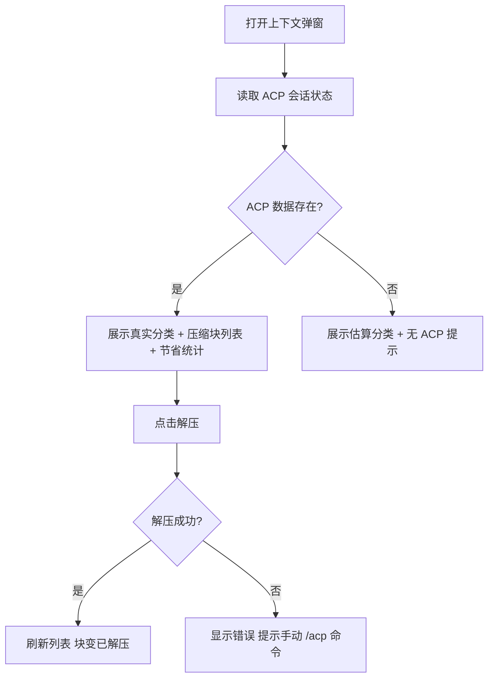

# 上下文面板 — 原型文档

> 版本：v1.0
> 日期：2026-08-15
> 作者：产品经理
> 关联方案：[上下文面板-设计方案.md](../设计/上下文面板-设计方案.md)

---

## 一、功能概述

上下文面板（设置页弹窗）向用户展示当前会话的真实上下文占用：引擎各角色（系统/用户/助手/工具）分别占了多少 token、ACP 插件压缩了哪些内容、累计省了多少 token，并且可以直接在面板里解压已压缩的内容块。数据来源从「前端估算」升级为「引擎真实数据（ACP 插件落盘）」。

**核心规则：**

| 规则 | 说明 |
|------|------|
| 分类占比 | 展示引擎真实分类（系统/用户/助手/工具），无 ACP 数据时回退估算 |
| 压缩块列表 | 展示当前会话 ACP 压缩的块（主题、层级、压缩前后 token、状态） |
| 解压操作 | 活跃压缩块可直接点「解压」恢复，无需手动打命令 |
| 累计节省 | 顶部展示 ACP 为本会话累计节省的 token 数 |
| 无数据兜底 | 未启用 ACP 或无压缩时显示友好提示，不报错 |

---

## 二、用户场景

### 场景 A：看真实占用

> 小分在设置页打开上下文弹窗，看到「系统 22.1K / 助手 15.3K / 工具 42.1K / 用户 3.2K」的真实分类占比，比之前只有「89.6K / 1.0M (9%)」一个总数直观得多。

### 场景 B：回顾压缩内容

> 小分发现会话被压缩过几次，弹窗里列出 3 个压缩块（「文件预览面板自动刷新调查」「上下文口径统一」「润色直连方案」），每块标注 T1 层级和「18.5K → 1.2K」的压缩前后 token，一眼知道上下文少了什么。

### 场景 C：恢复细节

> 小分需要查看之前压缩的「文件预览面板」块的细节，直接点旁边的「解压」按钮，几秒后该块恢复为可阅读内容，列表刷新显示「已解压」。

---

## 三、页面原型

### 3.1 上下文弹窗 — 有 ACP 数据

**入口：** 设置页 → 上下文占用（现有入口）

```
┌───────────────────────────────────────────────┐
│ 上下文占用                           [× 关闭] │
├───────────────────────────────────────────────┤
│ 模型：deepseek-v4-flash（上下文窗口 1.0M）     │
│                                               │
│ ▓ 上下文总量  89.6K / 1.0M tokens (9%)        │
│ ────────────────────────────────────────────  │
│ 系统  22.1K  ████████░░  22%                  │
│ 助手  15.3K  █████░░░░░  15%                  │
│ 工具  42.1K  ██████████  42%                  │
│ 用户   3.2K  ██░░░░░░░░   3%                  │
│ ────────────────────────────────────────────  │
│ ▓ ACP 压缩                     累计节省 3.05M │
│ ┌───────────────────────────────────────────┐ │
│ │ T1 文件预览面板自动刷新调查 18.5K→1.2K  [解压] │
│ │ T1 上下文口径统一          12.3K→0.8K  [解压] │
│ │ T2 润色直连方案             9.1K→1.5K  已解压 │
│ └───────────────────────────────────────────┘ │
└───────────────────────────────────────────────┘
```

| 区域 | 元素 | 展示条件 | 交互 |
|------|------|----------|------|
| 顶部 | 模型 + 上下文窗口 | 始终 | — |
| 总量区 | 当前占用 / 窗口 / 百分比 | 始终 | 颜色随占用变化（90+ 红/75+ 黄/其余主题色） |
| 分类区 | 系统/助手/工具/用户 + 各自 token + 占比条 | ACP 分类数据存在时 | 无独立交互 |
| ACP 区 | 标题「ACP 压缩」+ 累计节省 token | ACP JSON 存在且 blocks 非空 | — |
| 压缩块列表 | 层级徽标 + 主题 + 压缩前后 token + 状态 | 每块一行 | 活跃块右侧有「解压」按钮 |
| 解压按钮 | 文字「解压」 | 仅块 active 时 | 点击后 loading → 成功后块状态变「已解压」；失败显示错误 |
| 关闭 | [×] 按钮 | 始终 | 关闭弹窗 |

### 3.2 上下文弹窗 — 无 ACP 数据（兜底态）

```
┌───────────────────────────────────────────────┐
│ 上下文占用                           [× 关闭] │
├───────────────────────────────────────────────┤
│ 模型：deepseek-v4-flash（上下文窗口 1.0M）     │
│                                               │
│ ▓ 上下文总量  89.6K / 1.0M tokens (9%)        │
│ ────────────────────────────────────────────  │
│ 固定开销  22.1K  ████████░░  25%              │
│ 最近消息  67.5K  ██████████  75%              │
│ ────────────────────────────────────────────  │
│ ▓ ACP 压缩                                    │
│   未检测到 ACP 压缩数据                        │
└───────────────────────────────────────────────┘
```

| 区域 | 元素 | 展示条件 | 交互 |
|------|------|----------|------|
| 分类区 | 固定开销 + 最近消息（估算口径） | ACP 数据不存在时 | 与现有 useContextUsage 一致 |
| ACP 区 | 提示「未检测到 ACP 压缩数据」 | JSON 不存在/空 | — |

---

## 四、交互流程

### 4.1 正常流程



### 4.2 取消/退出流程

关闭弹窗 → 不保存任何状态（ACP 数据只读展示，解压操作直接作用于 serve 会话）。

### 4.3 异常分支

| 节点 | 异常 | 表现 |
|------|------|------|
| 读取 ACP 状态 | 会话无 JSON | 显示「未检测到 ACP 压缩数据」 |
| 读取 ACP 状态 | JSON 解析失败 | 同上 + 隐藏错误详情（开发可查 console） |
| 解压 | 模型拒绝执行 | 弹窗内错误提示：「解压失败：模型未执行，请在对话中手动输入 /acp decompress bN」 |
| 解压 | serve 未就绪 | 按钮 loading 后显示错误，可重试 |
| 会话切换 | 弹窗保持打开 | watch 会话变化自动重新加载 ACP 数据 |

---

## 五、页面状态矩阵

| 页面 | 状态 | 条件 | 展示 |
|------|------|------|------|
| 上下文弹窗 | 有 ACP 数据 | ACP JSON 存在且 blocks 非空 | 真实分类 + 压缩块列表 + 节省统计 |
| 上下文弹窗 | 无 ACP 数据 | JSON 不存在 / 插件未启用 / 新会话未压缩 | 估算分类 + 「未检测到」提示 |
| 上下文弹窗 | ACP 数据为空块 | JSON 存在但 blocks 为空 | 真实分类 + 空列表 + 「暂无压缩块」提示 |
| 上下文弹窗 | 解压中 | 点击解压后 | 按钮 loading、禁用其他解压按钮 |
| 上下文弹窗 | 解压成功 | 模型执行完成 | 块状态变「已解压」、列表刷新、累计节省减少 |
| 上下文弹窗 | 解压失败 | 模型拒绝/网络错误 | 错误提示 + 按钮恢复可点 |
| 上下文弹窗 | 切换会话 | activeSessionId 变化 | ACP 数据重新加载 |

---

## 六、边界与约束

| 边界项 | 约束 |
|--------|------|
| 数据时效 | ACP 状态在弹窗打开时读取一次；解压后重读；不实时轮询（弹窗非常驻） |
| 分类精度 | tool 分类按 assistant 消息内 tool part 占比折算（消息级 token 无法精确拆分）；system 为估算——tooltip 标注「估算」 |
| 解压成本 | 解压会扩大上下文占用（恢复内容），弹窗不提示占用增加，由 ACP 层负责 |
| 只读原则 | 弹窗只读 ACP 数据 + 触发解压；不修改 ACP 配置、不主动压缩 |
| 兼容性 | ACP 插件未安装时整体走兜底，不因新功能影响弹窗原有能力 |
| 性能 | 弹窗打开时额外一次 message:list（limit 1000）+ 一次文件读；可接受 |

---

## 七、测试要点

### 7.1 功能测试

| 编号 | 测试场景 | 前置条件 | 操作步骤 | 预期结果 |
|------|----------|----------|----------|----------|
| F-01 | 有 ACP 数据展示 | 会话有 ACP JSON（含 2+ 活跃块） | 打开弹窗 | 显示真实分类、2 块列表（T1 徽标、token 前后、活跃状态）、累计节省 |
| F-02 | 无 ACP 数据兜底 | 新会话无 JSON | 打开弹窗 | 显示估算分类 + 「未检测到 ACP 压缩数据」 |
| F-03 | 分类汇总正确 | 消息记录含 role 与 tokenUsage | 打开弹窗 | user/assistant/tool 分类 token 与 ACP 数据一致 |
| F-04 | 解压成功 | 有活跃块、serve 就绪 | 点击「解压」 | loading → 块变「已解压」、列表刷新、节省统计减少 |
| F-05 | 解压失败提示 | 模型拒绝执行 | 点击「解压」 | 显示「请在对话中手动输入 /acp decompress」 |
| F-06 | 会话切换刷新 | 弹窗打开时切换会话 | 切换会话 | ACP 数据随新会话刷新 |
| F-07 | 空块列表 | JSON 存在但无块 | 打开弹窗 | 真实分类 + 「暂无压缩块」 |

### 7.2 异常与兼容

| 编号 | 测试场景 | 前置条件 | 操作步骤 | 预期结果 |
|------|----------|----------|----------|----------|
| E-01 | JSON 损坏 | 手工改坏 ACP JSON | 打开弹窗 | 不崩溃，走「未检测到」兜底 |
| E-02 | 弹窗内连续解压 | 多个活跃块 | 连点解压 | 第二个解压期间按钮互斥（防并发） |
| E-03 | 深嵌套块解压 | 块被 T2 嵌套包裹 | 解压 T1 块 | 提示需先解压 T2 块（ACP 层逻辑），按钮禁用态提示 |

---

## 八、代码索引

### 前端

| 功能点 | 文件 | 关键位置 |
|--------|------|----------|
| 弹窗主体 + ACP 区块 | `src/renderer/src/components/shared/ContextUsageModal.vue` | 新增 ACP section 模板 + onDecompress |
| ACP 桥接 | `src/renderer/src/lib/acp-bridge.ts` | getAcpSessionState / decompressAcpBlock |
| 估算兜底 | `src/renderer/src/composables/useContextUsage.ts` | 既有，detected=false 时回退 |

### 主进程

| 功能点 | 文件 | 关键位置 |
|--------|------|----------|
| ACP 解析 | `electron/main/acp-store.ts` | getAcpStorageDir / getAcpSessionState |
| IPC handler | `electron/main/ipc.ts` | acp:getState / acp:decompress |
| channel 白名单 | `electron/preload/channels.ts` | ALLOWED_INVOKE 追加 |
| 消息 role 来源 | `electron/main/ipc.ts` | message:list（toMessageData） |

### 外部依赖

| 依赖 | 说明 |
|------|------|
| `opencode-acp` 插件 | 数据源（落盘 JSON），serve 内运行；分形 opencode.json 已配置 |
| OC 数据目录 | `~/.local/share/opencode/storage/plugin/acp/ses_{id}.json` |

---

## 九、变更记录

| 版本 | 日期 | 变更内容 | 作者 |
|------|------|----------|------|
| v1.0 | 2026-08-15 | 初始版本 | 产品经理 |
