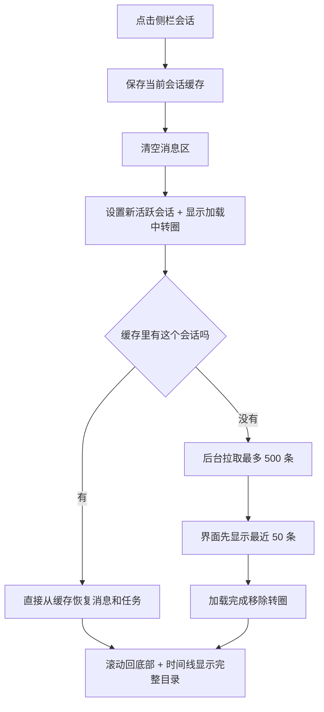
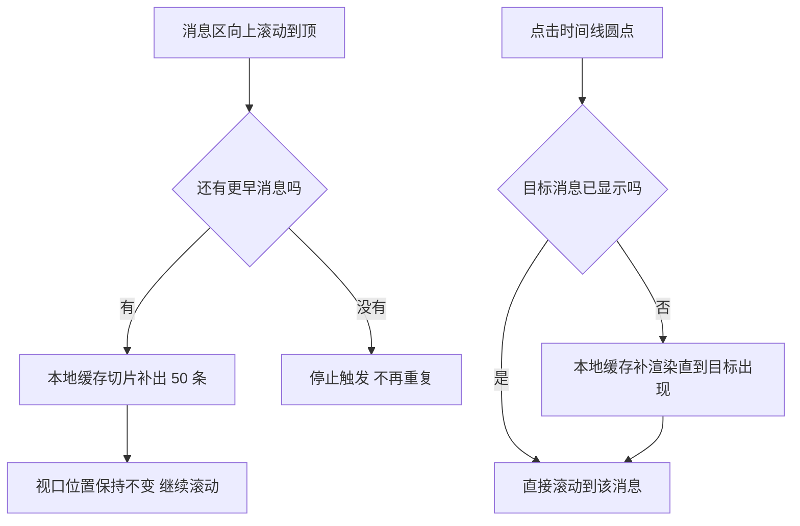

# 会话列表优化 — 原型文档

> 版本：v1.0
> 日期：2026-08-08
> 作者：产品经理
> 关联方案：[会话列表优化-设计方案.md](./会话列表优化-设计方案.md)

---

## 一、功能概述

会话列表优化让用户**看得见加载、翻得动长会话**：打开应用/切换工作区时列表有转圈反馈而不是误显示「暂无会话」；长会话（几百条消息）秒开，向上滚动能不断看到更早的消息；右侧时间线圆点显示完整目录，点击任意圆点直接跳到那一条用户消息。

**核心规则：**

| 规则 | 说明 |
|------|------|
| 会话跟随工作区 | 侧栏只显示当前工作区的会话（切换工作区列表自动刷新） |
| 加载可见 | 列表加载中显示转圈「正在加载会话…」；加载失败不误导为空 |
| 长会话秒开 | 进入会话最多加载 500 条，界面先显示最近 50 条（秒出），其余在后台待命 |
| 滚动加载更早 | 向上滚动到顶自动补出更早消息（本地缓存切片，无网络等待、无提示条） |
| 时间线完整 | 右侧圆点 = 整个会话的完整目录（不只最近 50 条），点击跳转自动补渲染 |
| 切回不丢消息 | 切换到其他会话再切回来，进行中的消息还在（内存缓存，最多保留 20 个会话） |
| 引擎离线提示 | 引擎未就绪时消息区显示离线占位（不是白屏/假卡死），引擎恢复自动重载 |

---

## 二、用户场景

### 场景 A：打开应用看会话

> 张阿姨（非编程用户）打开分形，工作区正在加载，侧栏先出现一个转圈「正在加载会话…」，几秒后列出她这个项目的会话。以前这里会一闪而过「暂无会话」，让她以为会话丢了。

### 场景 B：翻长会话

> 小李（开发者）跟 AI 聊了 300 多轮，点开这个会话只看到最近 50 条，向上滚动到顶，更早的消息自动补出来，一路翻到最开始；右侧圆点显示全部用户消息的目录，点中间的圆点直接跳到那一段。

### 场景 C：多窗口切换

> 小张（开发者）同时开了「项目 A」「项目 B」两个窗口，来回切换时列表不会互相覆盖——A 窗口看到的一直是 A 的会话。

### 场景 D：引擎重启恢复

> 张阿姨的引擎意外退出，消息区显示「历史消息暂不可用」灰色占位（会话标题还在），引擎重启后消息自动恢复，不用手动刷新。

### 场景 E：搜索会话

> 小李会话很多，在搜索框输入关键词，列表只显示标题匹配的会话；搜不到时提示「无匹配结果」，和「还没有会话」区分开。

---

## 三、页面原型

### 3.1 会话侧栏 — 加载中

```
┌──────────────────────────────┐
│ 会话                    [+][«]│
│ ┌──────────────────────────┐ │
│ │ 🔍 搜索会话               │ │
│ └──────────────────────────┘ │
│                              │
│         ⟳ （转圈）            │
│       正在加载会话…           │
│                              │
│                              │
│                              │
│                              │
│                              │
└──────────────────────────────┘
```

| 区域 | 元素 | 展示条件 | 交互 |
|------|------|----------|------|
| 列表区 | 转圈 + 「正在加载会话…」 | `sessionsLoading && 无会话 && 未搜索` | 转圈动画（animate-spin） |

### 3.2 会话侧栏 — 无会话引导 / 搜索无结果

```
┌──────────────────────────────┐
│ 会话                    [+][«]│
│ ┌──────────────────────────┐ │
│ │ 🔍 搜索会话               │ │
│ └──────────────────────────┘ │
│        ＋                    │
│      暂无会话                │
│                              │
│     （或搜索无结果：）        │
│       无匹配结果             │
└──────────────────────────────┘
```

| 区域 | 元素 | 展示条件 | 交互 |
|------|------|----------|------|
| 列表区 | 「＋ 暂无会话」引导 | 未搜索 && 无会话 && 加载完成 | 点击「+」新建会话 |
| 列表区 | 「无匹配结果」 | 有搜索词 && 过滤后为空 | 清空搜索恢复列表 |

### 3.3 会话侧栏 — 会话列表（含操作）

```
┌──────────────────────────────┐
│ 会话                    [+][«]│
│ ┌──────────────────────────┐ │
│ │ 🔍 搜索会话               │ │
│ └──────────────────────────┘ │
│ 💬 新会话         12.3K  ●   │
│ 💬 优化消息发送    ─   ✎ 🗑   │
│ 💬 修 Bug          ●         │
│ 💬 React 项目    ─  ✎ 🗑     │
└──────────────────────────────┘
```

| 区域 | 元素 | 展示条件 | 交互 |
|------|------|----------|------|
| 会话行 | 标题 | 始终 | 点击切换会话 |
| 会话行 | token 数 | `totalTokens` 非空 | 小字灰显 |
| 会话行 | 活动点（绿闪=处理中/蓝=未读/橙闪=等待授权） | 有活动状态 | 只读指示 |
| 会话行 | ✎ 重命名 / 🗑 删除 | 悬停显示 | 点击进入重命名 / 确认后删除 |
| 搜索框 | 搜索词 | 始终 | 输入即过滤；✕ 清空 |

### 3.4 消息区 — 历史加载空态三分支

```
┌──────────────────────────────────────────┐
│   （加载中）          ⟳ 正在加载历史消息…  │
│   大会话可能需要几秒                        │
│                                           │
│   （离线占位）  ⚡ 历史消息暂不可用          │
│   引擎未就绪，请稍候或检查引擎状态          │
│   当前会话：优化消息发送                    │
│                                           │
│   （正常欢迎页）  ▮ 开始新的对话             │
│   Enter 发送 · Shift+Enter 换行            │
└──────────────────────────────────────────┘
```

| 区域 | 元素 | 展示条件 | 交互 |
|------|------|----------|------|
| 消息区 | 转圈「正在加载历史消息…」 | 切会话全量拉取期间（messages 空 && historyLoading） | 转圈动画 |
| 消息区 | 离线占位「历史消息暂不可用」 | serve 未就绪（historyError） | 展示当前会话标题；引擎恢复自动重载 |
| 消息区 | 欢迎页 | 无历史加载、无错误（新会话） | 引导发送 |

### 3.5 消息区 — 长会话与时间线

```
┌──────────────────────────────────┬─┐
│ …（更早消息，滚动到顶自动补出）     │·│
│ 💬 用户问题 3            ⟳…       │·│
│ ▮ 回答 3                          │ │
│ 💬 用户问题 2                     │·│
│ ▮ 回答 2                          │…│
│ 💬 用户问题 1（当前视口）          │·│
│ ▮ 回答 1                          │·│
└──────────────────────────────────┴─┘
```

| 区域 | 元素 | 展示条件 | 交互 |
|------|------|----------|------|
| 消息列表 | 消息气泡 | messages 非空 | 滚动；到顶触发加载更早（无提示条） |
| 右侧 | 时间线圆点 | 有用户消息 | 圆点=用户消息；滚动高亮当前；点击跳转 |
| 右侧 | 省略号「…」 | 用户消息 >7 条 | 点击展开全部；悬停显示 tooltip（不展开） |
| 右侧 | 收起按钮「×」 | 展开态末尾 | 点击收起 |
| tooltip | 消息预览 | 悬停圆点 | 显示该消息前 80 字（50 条外也用快照兜底） |

---

## 四、交互流程

### 4.1 正常流程：切换会话



### 4.2 正常流程：滚动加载更早 / 时间线跳转



### 4.3 异常分支

| 节点 | 异常 | 表现 |
|------|------|------|
| 会话列表加载 | 引擎未就绪 | 静默失败；引擎恢复后自动补拉当前工作区列表 |
| 切会话拉消息 | 引擎未就绪 | 显示离线占位（会话标题正常）；引擎恢复自动重载 |
| 切换竞态 | 拉取期间又切到别的会话 | 过期结果丢弃，不影响当前会话 |
| 滚动到顶 | 已到最早消息 | 停止加载，后续滚动不再触发 |
| 时间线跳转 | 点击越界/目标找不到 | 静默不滚动 |
| 切回会话 | 缓存还在 | 直接恢复（含进行中的消息） |

---

## 五、页面状态矩阵

| 页面 | 状态 | 条件 | 展示 |
|------|------|------|------|
| 会话侧栏 | 加载中 | sessionsLoading && 无会话 && 未搜索 | 转圈 + 「正在加载会话…」 |
| 会话侧栏 | 无会话 | 加载完成 && 无会话 && 未搜索 | 「＋ 暂无会话」 |
| 会话侧栏 | 搜索无结果 | 有搜索词 && 过滤为空 | 「无匹配结果」 |
| 会话侧栏 | 有列表 | sessions 非空 | 会话行（标题/token/活动点/悬停操作） |
| 消息区 | 加载中 | messages 空 && historyLoading | 转圈 + 「正在加载历史消息…」 |
| 消息区 | 离线占位 | messages 空 && historyError | ⚡ 灰显 + 当前会话标题 |
| 消息区 | 欢迎页 | messages 空 && 无加载/错误 | 欢迎引导 |
| 消息区 | 有消息 | messages 非空 | 消息气泡 + 时间线 |
| 时间线 | 压缩 | 用户消息 >7 条 | 首尾点 + 活跃窗口 + 省略号 |
| 时间线 | 展开 | 点击省略号 | 全部圆点 + × 收起（容器可滚动） |
| 时间线 tooltip | 显示 | 悬停导航区 | 每点显示消息预览（50 条外走快照兜底） |

---

## 六、边界与约束

| 边界项 | 约束 |
|--------|------|
| 长会话上限 | 单会话最多加载 500 条（超出截断，后续虚拟滚动放开） |
| 缓存上限 | 内存缓存最多 20 个会话（LRU 淘汰最旧）；缓存含进行中的消息与任务 |
| 会话归属 | 会话列表跟随当前工作区（切换工作区后只显示该区会话） |
| 加载更早 | 只从本地缓存切片，无网络请求；缓存耗尽即到顶 |
| 引擎离线 | 历史消息不可用但会话信息正常展示；恢复后自动重载 |
| 数据来源 | 消息来自引擎 serve（本地无消息库）；清理缓存不影响引擎数据 |

---

## 七、测试要点

### 7.1 功能测试

| 编号 | 测试场景 | 前置条件 | 操作步骤 | 预期结果 |
|------|----------|----------|----------|----------|
| F-01 | 列表加载态 | 引擎启动慢/首次打开 | 打开应用 | 先显示「正在加载会话…」，完成后显示列表或「暂无会话」 |
| F-02 | 搜索过滤 | 有多个会话 | 输入关键词 / 清空 | 列表按标题过滤；无匹配显示「无匹配结果」 |
| F-03 | 会话跟随工作区 | 有多个工作区 | 切换工作区 | 列表只显示当前工作区会话 |
| F-04 | 多窗口竞态 | 两个窗口不同工作区 | 同时打开/切换 | 列表互不覆盖 |
| F-05 | 长会话秒开 | 会话 >50 条消息 | 切换进入 | 立即显示最近 50 条；转圈出现又消失 |
| F-06 | 滚动加载更早 | 会话 >50 条 | 向上滚动到顶 | 更早消息自动补出；视口不跳 |
| F-07 | 到顶停止 | 已加载全部 | 继续滚动 | 不再补出、无重复请求 |
| F-08 | 时间线完整目录 | 会话 >50 条 | 点省略号展开 | 全部圆点（如 500 个）；点圆点跳到对应消息 |
| F-09 | 切回不丢消息 | 会话进行中 | 切走再切回 | 进行中的消息还在 |
| F-10 | 引擎离线占位 | 引擎未启动 | 切换进入会话 | 灰显「历史消息暂不可用」+ 会话标题 |
| F-11 | 引擎恢复自动重载 | 离线占位中 | 启动/恢复引擎 | 消息自动出现，占位消失 |
| F-12 | 重命名/删除 | 有会话 | 悬停操作 | 重命名保存、删除确认后列表更新 |

### 7.2 兼容性

| 编号 | 测试场景 | 前置条件 | 操作步骤 | 预期结果 |
|------|----------|----------|----------|----------|
| C-01 | 缓存溢出 | 缓存 >20 个会话 | 连续切换 25 个会话 | 最旧会话缓存被淘汰；切回时走重新拉取 |
| C-02 | 500 条截断 | 会话 >500 条消息 | 进入会话 | 只加载 500 条；时间线目录为 500 条内（后续虚拟滚动放开） |
| C-03 | 流式后台累积 | 会话 A 处理中切到 B | 等 A 完成后切回 A | 切回直接看到 A 的完整结果（不重新拉取） |

---

## 八、代码索引

### 前端

| 功能点 | 文件 | 关键位置 |
|--------|------|----------|
| 会话列表加载/竞态/加载态 | `src/renderer/src/stores/session.ts` | loadSessions / loadSeq / sessionsLoading |
| 内存全量缓存 + 时间线索引 | `src/renderer/src/stores/chat.ts` | fullHistory / loadedFromFull / timelineIndex / loadFullHistory / prependFromFullHistory |
| 会话缓存 LRU + 后台事件 | `src/renderer/src/stores/chat.ts` | sessionCache / saveSessionCache / loadFromCache / handleBackgroundStreamEvent |
| 切换流程 | `src/renderer/src/composables/useSessionSwitch.ts` | doSwitch（缓存优先 + DB 兜底 + 竞态 guard） |
| 侧栏三分支/搜索 | `src/renderer/src/components/session/SessionSidebar.vue` | L186-201 空态分支 / filteredSessions |
| 滚动加载 + 时间线跳转 | `src/renderer/src/components/chat/ChatPanel.vue` | checkLoadMore / loadMoreHistory / scrollToTimelineIndex |
| 时间线导航 | `src/renderer/src/components/chat/ChatTimelineNav.vue` | userTimeline / activeIndex / timelineItems |
| 消息 DOM 锚点 | `src/renderer/src/components/chat/MessageBubble.vue` | L156 data-message-id |
| 后台事件/恢复重载 | `src/renderer/src/composables/useStreamProcessor.ts` | L187-188 handleBackgroundStreamEvent / L431-448 恢复重载 |
| 桥函数 | `src/renderer/src/lib/electron-bridge.ts` | listSessions / listMessages（limit/before options） |
| 文案 | `src/renderer/src/locales/zh.json` / `en.json` | session.loading / chat.historyLoading* / chat.historyOffline* |

### 后端

| 功能点 | 文件 | 关键位置 |
|--------|------|----------|
| messages 分页选项 | `electron/main/oc-sdk.ts` | L184 接口 / L283-293 实现（as never 断言） |
| 消息列表 IPC | `electron/main/ipc.ts` | L762-779 message:list（校验+透传） |
| 会话列表/创建 | `electron/main/ipc.ts` | L726-739 session:create / session:list（directory 透传） |

### 涉及表

无（消息数据源为 serve，分形无本地消息库）。

---

## 九、变更记录

| 版本 | 日期 | 变更内容 | 作者 |
|------|------|----------|------|
| v1.0 | 2026-08-08 | 初始版本：会话列表优化（加载态/竞态/内存分页/时间线全量索引） | 产品经理 |
