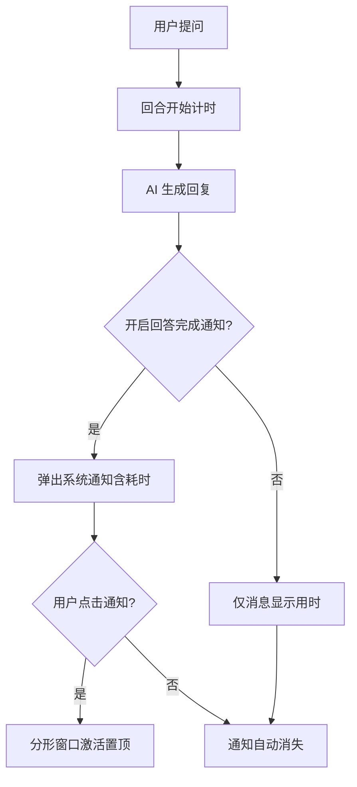
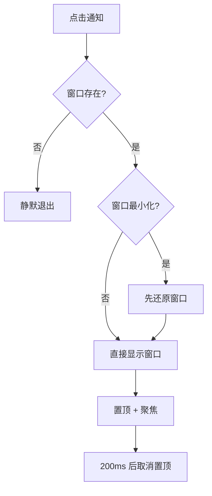

# 回合完成体验优化 — 原型文档

> 版本：v1.0
> 日期：2026-08-16
> 作者：产品经理
> 关联方案：[回合完成体验优化-设计方案.md](../设计/回合完成体验优化-设计方案.md)

---

## 一、功能概述

每个 AI 回合（提问 → 回答完成）结束时，让用户能清楚感知「这轮花了多久」，并且在切走做其他事时，通过系统通知及时得知「回答已完成」，点击通知即可回到分形继续看结果。

**核心规则：**

| 规则 | 说明 |
|------|------|
| 回合用时 | 每个回合独立计时，从提问发出到回答完成，显示在回合消息上 |
| 通知触发 | 设置中开启「AI 回答完成」通知后，每回合完成时发系统通知 |
| 通知耗时 | 通知正文带本回合耗时，格式 MM:SS 或 HH:MM:SS |
| 点击通知 | 激活分形窗口（最小化先还原）并置顶到前台 |

---

## 二、用户场景

### 场景 A：看回合约耗时

> 普通用户在分形里问了一个复杂问题，AI 思考加改文件花了 3 分多钟。回合结束后，用户看到消息上标注「03:12」，知道这轮确实花了不少时间，心里有数。

### 场景 B：切出去等通知

> 用户提问后切到浏览器查资料。AI 回答完成时，Windows 右下角弹出系统通知「回答已完成 / 用时 01:30」。用户点击通知，分形窗口立刻回到前台并置顶，直接看到结果。

### 场景 C：长时间任务

> 用户让 AI 执行一个耗时 1 小时以上的批量任务，期间去开会。回来看见通知「用时 1:05:00」，一眼就能读出总耗时，不用自己换算秒数。

---

## 三、页面原型

### 3.1 回合消息 — 用时标记

**位置：** 会话流中每条 assistant 回合消息头部

```
┌──────────────────────────────────────────────────┐
│  AI  ·  03:12                          [√ 完成]   │
│  ┌────────────────────────────────────────────┐  │
│  │ 已帮你把配置项全部迁移到新版本 settings。      │  │
│  │ 变更点：...                                 │  │
│  └────────────────────────────────────────────┘  │
└──────────────────────────────────────────────────┘
```

| 区域 | 元素 | 展示条件 | 交互 |
|------|------|----------|------|
| 消息头部 | AI 角色名 | 始终 | — |
| 消息头部 | 回合用时（MM:SS / HH:MM:SS） | 有计时基准时 | — |
| 消息头部 | 用时显示 `--` | 无计时基准（异常兜底） | — |

### 3.2 系统通知 — 回答完成

**位置：** Windows 通知中心 / 右下角弹窗

```
┌──────────────────────────────────┐
│  分形                             │
│  ──────────────────────────────  │
│  回答已完成                       │
│  用时 01:30                      │
└──────────────────────────────────┘
```

| 区域 | 元素 | 展示条件 | 交互 |
|------|------|----------|------|
| 通知头部 | 应用名「分形」 | 始终 | — |
| 通知标题 | 回答已完成 | 始终 | — |
| 通知正文 | 用时 MM:SS / HH:MM:SS | 有本回合耗时 | — |
| 通知正文 | AI 已生成回答（纯文案） | 无耗时（兜底） | — |
| 通知整体 | — | 始终 | 点击 → 激活分形窗口到前台 |

---

## 四、交互流程

### 4.1 正常流程



### 4.2 通知点击流程



### 4.3 异常分支

| 节点 | 异常 | 表现 |
|------|------|------|
| 回合计时 | 无起始时间（旧会话/异常时序） | 消息用时显示 `--`，通知正文回退纯文案，功能不中断 |
| 系统通知 | 系统禁用通知 / Windows 通知受限 | 不弹通知，主流程不受影响 |
| 点击通知 | 窗口已关闭 | 无动作（静默退出） |

---

## 五、页面状态矩阵

| 页面 | 状态 | 条件 | 展示 |
|------|------|------|------|
| 回合消息 | 计时正常 | 回合完成且有起始时间 | 用时 MM:SS / HH:MM:SS |
| 回合消息 | 计时缺失 | 回合完成但无起始时间 | 用时显示 `--` |
| 系统通知 | 带耗时 | 本回合有 duration_ms | 标题「回答已完成」+ 正文「用时 XX:XX」 |
| 系统通知 | 纯文案 | 无 duration_ms | 标题「回答已完成」+ 正文「AI 已生成回答」 |
| 系统通知 | 未开启 | 设置中关闭「AI 回答完成」 | 不弹通知 |
| 分形窗口 | 点击通知后 | 窗口最小化 | 还原 + 显示 + 置顶聚焦 |
| 分形窗口 | 点击通知后 | 窗口正常 | 显示 + 置顶聚焦 |

---

## 六、边界与约束

| 边界项 | 约束 |
|--------|------|
| 计时准确性 | 以 serve 事件流 `message.updated(role=user)` 为回合起点、`session.idle` 为终点；网络延迟/事件乱序可能导致微小误差 |
| 耗时格式 | <1 小时显示 MM:SS；≥1 小时显示 HH:MM:SS；负数/0 兜底为 00:00 |
| 通知依赖 | 系统通知能力；Windows 通知受限时降级为无通知 |
| 置顶行为 | 点击通知后仅短暂置顶（200ms），不改变窗口常驻层级 |
| 历史会话 | 历史回合的用时标记按当时持久化的 duration_ms 展示，不受本次优化回溯影响 |

---

## 七、测试要点

### 7.1 功能测试

| 编号 | 测试场景 | 前置条件 | 操作步骤 | 预期结果 |
|------|----------|----------|----------|----------|
| F-01 | 单回合计时 | 新会话 | 发一条消息等完成 | 消息显示用时，与提问到完成实际时长一致 |
| F-02 | 多回合独立计时 | 会话内 | 连续发两条消息各等完成 | 第二回合用时不含第一回合 |
| F-03 | 重启后续会话计时 | 重启 serve | 继续旧会话提问 | 用时正常显示（不显示 --） |
| F-04 | 通知点击激活 | 通知展示中，窗口最小化 | 点击通知 | 窗口还原置顶到前台 |
| F-05 | 通知耗时格式 | 回合完成耗时 90 秒 | 看通知正文 | 显示「用时 01:30」 |
| F-06 | 通知长耗时格式 | 回合完成耗时 65 分钟 | 看通知正文 | 显示「用时 1:05:00」 |
| F-07 | 通知开关 | 设置关闭「AI 回答完成」 | 完成一个回合 | 不弹通知，消息用时仍显示 |
| F-08 | 无耗时兜底 | 历史/异常场景无 duration_ms | 完成一个回合 | 通知正文为「AI 已生成回答」，不报错 |

### 7.2 兼容性

| 编号 | 测试场景 | 前置条件 | 操作步骤 | 预期结果 |
|------|----------|----------|----------|----------|
| C-01 | 多窗口 | 打开多个分形窗口 | 点击通知 | 激活最近聚焦/第一个窗口 |
| C-02 | 窗口销毁后点击 | 窗口已关闭但通知仍在 | 点击通知 | 无动作不报错 |

---

## 八、代码索引

### 前端

| 功能点 | 文件 | 关键位置 |
|--------|------|----------|
| 回合起始时间重置 | `electron/main/events.ts` | message.updated(role=user) 分支：`ctx.sessionStartTime.set` |
| 回合耗时计算 | `electron/main/events.ts` | session.idle 分支：`duration_ms = now - startTime` |
| 通知点击激活窗口 | `electron/main/ipc.ts` | `notification:show` handler + `activeNotifications` Set |
| 耗时格式化 | `src/renderer/src/lib/utils.ts` | `formatDurationHMS` |
| 回答完成通知 | `src/renderer/src/composables/useStreamProcessor.ts` | `notifyReplyDone` / result 事件调用点 |
| 通知文案 | `src/renderer/src/locales/zh.json` / `en.json` | `notificationReplyDoneBodyDuration` |

### 涉及表

| 表 | 操作 | 说明 |
|----|------|------|
| 无 | — | 纯事件流 + IPC，无数据库变更 |

---

## 九、变更记录

| 版本 | 日期 | 变更内容 | 作者 |
|------|------|----------|------|
| v1.0 | 2026-08-16 | 初始版本（覆盖回合计时修复、通知点击激活、耗时格式化） | 产品经理 |
