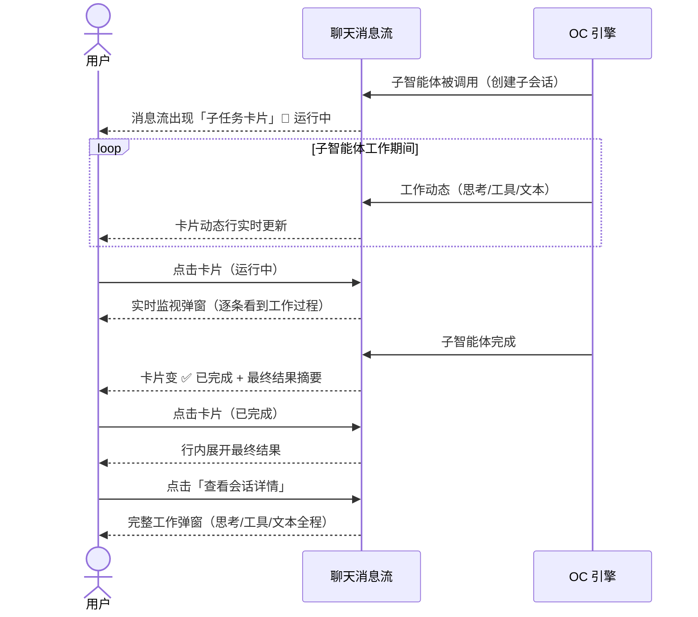

# 子智能体可视化 — 产品原型文档

> 版本：v1.0
> 日期：2026-08-09
> 作者：产品/测试
> 状态：待评审

---

## 一、用户场景

| 场景 | 用户角色 | 需求描述 |
|------|----------|----------|
| 阻塞可视化 | 分形用户 | 主智能体调用子智能体时，界面能看到子智能体正在工作，不会误以为卡住 |
| 实时监视 | 分形用户 | 子智能体工作时，点卡片能打开弹窗实时看它在想什么、做什么 |
| 反馈查看 | 分形用户 | 子智能体（如侦查兵）完成后，点卡片直接看最终结果 |
| 完整审计 | 分形用户 | 点「查看会话详情」回看子智能体的完整工作过程 |

## 二、核心规则表

| 规则 | 说明 |
|------|------|
| 何时出现卡片 | 主智能体派生子智能体的瞬间，消息流中插入「子任务卡片」 |
| 运行中显示 | 智能体徽标 + 「运行中」+ 耗时 + 一行实时动态 |
| 完成后显示 | 智能体徽标 + 「已完成」+ 耗时 + 最终结果摘要（前 3 行） |
| 运行中点击卡片 | 打开**实时监视弹窗**（流式看到子智能体工作） |
| 完成后点击卡片 | **行内展开**最终结果全文 |
| 查看会话详情 | 打开**完整工作弹窗**（思考过程/工具调用/全部文本） |
| 数据来源 | 引擎事件流自动推送（无需刷新/等待） |

## 三、交互流程

### 3.1 完整生命周期



### 3.2 三态交互对照

| 卡片状态 | 点击卡片 | 附带按钮 | 场景价值 |
|----------|----------|----------|----------|
| 🔄 运行中 | 实时监视弹窗 | 无 | 确认子智能体活着 + 在干什么 |
| ✅ 已完成 | 行内展开结果 | 「查看会话详情」 | 快速看反馈，深入看完整过程 |

## 四、界面布局

### 4.1 子任务卡片（消息流内）

```
┌─ 🕵️ 侦查兵 · 已完成 · 45s ─────────────────────┐
│  查得深圳今日 32°C 晴，空气质量优…                │
│  [查看会话详情]                                 │
└────────────────────────────────────────────────┘
```

| 元素 | 说明 |
|------|------|
| 徽标 | 按智能体映射：👷工匠 / 🧭参谋 / 🕵️侦查兵 / 🎨制图师 / 🤖其他 |
| 状态 | 🔄 运行中（呼吸动画）→ ✅ 已完成 |
| 耗时 | 从创建到完成，秒级实时刷新 |
| 动态行 | 运行中显示最后一条工作动态（单行省略号） |
| 摘要 | 完成后显示最终结果前 3 行 |
| 展开 | 已完成点击后行内展开全文（再点收起） |
| 详情按钮 | 「查看会话详情」→ 完整工作弹窗 |

### 4.2 实时监视弹窗（运行中）

```
┌─ 🕵️ 侦查兵 · 实时监视 ──────────── ✕ ┐
│  🔄 运行中 · 23s                      │
│  ── 思考 ──                            │
│  ▸ 我需要先搜索深圳今天的天气…          │
│  ── 工具 ──                            │
│  ✓ websearch 深圳天气（2 个结果）       │
│  ── 回复 ──                            │
│  深圳今日 32°C 晴…                     │
└────────────────────────────────────────┘
```

| 元素 | 说明 |
|------|------|
| 状态条 | 智能体名 + 运行中 + 耗时 |
| 思考区 | 可折叠，流式追加 |
| 工具区 | 工具名 + 参数摘要 + 结果摘要 |
| 回复区 | 流式文本 |
| 关闭 | ✕ 关闭不中断数据累积，再次点击卡片重新打开即见最新 |

### 4.3 完整工作弹窗（查看会话详情）

```
┌─ 🕵️ 侦查兵 · 完整工作 ──────────── ✕ ┐
│  返回主会话 ←                        │
│  [与主会话相同的消息渲染：             │
│   思考（折叠）/ 工具卡片 / 文本]       │
└────────────────────────────────────────┘
```

| 元素 | 说明 |
|------|------|
| 返回主会话 | 顶部链接，跳回派生子智能体的主会话 |
| 消息渲染 | 与主会话一致（思考折叠、工具卡片、文本气泡） |

## 五、异常分支

| 场景 | 用户看到什么 |
|------|-------------|
| 子智能体信息缺失 | 徽标显示 🤖 + 「子智能体」 |
| 最终结果获取失败 | 「已完成」+ 占位「（摘要获取失败）」，点详情重试 |
| 切走再切回 | 卡片保持原状态（已完成 + 摘要保留）；未完成的显示「状态未知」，点详情看最新 |
| 子智能体工作内容超长 | 监视弹窗保留最近 200 条 + 动态行截断 |

## 六、测试要点（用户视角）

| 测试场景 | 操作 | 预期结果 |
|----------|------|----------|
| 卡片出现 | 触发主智能体调用子智能体 | 消息流出现卡片 + 运行中 + 动态实时变化 |
| 实时监视 | 运行中点击卡片 | 弹窗逐条显示工作过程，无需刷新 |
| 完成状态 | 等待子智能体结束 | 卡片自动变 ✅ + 摘要出现 |
| 行内展开 | 已完成点击卡片 | 最终结果全文展开/收起 |
| 完整详情 | 点「查看会话详情」 | 完整工作弹窗显示全程 |
| 状态保留 | 子任务进行中切走会话再切回 | 卡片状态不丢 |
| 无感知 | 普通对话（无子智能体） | 界面无任何变化 |

## 七、边界与约束

- 本次不做：侧栏子会话树形分组（二期）、子会话批量清理
- 实时性依赖引擎事件流推送（实测 1.18.15 原生支持）
- 弹窗为模态（ModalShell），关闭即返回消息流

## 八、变更记录

| 版本 | 日期 | 变更内容 | 作者 |
|------|------|----------|------|
| v1.0 | 2026-08-09 | 初始版本（三态交互用户拍板：运行中实时弹窗 / 完成后行内摘要 / 详情按钮完整工作） | 产品/测试 |
