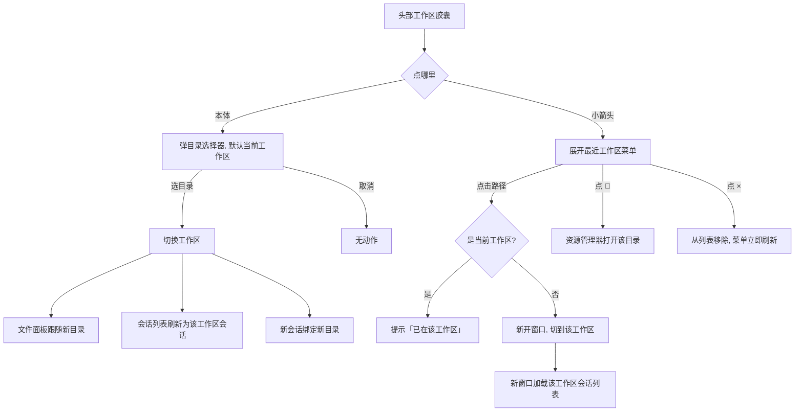

# 工作区管理 — 原型文档

> 版本：v1.0
> 日期：2026-08-08
> 作者：产品经理
> 关联方案：[工作区管理-设计方案.md](./工作区管理-设计方案.md)

---

## 一、功能概述

把头部的工作区胶囊（ws-pill）从「仅展示当前目录 + 选目录」升级为完整的**工作区管理入口**：点本体直接选目录，点小箭头打开「最近工作区」菜单，菜单项支持新窗口打开 / 在资源管理器中查看 / 从列表移除。切换工作区后，文件面板、会话列表、新会话都自动跟随新目录。

**核心规则：**

| 规则 | 说明 |
|------|------|
| 两个入口 | 胶囊本体点击 = 直接弹目录选择器；小箭头点击 = 打开最近工作区菜单 |
| 列表来源 | 最近使用的工作区（本地记忆）+ 引擎会话里出现过的目录（补充，可找回），去重合并显示 |
| 点击行为 | 点「当前工作区」项 → 提示「已在该工作区」；点其他项 → 新开一个窗口干活（两个项目互不干扰） |
| 移除语义 | 从列表移除 = 不再显示，不删除任何磁盘数据；之后重新打开该目录会自动恢复显示 |
| 跟随联动 | 切工作区后：文件面板跟随新目录、会话列表只显示该工作区的会话、新会话自动绑定新目录 |

---

## 二、用户场景

### 场景 A：换项目干活

> 小李（普通用户）今天要写另一个项目的代码，点了头部胶囊里的目录图标，在弹出的选择框里选好新目录——文件面板立刻切到新目录，会话列表变成这个项目专属的会话，开聊就是新项目的对话。

### 场景 B：回到上次的项目

> 张阿姨（非编程用户）昨天整理过两个文件夹，今天打开分形想接着弄。她点头部胶囊旁边的小箭头，看到「最近工作区」列表里有两个目录，点一下昨天弄的那个——直接新开一个窗口打开了那个项目，旧窗口还留在原来的项目里，互不影响。

### 场景 C：清理列表

> 小陈（普通用户）最近用过 5 个目录，但那个临时文件夹以后不会再用了。他在菜单里把鼠标移到那一项上，点旁边的 ×——这一项从列表消失。之后他不小心又打开了那个目录，它又自动出现在列表里，不用手动加回来。

### 场景 D：找回丢失的列表

> 开发者小李重装了系统（或清了应用缓存），本地「最近工作区」记录没了。他打开菜单发现之前用过的项目目录还在——因为引擎会话里记住了它们绑定的目录，自动补回了列表。

---

## 三、页面原型

### 3.1 头部工作区胶囊（ws-pill）— 常态

**位置：** 顶部导航栏左侧（品牌名右边）

```
┌──────────────────────────────────────────────────────────────┐
│ [◉ 分形]  [📁 H:\work\proj-a ▾]        ○ ○ ○ ○ ○ ○ ○ ○      │
│           └── 胶囊 ──┘                    （右侧 icon-btn）   │
└──────────────────────────────────────────────────────────────┘
```

| 区域 | 元素 | 展示条件 | 交互 |
|------|------|----------|------|
| 胶囊本体 | 📁 文件夹图标 | 始终 | 点击 = 弹目录选择器（默认定位到当前工作区） |
| 胶囊本体 | 路径文本 | 有 cwd 时显示路径；无 cwd 显示「选择工作区」 | 路径 mono 字体，超长省略号截断 |
| 胶囊右侧 | 小箭头 ▾ | 始终 | 点击 = 展开/收起「最近工作区」菜单 |

### 3.2 最近工作区菜单

**入口：** 点击胶囊小箭头

```
┌───────────────────────────┐
│ 最近工作区                 │
│ ┌────────────────────────┐│
│ │ H:\work\proj-a      📂×││  ← 当前工作区（高亮）
│ │ H:\work\proj-b      📂×││
│ │ H:\docs\proj-c      📂×││
│ └────────────────────────┘│
│ （无记录时：「暂无最近工作区」）│
└───────────────────────────┘
```

| 区域 | 元素 | 展示条件 | 交互 |
|------|------|----------|------|
| 菜单头 | 「最近工作区」标题 | 始终 | — |
| 菜单项 | 目录路径 | 合并列表非空 | 点击路径：当前项 → 提示「已在该工作区」；非当前项 → 新开窗口并切到该工作区 |
| 菜单项 | 高亮样式 | 该项 = 当前 cwd | 视觉区分当前工作区 |
| 菜单项 | 📂 打开位置 | hover 显示 | 在系统资源管理器中打开该目录；不触发新窗口 |
| 菜单项 | × 移除 | hover 显示 | 从最近工作区移除（列表立即消失该行）；不触发新窗口 |
| 空态 | 「暂无最近工作区」 | 合并列表为空 | 引导用户点胶囊本体选目录 |

### 3.3 新窗口（多项目并行）

**触发：** 菜单里点非当前工作区项

```
┌─────────────────────────────┐   ┌─────────────────────────────┐
│ 分形 — proj-b               │   │ 分形 — proj-a（原窗口）      │
│ （新窗口，工作区=proj-b）    │   │ （保持原工作区不动）          │
└─────────────────────────────┘   └─────────────────────────────┘
```

| 区域 | 元素 | 展示条件 | 交互 |
|------|------|----------|------|
| 新窗口标题栏 | 「分形 — 目录名」 | 带工作区打开的新窗口 | 便于多窗口识别；原窗口标题保持「分形」 |
| 新窗口内容 | 会话列表 = 该工作区的会话 | 新窗口加载完成 | 文件面板/会话列表均以新工作区为准 |

### 3.4 目录选择提示条（全局反馈）

**触发：** 菜单操作 / 切换失败等需要可见反馈时，顶部居中显示，3 秒自动消失

| 文案 | 场景 |
|------|------|
| 「已在该工作区」 | 点击菜单中的当前工作区项 |
| 「已在新窗口打开 proj-b」 | 非当前项成功新开窗口 |
| 「已从最近使用移除 proj-c」 | 点 × 移除某目录 |
| 「打开目录选择器失败，请重试」 | 目录对话框 invoke 失败 |
| 「打开新窗口失败，请重试」 | 新开窗口 invoke 失败 |

---

## 四、交互流程

### 4.1 正常流程



### 4.2 取消/退出流程

- 目录选择器点「取消」→ 无任何切换，界面保持原样
- 点菜单外任意区域 / 再点一次小箭头 → 菜单收起
- 新开窗口失败 → 提示「打开新窗口失败，请重试」，原窗口不受影响

### 4.3 异常分支

| 节点 | 异常 | 表现 |
|------|------|------|
| 打开菜单 | 引擎未就绪（会话目录取不到） | 菜单仍显示，只含本地「最近工作区」记录 |
| 切换工作区 | 目标目录已被删除/无权限 | 文件面板刷新静默失败（不弹错）；会话按该目录查询可能为空 |
| 打开菜单 | 本地记录全空 + 引擎无会话 | 显示「暂无最近工作区」空态 |
| 点击当前项 | 用户点了当前工作区 | 提示「已在该工作区」，不新开窗口 |
| 移除后 | 该目录在引擎会话里仍存在 | 菜单该行消失（不显示）；用户重新打开该目录后自动恢复显示 |
| 应用双开 | 用户又启动一个分形 | 新实例不启动，已打开的窗口弹到前台 |

---

## 五、页面状态矩阵

| 页面 | 状态 | 条件 | 展示 |
|------|------|------|------|
| 胶囊路径 | 有当前工作区 | cwd 非空 | 路径文本（截断） |
| 胶囊路径 | 无工作区 | cwd 为空 | 「选择工作区」 |
| 菜单 | 有列表 | 合并列表非空 | 路径列表 + hover 操作区 |
| 菜单 | 空态 | 列表为空 | 「暂无最近工作区」 |
| 菜单项 | 当前项 | path === cwd | 高亮样式；点击提示「已在该工作区」 |
| 菜单项 | 普通项 | 非当前 | 点击新开窗口 |
| 菜单项操作区 | hover 可见 | 鼠标悬停 | 📂 / × 出现 |
| 新窗口 | 带工作区 | createWindow(path) | 标题「分形 — 目录名」，内容按工作区加载 |
| 提示条 | 有提示 | alertText 非空 | 顶部居中显示，3s 自动消失 |
| 提示条 | 无提示 | alertText 空 | 不渲染 |

---

## 六、边界与约束

| 边界项 | 约束 |
|--------|------|
| 最近工作区上限 | 最多记住 10 个，超限移除最旧（最早使用的先淘汰） |
| 移除的持久性 | 排除集合存本地（localStorage），应用重启仍生效；重新打开该目录自动解除 |
| 移除的范围 | 只影响列表显示，不删除磁盘目录、不影响引擎会话 |
| 列表来源 | 本地记录优先排序，引擎会话目录补充（去重）；引擎不可用时仅本地 |
| 会话跟随 | 切工作区后会话列表只显示该工作区的会话；不同工作区的会话不混显 |
| 多窗口 | 每个窗口独立一个工作区；新窗口以创建时指定的工作区为准 |
| 单实例 | 同一时间只允许一个分形实例（防数据文件并发写）；再启动会聚焦已有窗口 |
| 目录有效性 | 启动恢复 cwd 时会校验目录仍存在；已删除的目录不恢复为当前工作区 |

---

## 七、测试要点

### 7.1 功能测试

| 编号 | 测试场景 | 前置条件 | 操作步骤 | 预期结果 |
|------|----------|----------|----------|----------|
| F-01 | 本体选目录 | 有当前工作区 | 点胶囊本体 → 选目录 | 目录选择器默认定位当前工作区；选定后切换工作区 |
| F-02 | 本体取消 | 任意 | 点胶囊本体 → 取消 | 无切换、无提示，界面不变 |
| F-03 | 菜单聚合 | 本地 recent 有 A，引擎会话有 A/B | 点小箭头 | 列表 = [A, B]，A 不重复 |
| F-04 | 菜单空态 | 无 recent 且引擎无会话 | 点小箭头 | 「暂无最近工作区」 |
| F-05 | 引擎未就绪 | serve 未启动 | 点小箭头 | 菜单仍显示，仅本地 recent，无崩溃 |
| F-06 | 点当前项 | 菜单含当前工作区 | 点击该项路径 | 提示「已在该工作区」，不新开窗口 |
| F-07 | 点非当前项 | 菜单含非当前项 | 点击该项路径 | 新窗口打开且切到该工作区；原窗口工作区不变 |
| F-08 | 移除 | 菜单有项 | hover 该项 → 点 × | 该行立即消失；刷新后仍不显示（持久化） |
| F-09 | 移除后恢复 | 已移除某目录 | 通过选择器重新打开该目录 | 目录重新出现在最近工作区列表 |
| F-10 | 打开位置 | 菜单有项 | hover 该项 → 点 📂 | 系统资源管理器打开该目录；不触发新窗口 |
| F-11 | 切工作区联动 | 有会话 + 文件面板打开 | 切换工作区 | 文件面板切新目录、会话列表刷新、新会话绑定新目录 |
| F-12 | 新窗口标题 | 从菜单开新窗口 | 观察新窗口标题 | 「分形 — 目录名」 |
| F-13 | 应用双开 | 分形已运行 | 再启动一次 | 新实例退出，已有窗口聚焦到前台 |

### 7.2 兼容性/异常

| 编号 | 测试场景 | 前置条件 | 操作步骤 | 预期结果 |
|------|----------|----------|----------|----------|
| C-01 | 目录不存在 | recent 含已删除目录 | 打开菜单 → 切到该目录 | 无崩溃；文件面板空/静默失败，会话为空 |
| C-02 | 路径为空串 | 引擎会话无 directory | 打开菜单 | 空值不显示在列表 |
| C-03 | 多窗口会话竞态 | 新窗口加载中 | 快速在窗口间切换 | 会话列表不被旧请求覆盖（最终显示当前工作区） |
| C-04 | 最近工作区超限 | 已存 10 个 | 再使用 1 个新目录 | 列表仍 10 个，最早的被挤出 |

---

## 八、代码索引

### 前端

| 功能点 | 文件 | 关键位置 |
|--------|------|----------|
| ws-pill 双区交互/菜单/switchToWorkspace | `src/renderer/src/components/layout/AppShell.vue` | 模板 L457-491；脚本 L160-274 |
| 工作区合并纯函数 | `src/renderer/src/lib/workspace-merge.ts` | mergeWorkspaces |
| 工作区状态/recentWorkspaces | `src/renderer/src/stores/settings.ts` | L166-196（MAX_RECENT_WORKSPACES/addRecentWorkspace/removeRecentWorkspace）、L199-246（initFromDb cwd 校验） |
| 文件面板跟随 | `src/renderer/src/components/files/FilePanel.vue` | L108-128（watch navPath/forceClose/cwd） |
| switch-workspace 消费 | `src/renderer/src/components/chat/ChatPanel.vue` | L400-419 |
| bridge 透传 | `src/renderer/src/lib/electron-bridge.ts` | createSession L425 / listSessions L431 / openDialog L340 / openWorkspaceWindow L678 / onInitWorkspace L683 |

### 后端

| 功能点 | 文件 | 关键位置 |
|--------|------|----------|
| session:create/list cwd 链路 | `electron/main/ipc.ts` | L726-739 |
| SDK query.directory 适配 | `electron/main/oc-sdk.ts` | L235-241 |
| 单实例锁/多窗口/init-workspace 下发 | `electron/main/index.ts` | L17/L48/L62-98/L146-156 |
| 目录对话框 | `electron/main/ipc.ts` | L499-544 |
| preload 白名单/事件桥 | `electron/preload/index.ts` | ALLOWED_INVOKE + window:init-workspace |

### 涉及表

无（`ui-settings.json` JSON 字段扩展，无表结构变更）。

---

## 九、变更记录

| 版本 | 日期 | 变更内容 | 作者 |
|------|------|----------|------|
| v1.0 | 2026-08-08 | 初始版本（镜像：工作区管理-设计方案 v1.0） | 产品经理 |
