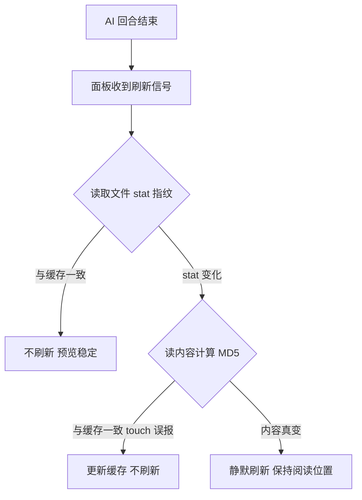

# 文件预览面板 — 原型文档

> 版本：v1.0
> 日期：2026-08-15
> 作者：产品经理
> 关联方案：[文件预览面板-设计方案.md](./文件预览面板-设计方案.md)

---

## 一、功能概述

文件预览面板是分形右侧的预览区域，支持文本/代码、Markdown、HTML、Word、Excel、PPT、PDF、图片等格式的快速查看，并可在面板内编辑文本类文件、将 HTML 导出为 PDF。会话中 AI 修改文件后，面板会**精确判断当前预览的文件是否真的被编辑**——没编辑就不刷新，避免预览"一直闪"。

**核心规则：**

| 规则 | 说明 |
|------|------|
| 只刷被编辑的文件 | AI 改了其他文件，当前预览不刷新 |
| 真变了才刷新 | stat 变化后还要比对内容哈希，touch 等不刷新 |
| 刷新不打扰 | 自动刷新不清空内容、不闪 loading、阅读位置不跳 |
| 多格式覆盖 | 文本/MD/HTML/docx/xlsx/pptx/pdf/图片均可预览 |
| HTML 可导出 | HTML 预览一键导出 PDF |

---

## 二、用户场景

### 场景 A：预览不被无关编辑打扰

> 用户打开了 `README.md` 在预览面板阅读。AI 会话中修改了 `src/utils.ts` 等多个文件。每轮结束面板应该保持稳定，不闪不跳——因为 `README.md` 没被改动。

### 场景 B：预览跟随真实编辑

> 用户正在预览 `config.json`，AI 这轮恰好改了这个文件。轮次结束后，面板自动刷新展示最新内容，用户看到的是新配置，且阅读位置没有跳回顶部。

### 场景 C：多格式预览

> 用户从文件树双击 `产品方案.pptx`，面板直接展示 PPT 内容，无需打开其他软件；双击 `发票.pdf` 可直接翻页查看；双击 `数据.xlsx` 可切换 Sheet、拖拽选区。

### 场景 D：HTML 导出 PDF

> 用户预览某个 HTML 页面，点击「导出 PDF」，选择保存位置后得到一份 PDF 文件，方便分享。

---

## 三、页面原型

### 3.1 文件预览面板 — 文本/Markdown 文件

**页面：** 右侧面板（内嵌模式）/ 独立预览窗口

```
┌────────────────────────────────────────────┐
│ 📄 README.md                  [编辑|预览]   │
│                        保存   ⟳  ⧉  大纲  ▶ │
├────────────────────────────────────────────┤
│  # 分形（Fractal）                          │
│                                             │
│  面向非编程人员的 OpenCode 桌面 GUI ...      │
│                                             │
│  ## 快速开始                                │
│  ...                                       │
├────────────────────────────────────────────┤
│ （MD 预览右侧可展开 200px 大纲侧边栏）        │
└────────────────────────────────────────────┘
```

| 区域 | 元素 | 展示条件 | 交互 |
|------|------|----------|------|
| Header | 文件名 + 未保存圆点 | 始终 / 编辑未保存时 | title 显示完整路径 |
| Header | 编辑/预览 tab | 有编辑能力的文件类型 | 切换 CodeMirror 编辑与渲染预览 |
| Header | 保存按钮 | 编辑 tab 且 dirty | Ctrl+S 或点击保存到磁盘 |
| Header | 手动刷新 ⟳ | 非 loading | 重新读取文件，各类型预览刷新 |
| Header | 独立窗口 ⧉ | 内嵌模式 | 打开独立预览窗口 |
| Header | 大纲 | markdown 文件 | 展开/收起 200px 大纲侧栏，点击跳转标题 |
| Header | 转 docx | markdown 且非独立窗口 | 检测 docx skill → 发送转换命令给 AI |
| 正文 | 编辑 tab | 文本类 | CodeMirror 高亮 + 划选发送修改建议 |
| 正文 | 预览 tab | markdown | MarkdownRenderer 渲染 + 大纲联动 |

### 3.2 文件预览面板 — HTML 文件

```
┌────────────────────────────────────────────┐
│ 📄 page.html                  [编辑|预览]   │
│                        保存   ⟳  ⧉       ▶ │
├────────────────────────────────────────────┤
│ [🔍检查模式] │ [适应│375│768│1024│1440│1920]│ [导出PDF] │
├────────────────────────────────────────────┤
│  ┌────────────────────────────────────┐    │
│  │        (iframe 渲染页面)            │    │
│  │        宽度跟随面板或固定预设        │    │
│  └────────────────────────────────────┘    │
└────────────────────────────────────────────┘
```

| 区域 | 元素 | 展示条件 | 交互 |
|------|------|----------|------|
| 工具栏 | 检查模式开关 | 始终 | 开=点击元素选中发送；关=页面可正常交互 |
| 工具栏 | 宽度预设 | 始终 | 0=跟随面板；375/768/1024/1440/1920 固定宽度 |
| 工具栏 | 导出 PDF | 始终 | 弹保存对话框 → 生成 PDF；成功/失败浮层提示 |
| 正文 | iframe | 始终 | sandbox allow-scripts；链接点击分流（绝对→系统浏览器，相对→开预览窗口） |
| 浮层 | 导出结果提示 | 导出动作后 | ok=accent 提示 / err=coral 报错，5 秒自动消失 |

### 3.3 文件预览面板 — PDF 文件

```
┌────────────────────────────────────────────┐
│ 📄 文档.pdf                     ⟳  ⧉      ▶ │
├────────────────────────────────────────────┤
│  ‹ 1 / 12 ›   [页码输入]   − 100% +  适应宽度│
├────────────────────────────────────────────┤
│  ┌────────────────────────────────────┐    │
│  │         (PDF canvas 渲染)          │    │
│  │         devicePixelRatio 高清       │    │
│  └────────────────────────────────────┘    │
└────────────────────────────────────────────┘
```

| 区域 | 元素 | 展示条件 | 交互 |
|------|------|----------|------|
| 工具栏 | 上一页/下一页 | 始终 | 翻页重绘 canvas |
| 工具栏 | 页码输入 | 始终 | 输入数字跳页，显示总页数 |
| 工具栏 | 缩放 −/+ | 始终 | 缩放当前页 |
| 工具栏 | 适应宽度 | 始终 | 初始 fit width |
| 正文 | canvas | 始终 | 损坏/加密 PDF 显示错误提示 |

### 3.4 文件预览面板 — 其他格式

| 格式 | 预览形态 | 特殊交互 |
|------|----------|----------|
| docx/doc | mammoth 渲染 HTML | 划选文本 → 发送到会话 |
| xlsx/xls/csv | HTML 表格（≤1000 行） | Sheet tab 切换；拖拽选区 → 发送表格到会话 |
| pptx | PptxPreview 组件 | 划选文本 → 发送 |
| image | data URL img | 支持 data: 附件内嵌图 |
| 二进制（exe/zip/音视频等） | 「不支持预览」提示 | 无 |

---

## 四、交互流程

### 4.1 正常流程（会话编辑 → 预览自动刷新）



### 4.2 取消/退出流程

- 关闭预览：内嵌模式有未保存编辑 → 弹确认框（确认放弃 / 取消）；独立窗口直接关闭
- HTML 导出 PDF 取消保存对话框 → 静默无提示

### 4.3 异常分支

| 节点 | 异常 | 表现 |
|------|------|------|
| 指纹读取 | 文件被删除/无权限 | 保守刷新一次，避免卡在旧内容 |
| 文件内容读取 | 文件损坏（PDF/docx/xlsx） | 面板内错误提示，不白屏 |
| PDF 加密 | 解密失败 | 面板内错误提示 |
| HTML 导出 | printToPDF/写盘失败 | 浮层报错显示原因 |
| xlsx 加密 | 密码保护 | 提示「该文件受密码保护」 |

---

## 五、页面状态矩阵

| 页面 | 状态 | 条件 | 展示 |
|------|------|------|------|
| 面板 | 无文件 | file=null | 不渲染 |
| 面板 | loading | 手动刷新/首次加载 | 居中「加载中」 |
| 面板 | 错误 | 读取失败 | 红色错误信息 |
| 面板 | unsupported | 二进制类型 | 「不支持预览」提示 |
| 面板 | 编辑 tab | 有编辑能力类型 | CodeMirror |
| 面板 | 预览 tab | 有预览能力类型 | 各类型渲染 |
| 面板 | 自动刷新中 | silent reload | 内容不清空、不闪 loading |
| 面板 | dirty | 编辑未保存 | 文件名旁 amber 圆点 + 保存按钮 |

---

## 六、边界与约束

| 边界项 | 约束 |
|--------|------|
| xlsx 渲染上限 | 最多渲染 1000 行，超出截断并提示 |
| 预览只读 | xlsx/pptx/pdf/docx 无编辑 tab |
| 独立窗口 | 无会话上下文：隐藏转 docx、发送走主进程转发 |
| HTML sandbox | 仅 allow-scripts；相对链接开新预览窗口，绝对链接走系统浏览器 |
| PDF worker | 经 electron-vite 打包资源加载 |
| 指纹缓存 | 运行时内存态，切换文件自动重置基准 |
| 自动刷新 | 不改变滚动位置（编辑器/iframe/MD/docx 四类） |

---

## 七、测试要点

### 7.1 功能测试

| 编号 | 测试场景 | 前置条件 | 操作步骤 | 预期结果 |
|------|----------|----------|----------|----------|
| F-01 | 无关编辑不刷新 | 预览 README.md | AI 修改其他文件，回合结束 | 预览不闪不跳 |
| F-02 | 真实编辑刷新 | 预览 config.json | AI 修改该文件，回合结束 | 预览自动更新为新内容 |
| F-03 | 滚动位置保持 | 预览长 MD 已滚到中段 | AI 修改该文件触发刷新 | 内容更新但滚动位置不变 |
| F-04 | touch 不刷新 | 预览某文件 | touch 文件（内容不变）触发信号 | 不刷新 |
| F-05 | 手动刷新 | 任意文件 | 点击 ⟳ | 重新读取，loading 显示 |
| F-06 | PDF 翻页缩放 | PDF 文件 | 翻页/页码跳转/缩放 | canvas 正确重绘 |
| F-07 | HTML 导出 PDF | HTML 文件 | 点击导出 → 选路径 | 生成 PDF，浮层成功提示 |
| F-08 | 导出取消 | HTML 文件 | 导出 → 取消对话框 | 静默无提示 |
| F-09 | 文件切换重置 | 预览 A 后切 B | 切文件后 AI 编辑 A | B 不刷新（A 的改动不影响 B） |

### 7.2 异常场景

| 编号 | 测试场景 | 前置条件 | 操作步骤 | 预期结果 |
|------|----------|----------|----------|----------|
| E-01 | 文件被删 | 预览中文件被删 | 触发刷新信号 | 保守刷新或错误提示，不白屏 |
| E-02 | 损坏 PDF | PDF 文件损坏 | 打开预览 | 面板内错误提示 |
| E-03 | 加密 xlsx | xlsx 带密码 | 打开预览 | 「受密码保护」提示 |
| E-04 | 大文件 | 几十 MB 文件 | AI 改其他文件，多轮会话 | stat 快路径，每轮不读盘 |

---

## 八、代码索引

### 前端

| 功能点 | 文件 | 关键位置 |
|--------|------|----------|
| 面板主组件 | `src/renderer/src/components/shared/FilePreviewPanel.vue` | reloadFile(:408) / onOcFileChanged(:194) |
| 指纹对比（本次新增） | `src/renderer/src/components/shared/FilePreviewPanel.vue` | onOcFileChanged 改造 + previewFp 缓存 |
| bridge 指纹函数（本次新增） | `src/renderer/src/lib/electron-bridge.ts` | fileFingerprint() |
| PDF 预览 | `src/renderer/src/components/shared/PdfPreview.vue` | 全文件 |
| PPT 预览 | `src/renderer/src/components/shared/PptxPreview.vue` | 全文件 |
| HTML 导出 | `src/renderer/src/components/shared/FilePreviewPanel.vue` | exportPdf(:237) |

### 主进程（Electron）

| 功能点 | 文件 | 关键位置 |
|--------|------|----------|
| 指纹 handler（本次新增） | `electron/main/ipc.ts` | fs:fileFingerprint |
| 白名单（本次新增） | `electron/preload/index.ts` | ALLOWED_INVOKE + fs:fileFingerprint |
| HTML 转 PDF | `electron/main/ipc.ts` | pdf:htmlToPdf |
| 刷新信号广播 | `electron/main/index.ts` | window:preview-changed |

### 涉及表

| 表 | 操作 | 说明 |
|----|------|------|
| 无 | — | 无数据库变更 |

---

## 九、变更记录

| 版本 | 日期 | 变更内容 | 作者 |
|------|------|----------|------|
| v1.0 | 2026-08-15 | 初始版本：合并 PDF 预览 / HTML 转 PDF 既有能力，新增自动刷新指纹判断 | 产品经理 |
