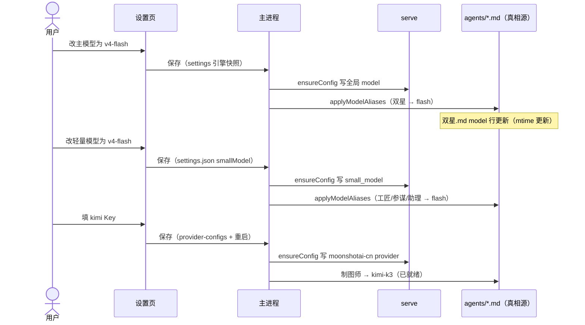

# 模型配置-原型文档

> 版本：v1.0 ｜ 状态：已实现（2026-08-09） ｜ 读者：产品/测试/UI
> 镜像：docs/设计/模型配置-设计方案.md（v1.2 技术视角）

## 一、用户场景

| 场景 | 用户角色 | 需求描述 |
|------|----------|----------|
| 切换主力模型 | 普通用户 | 在设置页选 v4-pro / v4-flash，主智能体（双星）立即跟随 |
| 控制成本 | 普通用户 | 把轻量模型固定为 flash——工匠跑腿 + 标题生成都走便宜模型 |
| 启用制图师 | 普通用户 | 粘贴 kimi API Key，制图师（能看图的智能体）即可用 |
| 改完不丢 | 升级用户 | 升级分形后，自己在设置页改过的模型配置不被预置覆盖 |

## 二、核心规则表（用户视角）

| 规则 | 说明 |
|------|------|
| 模型分三档 | 主模型（双星/军师/导师用）、轻量模型（工匠/参谋/助理 + 标题生成用）、多模态模型（制图师用） |
| 军师/导师跟随主模型 | 锁定的，不用配——主模型选什么它用什么（顾问用主力） |
| 轻量模型默认跟随主模型 | 想省钱就单独固定为 flash |
| 制图师需要 kimi Key | 不填 Key 制图师不可用（其他功能不受影响） |
| 保存即生效 | 改完保存后新任务就用新模型（个别需要重启引擎的会自动重启） |

## 三、界面布局（设置页）

```
┌─ LLM 设置 ─────────────────────────────────────┐
│ 模型（主模型）          [ v4-pro        ▼ ]     │  ← HIGH
│ API Key（DeepSeek）     [ ••••••••••  👁 ] [保存]│  ← 必填
│ API Key（制图师）       [ ••••••••••  👁 ] [保存]│  ← 多模态（kimi）
│   ┌─ 高级设置（展开）───────────────────────────┐
│   │ 轻量模型            [ 跟随主模型    ▼ ]     │  ← LOW
│   │   （说明：会话标题生成/消息润色等轻量任务）  │
│   └─────────────────────────────────────────────┘
└──────────────────────────────────────────────────┘
```

**元素明细**：

| 元素 | 类型 | 选项 | 默认 | 交互 |
|------|------|------|------|------|
| 模型（主模型） | 下拉 | v4-flash / v4-pro | v4-pro | 选择即保存；双星/军师/导师跟随 |
| API Key（DeepSeek） | password 输入 | — | 已存值回显 | 保存按钮；👁 切换明文 |
| API Key（制图师） | password 输入 | — | 已存值回显 | 保存按钮（自动重启引擎）；👁 切换明文；说明「不填则制图师不可用」 |
| 轻量模型 | 下拉 | 跟随主模型 / v4-flash / v4-pro | 跟随主模型 | 选择即保存；工匠/参谋/助理 + 标题生成跟随 |

**状态反馈**：
- kimi Key 保存成功 → 提示「已保存，引擎重启中…」（引擎就绪后主界面恢复）
- 轻量模型保存 → 无感知（下次任务生效）

## 四、交互流程（时序）



## 五、边界与约束（用户视角）

| 边界 | 说明 |
|------|------|
| 军师/导师不显示下拉 | 跟随主模型是设计意图（顾问用主力） |
| 制图师 Key 不填 | 只有制图师不可用，其余全部正常 |
| 升级不丢配置 | 你改过的模型配置（.md 文件）预置升级不会覆盖；oc-plus 重新部署可覆盖（它的权力） |
| 当前只列 DeepSeek 两个模型 | 主/轻量下拉只列 deepseek 系列；多模态固定 kimi-k3 |

## 六、测试要点（用户视角）

| 测试场景 | 操作 | 预期结果 |
|----------|------|----------|
| 切换主模型 | 设置页选 flash → 保存 → 发任务给双星 | 双星用 flash 回复（成本视角：便宜） |
| 轻量模型固定 | 轻量模型选 flash → 新建会话 | 会话标题正常生成（走 flash） |
| 制图师启用 | 填 kimi Key 保存 → 让制图师干活 | 制图师正常回复（不报 Model not found） |
| 升级保留 | 预置升级后检查设置页 | 模型选择保持用户之前的值 |
