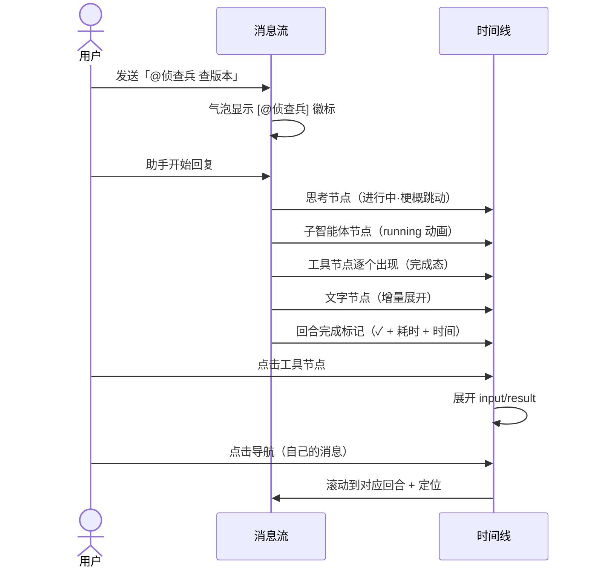

# 消息流时间线化-原型文档

> 版本：v1.1 ｜ 状态：待复审 ｜ 读者：产品/测试/UI
> 镜像：docs/设计/消息流时间线化-设计方案.md（v1.1 技术视角）
> Demo：docs/原型/timeline-demo.html（v3，http://127.0.0.1:8899/timeline-demo.html）

## 一、用户场景

| 场景 | 用户角色 | 需求描述 |
|------|----------|----------|
| 看懂助手干了什么 | 普通用户 | 一次回复里「思考→工具→子智能体→文字→总结」的顺序一眼可见 |
| 不被思考过程打扰 | 普通用户 | 思考默认折叠成一行（带方向梗概），想看了再点开 |
| 工具干了什么 | 普通用户 | 工具一行标题（图标+梗概如「read · 文件路径」），点开看参数和结果 |
| 感知进度 | 普通用户 | 节点有「进行中（跳动动画）/完成（✓+耗时）」两态 |
| 回合边界 | 普通用户 | 回合结束有完成标记（耗时+系统时间）——最后操作是工具静默结束也有 |
| 跟踪子智能体 | 普通用户 | 子智能体卡片在时间线里，归属位置清晰，功能不变 |
| 找回自己的消息 | 普通用户 | 导航只列自己的消息，按「我什么时候说的」回溯 |
| 识别指令 | 普通用户 | 发 @侦查兵 或 /review 时气泡上有小徽标 |

## 二、核心规则表

| 规则 | 说明 |
|------|------|
| 用户消息 | 右侧独立气泡（不变）；带 @agent/斜杠命令时左上角小徽标 |
| 助手回复 = 一条时间线（回合级） | 一次回复（你发消息 → 回复结束）= 一条时间线；过程分多步也不断开，节点按顺序连成一条线 |
| 节点两态 | 进行中：琥珀脉冲 + 三连点跳动 + 内容实时更新；完成：✓ + 耗时 |
| 思考过程 | 默认折叠：「💭 思考 + 方向梗概（前 60 字）」——点开展开全文；连续多段思考合并为一个节点 |
| 文字回复 | 始终展开；最后一段文字标为「✅ 总结」（绿底） |
| 工具调用 | 一行卡片：「icon + 工具名 + 梗概 + ✓ 完成」——点开看 input/result |
| 相邻同类合并 | 连续思考/文字合并为一个节点（工具打断后各自独立） |
| 子智能体 | **不单独显示 task 工具节点**——直接由子智能体卡片（🕵️ agent名 + 任务 + 状态）代替，功能不变 |
| 待办更新 | 单行：「📋 更新待办 · 正在：<任务>」——无展开（详情看独立待办面板） |
| 回合完成标记 | 时间线末尾：「─── ✓ 回合完成 · 耗时 · 时间 ───」——静默结束也有 |
| 时间线导航 | 只列你自己的消息（圆点锚点），点击跳转 |

## 三、界面布局（模拟会话）

```
┌────────────────────────────────────────────────────────┐
│  你                                        ┌─────────┐  │
│  [@侦查兵] 用侦查兵查一下 opencode 最新版本│ 你 ·14:02│  │
│                                          └─────────┘  │
│  ●💭 思考：派侦查兵查版本，再读 changelog…▸           │
│  │  ●🕵️ 侦查兵 · 查 opencode 最新版本 ✓ 12.4s ▸      │
│  │  ●🌐 websearch · opencode latest release ✓ 3.4s▸  │
│  │  ●📝 侦查兵返回了版本号，接下来读 changelog…       │
│  │  ●📄 read · RELEASE-NOTES-0.1.0.md ✓ 0.2s ▸       │
│  │  ●✅ 总结：v1.18.15 值得关注的三点…                │
│  ─── ✓ 回合完成 · 21.3s · 14:02:32 ───                │
├────────────────────────────────────────────────────────┤
│  你                                        ┌─────────┐  │
│  [无徽标] 把三件事记下来并执行            │ 你 ·14:08│  │
│                                          └─────────┘  │
│  ●📋 更新待办 · 正在：设计时间线组件  ✓ 0.3s          │
│  │  ●⌨️ bash · npm run test ✓ 2.3s ▸                 │
│  │  ●📋 更新待办 · 正在：实现组件     ✓ 0.2s          │
│  │  ●✅ 总结：三件事全部完成…                         │
│  ─── ✓ 回合完成 · 6.8s · 14:08:22 ───                │
└────────────────────────────────────────────────────────┘
```

**元素明细**：

| 元素 | 类型 | 状态 | 交互 |
|------|------|------|------|
| 思考节点 | 卡片（琥珀 💭） | 默认收起（梗概） | 点击展开全文 |
| 工具节点 | 卡片（蓝 icon 细分） | 默认收起（梗概） | 点击展开 input/result |
| todo 节点 | 单行（粉 📋） | 常显 | **无展开** |
| 子智能体节点 | 卡片（紫 🕵️） | 收起/运行中动画 | SubTaskCard 现有（展开/监视/详情） |
| 文字节点 | 无卡片（正文） | 始终展开 | 无收起 |
| 总结节点 | 绿底（✅） | 始终展开 | 无收起 |
| 进行中动画 | 卡片+圆点 | 脉冲+三连点跳动 | 内容实时更新 |
| 回合完成标记 | 分隔线 | 完成即显示 | 纯展示 |
| 用户指令徽标 | 气泡角标 | @agent 紫 / 命令 蓝 | 纯展示 |

## 四、交互流程



## 五、边界与约束

| 边界 | 说明 |
|------|------|
| 思考收起也完整保存 | 收起只是视觉折叠，数据完整 |
| 工具结果太长 | 展开截断（现有机制），完整在诊断日志 |
| todo 详情 | 在独立待办面板（时间线只显示「正在做什么」） |
| 旧会话 | 无 contentBlocks 的老消息降级为三段式（顺序退化可接受） |
| 子智能体归属 | 实时=task 工具出现位置（子智能体卡片代替 task 节点）；历史=对应消息；无法锚定→独立节点段 |
| 导航只有用户消息 | 不列思考/工具/子智能体节点 |

## 六、测试要点（用户视角）

| 测试场景 | 操作 | 预期结果 |
|----------|------|----------|
| 看懂时间线 | 复杂任务（多工具+子智能体+多次思考） | 竖线+节点顺序清晰，思考/文字交替正确 |
| 收起态梗概 | 找有思考/工具的回合同合 | 标题行显示内容梗概（read 显示文件名等） |
| 进行中动画 | 发任务观察 | 节点脉冲+三连点跳动，内容实时更新 |
| 静默结束 | 发任务让模型最后只跑 shell | 回合完成标记仍显示 |
| todo 单行 | 让助手建待办 | 时间线一行显示「正在：X」，无展开 |
| 指令徽标 | 发 @侦查兵 / /review | 气泡徽标显示 |
| 导航回溯 | 长会话滚动 | 导航只列你的消息，点击跳转 |
| 子智能体 | 历史会话 | 卡片在对应消息位置，功能（展开/详情）不变 |
| 旧会话 | 打开老消息 | 降级三段式显示，不报错 |

## 七、变更记录

| 版本 | 日期 | 变更内容 | 作者 |
|------|------|----------|------|
| v1.0 | 2026-08-09 | 初稿（镜像设计 v1.0） | 双星 |
| v1.1 | 2026-08-09 | 同步设计 v1.1：收起态梗概 / todo 单行无展开 / 两态动画 / 回合完成标记+系统时间 / 子智能体归属与平铺收敛 / 相邻同类合并 | 双星 |
| v1.2 | 2026-08-09 | 同步设计 v1.2：回合级时间线（多步不断线）/ 子智能体代替 task 工具节点（不重复展示） | 双星 |
| v1.3 | 2026-08-09 | 同步设计 v1.3：task 锚定 running 时点 / 中文词边界 / 存量降级声明 | 双星 |
