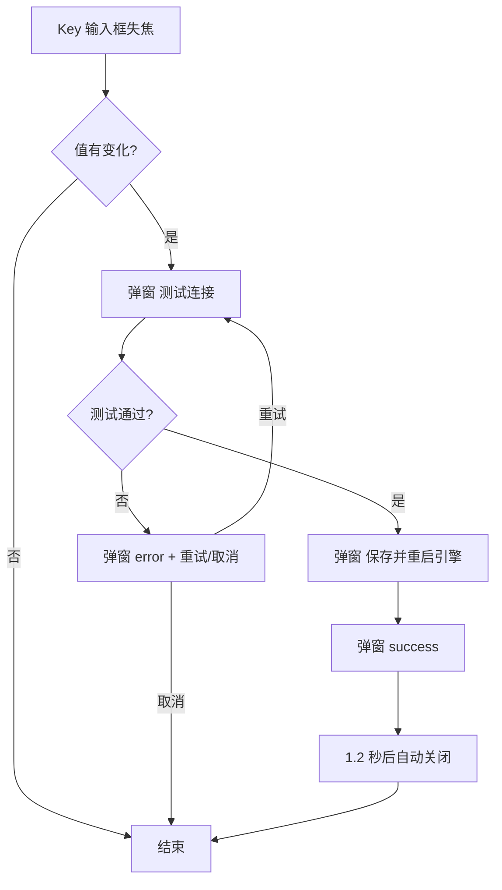

# 设置页重构 — 原型文档

> 版本：v1.1 ｜ 状态：已实现（2026-08-14 提交 5884e6c）｜ 读者：产品/测试/UI
> 关联方案：docs/设计/设置页重构-设计方案.md（v1.1）
> 说明：本文档替代旧「设置页原型文档.md」（v1.0，数据模式开关时代，三栏布局已过时）

---

## 一、功能概述

设置页是分形桌面端唯一配置入口：API Key、界面偏好、AI 行为、通知、高级配置。本次重构解决三件事：**布局混乱**（25+ 个设置项平铺爆炸 → 左侧导航 6 tab）、**功能缺失**（思考节点开关/图片头像/默认主 Agent/子 agent 模型/系统通知）、**交互笨重**（配置 Key 后需手动「测试连接→保存→重启引擎」，小白不懂重启）。

**核心规则：**

| 规则 | 说明 |
|------|------|
| 六 tab 分类 | 通用 / 模型与 API / AI 行为 / 通知 / 高级 / 关于 |
| key 自动生效 | Key 输入框失焦后自动「测试连接 → 保存并重启引擎」，弹窗只反馈进度 |
| 通知默认开启 | 回答完成 / 引擎异常 / 权限请求 3 场景默认开，子任务完成默认关 |
| 轻量模型默认 flash | LOW 槽位（标题/摘要/润色）默认用 deepseek-v4-flash，更快更省 |
| 头像可选 | 24 个 lucide 科技图标 或 上传本地图片，实时预览 |

---

## 二、用户场景

### 场景 A：首次配置 Key

> 小白用户下载分形后，在「模型与 API」tab 填入 DeepSeek API Key。输入框一失焦，自动弹出「正在测试连接…」进度弹窗，连接成功后自动「保存并重启引擎」，弹窗显示绿色 ✓ 后 1.2 秒自动关闭。全程不用知道「重启引擎」是什么。

### 场景 B：更换失效 Key

> 用户之前的 Key 过期了（发消息无反应）。打开设置页发现 Key 还是旧的，替换成新 Key，失焦后同样自动走完测试→保存→重启。如果新 Key 无效，弹窗显示红色错误 + 「重试 / 取消」按钮，不会拿坏 Key 重启引擎。

### 场景 C：个性化界面

> 日常用户在「通用」tab 切换语言/主题/字号（字号档位生效，全部界面文字同步缩放）；在头像区从 24 个科技图标里挑一个，或上传自己的头像图片（圆形预览、hover 后可更换/清除）。

### 场景 D：开启系统通知

> 用户想被 AI 回答完成时提醒。打开「通知」tab——发现默认就已经开着（回答完成/引擎异常/权限请求）。想安静的话关掉全局开关，4 个场景开关全部变灰禁用。只要某个场景开，对应事件到达就弹 Windows 通知。

### 场景 E：调整子 agent 模型

> 用户在「AI 行为」tab 看到 7 个子 agent（工匠/军师等），每个可独立选模型：默认「跟随默认」（显示当前实际生效值），可选 flash / pro；制图师只能选 Kimi K3（模型能力限定，防配错）。

---

## 三、页面原型

### 3.1 设置页整体 — 6 tab 布局

**页面：** 顶部工具栏「设置」入口 → SettingsPanel

```
┌────────┬──────────────────────────────────┐
│ 通用    │  [分组标题]                       │
│ 模型与API│  label              [控件]       │
│ AI行为  │  label              [控件]       │
│ 通知    │  ...                             │
│ 高级    │                                  │
│ 关于    │                                  │
└────────┴──────────────────────────────────┘
```

| 区域 | 元素 | 展示条件 | 交互 |
|------|------|----------|------|
| 左侧导航 | 6 个 tab | 始终 | 点击切换右侧内容；当前 tab accent 高亮 |
| 通用 | 语言/主题/字号/消息排布/昵称/头像 | 始终 | 下拉/输入/开关即时生效（ui.* 三写自动保存） |
| 模型与 API | DeepSeek Key（含余额）、Kimi K3 Key（含余额）、baseUrl、主模型、上下文窗口 | 始终 | Key 失焦变化 → 自动流程弹窗；余额刷新按钮 |
| AI 行为 | 默认主 Agent（双星/build/plan）、7 个子 agent 模型、权限模式、思考深度、思考节点开关、轻量模型（含作用描述） | 始终 | 选择即时写 settings.json |
| 通知 | 全局开关 + 4 场景开关 | 始终 | 全局关 → 场景禁用（灰） |
| 高级 | 数据模式、OC 路径、日志级别、预置技能、JSON 编辑器 | 始终 | JSON 编辑器为高级用户兜底 |
| 关于 | 版本/引擎版本/预置版本 + 更新日志按钮（右对齐） | 始终 | 更新日志弹窗 |

### 3.2 Key 变更引导弹窗

**入口：** DeepSeek / Kimi K3 Key 输入框失焦且值与挂载时不同

| 阶段 | 弹窗内容 | 可关闭？ | 按钮 |
|------|----------|----------|------|
| testing | 旋转加载圈 + 「正在测试连接…」 | 否（ESC/遮罩/× 全禁用） | 无 |
| saving | 旋转加载圈 + 「正在保存并重启引擎…」 | 否 | 无 |
| success | 绿色 ✓ + 「连接成功，已保存并重启引擎」 | 是 | 无（1.2s 自动关） |
| error | 红色错误信息（Key 无效原因） | 是 | 取消 / 重试 |

### 3.3 头像选择区

| 元素 | 说明 |
|------|------|
| 图片上传器 | 无图：虚线圆形占位框（上传图标）；有图：圆形预览 + hover 左右分半「更换 / 清除」大热区 |
| 图标候选 | 8 列 × 3 行 24 个 lucide 科技图标（56px 圆形），选中 accent 高亮 |
| 顺序 | 图片上传器在前，图标候选在后；有图时消息区显示图片，否则显示图标 |

---

## 四、交互流程

### 4.1 Key 变更自动流程



### 4.2 通知开关

| 步骤 | 行为 |
|------|------|
| 全局关 → 开 | 4 个场景开关解锁；已勾选场景保持 |
| 场景开关 | 独立勾选，即时生效 |
| 全局开 + 场景开 | 事件到达时弹 Windows 通知（回答完成/引擎异常/权限请求/子任务完成） |

### 4.3 异常分支

| 节点 | 异常 | 用户看到 |
|------|------|----------|
| 测试连接 | Key 无效（401） | 红色错误 + 重试/取消，不保存不重启 |
| 保存重启 | 引擎启动失败 | 弹窗 error 显示失败原因 |
| 余额查询 | 网络失败/Key 无效 | 余额区显示「查询失败」 |
| 头像上传 | 非图片/超限 | 系统对话框直接拒绝选图 |
| 通知弹窗 | 系统未授权 | 静默（不阻断） |

---

## 五、页面状态矩阵

| 页面 | 状态 | 条件 | 展示 |
|------|------|------|------|
| 通知 tab | 全局开 | enabled=true | 场景开关可操作 |
| 通知 tab | 全局关 | enabled=false | 场景开关灰禁（pointer-events none） |
| Key 弹窗 | 进行中 | testing/saving | 禁止关闭，防「看似取消实则后台仍在执行」 |
| Key 弹窗 | 失败 | error | 可关闭 + 重试 |
| 头像区 | 无图 | avatarImage 空 | 虚线占位 + 24 图标 |
| 头像区 | 有图 | avatarImage 非空 | 圆形预览 + hover 更换/清除 |
| 头像区 | 换图 | 同一文件名覆盖 | 预览即时刷新（?v= cache-busting） |
| 轻量模型 | 默认 | 未手动选择 | flash（默认值）+ 描述文案 |
| 轻量模型 | 跟随主模型 | 显式选择 | ''（下拉首项） |

---

## 六、边界与约束

| 边界项 | 约束 |
|--------|------|
| Key 明文 | 输入框默认 password，可点眼睛切换明文 |
| 头像图片 | 仅 png/jpg/jpeg/webp；统一命名 avatar.{ext} 覆盖旧图；路径遍历双重白名单拦截 |
| 主 Agent 候选 | 仅 双星/build/plan（子 agent 不可作主 agent） |
| 子 agent 模型 | 按能力限定：制图师仅 kimi-k3、侦查兵 ds-anthropic 端点、其余 flash/pro |
| 通知默认 | enabled=true + 3 场景开 + 子任务关（老用户已有显式配置保持） |
| 轻量模型 | '' = 跟随主模型；默认 flash（前后端 + schema 三端同步） |
| 已知缺陷 | 旧「设置页原型文档.md」与旧「设置页设计方案.md」过时未归档，仅作历史参考 |

---

## 七、测试要点

### 7.1 功能测试

| 编号 | 测试场景 | 前置条件 | 操作步骤 | 预期结果 |
|------|----------|----------|----------|----------|
| F-01 | Key 有效自动流程 | 有有效 Key | 设置页改 Key 失焦 | 弹窗自动测试→保存重启→✓ 自动关 |
| F-02 | Key 无效自动流程 | 有无效 Key | 设置页改 Key 失焦 | 红色错误 + 重试/取消，引擎不重启 |
| F-03 | 通知默认值 | 全新安装 | 打开通知 tab | 全局开 + 3 场景开 + 子任务关 |
| F-04 | 通知全局关 | 默认态 | 关全局开关 | 场景开关全灰禁 |
| F-05 | 轻量模型默认 | 全新安装 | 打开 AI 行为 tab | 下拉显示 flash + 描述文案 |
| F-06 | 头像上传 | 有图片文件 | 上传 → 更换 → 清除 | 预览即时更新，清除回退图标 |
| F-07 | 思考节点开关 | 有 thinking 消息 | 关开关 → 开开关 | 时间线节点隐藏 → 恢复（数据不删） |

### 7.2 权限与安全

| 编号 | 测试场景 | 前置条件 | 操作步骤 | 预期结果 |
|------|----------|----------|----------|----------|
| S-01 | 头像路径遍历 | 手改 settings.json | avatarImage=../../x | 渲染回退图标，主进程 403 |
| S-02 | Key 泄露 | 任意 | 查看 dev.log / 事件日志 | 不出现 Key 明文（provider-configs.json 隔离） |

---

## 八、代码索引

### 前端

| 功能点 | 文件 | 关键位置 |
|--------|------|----------|
| 设置页主体 | `src/renderer/src/components/settings/SettingsPanel.vue` | 6 tab 导航 + key 弹窗接线 |
| Key 变更弹窗 | `src/renderer/src/components/shared/KeyChangeDialog.vue` | 阶段状态机 |
| 通用组件 | `SettingsSelect/SettingsInput/SettingsToggle/SettingsSection.vue` | desc prop / closable |
| 头像图标 | `src/renderer/src/lib/avatar-icons.ts` | 24 图标映射 |
| 头像 URL | `src/renderer/src/composables/useAvatarImageUrl.ts` | avatar:// + ?v= |
| 设置 store | `src/renderer/src/stores/settings.ts` | 防循环 / 默认值 / 三写链 |

### 后端

| 功能点 | 文件 | 关键位置 |
|--------|------|----------|
| avatar 协议 | `electron/main/avatar-protocol.ts` | 注册 + handler 白名单 |
| 引擎 key 快照 | `electron/main/server-manager.ts` | readServedApiKey / getServedApiKey |
| 默认值/schema | `electron/main/settings.ts` + `settings.schema.json` | 通知 3 场景开 / smallModel flash |
| key 重启判断 | `electron/main/ipc.ts` | saveProviderConfig 用 servedKey 基准 |

---

## 九、变更记录

| 版本 | 日期 | 变更内容 | 作者 |
|------|------|----------|------|
| v1.0 | 2026-08-13 | 初稿（与设计 v1.0 同步，未落盘） | 产品 |
| v1.1 | 2026-08-14 | 首次落盘：6 tab 布局 / key 自动流程弹窗 / 通知默认 3 场景开 / 轻量模型默认 flash / avatar 协议头像 / 主 agent 3 项 | 产品 |
