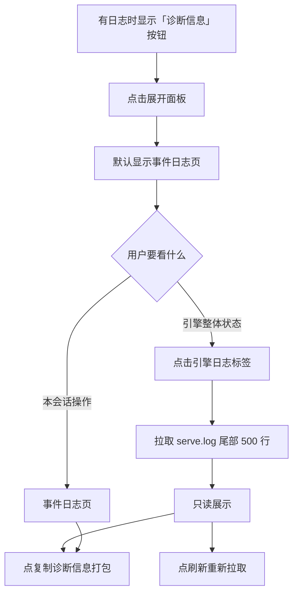

# 诊断面板改造 — 原型文档

> 版本：v1.2
> 日期：2026-08-15
> 作者：产品经理
> 关联方案：[诊断面板改造-设计方案.md](./诊断面板改造-设计方案.md)

---

## 一、功能概述

把聊天区右下角的「调试」按钮改造成**面向用户的「诊断信息」面板**：不用开终端，应用内就能看到三页日志（本会话发生了什么 + 引擎整体发生了什么 + 渲染层控制台），一键复制发给开发者就能排查问题。

**核心规则：**

| 规则 | 说明 |
|------|------|
| 入口 | 本会话有事件日志时显示「诊断信息」按钮（引擎日志有无不参与——渲染层拿不到 serve.log 状态，引擎页空态兜底） |
| 三页日志 | 「事件日志」= 当前会话的操作记录；「引擎日志」= 引擎整体日志（全局）；「控制台日志」= 渲染层 console 输出 |
| 错误高亮 | 事件日志按 ❌/⚠️ 前缀、引擎日志按 level= 字段：错误红色、警告黄色，一眼定位问题（v1.2） |
| 日志搜索 | 三页共用搜索框，输入关键词即时过滤，行数显示命中数（v1.2） |
| 复制 | 每页可单独复制；另有「复制诊断信息」= 版本信息 + 全部日志打包 |
| 定位 | 日志只存本地，不会自动上传；复制内容由用户自己决定发不给谁 |

---

## 二、用户场景

### 场景 A：遇到报错求助

> 张阿姨（非编程用户）用分形时发现「消息一直不回复」，她不用开任何终端——点聊天区右下角「诊断信息」，点「复制诊断信息」，把内容贴给客服，客服一眼看到引擎日志里的报错原因。

### 场景 B：开发者排查

> 小李（开发者）改完代码重启 app，打开「诊断信息 → 引擎日志」，直接看到 serve 启动日志（配置加载路径、监听端口）；触发一次插件报错后点「刷新」，报错行就出现在列表里——不用再切终端。

### 场景 C：会话操作追溯

> 小张（开发者）发现某个会话的审批弹窗行为异常，打开「事件日志」，看到该会话的权限请求/响应记录（哪个工具、什么时候允许/拒绝），定位问题。

### 场景 D：日志搜索定位错误（v1.2）

> 小李排查问题时引擎日志很长，他在搜索框输入「ERROR」——日志立刻只剩报错行（红色高亮），一眼看到 serve 抛出的具体错误；清空关键词恢复完整日志。

---

## 三、页面原型

### 3.1 诊断面板 — 默认（事件日志页）

**入口：** 聊天区底部操作行「▸ 诊断信息 (N)」按钮（有日志时显示）→ 点击展开底部面板

```
┌─────────────────────────────────────────────────────────┐
│ ▸ 诊断信息 (12)              [📋复制] [✕]               │
├─────────────────────────────────────────────────────────┤
│ ┌─ 事件日志 ──┬─ 引擎日志 ─┐                             │
│ │                                                        │
│ │ 🔐 subtype=approval tool=bash request_id=per_xxx       │
│ │ 🔐 tool_input keys: command                            │
│ │ 🔐 respondPermission allow: per_xxx                    │
│ │ 📤 question:reply request=que_xxx answers=[...]        │
│ │ 📨 unknown type: xxx                                   │
│ │                                                        │
│ │              （只读代码块，可滚动）                     │
│ └────────────────────────────────────────────────────────┘
│ 日志用于排查问题，可复制后发给开发者排查                    │
└─────────────────────────────────────────────────────────┘
```

| 区域 | 元素 | 展示条件 | 交互 |
|------|------|----------|------|
| 标题栏 | 「▸ 诊断信息 (N)」 | 事件日志非空 | 点击展开/收起面板 |
| 标题栏 | 📋 复制 | 始终 | 复制当前标签页内容 |
| 标题栏 | ✕ | 面板展开时 | 关闭面板 |
| 标签栏 | 「事件日志」 | 始终 | 默认选中；点击切换 |
| 标签栏 | 「引擎日志」 | 始终 | 点击切换；进入时拉取尾部 500 行 |
| 内容区 | 日志行 | 对应页有内容 | 只读代码块（max-h-48 滚动） |
| 内容区 | 「暂无引擎日志」 | serve 未启动过 | 空态提示 |
| 底部 | 提示文案 | 始终 | 面向用户引导 |

### 3.2 诊断面板 — 引擎日志页

```
┌─────────────────────────────────────────────────────────┐
│ ▸ 诊断信息              [🔍搜索日志…] [🔄刷新] [📋复制] [✕] │
├─────────────────────────────────────────────────────────┤
│ ┌─ 事件日志 ──┬─ 引擎日志 ──┬─ 控制台日志 ─┐   3/52 行    │
│ │ [serve] loading path=...opencode\opencode.json         │
│ │ [serve] server listening on port 58143                 │
│ │ [serve] ERROR: ...                    ← 红色高亮       │
│ │ [serve] [vector] ensureModel 失败，降级 BM25: ...      │
│ │                                                        │
│ │      （只读代码块，可滚动，尾部 500 行）                │
│ └────────────────────────────────────────────────────────┘
│ 日志用于排查问题，可复制后发给开发者排查                    │
└─────────────────────────────────────────────────────────┘
```

| 区域 | 元素 | 展示条件 | 交互 |
|------|------|----------|------|
| 标签栏 | 🔍 搜索框 | 始终 | 输入关键词即时过滤当前页（三页共用）；X 清空 |
| 标题栏 | 🔄 刷新 | 引擎日志页 | 重新读取 serve.log 尾部 |
| 内容区 | 引擎日志行 | serve 有输出 | 只读代码块；超长自动滚动到底部；**level=ERROR 红色、level=WARN 黄色高亮**（v1.2） |
| 内容区 | 行数 | 始终 | `命中数/总行数`（搜索时）；无搜索仅总行数 |
| 复制诊断 | 「复制诊断信息」 | 用户明确需求 | 打包：应用版本 + 引擎日志尾部 → 剪贴板；提示「日志可能包含本地路径，谨慎发送」 |

---

## 四、交互流程

### 4.1 正常流程



### 4.2 取消/退出流程

点击 ✕ 或再次点击按钮 → 面板收起（日志保留，下次展开可见）。

### 4.3 异常分支

| 节点 | 异常 | 表现 |
|------|------|------|
| 打开引擎日志页 | serve 从未启动（无 serve.log） | 显示「暂无引擎日志」空态 |
| 刷新 | 读取失败 | 提示错误 + 保留旧内容 + 可再点刷新 |
| 复制 | 剪贴板权限被拒 | 提示复制失败，手动选中复制兜底 |
| 面板展开时新日志产生 | 引擎持续写日志 | 当前页不自动刷新（避免打断阅读）；点刷新查看 |

---

## 五、页面状态矩阵

| 页面 | 状态 | 条件 | 展示 |
|------|------|------|------|
| 诊断按钮 | 隐藏 | 本会话无事件日志 | 不显示 |
| 诊断按钮 | 显示 | 本会话有事件日志 | 「▸ 诊断信息 (N)」，N=事件条数 |
| 事件日志页 | 有内容 | 会话有操作记录 | 日志行列表 |
| 事件日志页 | 空 | 新会话无操作 | 空白内容区（无空态文案——事件少正常） |
| 引擎日志页 | 有内容 | serve.log 存在 | 尾部 500 行 |
| 引擎日志页 | 空态 | serve.log 不存在 | 「暂无引擎日志」 |
| 复制诊断信息 | 成功 | 剪贴板可用 | 提示已复制（Toast） |
| 复制诊断信息 | 失败 | 权限被拒 | 错误提示 |
| 搜索框 | 有关键词 | 输入任意文字 | 当前页行即时过滤；行数显示命中/总数 |
| 搜索框 | 无匹配 | 关键词无命中 | 显示「无匹配日志」空态 |
| 引擎日志 ERROR 行 | 高亮 | 行含 level=ERROR | 红色（--coral） |
| 引擎日志 WARN 行 | 高亮 | 行含 level=WARN | 黄色（--warning） |

---

## 六、边界与约束

| 边界项 | 约束 |
|--------|------|
| 日志保留 | serve.log 上限 10MB，超限轮转为 serve.1.log（只留 1 份旧档） |
| 事件日志保留 | 每会话最多 200 行（现状），应用重启后按会话文件恢复 |
| 隐私 | 日志含本地路径/命令内容，只存本机；无任何上传逻辑 |
| 引擎日志时效 | serve/控制台页每 3s 自动轮询刷新（事件日志页不轮询） |
| 高亮范围（v1.2） | 事件日志按 ❌/⚠️ 前缀、引擎日志按 level= 字段；控制台日志无 level 字段不高亮 |
| 搜索行为（v1.2） | 仅过滤显示，不影响复制内容（复制始终为全部原始行） |
| 旧数据 | 历史 stderr.json（CC 遗留）不再读取，机制移除 |

---

## 七、测试要点

### 7.1 功能测试

| 编号 | 测试场景 | 前置条件 | 操作步骤 | 预期结果 |
|------|----------|----------|----------|----------|
| F-01 | 面板展开/收起 | 有日志 | 点击诊断信息按钮 | 面板展开显示事件日志页；再点收起 |
| F-02 | 引擎日志加载 | serve 启动过 | 切到引擎日志标签 | 显示 serve.log 尾部 500 行 |
| F-03 | 引擎日志刷新 | 新日志产生 | 点刷新 | 新日志行出现 |
| F-04 | 空态 | 无 serve.log | 打开引擎日志页 | 「暂无引擎日志」 |
| F-05 | 复制诊断信息 | 有日志 | 点复制 | 剪贴板 = 版本号 + 日志尾部；提示已复制 |
| F-06 | 事件日志精简 | 有会话事件 | 打开事件日志页 | 无逐条事件流明细；有错误（含错误内容）/权限/提问记录 |
| F-07（v1.2） | 引擎日志 ERROR 高亮 | 引擎日志含 level=ERROR 行 | 切到引擎日志页 | 报错行红色显示 |
| F-08（v1.2） | 引擎日志 WARN 高亮 | 引擎日志含 level=WARN 行 | 切到引擎日志页 | 警告行黄色显示 |
| F-09（v1.2） | 日志搜索过滤 | 引擎日志多行 | 搜索框输入关键词 | 只显示命中的行；行数显示命中/总数 |
| F-10（v1.2） | 搜索无匹配 | 关键词无命中 | 搜索框输入随机词 | 显示「无匹配日志」空态；清空恢复全部 |
| F-11（v1.2） | 搜索不复制 | 搜索过滤后 | 点「复制当前标签页」 | 复制的是全部日志（搜索不截断复制内容） |

### 7.2 兼容性

| 编号 | 测试场景 | 前置条件 | 操作步骤 | 预期结果 |
|------|----------|----------|----------|----------|
| C-01 | 旧数据不残留 | 存在历史 stderr.json | 打开面板 | 不显示旧 stderr 内容（机制已移除） |
| C-02 | 日志超限轮转 | serve.log > 10MB | 继续写日志 | serve.1.log 出现，serve.log 重建 |

---

## 八、代码索引

### 前端

| 功能点 | 文件 | 关键位置 |
|--------|------|----------|
| 面板结构/标签页 | `src/renderer/src/components/chat/ChatPanel.vue` | L997-1089 |
| 事件日志记录点 | `src/renderer/src/composables/useStreamProcessor.ts` | L182/L280-282/L385/L410/L436-441 |
| 桥函数 | `src/renderer/src/lib/electron-bridge.ts` | readServeLog（新增） |
| 面板文案 | `src/renderer/src/locales/zh.json` / `en.json` | chat.debug*（改造） |

### 后端

| 功能点 | 文件 | 关键位置 |
|--------|------|----------|
| stderr 管道 | `electron/main/server-manager.ts` | L274 |
| 日志 IPC | `electron/main/ipc.ts` | L392-411（改造） |
| 白名单 | `electron/preload/index.ts` | ALLOWED_INVOKE |

### 涉及表

无（日志文件落盘，不涉及数据库）。

---

## 九、变更记录

| 版本 | 日期 | 变更内容 | 作者 |
|------|------|----------|------|
| v1.2 | 2026-08-15 | 镜像设计方案 v1.2：**引擎日志 ERROR/WARN 高亮**（按 serve.log level= 字段，报错红色一眼定位）+ **三页共用日志搜索**（关键词即时过滤、命中/总数、无匹配空态、复制不受影响）。新增场景 D、3.2 页原型、F-07~F-11、边界约束 | 产品经理 |
| v1.1 | 2026-08-08 | 镜像同步：入口/按钮显示条件统一为「只看事件日志」；复制诊断信息加本地路径隐私警告 | 产品经理 |
| v1.0 | 2026-08-08 | 初始版本 | 产品经理 |
