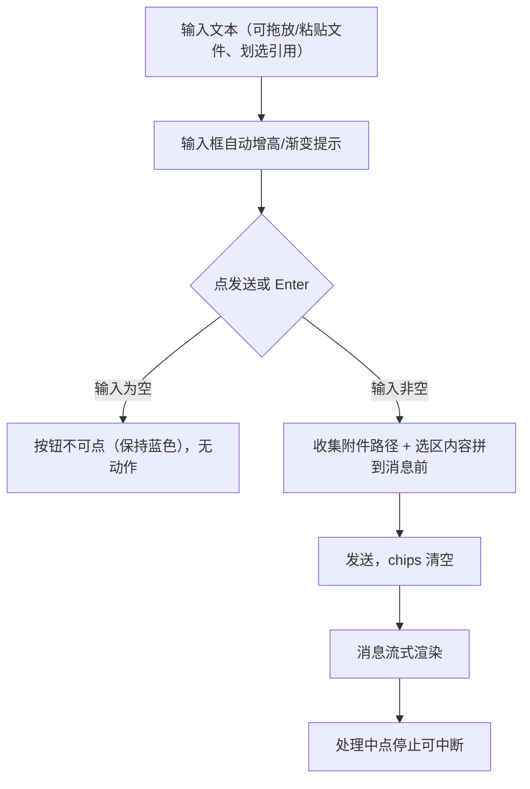
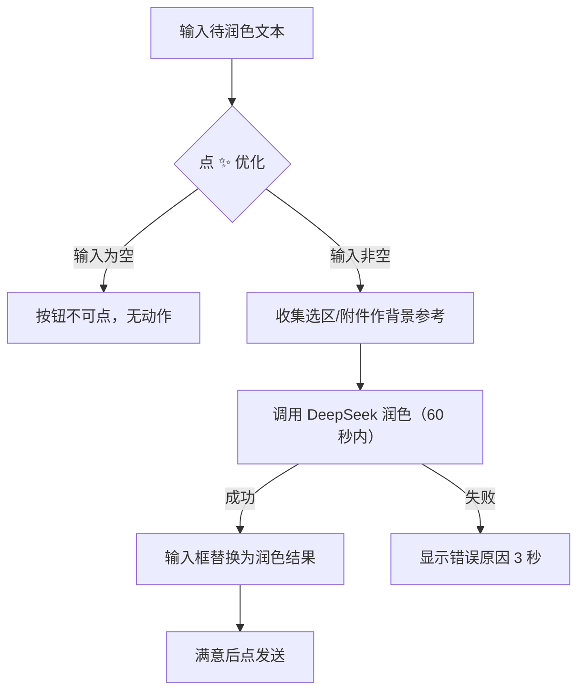

# 输入框优化 — 原型文档

> 版本：v1.1
> 日期：2026-08-15
> 作者：产品经理
> 关联方案：[输入框优化-设计方案.md](./输入框优化-设计方案.md)

---

## 一、功能概述

把聊天输入区从「工具条 + 输入框分离」改造成**一张 composer 卡片**：附件/引用、输入框、功能操作、发送按钮全部收进同一张卡片。新增 **AI 润色**——点发送按钮左边的「✨」，AI 自动把输入框里的消息改得更通顺，结果直接替换输入框内容，改完满意再发送。

**核心规则：**

| 规则 | 说明 |
|------|------|
| 单卡片三层 | chips 行（附件/引用）→ 操作行（功能按钮）→ 输入行（输入框+发送），一张卡片自上而下 |
| chips 空态零高度 | 没有附件/引用时，chips 行整个不显示，不占空间 |
| 操作行独立一行 | 附件/斜杠/命令在左，agent/模型/权限/推理/上下文在右，位于输入框上方 |
| 滚动提示 | 输入框隐藏滚动条；内容还有更多时，上下边缘出现蓝色渐变提示 |
| AI 润色 | 只润色当前输入框文本（不参考聊天历史），结果替换输入框；用户选中的片段和附带的文件会作为背景参考。**润色直接调用 DeepSeek 服务，与当前会话是否正在生成无关——会话进行时也能润色** |
| 引用只作背景 | 润色时用户引用的内容「仅作背景理解」，不会出现在优化结果里 |
| 会话参数 | agent / 模型 / 权限 / 推理强度都在输入区直接切换，对当前会话生效 |

---

## 二、用户场景

### 场景 A：消息润色

> 张阿姨（非编程用户）想给同事发一段项目进展，觉得写得啰嗦。她把内容粘贴进输入框，点发送按钮左边的「✨」按钮，一两秒后输入框里的文字自动变通顺了。她看了眼没问题，直接点发送。

### 场景 B：带着上下文润色

> 小李（开发者）在文档里划选了一段代码，又拖了一个文件进输入区。输入框上方出现两个小标签（选区卡片 + 附件卡片）。他写了句「优化这段说明」，点「✨」，AI 参考他选中的代码和文件把说明改得更准确——引用内容只作背景，不会拼进结果。

### 场景 C：长文本输入

> 小张（写作者）输入一大段文章，输入框变高后滚动条不见了，但上下边缘出现淡淡的蓝色渐变，提示上面/下面还有内容。他继续输入，渐变自动变化，始终提示可滚动方向。

### 场景 D：发送前选参数

> 王工（开发者）发消息前在输入区上方的操作行里点「✦双星」换成「build」，模型从 v4-pro 换成 v4-flash，权限从「询问」切成「自动编辑」，推理强度从「高」调到「低」——全部在输入框上方完成，不用打开设置。

### 场景 E：拖放/粘贴文件

> 小李直接把文件拖进输入框，卡片出现虚线高亮边框，松手后文件变成附件 chip；从剪贴板粘贴图片也一样。点附件 chip 可以在右侧预览。

---

## 三、页面原型

### 3.1 输入区 — 空态（默认）

**入口：** 会话主界面底部

```
┌────────────────────────────────────────────────────────────┐
│ 操作行:  [📎][/][☰]        [✦双星][v4-pro][🛡询问][⚡高][ctx] │
├────────────────────────────────────────────────────────────┤
│                                                             │
│  输入框（提示：输入消息，Enter 发送）                        │
│                                                             │
│                              [✨]          [➤]              │
└────────────────────────────────────────────────────────────┘
（整体 max-width 760 居中；聚焦时卡片出现蓝色光环）
```

| 区域 | 元素 | 展示条件 | 交互 |
|------|------|----------|------|
| 卡片 | 整体 | 始终 | 聚焦时 accent 蓝色光环（4px 外发光） |
| 操作行 | 📎 附件 | 始终 | 点击打开文件选择器 |
| 操作行 | / 斜杠 | 始终 | 点击弹出最近/收藏命令列表 |
| 操作行 | ☰ 命令 | 始终 | 点击打开命令菜单 |
| 操作行 | ✦agent / 模型 / 🛡权限 / ⚡推理 / ctx | 始终（推理按模型有无显示） | 点击展开下拉，选择后对会话生效 |
| 输入行 | 输入框 | 始终 | 单行提示；Enter 发送、Shift+Enter 换行 |
| 输入行 | ✨ 优化 | 输入框有内容 | 点击 AI 润色，结果替换输入框 |
| 输入行 | ➤ 发送 | 输入框有内容 | 点击发送；空输入时不可点但保持蓝色 |
| 输入行 | ⏹ 停止 | 消息处理中 | 红色方块，点击停止生成 |

### 3.2 输入区 — 有 chips（附件/引用）

```
┌────────────────────────────────────────────────────────────┐
│ [🔖 选区片段 · p1]  [📄 b.ts ×]   ← chips 行（选区=蓝底/附件=灰底）│
├────────────────────────────────────────────────────────────┤
│ 操作行:  [📎][/][☰]        [✦双星][v4-pro][🛡询问][⚡高][ctx] │
├────────────────────────────────────────────────────────────┤
│  输入框：优化这段说明……                                      │
│                              [✨]          [➤]              │
└────────────────────────────────────────────────────────────┘
```

| 区域 | 元素 | 展示条件 | 交互 |
|------|------|----------|------|
| chips 行 | 选区卡片 | 划选过内容 | 蓝色底（accent-glow），带 × 移除；内容参与润色参考 |
| chips 行 | 附件卡片 | 拖放/粘贴/添加过文件 | 灰色底，图片附件带缩略图；点击打开预览；带 × 移除；路径参与润色参考（主进程读内容） |
| chips 行 | 整行 | 无任何 chips | 不渲染（零高度） |

### 3.3 输入区 — 润色中 / 润色失败

```
┌────────────────────────────────────────────────────────────┐
│ 操作行:  [📎][/][☰]        [✦双星][v4-pro][🛡询问][⚡高][ctx] │
├────────────────────────────────────────────────────────────┤
│  输入框：优化这段说明……                                      │
│                        [✨ 呼吸灯]       [➤]                │
│                                            ┌─────────────┐  │
│             润色失败提示 ───────────►        │润色超时：…│  │
│                                            └─────────────┘  │
└────────────────────────────────────────────────────────────┘
```

| 区域 | 元素 | 展示条件 | 交互 |
|------|------|----------|------|
| ✨ 按钮 | 呼吸灯动画 | 润色进行中 | 图标闪烁（透明度+缩放脉冲），按钮禁用防重复点击 |
| 错误条 | 红色提示条 | 润色失败 | 卡片右下角显示具体原因（如「润色超时」），3 秒自动消失 |

---

## 四、交互流程

### 4.1 正常流程 — 发送消息



### 4.2 正常流程 — AI 润色



### 4.3 取消/退出流程

- 润色进行中再次点 ✨ → 按钮已禁用，不会重复触发。
- 斜杠/下拉菜单点页面其他区域 → 菜单自动关闭。
- chips 点 × → 移除该附件/引用（发送时不再带上）。

### 4.4 异常分支

| 节点 | 异常 | 表现 |
|------|------|------|
| 润色 | DeepSeek 60 秒未回复 | 错误条「润色超时：模型未在 60 秒内回复」，3 秒消失，输入内容保留 |
| 润色 | 引用的文件已被删除/无权限 | 该引用跳过，润色照常（用户无感知） |
| 润色 | 未配置 API Key | 错误条「未配置 DeepSeek API Key（设置 → API Key）」 |
| 润色 | API Key 失效 | 错误条「API Key 无效或已失效（HTTP 401）」 |
| 润色 | 引用内容超大 | 只取前 50KB 作参考 |
| 发送 | 输入全空格 | 发送按钮不可点，无动作 |
| 拖放/粘贴 | 非文件内容 | 忽略，不产生附件 |
| 发送处理中 | 用户点停止 | 停止生成，输入区恢复发送按钮 |

---

## 五、页面状态矩阵

| 页面/元素 | 状态 | 条件 | 展示 |
|-----------|------|------|------|
| composer 卡片 | 默认 | 未聚焦 | 无光环，普通边框 |
| composer 卡片 | 聚焦 | textarea focus | accent 蓝色边框 + 4px 外发光 |
| composer 卡片 | 拖放中 | 文件拖到卡片上 | 蓝色虚线边框高亮 |
| chips 行 | 有内容 | 存在选区/附件 | 显示 chips |
| chips 行 | 空态 | 无选区/附件 | 整行不渲染（零高度） |
| 发送按钮 | 可发送 | 输入非空 | 蓝色实底 + 纸飞机图标 |
| 发送按钮 | 禁用 | 输入为空 | 视觉不变（保持蓝色），仅禁交互 |
| 停止按钮 | 处理中 | 消息生成中 | 红色方块替代发送 |
| ✨ 优化按钮 | 可用 | 输入非空且非润色中 | 浅蓝底 + 蓝图标 |
| ✨ 优化按钮 | 忙碌 | 润色进行中 | 图标呼吸灯动画，禁用 |
| ✨ 优化按钮 | 禁用 | 输入为空 | 视觉不变，仅禁交互 |
| 推理强度选择器 | 显示 | 当前模型支持 variants | 按模型显示档位（flash 3 档 / pro 2 档） |
| 推理强度选择器 | 隐藏 | 模型无 variants | 不渲染 |
| 权限 pill | 计划模式 | planMode=true | 显示「计划」（只读先出方案） |
| 错误条 | 显示 | 润色失败 | 红色小条 3 秒后消失 |

---

## 六、边界与约束

| 边界项 | 约束 |
|--------|------|
| 润色上下文 | 只带用户显式引用（选区片段 + 附件文件），**不带聊天历史**；引用明确「仅作背景，不引用到输出」 |
| 引用文件大小 | 单文件最多取前 50KB 内容；读取失败跳过 |
| 润色超时 | DeepSeek 60 秒内未回复视为失败 |
| 润色通道 | 直接调用 DeepSeek API（chat/completions），**不占用当前会话、与会话是否生成中无关**；不创建任何会话，不污染历史 |
| 润色凭证 | 复用设置里的 DeepSeek API Key；未配置时润色不可用并提示去设置 |
| 附件类型 | 支持拖放/粘贴/文件选择器添加；MIME 按扩展名推断，未知类型按通用二进制处理 |
| 发送启用 | 仅看输入框文本非空——有附件但无文字时发送按钮仍不可点 |
| 操作行排列 | 窄窗口下操作行允许换行（flex-wrap）；agent/模型/权限/推理/上下文右对齐 |
| 权限模式 | 四档（询问/自动编辑/全自动/计划）；「计划」时发送强制 plan agent（只读） |
| 历史兼容 | 旧权限档（auto/dontAsk）按映射显示为「全自动」；旧推理档（medium/xhigh 等）读入归一为低/高/最大 |

---

## 七、测试要点

### 7.1 功能测试

| 编号 | 测试场景 | 前置条件 | 操作步骤 | 预期结果 |
|------|----------|----------|----------|----------|
| F-01 | 发送消息 | 输入非空 | 点发送 / Enter | 消息发送，输入框清空 |
| F-02 | 换行 | 输入非空 | Shift+Enter | 不发送，插入换行 |
| F-03 | 空输入拦截 | 输入为空/空格 | 点发送 | 按钮不可点，无事件 |
| F-04 | 停止生成 | 消息处理中 | 点停止按钮 | 停止，按钮恢复发送态 |
| F-05 | chips 空态 | 无附件/选区 | 查看输入区 | chips 行完全不显示（零高度） |
| F-06 | chips 添加/移除 | 有文件 | 拖入文件 → 点 × | 附件 chip 出现/消失 |
| F-07 | 附件预览 | 附件 chip 存在 | 点 chip | 右侧打开文件预览 |
| F-08 | 划选引用 | 有选区 | 划选内容 | 蓝色选区卡片出现，× 可移除 |
| F-09 | agent 切换 | 默认 | 展开选 build | pill 更新为 build，后续消息走 build agent |
| F-10 | 模型切换 | 默认 pro | 展开选 v4-flash | pill 更新为 v4-flash |
| F-11 | 权限切换 | 默认询问 | 选自动编辑 | pill 更新；选计划 → 显示「计划」 |
| F-12 | 推理强度 | flash 模型 | 展开选择 | 显示 3 档（低/高/最大）可选 |
| F-13 | 推理强度过滤 | pro 模型 | 展开选择 | 只显示 2 档（高/最大） |
| F-14 | 润色成功 | 输入非空 | 点 ✨ | 输入框替换为润色结果 |
| F-14b | 会话进行中润色（v1.1 新增） | 输入非空 + 当前会话正在生成消息 | 点 ✨ | 润色正常完成，不回填会话、不中断生成 |
| F-15 | 润色带引用 | 有选区/附件 | 点 ✨ | 引用作背景，结果不包含引用内容 |
| F-16 | 润色失败提示 | DeepSeek 返回异常 | 点 ✨ | 错误条显示原因，3 秒消失 |
| F-16b | 未配置 API Key（v1.1 新增） | 设置未填 key | 点 ✨ | 错误条「未配置 DeepSeek API Key」 |
| F-17 | 润色防重复 | 润色中 | 连点 ✨ | 第二次无效（按钮禁用） |
| F-18 | 斜杠快捷命令 | 有最近命令 | 点 / 选命令 | 命令直接发送 |
| F-19 | 斜杠输入补全 | 输入 / | 输入框内打 / | 弹出候选列表，↑↓选择 Enter 发送 |
| F-20 | 拖放边框 | 拖文件到卡片 | 拖入/拖出 | 拖入出现虚线边框，拖出消失 |

### 7.2 兼容性 / 边界

| 编号 | 测试场景 | 前置条件 | 操作步骤 | 预期结果 |
|------|----------|----------|----------|----------|
| C-01 | 引用文件不存在 | chips 带已删文件 | 点 ✨ | 跳过该引用，润色照常 |
| C-02 | 大文件引用 | 附件 > 50KB | 点 ✨ | 只取前 50KB 内容 |
| C-03 | 旧权限档兼容 | 老配置 dontAsk | 打开输入区 | 显示「全自动」 |
| C-04 | 旧推理档兼容 | 老配置 xhigh | 打开输入区 | 归一显示「高」 |
| C-05 | 窄窗口 | 窗口缩窄 | 查看操作行 | 操作行自动换行，功能不丢失 |
| C-06 | 重启持久化 | 切换过 agent | 重启应用 | agent 选择保持（双写 localStorage + SQLite） |

---

## 八、代码索引

### 前端

| 功能点 | 文件 | 关键位置 |
|--------|------|----------|
| composer 卡片结构（三层 + chips + 操作行 + 输入行） | `src/renderer/src/components/chat/InputBar.vue` | L1-5 组件注释 / 模板 L392-624 |
| chips 行（v-if 零高度） | `src/renderer/src/components/chat/InputBar.vue` | 模板 L404-422 |
| 渐变提示（scrollbar-none + 双向渐变） | `src/renderer/src/components/chat/InputBar.vue` | L193-206（updateInputGradient）/ 样式 L795-818 |
| 操作行（cf-left / cf-right-pills） | `src/renderer/src/components/chat/InputBar.vue` | L494-623 |
| polish 按钮 + 错误条 | `src/renderer/src/components/chat/InputBar.vue` | L341-377（polishInput）/ 样式 L1037-1095 |
| 发送/停止按钮（30×30 + 禁用态保蓝） | `src/renderer/src/components/chat/InputBar.vue` | 样式 L990-1026 |
| 斜杠补全 + 拖放 + 粘贴 | `src/renderer/src/components/chat/InputBar.vue` | L86-184 |
| chips 组装（选区 + 附件） | `src/renderer/src/components/chat/ChatPanel.vue` | L162-204 |
| handleSend agent/variant 透传 | `src/renderer/src/components/chat/ChatPanel.vue` | L608-644 |
| 润色桥函数 | `src/renderer/src/lib/electron-bridge.ts` | L480-482（polishMessage） |
| currentAgent 持久化 | `src/renderer/src/stores/settings.ts` | L136 / L317-348（双写 watch） |
| 文案 | `src/renderer/src/locales/zh.json` / `en.json` | composer.*（L266-285） |

### 后端

| 功能点 | 文件 | 关键位置 |
|--------|------|----------|
| 润色主链路 IPC（v1.1 直连 DeepSeek） | `electron/main/ipc.ts` | L639-671（ai:polishMessage：读 provider-configs.json → fetch chat/completions → choices 提取） |
| 润色指令组装 | `electron/main/ipc.ts` | L992-1032（POLISH_PROMPT / POLISH_REF_MAX_BYTES / buildPolishPrompt） |
| 回复提取 | `electron/main/ipc.ts` | L1035-1046（extractAssistantText——v1.1 直连后废弃） |
| 附件 parts 构建 | `electron/main/ipc.ts` | L75-115（mimeFromExt）/ L234-250（buildSendParts） |
| 发送透传 | `electron/main/ipc.ts` | L612-631（chat:sendMessage agent/variant） |
| promptPartsAsync | `electron/main/oc-sdk.ts` | L272-282（variant 变量透传） |

### 涉及表

无新增表；`currentAgent` 等 UI 偏好持久化到已有 SQLite `providerConfigs` + localStorage `sb-ui-settings`。

---

## 九、变更记录

| 版本 | 日期 | 变更内容 | 作者 |
|------|------|----------|------|
| v1.1 | 2026-08-15 | 镜像设计方案 v1.1：润色改为**直接调用 DeepSeek**（不再走引擎临时会话）——会话进行时也能润色；新增 F-14b/F-16b 测试用例；异常分支与边界约束同步（API Key 未配置/失效） | 产品经理 |
| v1.0 | 2026-08-08 | 初始版本（逆向文档：镜像自设计方案 v1.0） | 产品经理 |
