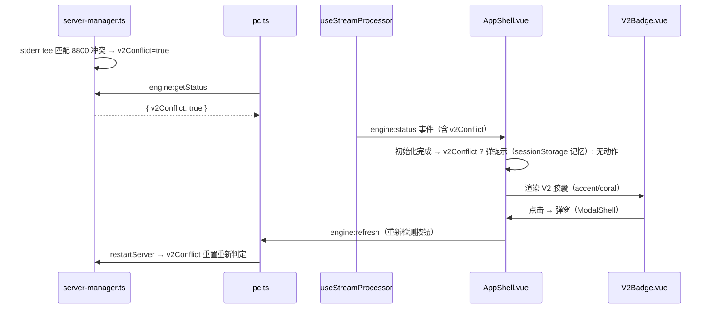

# V2 状态指示器 - 设计方案

版本：v1.0 · 2026-08-09 · 技术研发

## 一、需求背景

serve 1.18.15 启动时额外启动 v2 server（默认端口 8800）——**任何 opencode 客户端**（官方桌面端/TUI）都会占用 8800，分形 serve 的 v2 server 启动失败（非致命——v1 API 全功能正常，见 docs/知识/oc-engine/v1.18.x-已知问题-8800端口冲突.md）。

用户要求状态透明：载入页判断 v2 可用性 → 不可用弹窗提示 + 右上角「V2」按钮（可用=主题色 / 不可用=红色）+ 点击弹窗解释 V2 是什么、为什么不可用。

## 二、用户故事

- 作为分形用户，当 v2 服务不可用时（官方桌面端/TUI 占用 8800），我希望在进入主界面时知道原因，而不是被 stderr 报错吓到
- 作为分形用户，我希望随时能查看 v2 状态（右上角按钮），并了解 v2 是什么、为什么不可用、怎么恢复

## 三、关键设计决策

| # | 决策 | 说明 |
|---|------|------|
| D1 | **判断方式 = stderr 冲突匹配（真实结果）** | server-manager 已有 `v2ConflictHinted` 匹配逻辑（e3e3a91）——暴露为状态，不做端口预探测（简单可靠；不做「8800 空闲但 v2 server 其他问题」细分——主场景即端口占用） |
| D2 | **状态粒度：二元**（`v2Conflict: boolean`） | 可用 = 启动无冲突报错；不可用 = 匹配到 `Failed to start server. Is port 8800 in use?` |
| D3 | **载入页弹窗时机 = 初始化完成进入主界面时弹一次** | 不打断载入；sessionStorage `sb-v2-hint-shown` 记忆一次性（载入页之后的主界面生命周期内不重复弹；重启 app 重新检测） |
| D4 | **V2 按钮位置 = 顶栏右侧**（主题按钮旁） | 文本小胶囊「V2」；icon-btn 风格尺寸对齐 |
| D5 | **颜色语义**：可用=accent（主题色）/ 不可用=coral（红） | 一目了然；title 提示（「V2 服务可用/不可用」） |
| D6 | **不可用时弹窗附「重新检测」按钮** | 重启 serve 尝试恢复（复用 engine:refresh——v2Conflict 状态在重启后重置重新判定） |
| D7 | **纯透明性，零行为改变** | 指示器只读状态 + 提示；不改变任何功能路径（分形全走 v1） |

## 四、数据流

## 五、组件方案

### 5.1 V2Badge.vue（新建，src/renderer/src/components/shared/V2Badge.vue）
- props：`conflict: boolean`
- 渲染：顶栏胶囊（「V2」12px 600 + 圆角 8px + padding 4px 8px；border 1px）
- 颜色：conflict → coral（var(--color-coral)/border-coral）；否则 accent（var(--accent)/border-accent-line）
- title：v2Available / v2Conflict 文案
- 点击 → emit('open'）

### 5.2 V2Dialog（AppShell 内联 ModalShell 或独立组件）
- ModalShell 复用（title「V2 API 状态」）
- 三块内容：
  1. **V2 是什么**：「V2 是 OpenCode 的新一代 API（官方桌面端已迁移）。分形主要使用 V1 API，功能完整。」
  2. **当前状态**：可用（绿点 ✓）/ 不可用（红点 ✗ + 原因：「端口 8800 被占用——通常为 OpenCode 官方桌面端或 TUI 正在运行」）
  3. **建议动作**（仅不可用）：「关闭 OpenCode 官方桌面端 / TUI 后点击『重新检测』」+ 重新检测按钮（调 engine:refresh——重启 serve 重新判定）

### 5.3 载入页提示（AppShell 初始化完成分支）
- 位置：AppShell 串行链 `initializing=false` 之前（进入主界面瞬间）检查：
  - `engineStatus.v2Conflict && !sessionStorage.getItem('sb-v2-hint-shown')` → 弹提示（复用 V2Dialog 或轻量 alert 条——**建议轻量**：alertText 顶部提示条「V2 API 服务不可用（8800 被占用）——点右上角 V2 查看详情」3s 自动消失 + sessionStorage 记忆）
  - **设计取舍**：载入弹「完整弹窗」会打断首次进入（用户刚确认时机=进入时弹一次）——**用轻量提示条**（不打断）+ V2 按钮承载详情——**比弹窗更好**（尊重用户确认的「弹一次」语义——提示条也记一次）

### 5.4 状态链路
- server-manager.ts：`getV2Conflict()` 暴露 + `resetV2Conflict()`（restartServer 时重置）+ v2ConflictHinted 内部改 v2Conflict 状态
- ipc.ts `engine:getStatus`：返回 `v2Conflict: getV2Conflict()`
- electron-bridge.ts：`EngineStatus` 加 `v2Conflict: boolean`
- useStreamProcessor：engine:status 缓存 v2Conflict（AppShell 读取）

## 六、文件清单

| 文件 | 操作 | 说明 |
|------|------|------|
| electron/main/server-manager.ts | 修改 | v2Conflict 状态 + getV2Conflict/resetV2Conflict |
| electron/main/ipc.ts | 修改 | engine:getStatus 返回 v2Conflict |
| src/renderer/src/lib/electron-bridge.ts | 修改 | EngineStatus 加 v2Conflict |
| src/renderer/src/components/shared/V2Badge.vue | 新建 | 顶栏胶囊 |
| src/renderer/src/components/layout/AppShell.vue | 修改 | V2Badge 渲染 + 载入完成提示条 + V2Dialog 弹窗 |
| src/renderer/src/composables/useStreamProcessor.ts | 修改 | engine:status 缓存 v2Conflict |
| src/renderer/src/locales/zh.json / en.json | 修改 | v2 相关文案（v2Available/v2Conflict/v2What/v2Status/v2Action/v2Retry 等） |

## 七、测试要点

1. server-manager：stderr 匹配 → v2Conflict=true；不匹配 → false；resetV2Conflict 重置
2. ipc：engine:getStatus 返回 v2Conflict
3. V2Badge：conflict 颜色断言（coral vs accent）、title 文案
4. AppShell：载入完成 v2Conflict=true 且未提示过 → 提示条显示 + sessionStorage 写入；已提示过 → 不显示
5. 全量回归（重点：AppShell.test 载入链、engine:getStatus mock 结构变化）

## 八、风险与边界

- **误报**：stderr 冲突匹配不到的 v2 启动失败（非端口原因）→ 显示可用（边缘场景，主场景即端口占用）
- **重连**：serve 重启（engine:refresh）后 v2Conflict 重置重新判定（resetV2Conflict 保证）
- **多窗口**：每个窗口独立渲染（状态来自主进程广播，一致）
- **零行为改变**：v2 状态不影响任何功能路径（纯透明性）

## 九、变更记录

| 版本 | 日期 | 内容 |
|------|------|------|
| v1.0 | 2026-08-09 | 初稿（D1-D7 + 数据流 + 组件方案 + 测试要点） |
