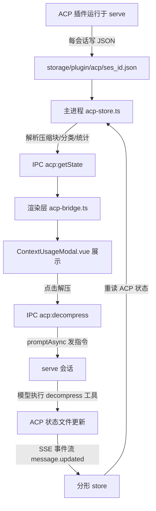
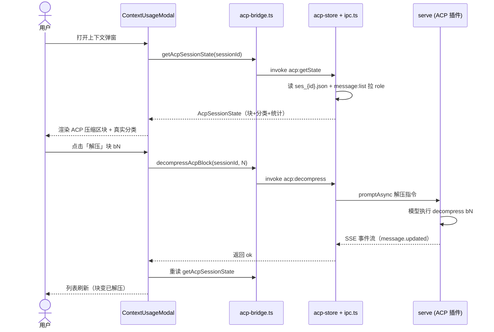

# 上下文面板 — 功能设计方案

> 版本：v1.0
> 日期：2026-08-15
> 作者：技术研发
> 状态：待评审

---

## 一、需求背景

### 1.1 现状

分形的上下文占用展示由两处组成：工具栏 `ContextIndicator.vue`（精简百分比）与设置页入口打开的 `ContextUsageModal.vue`（弹窗明细）。当前实现走 `useContextUsage.ts` composable，数据来源是**前端估算**：

- **总量** = 最后一条 assistant 消息的 `inputTokens + cacheReadTokens + cacheWriteTokens`（来自 serve `message.updated` 事件透传）+ 固定开销（systemPrompt 1500 / systemTools 10500 / mcpTools 200 / customAgents 2600 / memoryFiles 1200 / skills 6100，合计 22.1K）
- **分类占比** = 固定开销按估算拆行 + 消息 tokens 单行，**并非引擎真实分类**

**已知偏差**：固定开销是写死的估算值，随 OC 版本演进（新增工具、skill、agent）必然漂移；消息 tokens 只有最后一条有值，历史消息的 token 贡献被忽略；分类行（系统/工具/助手）无法反映真实构成。

**机会**：分形已内置 `opencode-acp@latest` 插件（`opencode.json` plugin 数组含之，且 `compaction.auto=false`——ACP 接管上下文压缩）。ACP 插件每会话把**真实上下文构成**落盘到 `~/.local/share/opencode/storage/plugin/acp/ses_{sessionId}.json`：消息级 token 明细（`prune.messages.byMessageId`）、压缩块列表（`blocksById`，含主题/压缩前后 token/层级 T1-T3/active 状态）、累计节省统计（`stats.totalPruneTokens`）、模型上下文限制（`modelContextLimit`）。

此外，ACP 的压缩/解压是**模型工具**（`compress` / `decompress`，serve 无 REST 接口）——GUI 无法直接调用，但可以通过**向会话发指令 prompt** 驱动模型执行（分形已有 `promptAsync` 能力，ipc.ts:1003）。

### 1.2 用户故事

| 场景 | 用户角色 | 需求描述 |
|------|----------|----------|
| 真实分类占比 | 普通用户 | 打开上下文弹窗能看到引擎**真实的**上下文构成（系统/用户/助手/工具各占多少），而不是估算值 |
| 压缩记录可见 | 普通用户 | 弹窗列出当前会话 ACP 已压缩的块（主题、压缩前后 token、层级、状态），明白上下文被压缩了什么 |
| 压缩省了多少 | 普通用户 | 一眼看到 ACP 累计为本会话节省了多少 token（totalPruneTokens） |
| 解压操作 | 普通用户 | 需要已压缩内容的细节时，弹窗里直接点「解压」恢复该块，不用手打指令 |
| 无 ACP 兜底 | 普通用户 | 会话没有 ACP 数据（未启用插件/新会话尚未压缩）时弹窗不报错、分类回退估算 |

### 1.3 范围

| 角色 | 可操作范围 | 本次是否覆盖 |
|------|-----------|-------------|
| 普通用户 | 弹窗查看真实分类占比（system/user/assistant/tools） | ✅ |
| 普通用户 | 弹窗查看当前会话 ACP 压缩块列表 + 节省统计 | ✅ |
| 普通用户 | 弹窗内点击解压恢复已压缩块 | ✅ |
| 普通用户 | 无 ACP 数据时优雅兜底（分类回退估算） | ✅ |
| 普通用户 | 弹窗内直接触发**压缩**（主动压缩） | ❌（依赖模型自主判断时机，主动触发后续版本） |
| 普通用户 | 跨会话 ACP 统计（/acp stats 效果） | ❌（YAGNI，本期聚焦当前会话） |
| 普通用户 | 修改 ACP 插件配置（阈值/层级） | ❌（插件侧能力，GUI 不动） |

---

## 二、架构设计

### 2.1 整体数据流



### 2.2 关键设计决策

| 决策点 | 选择 | 理由 |
|--------|------|------|
| 数据来源 | ACP 插件落盘 JSON（`storage/plugin/acp/ses_{id}.json`） | 插件已在 serve 内运行，落盘的是引擎真实构成；GUI 读文件零侵入 |
| 分类占比 | ACP `byMessageId` tokenCount + serve `message:list` 的 role 匹配汇总 | ACP 存储只有 msg_id→tokenCount，无 role；serve 消息记录含 role（`message:list` 契约 id/session_id/role/content/token_usage/created_at，ipc.ts:1672）——两者按 msg_id 关联即得真实分类 |
| 解压操作 | 主进程向会话 `promptAsync` 发指令（让模型执行 decompress bN） | decompress 是模型工具（`@opencode-ai/plugin` 的 `tool()` 注册），serve 无 REST 端点；promptAsync 是分形既有能力（ipc.ts:1003），SSE 事件流天然驱动刷新 |
| 无 ACP 兜底 | 弹窗显示「未检测到 ACP 压缩」+ 分类回退 `useContextUsage` 估算 | ACP JSON 不存在/无压缩块/插件未启用时保持可用，不因新功能引入空态崩溃 |
| 路径安全 | ACP 目录硬编码在 OC 数据目录内，读前校验存在性 | 渲染进程无 fs 权限（沙箱），主进程只读固定目录；不接收用户任意路径 |
| 指令安全 | 解压指令由主进程构造（固定模板 + blockId 数字校验），不经用户输入拼接 | 防 prompt 注入——用户点在哪个块由 GUI 决定，blockId 从 ACP JSON 解析结果取，非用户自由文本 |

### 2.3 ACP 落盘数据契约（实测，2026-08-15）

`~/.local/share/opencode/storage/plugin/acp/ses_{sessionId}.json` 顶层键：

| 键 | 类型 | 说明 |
|----|------|------|
| `prune.messages.byMessageId` | `{ [msg_id]: { tokenCount, allBlockIds, activeBlockIds } }` | 消息级 token 明细 |
| `prune.messages.blocksById` | `{ [blockId]: CompressionBlock }` | 压缩块，含 `topic/compressedTokens/summaryTokens/tier/active/startId/endId/effectiveMessageIds/createdAt/summary` |
| `prune.messages.activeBlockIds` | `number[]` | 当前活跃（已压缩未解压）块 |
| `stats.totalPruneTokens` | number | 累计节省 token |
| `modelContextLimit` | number | 模型上下文限制（如 1000000） |
| `lastCompaction` | number | 最后压缩时间戳 |
| `nudges.contextLimitAnchors` | array | 上下文阈值锚点（本方案不用） |

---

## 三、主进程设计

### 3.1 ACP 状态读取模块（新增）

**文件：** `electron/main/acp-store.ts`

职责：定位 ACP 落盘目录、读取指定会话 JSON、解析为前端可消费的结构化数据。

```typescript
// 关键函数签名（实现细节以代码为准）
export interface AcpBlock {
  blockId: number
  topic: string
  compressedTokens: number
  summaryTokens: number
  tier: number
  active: boolean
  startId: string
  endId: string
  createdAt: string
  summaryPreview: string
}

export interface AcpCategoryStat {
  role: "user" | "assistant" | "tool" | "system"
  tokens: number
  messages: number
}

export interface AcpSessionState {
  detected: boolean
  blocks: AcpBlock[]
  totalPruneTokens: number
  modelContextLimit: number
  categories: AcpCategoryStat[]
  error?: string
}

export function getAcpStorageDir(): string
export function getAcpSessionState(sessionId: string, messages: Array<{ id: string; role: string; tokenUsage?: string }>): AcpSessionState
```

**解析逻辑：**
1. `getAcpStorageDir()`：`path.join(os.homedir(), ".local", "share", "opencode", "storage", "plugin", "acp")`（与 OC 数据目录约定一致）
2. `getAcpSessionState()`：读 `ses_{sessionId}.json`；不存在/解析失败 → `{ detected: false, blocks: [], ... }`
3. 压缩块：`blocksById` 值数组，按 `createdAt` 倒序，字段透传（`summary` 截断为 `summaryPreview` 供列表预览）
4. 分类：`byMessageId` 的 msg_id ↔ `messages` 参数（serve 消息记录，含 role 与 tokenUsage）按 id 关联——`role: "user" | "assistant"` 直接映射；tool 消息如何识别见 3.2 决策；`system` 用 ACP `modelContextLimit` 与固定开销估算（无消息级 system token，ACP 亦无此数据——见风险表）

### 3.2 IPC handler（新增）

**文件：** `electron/main/ipc.ts`（追加 handler）+ `electron/preload/channels.ts`（白名单）

| channel | 参数 | 返回 | 说明 |
|---------|------|------|------|
| `acp:getState` | `{ sessionId: string }` | `AcpSessionState` | 读 ACP 会话状态；内部调 `message:list`（limit 1000）拿 role 做分类汇总 |
| `acp:decompress` | `{ sessionId: string; blockId: number }` | `{ ok: boolean; error?: string }` | 构造解压指令 prompt → `client.session.promptAsync` 让模型执行 decompress |

**解压指令模板：**

```
请使用 decompress 工具恢复压缩块 b{blockId}（当前会话已压缩的内容块）。
只需执行工具调用，不要额外解释。
```

**分类中 tool 消息的识别：** serve `message:list` 记录 role 只有 `user` / `assistant`，工具调用嵌在 assistant 消息的 parts 内（`type: "tool"`）——`toMessageData`（ipc.ts:1679）已解析 parts。分类汇总时：assistant 消息的 tokens 拆分为「assistant 文本」与「tool」两部分较难（token 粒度在消息级）——**本期简化**：`user` 按 role 归 user；`assistant` 消息内存在 tool part 的按工具消息占比折算（工具 token ≈ 该消息 outputTokens × toolParts占比），否则全归 assistant。`system` 用固定开销估算。此简化在风险表标注。

---

## 四、前端设计

### 4.1 新增桥接（新增）

**文件：** `src/renderer/src/lib/acp-bridge.ts`

```typescript
// 职责：渲染进程调用 ACP IPC 的薄封装（对齐 electron-bridge.ts 既有模式）
import { invoke } from "./electron-bridge"

export interface AcpBlock {
  blockId: number
  topic: string
  compressedTokens: number
  summaryTokens: number
  tier: number
  active: boolean
  startId: string
  endId: string
  createdAt: string
  summaryPreview: string
}

export interface AcpSessionState {
  detected: boolean
  blocks: AcpBlock[]
  totalPruneTokens: number
  modelContextLimit: number
  categories: Array<{ role: string; tokens: number; messages: number }>
  error?: string
}

/** 读取当前会话 ACP 状态（压缩块 + 分类 + 统计） */
export async function getAcpSessionState(sessionId: string): Promise<AcpSessionState>
/** 触发解压指定压缩块（经 serve 模型执行 decompress 工具） */
export async function decompressAcpBlock(sessionId: string, blockId: number): Promise<{ ok: boolean; error?: string }>
```

### 4.2 上下文弹窗改造

**文件：** `src/renderer/src/components/shared/ContextUsageModal.vue`

**改造点：**

1. **新增「ACP 压缩」区块**（位于现有分类占比区下方）：
   - 未检测到 ACP：显示一行提示（`未检测到 ACP 压缩数据`）+ 说明 ACP 插件接管压缩
   - 有数据：统计行（累计节省 `totalPruneTokens`、模型上下文限制 `modelContextLimit`）+ 压缩块列表
2. **压缩块列表项**：主题（`topic` 截断一行）、层级徽标（T1/T2/T3）、`compressedTokens → summaryTokens`（压缩前 → 压缩后）、状态（活跃/已解压）、时间；活跃块右侧「解压」按钮
3. **分类占比换真实数据**：`categories` 有值时用 ACP 分类渲染环形/列表占比；`detected=false` 时回退 `useContextUsage` 估算
4. **解压交互**：点击「解压」→ 按钮 loading → `decompressAcpBlock` → 成功刷新 `getAcpSessionState`；失败显示错误（如「模型未执行解压，请在对话中手动输入 /acp decompress bN」）

**模板关键结构：**

```vue
<!-- ACP 压缩区块（ContextUsageModal 内） -->
<div class="acp-section">
  <h3>ACP 压缩</h3>
  <template v-if="acpState.detected">
    <div class="acp-stats">
      <span>累计节省 {{ formatTokens(acpState.totalPruneTokens) }}</span>
      <span>模型窗口 {{ formatTokens(acpState.modelContextLimit) }}</span>
    </div>
    <ul class="acp-blocks">
      <li v-for="b in acpState.blocks" :key="b.blockId" class="acp-block">
        <span class="acp-tier">T{{ b.tier }}</span>
        <span class="acp-topic">{{ b.topic }}</span>
        <span class="acp-tokens">{{ formatTokens(b.compressedTokens) }} → {{ formatTokens(b.summaryTokens) }}</span>
        <button v-if="b.active" :disabled="decompressing" @click="onDecompress(b)">解压</button>
      </li>
    </ul>
  </template>
  <p v-else class="acp-empty">未检测到 ACP 压缩数据</p>
</div>
```

**Script 关键逻辑：**

```typescript
// 挂载时读取当前会话 ACP 状态；会话切换时刷新
const acpState = ref<AcpSessionState>({ detected: false, blocks: [], totalPruneTokens: 0, modelContextLimit: 0, categories: [] })
const decompressing = ref(false)

async function loadAcpState() {
  const sid = session.activeSessionId
  if (!sid) { acpState.value = emptyState(); return }
  acpState.value = await getAcpSessionState(sid)
}

async function onDecompress(block: AcpBlock) {
  decompressing.value = true
  try {
    const res = await decompressAcpBlock(session.activeSessionId!, block.blockId)
    if (!res.ok) throw new Error(res.error)
    await loadAcpState()
  } catch (e) {
    showError(`解压失败：${(e as Error).message}`)
  } finally {
    decompressing.value = false
  }
}
```

### 4.3 工具栏指示器（不动）

`ContextIndicator.vue` 保持现状（精简百分比），弹窗是明细入口——本期不改工具栏，避免两处口径再次分叉。

---

## 五、文件变更清单

### 主进程

| 操作 | 文件 | 说明 |
|------|------|------|
| 新增 | `electron/main/acp-store.ts` | ACP 落盘 JSON 读取 + 解析 + 分类汇总 |
| 修改 | `electron/main/ipc.ts` | 追加 `acp:getState` / `acp:decompress` handler |
| 修改 | `electron/preload/channels.ts` | ALLOWED_INVOKE 白名单加两个 channel |

### 渲染层

| 操作 | 文件 | 说明 |
|------|------|------|
| 新增 | `src/renderer/src/lib/acp-bridge.ts` | invoke 封装（getAcpSessionState / decompressAcpBlock） |
| 修改 | `src/renderer/src/components/shared/ContextUsageModal.vue` | 新增 ACP 压缩区块 + 分类占比换真实数据 + 解压交互 |

### 测试

| 操作 | 文件 | 说明 |
|------|------|------|
| 新增 | `electron/main/acp-store.test.ts` | 解析逻辑（块列表/分类汇总/不存在兜底）单测 |
| 新增 | `src/renderer/src/lib/acp-bridge.test.ts` | invoke 传参/返回透传单测 |
| 修改 | `src/renderer/src/components/shared/ContextUsageModal.test.ts` | 新增 ACP 区块渲染/解压交互用例 |

---

## 六、关键流程

### 6.1 时序图



### 6.2 异常流程

| 异常场景 | 前端处理 | 主进程处理 |
|----------|----------|----------|
| 会话无 ACP JSON（未启用插件/新会话） | 显示「未检测到 ACP 压缩数据」，分类回退估算 | 返回 `{ detected: false }` |
| ACP JSON 解析失败（版本升级字段变化） | 同上兜底 + 错误提示 | catch 后返回 `{ detected: false, error }` |
| 解压指令被模型拒绝执行 | 显示「解压失败：模型未执行，请手动输入 /acp decompress bN」 | 透传 promptAsync 错误 |
| serve 未就绪（解压时） | 按钮 loading 后显示错误 | promptAsync 抛错透传 |
| 会话切换导致弹窗数据过期 | 重新加载（watch activeSessionId） | — |

---

## 七、测试要点

| 测试场景 | 前置条件 | 操作 | 预期结果 |
|----------|----------|------|----------|
| 无 ACP 数据兜底 | 会话无 JSON / 目录不存在 | 打开弹窗 | 显示「未检测到」，分类为估算，无报错 |
| 有 ACP 数据展示 | 会话有 JSON（含 blocks） | 打开弹窗 | 块列表按时间倒序，含层级/token/状态 |
| 分类汇总正确 | 消息记录含 role 与 tokenUsage | 打开弹窗 | user/assistant/tool 分类 token 与 ACP byMessageId 汇总一致 |
| 解压成功 | 会话有活跃块，serve 就绪 | 点击解压 | 按钮 loading → 成功后块变已解压，列表刷新 |
| 解压失败 | 模型拒绝执行 | 点击解压 | 显示手动解压提示 |
| 会话切换刷新 | 弹窗打开状态切换会话 | 切换会话 | 弹窗 ACP 数据随会话刷新 |

---

## 八、风险与边界

| 风险 | 等级 | 应对措施 |
|------|------|----------|
| `message:list` 的 role 只有 user/assistant，tool 消息 token 无法精确拆分 | 中 | 本期简化：按 assistant 消息内 tool part 占比折算；已在 3.2 标注，后续可精确化 |
| ACP JSON 结构随插件版本变化 | 中 | 读取容错（字段缺失兜底默认值）；acp-store 单测覆盖关键字段 |
| 解压 prompt 被模型拒绝（低概率） | 低 | 错误提示引导手动 /acp 命令；不阻塞主流程 |
| system 分类无真实数据（ACP 不含 system token） | 中 | system 用固定开销估算，tooltip 标注「估算」；后续 ACP 若补 system token 再换 |
| 弹窗打开时拉 message:list 全量（limit 1000）增加一次调用 | 低 | 仅在弹窗打开时调用一次；解压后重读；可接受 |
| 解压操作改变 serve 会话状态 | 低 | 解压是 ACP 标准行为（decompress 工具），与用户手动 /acp 等价；不引入额外风险 |

---

## 九、实施计划

| 阶段 | 任务 | 预估工时 |
|------|------|----------|
| 主进程 | acp-store.ts 读取/解析 + 单测 | 1.5h |
| 主进程 | ipc.ts 两个 handler + channels 白名单 | 0.5h |
| 渲染层 | acp-bridge.ts + ContextUsageModal 改造 + 单测 | 2h |
| 联调 | serve 会话真实 ACP 数据联调（解压链路） | 1h |
| 测试 | 全量 vitest + 双 typecheck + 手工验收 | 0.5h |
| **合计** | | **5.5h** |

---

## 十、变更记录

| 版本 | 日期 | 变更内容 | 作者 |
|------|------|----------|------|
| v1.0 | 2026-08-15 | 初始版本：ACP 数据接入上下文弹窗（分类真实化 + 压缩块展示 + 解压操作） | 技术研发 |
