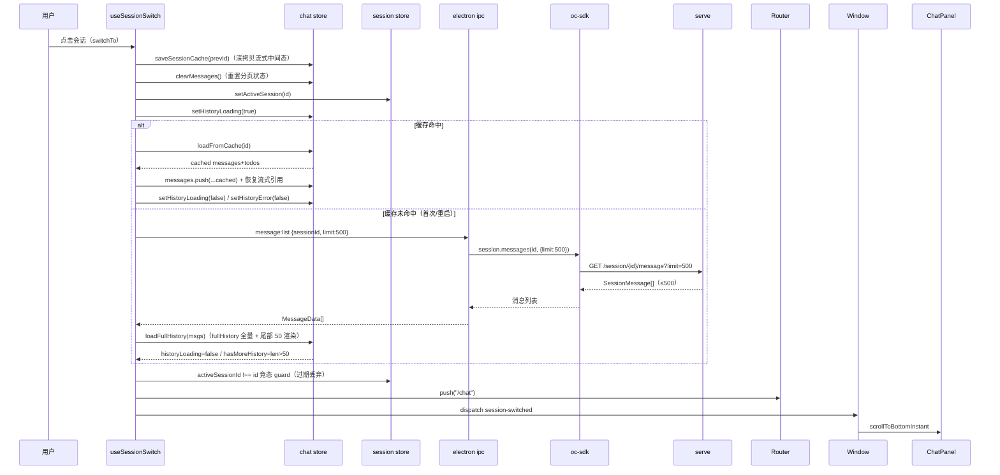
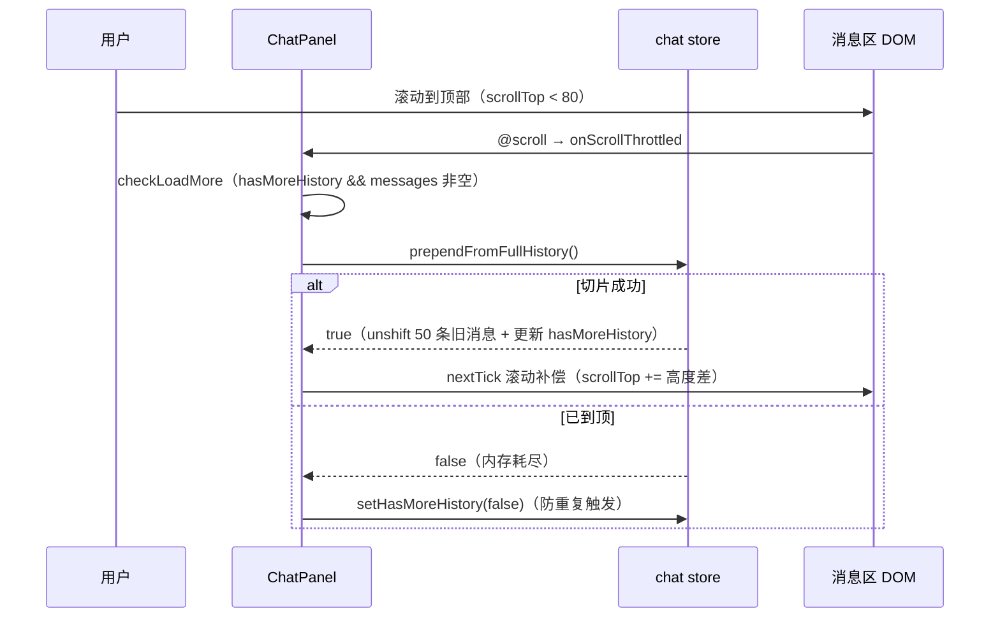
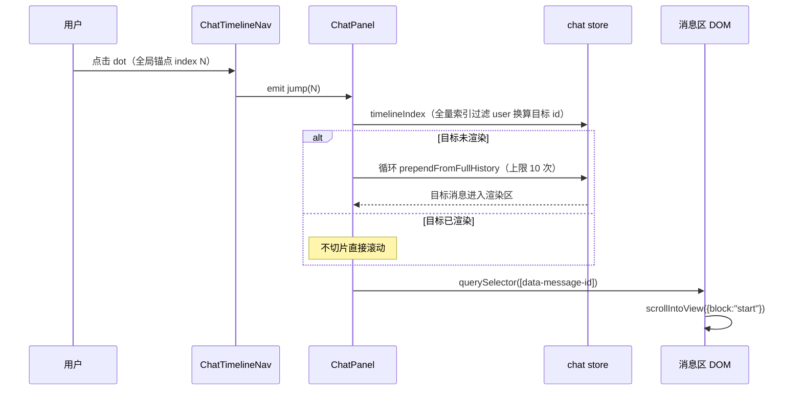

# 会话列表优化 — 功能设计方案

> 版本：v1.1
> 日期：2026-08-08
> 作者：技术研发
> 状态：待评审

---

## 一、需求背景

### 1.1 现状与问题

分形（oc-gui）从 cc-gui 迁移 UI 设计资产，但**引擎从 CC 换成了 OC（OpenCode serve）**，会话数据从「CC 时代全量本地库」变为「serve 唯一数据源」，会话列表与消息历史经历了三轮适配：

1. **会话列表无加载态**：serve 未就绪时 `session:list` 静默失败，列表停留在旧工作区结果（83f7795 修复前）——用户看到前工作区列表，且「暂无会话」空态在加载期间误导用户。
2. **长会话无分页**：`GET /session/{id}/message` 全量拉取，几百条消息一次渲染 DOM 卡顿；首版（6d0e874）尝试 serve `before` 游标分页，但用户反馈**「加载更早没生效 + 时间线只剩 4 个圆点」**（869382d 重构前）——时间线数据源只有已渲染的尾部 50 条，滚动加载依赖网络分页有不确定性。
3. **切换会话无竞态保护**：切换/工作区刷新期间先发请求后返回会覆盖新列表/新会话消息。

### 1.2 用户故事

| 场景 | 用户角色 | 需求描述 |
|------|----------|----------|
| 打开应用看会话 | 普通用户 | 启动/切换工作区后能看到当前工作区的会话列表，加载期间有反馈（转圈而非「暂无会话」） |
| 翻看长会话 | 普通用户 | 长会话（几百条消息）秒开、可滚动到顶加载更早、可沿时间线跳到任意用户消息 |
| 多窗口并行 | 普通用户 | 新窗口打开不同工作区时会话列表不被旧窗口覆盖（竞态保护） |
| 离线恢复 | 普通用户 | 引擎重启后历史消息自动恢复，不出现永久灰屏占位 |
| 搜索会话 | 普通用户 | 会话多时能按标题搜索，搜索无结果与「无会话」区分展示 |

### 1.3 范围

| 角色 | 可操作范围 | 本次是否覆盖 |
|------|-----------|-------------|
| 普通用户 | 会话列表加载态/空态/搜索无结果三分支 | ✅ |
| 普通用户 | 长会话滚动到顶加载更早（内存切片，无网络） | ✅ |
| 普通用户 | 时间线导航完整目录（全量锚点）+ 点击跳转 | ✅ |
| 普通用户 | 会话搜索过滤、重命名、删除 | ✅ |
| 开发者 | serve 分页游标（before） | ⚠️ 已实现但废弃（6d0e874→869382d 回退），文档标注留存 |
| 任意角色 | 虚拟滚动（超 500 条只渲染可视区） | ❌（后续计划，见九、风险与边界） |

---

## 二、架构设计

### 2.1 整体数据流

```mermaid
flowchart TD
    A[AppShell/SessionSidebar onMounted] --> B[loadSessions cwd]
    B -->|session:list ?directory=| C[serve GET /session]
    C -->|Session[]| D[toSessionData 映射]
    D -->|list| E[loadSeq 竞态守卫]
    E --> F[sessions ref 展示]
    F --> G[SessionSidebar 三分支: 加载中/无会话/搜索无结果]

    H[切换会话 useSessionSwitch] --> I{sessionCache 命中?}
    I -->|命中| J[loadFromCache 恢复 messages+todos]
    I -->|未命中| K[listMessages limit=500]
    K --> L[loadFullHistory]
    L --> M[fullHistory 全量缓存 + messages 尾部 50 渲染]
    M --> N[timelineIndex computed 全量索引]
    M --> O[滚动到顶 prependFromFullHistory 内存切片]
    N --> P[ChatTimelineNav 完整目录 + 点击跳转]
```

### 2.2 关键设计决策

| 决策点 | 选择 | 理由 |
|--------|------|------|
| D1 会话列表排序 | **前端不显式排序，依赖 serve 返回顺序**（能力清单已定案「排序=前端职责，按 updated_at 倒序」，但 `loadSessions` 直接 `list.map(toLocalSession)` 未做 sort） | serve `GET /session` 参数仅 directory/workspace/scope/path/roots/start/search/limit，**无 sort**；已实测定稿（2026-08-08）：serve 按 `time.created` 倒序返回（最新在前），前端依赖 serve 顺序成立；响应含 `updated_at` 字段（`toLocalSession` 在读），但排序键是 created 非 updated |
| D2 会话绑定工作区 | `session:create` 的 cwd **透传 serve `query.directory`** + `session:list` 传 directory 走 serve 原生 `?directory=` 过滤 | OC Session 绑定 project/directory；切换工作区后列表只显示该工作区会话，UI 语义与引擎一致（对齐工作区管理方案 D2） |
| D3 加载竞态 | `loadSeq` 递增守卫：每次 `loadSessions` 取 `++loadSeq`，请求返回时 `seq !== loadSeq` 则丢弃 | 新窗口 onMounted 与 onInitWorkspace 并发各发一次 loadSessions，先发后返回会覆盖新工作区列表（对齐工作区管理方案 D11）；会话切换用 `activeSessionId !== id` guard |
| D4 长会话分页 | **最终架构：内存全量（≤500 条）+ DOM 分页渲染**——进入会话一次 `listMessages(id, {limit:500})` 存 fullHistory，DOM 只渲染尾部 50 条，滚动到顶从内存切片 | serve `before` 游标分页曾实现（6d0e874）后废弃（869382d）：用户反馈「加载更早没生效 + 时间线只剩 4 圆点」。内存全量一次拉取可控（≤500），切片同步无网络、无加载提示、时间线目录完整 |
| D5 切换策略 | **缓存命中优先**：`sessionCache` LRU 20 保留流式中间态（messages+todos 深拷贝）→ 命中直接恢复；未命中（首次/重启）走 DB 全量拉取 | 切换会话时 DB 只有已完成消息，流式中的消息切回不能丢；LRU 上限 20 防止缓存无限膨胀 |
| D6 后台会话事件 | `handleBackgroundStreamEvent`：事件属于非活跃会话时从缓存取出 → 增量更新 → 写回，切回时 `loadFromCache` 恢复完整状态 | 切回不重新拉取，保留后台累积的流式消息与工作清单；事件去重逻辑与 `useStreamProcessor` 一致 |
| D7 时间线全量索引 | `timelineIndex` computed：fullHistory 全量锚点 + messages 中超出 fullHistory 的新消息（流式新增）合并去重；preview=content 前 80 字 | 50 条外锚点的 tooltip 数据源——messages 只渲染尾部，query 不到更早内容；流式消息在 messages 尾部 push 但不在 fullHistory（DB 尚未落库），需追加锚点保证时间线完整 |
| D8 历史加载指示 | `historyLoading` 三分支空态：转圈占位（切会话全量拉取）/ 离线占位（serve 未就绪 historyError）/ 正常欢迎页 | 切会话 message:list 期间无任何反馈会让用户误以为卡死（98ff8d5）；serve 未就绪时历史不可用但会话信息正常展示（G3） |
| D9 虚拟滚动 | **后续计划（本次不做）**：超 500 条内存切片仍有 DOM 上限，极端长会话（>500）被 FULL_HISTORY_LIMIT 截断 | 见九、风险与边界 |
| D10 before 分页留存 | `oc-sdk.messages` 保留 `{limit?, before?}` options（`as never` 绕过 SDK types.gen 缺字段），`ipc message:list` 校验透传，当前渲染层不使用 before | serve spec 实测支持 before 游标，保留能力供未来虚拟滚动/DB 分页使用；首屏已统一走 limit=500 全量 |

---

## 三、后端设计

### 3.1 oc-sdk messages 分页选项

**文件：** `electron/main/oc-sdk.ts`（`OcSessionClient` 接口 + `createOcClient` 实现）

```typescript
// L183-184：接口
/** 拉取会话消息列表（limit=最近 N 条；before=消息 ID 游标，返回该消息之前的更早消息——长会话分页加载用） */
messages(id: string, options?: { limit?: number; before?: string }): Promise<SessionMessage[]>

// L283-293：实现
messages: async (id, options) => {
  // before 不在 SDK types.gen 的 SessionMessagesData.query（仅 directory/limit），
  // 但 serve spec 实测支持（分页游标）——用 as never 类型断言绕过类型检查（@hey-api 运行时透传 query）
  const query = options
    ? ({
        ...(options.limit !== undefined ? { limit: options.limit } : {}),
        ...(options.before !== undefined ? { before: options.before } : {}),
      } as never)
    : undefined
  return normalizeError<SessionMessage[]>(await client.session.messages({ path: { id }, query }))
}
```

- `limit`：可选，最近 N 条；`before`：可选，消息 ID 游标，返回该消息之前的更早消息
- `as never` 类型断言：SDK `types.gen` 的 query 类型缺 `before` 字段，但 serve spec 实测支持（阶段 0 实测），@hey-api 运行时透传 query

### 3.2 ipc 校验透传

**文件：** `electron/main/ipc.ts`

```typescript
// L762-779：message:list
ipcMain.handle('message:list', async (_e, args: { sessionId: string; limit?: number; before?: string }) => {
  // 参数校验：sessionId 必填；limit 可选正整数（1-1000）；before 可选字符串（消息 ID 分页游标）
  if (typeof args?.sessionId !== 'string' || !args.sessionId) {
    throw new Error(`message:list sessionId 参数非法: ${JSON.stringify(args)}`)
  }
  if (args.limit !== undefined && (!Number.isInteger(args.limit) || args.limit < 1 || args.limit > 1000)) {
    throw new Error(`message:list limit 必须是 1-1000 的正整数: ${String(args.limit)}`)
  }
  if (args.before !== undefined && typeof args.before !== 'string') {
    throw new Error(`message:list before 必须是字符串: ${String(args.before)}`)
  }
  // 透传 limit/before：首屏 limit=50 取最近 N 条；滚动到顶 before=首条消息 id 取更早
  const msgs = await (await requireClient()).session.messages(args.sessionId, {
    limit: args.limit,
    before: args.before,
  })
  return msgs.map(toMessageData)
})
```

- **校验**：`sessionId` 必填字符串；`limit` 1-1000 正整数；`before` 字符串
- **透传**：直通 `oc-sdk.messages`，渲染层当前只用 `limit=500`，`before` 留作未来能力

### 3.3 session:list / session:create 工作区链路

**文件：** `electron/main/ipc.ts`

```typescript
// L726-733：session:create —— cwd 透传 serve query.directory（新会话绑定当前工作区）
ipcMain.handle('session:create', async (_e, args: { title?: string; cwd?: string }) => {
  const s = await (await requireClient()).session.create({
    title: typeof args?.title === 'string' ? args.title : undefined,
    cwd: typeof args?.cwd === 'string' && args.cwd ? args.cwd : undefined,
  })
  return toSessionData(s)
})

// L735-739：session:list —— directory 透传 serve 过滤（会话跟随工作区）
ipcMain.handle('session:list', async (_e, args: { directory?: string } = {}) => {
  const list = await (await requireClient()).session.list(args.directory)
  return list.map(toSessionData)
})
```

- `oc-sdk.ts` 实现（L235-241）：`session.create` 目录走 `query.directory`（SDK 实测结构：body 只有 parentID/title）；`session.list` 传 `directory ? { directory } : undefined`——serve 原生 `?directory=` 过滤，未传返回全部

---

## 四、前端设计

### 4.1 session store 状态机

**文件：** `src/renderer/src/stores/session.ts`

```typescript
// 会话列表加载中（供空态显示「加载中」而非「暂无会话」——serve 未就绪时列表会短暂为空，误导用户）
const sessionsLoading = ref(false);
let pendingLoads = 0;

// 竞态守卫：并发 loadSessions（新窗口 onMounted 与 onInitWorkspace 各发一次）时，
// 只有最后一次调用的结果能写入——先发请求若后返回会覆盖新工作区列表（多窗口切换 bug）
let loadSeq = 0;
async function loadSessions(directory?: string) {
  const seq = ++loadSeq;
  pendingLoads++;
  sessionsLoading.value = true;
  try {
    const list = await listSessions(directory);
    if (seq !== loadSeq) return; // 已有更新的加载请求，丢弃过期结果
    sessions.value = list.map(toLocalSession);
    // Don't auto-select: user should start fresh or pick one explicitly
  } catch (err) {
    console.error("Failed to load sessions:", err);
  } finally {
    pendingLoads--;
    if (pendingLoads <= 0) sessionsLoading.value = false;
  }
}
```

| 状态 | 触发条件 | 行为 |
|------|----------|------|
| `sessionsLoading=true` | `loadSessions` 发起（pendingLoads 0→1） | 侧栏空态显示「加载中」转圈 |
| `sessionsLoading=false` | 所有挂起请求完成（pendingLoads 归 0） | 恢复「无会话/列表」判断 |
| 过期结果 | `seq !== loadSeq` | 丢弃不写入（竞态守卫） |

**辅助动作：**

- `createSession(model?, cwd?, mode?, locale?, title?)`：切换前 `saveSessionCache(activeSessionId)` 防止流式消息丢失；成功 unshift + active；后端不可达 fallback 本地 ID（`Date.now().toString(36)`）
- `renameSession(id, title)`：后端重命名 + 本地更新 title/updatedAt
- `deleteSession(id)`：后端删除 + 本地过滤；活跃会话删除后切到 `sessions[0]`
- `insertSession(s)`：fork 等 IPC 直连场景插入列表头部
- `toLocalSession(s)`：后端 SessionData → 前端 Session（`new Date(s.updated_at + "Z").getTime()` 等）

### 4.2 chat store 内存分页状态机

**文件：** `src/renderer/src/stores/chat.ts`

**核心常量与状态：**

```typescript
/** 全量历史拉取上限：超限截断（后续虚拟滚动放开）。进入会话一次拉全，内存建索引 + DOM 分页渲染 */
export const FULL_HISTORY_LIMIT = 500;

/** 全量历史缓存（进入会话一次拉取 ≤FULL_HISTORY_LIMIT，不渲染 DOM，供滚动到顶切片与时间线索引） */
const fullHistory = ref<Message[]>([]);
/** 已从 fullHistory 尾部加载显示到 messages 的条数（含 prepend 累计），决定下次切片起点 */
const loadedFromFull = ref(0);
/** 历史消息加载失败标记（serve 未就绪时 message:list 报错）——消息区展示离线占位而非正常空态 */
const historyError = ref(false);
/** 历史消息加载中标记（切会话全量拉取 message:list 期间）——消息区展示加载占位，避免「白屏等待」误判 */
const historyLoading = ref(false);
/** 是否还有更早消息（首屏尾部 50 条未达全量 → 还有更早；已到顶 → false） */
const hasMoreHistory = ref(false);
```

**核心动作：**

| 动作 | 签名 | 行为 |
|------|------|------|
| `loadFullHistory` | `(records) => void` | 内部 `clearMessages` 清旧会话残留 → fullHistory=全量 → messages=slice(-50) → loadedFromFull=min(50,len) → hasMoreHistory=len>50 → setHistoryLoading(false) |
| `prependFromFullHistory` | `() => boolean` | 内存切片（同步无网络）：`slice(max(0, len-loaded-50), len-loaded)` 从后往前 unshift → loadedFromFull 累加 → hasMoreHistory 更新；返回 true=切出 / false=已到顶 |
| `timelineIndex` | `computed` | fullHistory 全量锚点 + messages 中不在 fullHistory 的流式新消息合并去重；preview=content 前 80 字 |
| `saveSessionCache` | `(sessionId) => void` | 深拷贝 messages+todos 入缓存；超 `MAX_CACHE_SIZE=20` LRU 删最旧 |
| `loadFromCache` | `(sessionId) => Message[] \| null` | 命中 → LRU 移到末尾 + 恢复 todos，返回 messages；未命中 null |
| `handleBackgroundStreamEvent` | `(sessionId, event) => void` | 后台会话事件增量写入缓存（assistant 去重 / tool_result / result 完成 / error / token_usage / todo 覆盖 + TodoWrite/TaskCreate/TaskUpdate 拦截） |
| `clearMessages` | `() => void` | 重置 messages/todos/审批/usedAgents + **分页状态**（hasMoreHistory=false、fullHistory=[], loadedFromFull=0） |
| `prependMessages` | `(records) => void` | 头部拼接更早消息（升序 records 从后往前 unshift 保证整体旧→新）；DB 分页留用 |
| `recordToMessage` | `(rec) => Message` | JSON blob 解析 + contentBlocks 重建；`loadMessages`/`prependMessages` 共用 |

### 4.3 会话切换 composable

**文件：** `src/renderer/src/composables/useSessionSwitch.ts`

```typescript
async function doSwitch(id: string) {
  const prevId = session.activeSessionId;
  // 第一步：保存当前会话缓存（在任何状态变更之前）
  if (prevId) chat.saveSessionCache(prevId);
  // 第二步：立即清空消息（防止第二个 switch 在中途保存错误数据）
  chat.clearMessages();
  // 第三步：设置新活跃会话
  session.setActiveSession(id);
  // 缓存未命中时走 DB 拉取——先置加载态（消息区显示加载占位，避免白屏等待误判）
  chat.setHistoryLoading(true);
  // 只清除已完成的会话指示器，处理中的保留绿点
  if (session.sessionActivity[id] !== 'processing') session.setSessionActivity(id, null);

  // 优先从缓存恢复，缓存无数据则从 DB 加载
  const cached = chat.loadFromCache(id);
  if (cached) {
    // 缓存命中 = 会话消息已就绪，清除离线标记（恢复场景：serve 已回连但缓存存在）
    chat.setHistoryLoading(false);
    chat.setHistoryError(false);
    chat.messages.push(...cached);
    // 恢复流式状态：若最后一条消息在流式中，保持引用以继续接收事件
    const last = chat.messages[chat.messages.length - 1];
    if (last?.role === "assistant" && last.isStreaming) {
      chat.currentAssistantMsg = last;
      chat.isProcessing = true;
    }
  } else {
    try {
      // 全量拉取（≤500）：只在内存建立索引与缓存（fullHistory + timelineIndex），DOM 仍分页渲染尾部 50 条
      const msgs = await listMessages(id, { limit: FULL_HISTORY_LIMIT });
      // 竞态 guard：异步期间可能已切换到其他会话，检查后丢弃过期结果
      if (session.activeSessionId !== id) return;
      chat.loadFullHistory(msgs);
      chat.setHistoryError(false);
    } catch {
      if (session.activeSessionId !== id) return;
      // 加载失败（serve 未启动/未注入）→ 置离线标记，消息区灰显占位（G3）
      chat.setHistoryLoading(false);
      chat.setHistoryError(true);
    }
  }

  // 最终 guard：避免在已切换后还 push router
  if (session.activeSessionId !== id) return;
  await router.push("/chat").catch(() => {});
  window.dispatchEvent(new CustomEvent("session-switched"));
}
```

- 缓存命中优先：含流式中间态（messages+todos 深拷贝），切回不重新拉取
- DB 兜底：首次/重启进入会话，limit=500 全量缓存 + 尾部 50 渲染 + hasMore 判定
- 竞态 guard：DB 拉取期间切到其他会话则丢弃过期结果（`activeSessionId !== id` 三处）

### 4.4 ChatPanel 时间线交互

**文件：** `src/renderer/src/components/chat/ChatPanel.vue`

**滚动到顶加载更早（内存切片，无网络）：**

```typescript
// L534-560
/** 滚动到顶加载更早：距顶 < 80px 且还有更早且消息非空（同步内存切片，无需 loading 标记防重入） */
function checkLoadMore() {
  const container = scrollContainer.value;
  if (!container) return;
  if (container.scrollTop < 80 && chat.hasMoreHistory && chat.messages.length > 0) {
    loadMoreHistory();
  }
}

/** 加载更早消息（从 fullHistory 内存切片，同步无网络）——prepend 到头部并滚动补偿保持视口位置 */
function loadMoreHistory() {
  const container = scrollContainer.value;
  const prevHeight = container ? container.scrollHeight : 0;
  const prevScrollTop = container ? container.scrollTop : 0;
  if (chat.prependFromFullHistory()) {
    // 滚动补偿：新内容高度差 = 新 scrollHeight - 旧 scrollHeight，加回原 scrollTop 即视口位置不变
    if (container) {
      nextTick().then(() => {
        container.scrollTop = (container.scrollHeight - prevHeight) + prevScrollTop;
      });
    }
  } else {
    // 已到顶（内存切片耗尽）→ 关闭「还有更早」标记，避免滚动反复触发
    chat.setHasMoreHistory(false);
  }
}
```

**时间线跳转（目标未渲染 → 循环切片）：**

```typescript
// L562-591
/**
 * 时间线跳转：ChatTimelineNav 点击 dot/ellipsis 时按全局锚点索引定位。
 * globalIndex 为「timeline 过滤 user 后」的锚点索引 → 先在 timelineIndex（全量含 assistant）中换算目标消息 id，
 * 目标未渲染时从 fullHistory 内存循环切片（上限 10 次防死循环），再滚动到对应 DOM 元素。
 */
async function scrollToTimelineIndex(globalIndex: number) {
  if (globalIndex < 0) return;
  // 换算：timelineIndex 中第 globalIndex 个 user 锚点（timelineIndex 是全量索引，需过滤 assistant）
  let target: { id: string; created: number; role: string } | undefined;
  let userCount = 0;
  for (const item of chat.timelineIndex) {
    if (item.role === "user") {
      if (userCount === globalIndex) { target = item; break; }
      userCount++;
    }
  }
  if (!target) return;
  const id = target.id;
  // 目标消息未渲染 → 循环 prepend 直到包含或切片耗尽（上限 10 次防死循环）
  if (!chat.messages.some(m => m.id === id)) {
    for (let i = 0; i < 10; i++) {
      if (!chat.prependFromFullHistory()) break;
      if (chat.messages.some(m => m.id === id)) break;
    }
  }
  await nextTick();
  // 滚动到目标消息 DOM 元素（MessageBubble 根节点带 data-message-id）
  const el = scrollContainer.value?.querySelector<HTMLElement>(`[data-message-id="${id}"]`);
  el?.scrollIntoView({ block: "start" });
}
```

**历史加载空态三分支（模板）：**

```
chat.messages.length === 0（welcome-container）
├── chat.historyLoading  → 转圈占位（historyLoadingTitle「正在加载历史消息…」）
├── chat.historyError    → 离线占位（historyOfflineTitle + 当前会话标题正常展示）
└── 正常欢迎页（welcomeTitle + 快捷键提示）
```

**消息列表（chat.messages.length > 0）：**

- `MessageBubble` 渲染（根节点带 `data-message-id` / `data-role`，时间线跳转与 scroll spy 定位依赖）
- 加载更早为同步内存切片（瞬时无感），**不再需要顶部加载提示**（6d0e874 的顶部加载提示已移除）
- `session-switched` 事件 → `scrollToBottomInstant`（切换完成回到底部）

### 4.5 ChatTimelineNav 时间线导航

**文件：** `src/renderer/src/components/chat/ChatTimelineNav.vue`

| 属性/事件 | 类型 | 说明 |
|-----------|------|------|
| `messages` | `Message[]` | 已渲染消息（tooltip 实时内容源） |
| `timeline` | `Array<{id,created,role,preview?}>` | **全量时间线索引**（含未渲染历史），完整目录的锚点来源；preview 供 50 条外锚点 tooltip 兜底 |
| `scrollContainer` | `HTMLElement \| null` | scroll spy 监听容器 |
| `@jump` | `(globalIndex: number) => void` | 点击 dot 发射全局锚点索引（timeline 过滤 user 后），由 ChatPanel 换算并滚动 |

**核心逻辑：**

```typescript
// 全局 user 锚点：timeline（全量索引）过滤 user——目录完整，不受 DOM 分页（只渲染尾部 50 条）影响
const userTimeline = computed(() => props.timeline.filter(m => m.role === "user"));

// 当前滚动到的用户消息全局索引（scroll spy；index 为 userTimeline 内的位置）
const activeIndex = ref(-1);

function updateActive() {
  // 局部定位：视口顶部（scrollTop+80 内最后一条）在已渲染 messages 中的 user index
  // 全局换算：视口顶部消息 id → userTimeline（全量）中的位置
  const localUsers = props.messages.filter(m => m.role === "user");
  const topId = localUsers[bestLocal]?.id;
  const globalIdx = topId ? userTimeline.value.findIndex(u => u.id === topId) : -1;
  activeIndex.value = globalIdx;
}
```

- **压缩逻辑**：`WINDOW=2`，活跃点前后各保留 2 个 + 首点 + 尾点；中间用省略号（`…`）代替，title 显示隐藏条数（off-by-one 已修复：不含首尾点）
- **展开/压缩**：点击省略号展开全部（`expandedClick` 持久），展开态末尾 `×` 收起；hover 只显示 tooltip 不展开（曾用 Alt 键/hover 展开——Alt 与 Windows 菜单栏冲突、hover 会吞掉省略号点击入口，均已移除）
- **展开态容器可滚动**（`overflow-y: auto`），圆点超出可视区时每个点都可点
- **tooltip**：`tooltipFor(index)` 优先已渲染 messages 实时内容（流式更新），50 条外 fallback `timeline` 的 preview 快照
- **点击脉冲**：`justClickedIndex` 标记目标点 600ms 动画（重复点击取消旧计时器）
- **scroll spy**：scroll/resize 事件 80ms 节流（`scheduleUpdate`），`messages.length` watch 后 nextTick 刷新

---

## 五、数据库变更

无数据库变更。消息数据源为 serve（`GET /session/{id}/message`），分形本地无消息表；会话缓存（sessionCache LRU 20）为纯内存结构。

---

## 六、文件变更清单

### 后端（electron/main）

| 文件 | 变更 |
|------|------|
| `electron/main/oc-sdk.ts` | 新增 `OcSessionClient.messages(id, options?)` 接口与实现（limit/before 透传，`as never` 断言） |
| `electron/main/ipc.ts` | 新增 `message:list` handler（校验 + 透传）；`session:create`/`session:list` 透传 cwd/directory |

### 前端（src/renderer/src）

| 文件 | 变更 |
|------|------|
| `src/renderer/src/stores/session.ts` | `loadSessions(directory?)` + `loadSeq` 竞态守卫 + `sessionsLoading`/`pendingLoads`；`toLocalSession` 映射 |
| `src/renderer/src/stores/chat.ts` | `fullHistory`/`loadedFromFull`/`timelineIndex`/`historyLoading`/`historyError`/`hasMoreHistory`；`loadFullHistory`/`prependFromFullHistory`/`prependMessages`；`sessionCache` LRU 20 + `saveSessionCache`/`loadFromCache`/`handleBackgroundStreamEvent`；`clearMessages` 重置分页状态 |
| `src/renderer/src/composables/useSessionSwitch.ts` | `doSwitch`：缓存优先 + DB limit=500 兜底 + 竞态 guard + historyLoading 状态 |
| `src/renderer/src/components/session/SessionSidebar.vue` | 加载态三分支（转圈/无会话/搜索无结果）+ 搜索过滤；onMounted 带 cwd 加载 |
| `src/renderer/src/components/chat/ChatPanel.vue` | 滚动到顶 `checkLoadMore`/`loadMoreHistory`（滚动补偿）；`scrollToTimelineIndex`（循环 prepend 上限 10）；历史加载空态三分支；`session-switched` 回底 |
| `src/renderer/src/components/chat/ChatTimelineNav.vue` | `timeline` 全量锚点 prop；`userTimeline` 过滤；activeIndex 全局换算；压缩/展开交互 |
| `src/renderer/src/components/chat/MessageBubble.vue` | 根节点 `data-message-id`（时间线跳转定位） |
| `src/renderer/src/composables/useStreamProcessor.ts` | 后台会话事件 → `handleBackgroundStreamEvent`；serve 恢复自动重载（`listMessages limit=500` + `loadFullHistory`）；回合结束/引擎就绪 `loadSessions(cwd)` |

---

## 七、关键流程

### 7.1 时序图：切换会话全链路



### 7.2 时序图：滚动到顶加载更早（内存切片）



### 7.3 时序图：时间线点击跳转



### 7.4 异常流程

| 异常场景 | 前端处理 | 后端处理 |
|----------|----------|----------|
| serve 未就绪（`message:list` 抛错） | catch → 置 `historyLoading=false` + `historyError=true` → 消息区灰显离线占位（会话标题正常展示） | `requireClient()` 抛错透传 |
| 会话列表加载失败（serve 未就绪） | `loadSessions` catch 静默 + `sessionsLoading=false`；引擎恢复后 `engine:status` 事件补拉当前工作区 | — |
| 切换竞态过期（DB 拉取期间切到其他会话） | 三处 `activeSessionId !== id` guard 丢弃过期结果，不写入 messages/router | — |
| 会话列表竞态过期（并发 loadSessions） | `loadSeq` 递增守卫，旧请求结果丢弃 | — |
| 缓存命中但 serve 未回连 | 缓存恢复 + `setHistoryError(false)`（serve 已回连但缓存存在场景） | — |
| 滚动到顶已到顶（内存切片耗尽） | `prependFromFullHistory` 返回 false → `setHasMoreHistory(false)`，后续滚动不再触发 | — |
| 时间线跳转越界 index | `scrollToTimelineIndex` 换算不到目标（userCount 超界）→ 静默返回不滚动 | — |
| 时间线跳转切片循环上限 | 10 次循环后仍未包含目标 → 放弃（防死循环），直接尝试滚动已渲染元素 | — |
| 后台会话事件（非活跃） | `handleBackgroundStreamEvent` 写入缓存 + activity 指示器更新；切回 `loadFromCache` 恢复 | — |

---

## 八、测试要点

### 后端

| 测试场景 | 前置条件 | 操作 | 预期结果 |
|----------|----------|------|----------|
| oc-sdk messages 透传 | mock SDK client | 调 `session.messages('ses_1', {limit:50, before:'msg_100'})` | query 含 limit+before（`as never` 绕过） |
| oc-sdk messages 仅 limit | mock SDK client | 调 `session.messages('ses_1', {limit:50})` | query 只含 limit |
| oc-sdk messages 无参 | mock SDK client | 调 `session.messages('ses_1')` | query undefined |
| ipc message:list 校验 | — | sessionId 缺失 / limit=0 / limit=1001 / before 非字符串 | 抛参数非法错误 |

### 前端

| 测试场景 | 前置条件 | 操作 | 预期结果 |
|----------|----------|------|----------|
| sessionsLoading 挂起/完成 | mock listSessions 挂起 promise | `loadSessions()` → resolve | 挂起期间 true，完成后 false |
| loadSeq 竞态 | 旧工作区请求慢、新工作区请求快 | 并发两次 loadSessions | 只有最后一次结果写入（sessions 长度 1 且为新 id） |
| 切换 DB 全量分页 | mock 返回 500 条 | `switchTo` | listMessages 调 limit=500；messages 尾部 50 条；hasMoreHistory=true；historyLoading=false |
| 切换 <50 条 | mock 返回 30 条 | `switchTo` | 全部渲染；hasMoreHistory=false |
| 切换竞态 | DB 拉取期间切到其他会话 | resolve 过期结果 | 过期结果丢弃（messages 空） |
| 滚动到顶内存切片 | loadFullHistory(60) | 触发 scroll（scrollTop<80） | messages 60 条；无网络请求；hasMore=false |
| 已到顶不触发 | loadFullHistory(50) | 触发 scroll | 不切片、无请求 |
| 切片耗尽置 false | loadFullHistory(55) | 连续滚动两次 | 第一次切 5 条 hasMore=false；第二次不再触发 |
| 时间线跳转未渲染 | loadFullHistory(120) 首屏 m70-m119 | `scrollToTimelineIndex(20)` | 循环 prepend 至 m20 进入渲染区；scrollIntoView 调用 |
| 时间线跳转已渲染 | loadFullHistory(120) | `scrollToTimelineIndex(100)` | 不切片直接滚动 |
| 时间线跳转越界 | loadFullHistory(50) | `scrollToTimelineIndex(999)` | 静默返回不滚动 |
| 时间线导航空/仅 assistant | 空 messages / 纯 assistant | 挂载组件 | 不渲染（nav 不存在） |
| 时间线压缩 | 20 条 user 消息 | 挂载 | 4 点 + 1 省略号（首点 0 + 窗口 17-18 + 尾点 19） |
| 省略号 off-by-one | 12 条 / 20 条 | 挂载 | 前置省略 title 显示 8/16 条（不含首尾点） |
| 展开交互 | 20 条 | hover 导航 / 点省略号 / 点 × | hover 不展开；点省略号展开全部（20 点）；× 收起回压缩态 |
| 50 条外 tooltip 兜底 | messages 只渲染尾部，timeline 全量带 preview | 展开 + hover 未渲染点 | tooltip 显示 preview 而非空 |
| 点击 dot 发射 jump | 4 条消息 timeline 含 assistant | 点第 2 个 user dot | emit jump=[1]（全局锚点索引） |
| timeline 全量 500 | messages 50 条 + timeline 500 user | 点省略号展开 | 渲染 500 点（完整目录） |
| active 全局换算 | 视口顶部 u2 + timeline 全量 u0-u3 | scroll（offsetTop 模拟） | 第 3 个点 active |
| tooltip 显示/消失 | 2 条消息 | mouseenter / mouseleave | 显示 2 个 tooltip / 全部消失 |

---

## 九、风险与边界

| 风险/边界 | 等级 | 应对措施 |
|-----------|------|----------|
| 会话列表排序依赖 serve 返回顺序 | 中 | 已验证（2026-08-08）：serve 按 time.created 倒序返回，前端依赖成立；若未来需要「按最近活动排序」需前端显式 sort（updated_at 字段存在） |
| 长会话 >500 条被 FULL_HISTORY_LIMIT 截断 | 中 | 后续计划：虚拟滚动（只渲染可视区）或 before 游标 DB 分页；当前 `hasMoreHistory` 语义基于「已缓存全量」而非「服务端还有」 |
| 内存缓存膨胀 | 低 | sessionCache LRU 上限 20 + 深拷贝（JSON 序列化）开销可控；每次切换 saveSessionCache 新副本 |
| 时间线跳转循环 prepend 上限 10 次 | 低 | 每次切片 50 条，10 次可覆盖 500 条全量；极端边界（fullHistory 未含目标）静默放弃不白屏 |
| 流式消息与时间线索引一致性 | 低 | timelineIndex 动态合并 messages 中超出 fullHistory 的流式新消息（DB 尚未落库）；clearMessages 重置全部锚点防残留 |
| serve before 分页能力留存未用 | 低 | oc-sdk/ipc 保留 options 透传，渲染层当前统一 limit=500；未来虚拟滚动可直接启用 |
| 后台会话流式状态恢复 | 中 | 缓存命中时检查最后一条 assistant 是否 isStreaming，恢复 currentAssistantMsg 引用继续接收事件 |

---

## 十、实施计划

> 本次为逆向文档化（代码已实现），此章节记录实际演进顺序供评审核对。

| 阶段 | 任务 | 状态 |
|------|------|------|
| 1 | 会话列表加载统一带工作区过滤（ff7cfc3） | ✅ 已完成 |
| 2 | 历史消息加载指示器 historyLoading（98ff8d5） | ✅ 已完成 |
| 3 | serve before 分页首版：首屏 50 + 滚动加载更早 + 顶部加载提示（6d0e874） | ✅ 已废弃（869382d 回退） |
| 4 | 内存全量重构：fullHistory ≤500 + DOM 分页渲染 + timelineIndex 全量索引（869382d） | ✅ 已完成 |
| 5 | 新窗口会话列表修复 + sessionsLoading 空态转圈（83f7795） | ✅ 已完成 |
| 6 | 虚拟滚动 / before 分页放开 | ⏳ 后续计划 |

---

## 十一、变更记录

| 版本 | 日期 | 变更内容 | 作者 |
|------|------|----------|------|
| v1.0 | 2026-08-08 | 逆向文档化：会话列表优化（加载态/竞态/内存分页/时间线全量索引） | 技术研发 |
| v1.1 | 2026-08-09 | 实测修订：列表接口改 v2 /api/session?limit=1000（v1 limit/start 参数 1.18.15 实测失效恒返 50 条）；子会话隐藏（parentID 非空丢弃）；历史分页落地（FULL_HISTORY_LIMIT=500 内存全量+首屏 50 条+滚动续载）；排序实测定稿（serve 按 time.created 倒序） | 技术研发 |
