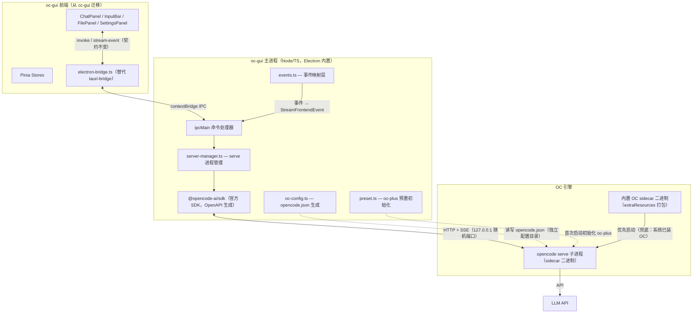
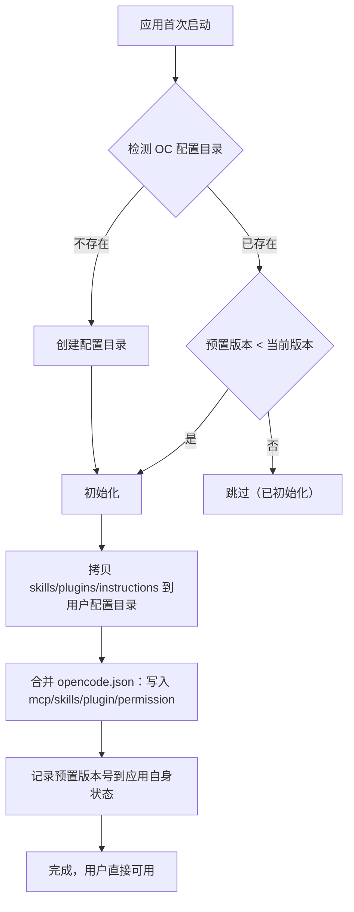
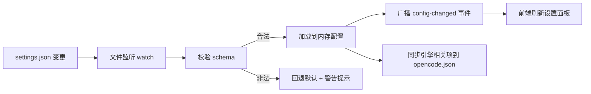
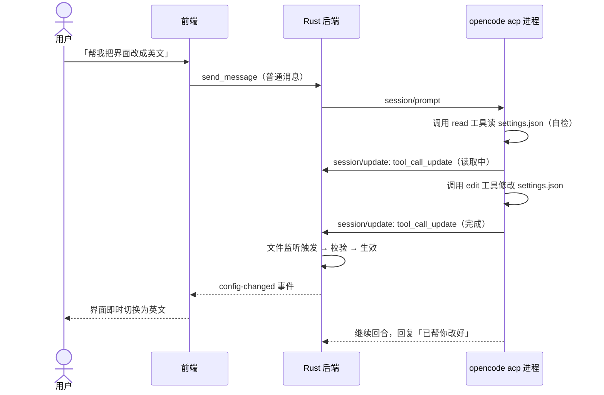
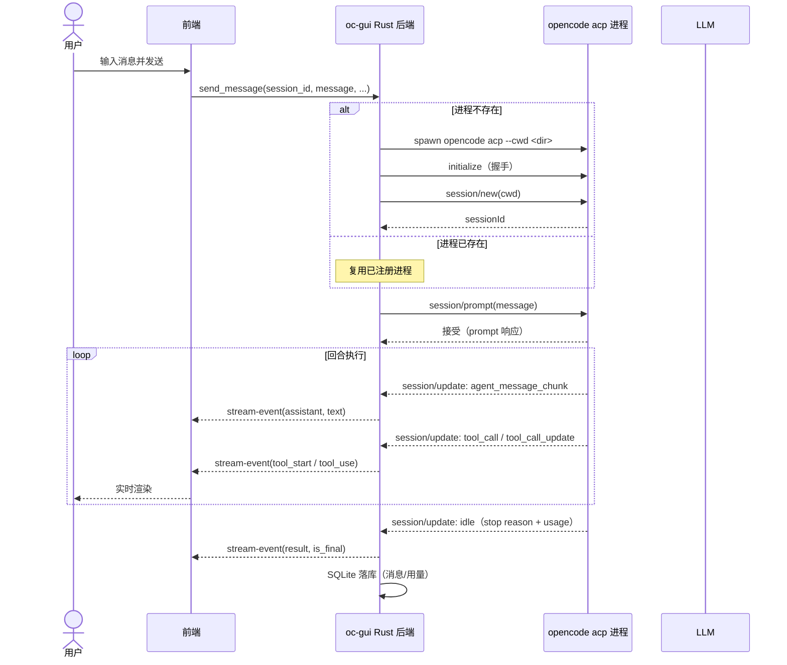
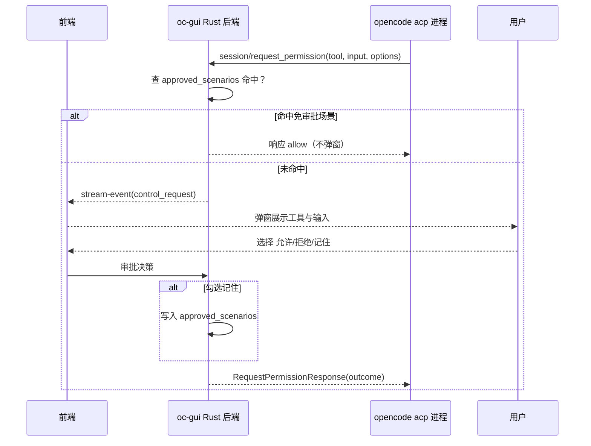
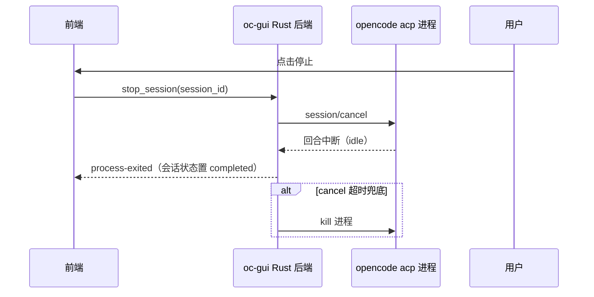

# 分形（Fractal / oc-gui）— 技术设计方案

> 版本：v1.11
> 日期：2026-08-05
> 作者：技术研发
> 状态：草案
> 产品名：分形（产品名，含插件形态与应用形态）；oc-gui（项目代号，用于代码/数据目录）
> 工作区：H:\MaxNull\WorkStation\fractal（新项目）；设计资产来源：H:\MaxNull\WorkStation\cc-gui；增强套件来源：H:\MaxNull\WorkStation\oc-plus

---

## 〇、方案定位

**分形是独立的新产品**：以 OpenCode（OC）为唯一底层 AI 引擎的桌面 GUI，面向非编程人员的开箱即用工具。UI 设计**借鉴（整体迁移）现有产品 cc-gui** 的设计资产——布局、会话管理、文件管理、会话区域、工具栏等，不重新设计；代码与协议层全新编写，无 CC 历史包袱。

| 维度 | 定位 |
|------|------|
| 产品形态 | 新建独立项目（工作区 fractal），cc-gui 保留不动 |
| 目标用户 | 非编程人员为主，开发人员可进阶使用高级配置 |
| 引擎 | OC 唯一（ACP 双工协议），无 CC 代码 |
| 前端设计 | 整体迁移 cc-gui 设计资产（契约 StreamFrontendEvent 不变） |
| 交付形态 | 独立可安装工具，内置 OC sidecar，开箱即用 |
| 模型 | 仅 DeepSeek（OC 内置 provider，API Key 唯一必填项） |

**用户目标**：不重新设计 GUI——把 cc-gui 中亲手设计的布局、会话管理、文件管理、会话区域、工具栏等设计资产整体搬到 OC GUI；OC 作为唯一引擎；最终交付一个可以直接安装、**独立于系统已装 OC 运行**的工具（内置 OC 二进制）。

**命名体系**（v1.9 明确）：分形是产品家族名，含两个形态——

| 形态 | 指代 | 说明 |
|------|------|------|
| **分形插件**（fractal.ts / Guardian Agent） | 插件形态 | oc-plus 中的记忆管家/后台守护插件，OC CLI 环境下的先行形态；产品化后成为应用的内置能力 |
| **分形应用**（oc-gui） | 应用形态 | 本方案交付的桌面 GUI，最终产品 |

> 插件名 `fractal`、项目代号 `oc-gui`、产品名「分形」三者各司其职不冲突；文档中「分形插件」指 Guardian，「分形应用」指 GUI。

---

## 一、需求背景

### 1.1 现状

cc-gui（Super Bazooka）是 Claude Code CLI 的桌面 GUI，技术栈 Tauri 2 + Vue 3 + Rust，积累了完整的设计资产：

```
GUI (Vue 3) → Tauri Bridge → Rust 后端 → spawn claude CLI 子进程
                                          ↕ NDJSON (stream-json 双工)
                                          CC 子进程 → API → LLM
```

设计资产清单（本次迁移对象）：

| 设计资产 | 核心文件 | 说明 |
|----------|----------|------|
| 布局设计 | `AppShell.vue`、`ChatPanel.vue` | 整体框架与聊天主面板 |
| 会话管理 | `SessionSidebar.vue`、`ChatTimelineNav.vue`、`stores/session.ts` | 侧栏、时间线导航、会话 CRUD |
| 文件管理 | `FilePanel.vue`、`FileTree.vue`、`FilePreview.vue`、`DiffViewer.vue`、`GitPanel.vue` | 树浏览、预览、diff、Git 面板 |
| 会话区域 | `MessageBubble.vue`、`MarkdownRenderer.vue`、`MermaidRenderer.vue`、`ThinkingIndicator.vue`、`TodoPanel.vue`、`ContextIndicator.vue` | 气泡、渲染、思考、任务面板 |
| 工具栏 | `InputBar.vue`、`InputBarToolbar.vue`、`ModeBar.vue`、`CommandPalette.vue` | 输入栏、模式栏、命令面板 |
| 共享组件 | `ModalShell.vue`、`ChangelogDialog.vue`、`ErrorBoundary.vue`、`ManagePanel.vue` | 弹窗、变更日志、错误边界 |
| 状态层 | `stores/chat.ts`、`composables/useStreamProcessor.ts` 等 | 事件消费与状态管理 |

### 1.2 用户故事

| 场景 | 用户角色 | 需求描述 |
|------|----------|----------|
| 迁移复用 | 开发者 | 新 GUI 的布局/会话/文件/工具栏与 cc-gui 体验一致，不重新设计 |
| 唯一引擎 | 开发者 | 新 GUI 底层只用 OC（ACP 协议），无 CC 代码 |
| 独立安装 | 最终用户 | 拿到安装包即装即用，不要求先装 Node.js / opencode CLI |
| **开箱即用** | **非编程人员** | **安装后无需任何配置即可对话；预置的 MCP、skill、插件自动生效，无需了解其概念** |
| **唯一配置项** | **非编程人员** | **API Key 是唯一必填项（DeepSeek），其余全部默认；小白可直接让 agent 帮他改设置** |
| **高级配置** | **开发人员** | **类似 VSCode settings.json 的 JSON 配置文件，agent 可自检、自修改** |
| 权限审批 | 开发者 | 工具调用弹窗审批，可记住免审批场景（与 cc-gui 一致） |
| 会话延续 | 开发者 | 会话可暂停、恢复、分叉，行为与 cc-gui 一致 |
| **DeepSeek 专属** | 全部用户 | **产品只针对 DeepSeek 模型适配，暂不提供其他 Provider** |

### 1.3 范围

| 角色 | 可操作范围 | 本次是否覆盖 |
|------|-----------|-------------|
| 新项目脚手架 | Electron + Vue 3 + TS 工程初始化 | ✅ |
| 前端设计资产迁移 | 布局/会话/文件/工具栏/共享组件/状态层 | ✅ |
| 后端主进程 | OC server 集成（进程/HTTP/SSE 事件映射）、SQLite schema 迁移 | ✅ |
| 打包 | 可安装包（NSIS/MSI） | ✅ |
| 内置 OC sidecar | 应用自带 opencode 二进制，独立于系统安装 | ✅ 一期（可行性已验证：Tauri 官方 sidecar 机制 + OC 发布独立二进制） |
| **预置配置体系** | **内置 MCP/skill/插件初始化，开箱即用** | ✅ 一期 |
| **Provider 范围** | **仅 DeepSeek，暂不支持其他 Provider** | ✅ 一期（收窄，不做多 Provider 切换） |
| 禅模式（直连 LLM API） | 与 agent 无关的功能 | ❌ 一期不做，二期评估 |
| Git 面板 / 文件面板 | 与 agent 无关的本地功能 | ✅ 随设计资产一并迁移 |

---

## 二、架构设计

### 2.1 整体数据流



### 2.2 关键设计决策

| 决策点 | 选择 | 理由 |
|--------|------|------|
| D1 项目形态 | **新建独立项目 oc-gui**，cc-gui 保留 | 用户明确「不是删掉原项目，是做一个新项目」；OC 唯一引擎，无兼容包袱 |
| D2 集成接口 | **`opencode serve` HTTP 模式为主，ACP 降为备选**（v1.10 修订，待阶段 0 双轨实测最终定案） | 官方桌面端/Web/IDE 全部走 serve（OpenAPI 3.1 + 官方 SDK + 官方参考实现）；ACP 的 4 项关键能力（模型粒度/权限结构/plan 协商/resume 重放）均待实测未知，而 serve 对应能力文档明确；「有官方参考」优先原则（用户确认） |
| D3 前端资产复用 | **整体迁移 + StreamFrontendEvent 作为前后端契约** | 设计资产全部引擎无关，契约不变则组件/状态层/渲染零改造；这是「不重新设计」的落地方式 |
| D4 进程模型 | **单 serve 进程 + 多会话**（serve 模式；生命周期 = 应用生命周期）（v1.10 修订，随 D2 定案） | 官方 server 原生支持多会话/多 project（session/project API），无需每会话一个进程；若实测 ACP 胜出则回退「每会话一进程」（原 D4 设计保留于附录 A.6 基线） |
| D5 权限模式映射 | CC defaultMode 概念不再存在，直接按 OC「规则集 + request_permission」设计 | 新项目无 CC 兼容包袱，权限体系一步到位按 OC 原生语义设计 |
| D6 Provider 配置 | **只配置 DeepSeek**：OC 内置 DeepSeek provider（models.dev 目录），仅需注入 API Key | DeepSeek 是 OC 标准支持 provider，无需自定义 openai-compatible 块；模型目录自动可用——「API Key 唯一配置项」由此成立 |
| D7 会话持久化 | SQLite schema 从 cc-gui 迁移（会话/消息/免审批表） | 数据结构是设计资产的一部分，原样搬移；`cli_session_id` 字段重命名/复用为 OC session id |
| D8 独立运行 | **一期内置 OC sidecar**：Electron 打包官方发布的独立二进制（extraResources），优先启动内置引擎，系统已装 OC 作为兜底 | 可行性已验证：① OC 官方 GitHub Releases 发布全平台独立二进制（`opencode-windows-x64.zip` 等）；② 官方桌面端与 OpenChamber 均以「内嵌二进制 + serve」方式运行，参考实现现成 |
| D9 技术选型 | **Electron + Vue 3 + TypeScript**（v1.11 修订：从 Tauri 2 迁移） | 官方桌面端已从 Tauri 迁 Electron（2026-04，理由：全 TS 生态 + WebKit 渲染问题 + Node 化）；分形后端零 Rust 包袱（cc-gui 的 Rust 是 CC 专属不迁移），Electron 让「官方 SDK（TS）+ oc-plus（TS）+ 知识引擎（TS）」全链路复用，OC 2.0 抗漂移强；Vue 3 前端资产与壳解耦不受影响；代价为安装包体积（~200MB vs ~40MB），用户确认接受 |
| D10 预置配置体系 | **应用内置 MCP/skill/插件预置包，首次启动初始化到 OC 配置**，非编程人员零配置 | OC `opencode.json` 原生支持 `mcp`（local/remote）、`skills`（paths/urls）、`plugin`、`permission`、`instructions`——预置即写入这些字段；非编程人员无需了解任何概念 |
| D11 配置分层 | **应用配置统一为类 VSCode settings.json 的 JSON 文件；API Key 是唯一必填项；agent 可读可改配置** | ① 分层：内置默认值 → 用户 settings.json → 系统钥匙串（密钥）；② 配置即文件，agent 通过标准文件工具（read/edit/write）自检自改，小白一句话「帮我改设置」即可；③ JSON Schema 校验保证 agent 改错能被拦截 |
| D12 打包交付 | electron-builder（NSIS/MSI），参考官方桌面端打包配置 | 独立安装工具的目标形态；官方 electron-builder.config.ts 可借鉴 |
| D13 单一 Provider 策略 | **产品只针对 DeepSeek 适配，不引入多 Provider 抽象层** | 用户明确暂不考虑其他模型；设置面板/配置/预置全部按 DeepSeek 单一模型设计，未来需要多模型时再抽象 |
| D14 零源码改动 | **绝不 fork / patch OC 源码**，只依赖官方扩展面（插件 hook API + ACP + 配置 schema + agent/skill 文件格式） | 跟随 OC 快速迭代的前提——fork 后每次升级都要 merge 上游，成本与漂移风险不可控；官方缺口走 issue/PR 上游，GUI 补足插件做不到的能力 |
| D15 oc-plus 内嵌 | **oc-plus 全家桶（双星四 agent + 分形插件 + 14 技能 + 权限/MCP 配置）作为预置包核心内容**，随应用打包 + 首次启动初始化 | oc-plus 是用户自研的 OC 增强套件（agent 协作/记忆引擎/技能库），与产品「先插件补短板、后 GUI 成型」的演进路线一致；D10 预置体系的内容由此明确 |
| D16 模型固定 | **deepseek-v4-flash（默认）+ deepseek-v4-pro（预览版标记）高低搭配**，DeepSeek 出新模型前不换 | 用户确认：目前全用 flash（正式版，能力比预览版 pro 强）；pro 正式上市后切默认；映射表维护在 provider.ts |
| D17 配置完全隔离 | **内置引擎用独立配置/数据目录启动（`OPENCODE_APPNAME=oc-gui` 或显式 `OPENCODE_CONFIG_DIR`/`OPENCODE_DATA_DIR` 等），不写 `~/.config/opencode/`** | 用户目标「不与已装 OC 冲突」的落地：OC 原生支持目录隔离环境变量（PR #8963）；预置 oc-plus 内容/记忆/配置全在分形自己的目录，零污染系统 OC；高级设置保留「共享系统配置」开关 |

### 2.3 设计资产复用策略

**复用原则**：以「前后端事件契约（StreamFrontendEvent）+ 数据库 schema」为迁移边界——契约之内整体拷贝，契约之外（引擎交互）重写。

| 迁移类别 | 处理方式 | 涉及 |
|----------|----------|------|
| 直接拷贝（引擎无关） | 原样复制，不修改 | 布局/会话/文件/工具栏/共享组件、stores、composables、样式 |
| 契约适配（小改） | 保持事件结构，仅换数据来源 | `useStreamProcessor.ts`（消费端不变，输入端换 oc_protocol 输出） |
| 重写（引擎相关） | 按 OC 语义新写 | 进程管理、协议解析、DeepSeek 配置、设置面板的 API Key 区 |
| 删除（CC 专属） | 不迁移 | `~/.claude` 相关命令、CC 安装器、CC skills 检测、`protocol.rs` 的 CC 事件解析 |

**迁移清单**（前端，全部来自 cc-gui）：

| 设计资产 | 文件 | 迁移方式 |
|----------|------|----------|
| 布局 | `AppShell.vue`、`ChatPanel.vue` | 拷贝 |
| 会话管理 | `SessionSidebar.vue`、`ChatTimelineNav.vue`、`stores/session.ts` | 拷贝 + cli_session_id 语义调整 |
| 文件管理 | `FilePanel.vue`、`FileTree.vue`、`FilePreview.vue`、`DiffViewer.vue`、`GitPanel.vue` | 拷贝 |
| 会话区域 | `MessageBubble.vue`、`MarkdownRenderer.vue`、`MermaidRenderer.vue`、`ThinkingIndicator.vue`、`TodoPanel.vue`、`ContextIndicator.vue` | 拷贝 |
| 工具栏 | `InputBar.vue`、`InputBarToolbar.vue`、`ModeBar.vue`、`CommandPalette.vue` | 拷贝 |
| 共享 | `ModalShell.vue`、`ChangelogDialog.vue`、`ErrorBoundary.vue`、`ManagePanel.vue` | 拷贝 |
| 状态层 | `stores/chat.ts`、`composables/useStreamProcessor.ts` 等 | 拷贝，事件契约不变 |
| 设置面板 | `SettingsPanel.vue` | 拷贝 + API Key 区改为 DeepSeek 专属 |
| 国际化 | `locales/zh.json`、`locales/en.json` | 拷贝 |

---

## 三、后端设计

### 3.1 新增模块（Electron 主进程，Node/TS）

> v1.11：Electron 主进程即 Node 运行时，官方 SDK（`@opencode-ai/sdk`）直接可跑，无需自写 HTTP 客户端；oc-plus 的 TS 引擎（知识引擎等）可直接 import。

```
electron/
├── main/                 # Electron 主进程
│   ├── index.ts          # 应用入口（窗口创建、生命周期）
│   ├── ipc.ts            # ipcMain 命令处理器（前端 invoke 的落点）
│   ├── server-manager.ts # serve 进程管理（spawn/健康检查/重启）
│   ├── oc-sdk.ts         # @opencode-ai/sdk 封装（会话/消息/权限 API）
│   ├── events.ts         # SSE 事件流 → StreamFrontendEvent 映射层
│   ├── oc-config.ts      # opencode.json 生成（独立配置目录）
│   ├── preset.ts         # oc-plus 预置初始化（拷贝 + merge + 版本管理）
│   └── db.ts             # SQLite（better-sqlite3，迁移 cc-gui schema）
├── preload/
│   └── index.ts          # contextBridge 暴露安全 API（替代 tauri-bridge）
└── renderer/             # Vue 3 前端（cc-gui 迁移资产，走 preload 桥）
```

#### 3.1.1 oc-sdk.ts — 官方 SDK 集成（serve 模式）

**职责**：封装 `@opencode-ai/sdk`（OpenAPI 自动生成的全 API 客户端），主进程内直接调用：

| 能力 | SDK 调用（对应 serve API） | 说明 |
|------|---------------------------|------|
| 会话 CRUD / fork / abort | `sdk.session.*` | 单 server 多会话（D4） |
| 发消息 | `sdk.session.prompt` / `promptAsync` | 同步等待 / 异步流式 |
| 权限审批 | `sdk.session.respondPermission`（`{response, remember?}`） | remember 落免审批表 |
| 模型切换 | `prompt` 的 `model` 参数 | 会话级原生支持（C-1 关闭） |
| 文件/Git | `sdk.file.*`、`sdk.find.*` | 文件面板直连 OC 数据 |
| 配置 | `sdk.config.get` / `update` | 与 oc-config.ts 协同 |

#### 3.1.2 events.ts — 事件映射层

**职责**：订阅 `sdk.event`（SSE `/event` 流）→ 映射为 `StreamFrontendEvent`（与 cc-gui 契约完全一致，前端零改造）。参考 OpenChamber `useEventStream.ts` 的 SSE 重连/心跳处理。

> v1.11：事件源为 serve SSE；事件名/结构待阶段 0 实测确认后逐项填表（映射目标不变）。

#### 3.1.2 events.ts — 事件映射层

**职责**：订阅 `sdk.event`（SSE `/event` 流）→ 映射为 `StreamFrontendEvent`（与 cc-gui 契约完全一致，前端零改造）。参考 OpenChamber `useEventStream.ts` 的 SSE 重连/心跳处理。

**映射表（基线，事件名待阶段 0 实测确认）**：

| 事件源（serve SSE / ACP sessionUpdate 基线） | StreamFrontendEvent | 说明 |
|------------------------|---------------------|------|
| `agent_message_chunk`（文本增量） | `assistant`（text） | 对等 CC text_delta |
| `agent_thought_chunk` | `assistant`（thinking） | OC 原生流式思考 |
| `user_message_chunk` | `user` | 消息回显，与本地合并去重 |
| `tool_call`（pending） | `tool_start` | 工具卡片创建 |
| `tool_call_update`（running） | `tool_use`（进度） | 含 callID/toolName/state/cwd |
| `tool_call_update`（completed/error） | `tool_use` + `user`（tool_result） | 结果回填 |
| 权限请求（serve: permissions 事件 / ACP: request_permission） | `control_request` | 前端复用现有审批弹窗 |
| 回合结束（idle + stop reason + usage） | `result`（is_final） | 回合结束 |
| server 错误 / 进程退出 | `stream-error` / `process-exited` | 错误通道 |

#### 3.1.3 oc-config.ts — 配置文件生成

**职责**：生成/合并 **分形独立配置目录**（D17）下的 `opencode.json`，并将应用配置中的引擎相关项（DeepSeek API Key 引用、模型、权限模式）同步到 OC 配置。

> v1.10：不再写 `~/.config/opencode/opencode.json`——改用 `OPENCODE_APPNAME=oc-gui`（或显式 `OPENCODE_CONFIG_DIR` + `OPENCODE_DATA_DIR` 等）隔离，路径指向应用数据目录（如 `%APPDATA%/oc-gui/oc-data/`）。「共享系统配置」作为高级设置开关（二期）。

- DeepSeek 为 OC 内置 provider：仅注入 `options.apiKey`（`{env:OC_GUI_DEEPSEEK_API_KEY}` 引用，运行时由应用注入环境变量）
- 模型列表来自 models.dev 目录；GUI 展示名 ↔ 模型 ID 映射表维护在 provider.ts
- 默认 `model: "deepseek/deepseek-v4-flash"`

### 3.2 server-manager.ts — OC serve 进程管理

> v1.11：Electron 主进程内 Node spawn（非 Rust sidecar）；单进程多会话（D4）。

```
优先：spawn 应用 extraResources 内置 opencode 二进制   # 独立运行
兜底：spawn 系统安装的 opencode                        # find_opencode()
args:  serve --port <随机端口> --hostname 127.0.0.1
env:   OPENCODE_APPNAME=oc-gui（或显式目录隔离变量，D17）
```

- 启动：应用启动时 spawn 一次；会话复用同一 server 进程（多会话/多 project 官方原生支持）
- 健康检查：轮询 `GET /global/health`，失败自动重启（参考 OpenChamber createOpencodeServer 的等待就绪逻辑）
- 退出：应用退出时优雅关闭（`/instance/dispose` 或直接终止）
- `find_opencode()`：先检测内置二进制可用性，再检测 npm 全局安装的 `opencode` / `opencode.exe`
- 意外退出：`process-exited` 通道 + 所有会话状态置 error，应用内一键重启 server

### 3.3 OC sidecar 打包方案（新增，一期）

**来源**：OC 官方 GitHub Releases 发布的独立二进制（已验证 v1.18.13 包含全平台产物）：

| 平台 | Release 产物 |
|------|-------------|
| Windows x64 | `opencode-windows-x64.zip` |
| Windows arm64 | `opencode-windows-arm64.zip` |
| macOS | `opencode-darwin-arm64.zip` / `opencode-darwin-x64.zip` |
| Linux | `opencode-linux-x64.tar.gz` / `opencode-linux-arm64.tar.gz` 等 |

**打包流程**：

```
构建脚本（CI/本地）：
1. 按目标平台下载 opencode zip/tar.gz
2. 解压得到 opencode 可执行文件
3. 放入 electron/resources/binaries/（electron-builder extraResources 打包）
4. 提交或构建时拉取
```

**配置**（electron-builder，参考官方桌面端）：

```jsonc
// electron-builder.yml（或 package.json build 字段）
{
  "extraResources": [
    { "from": "resources/binaries/", "to": "binaries/" }
  ]
}
```

**启动调用**（主进程）：

```ts
// Electron 主进程 spawn 内置二进制（serve 模式），HTTP 端口随机分配
const bin = path.join(process.resourcesPath, "binaries", isWin ? "opencode.exe" : "opencode");
const child = spawn(bin, ["serve", "--port", String(port), "--hostname", "127.0.0.1"], {
  env: { ...process.env, OPENCODE_APPNAME: "oc-gui" } // D17 配置隔离
});
// 后续通过 http://127.0.0.1:<port> 调用官方 SDK，SSE 消费事件流
```

**风险控制**：
- 版本固定：构建脚本锁死 OC 版本号，避免 sidecar 与协议适配层不匹配
- 更新机制：二进制随应用版本发布（升级应用即升级引擎）；独立热更新（electron-updater）二期评估
- macOS 签名：主进程与 sidecar 需代码签名否则 Gatekeeper 拦截（用户当前为 Windows 平台，影响低，但需在发布流程中处理）

### 3.4 ipc.ts — 主进程命令（替代 Tauri 命令）

| 命令 | 设计 |
|------|------|
| `send_message` | server 已就绪 → `sdk.session.prompt`（带 model 参数）；未就绪 → 先启动 server 再调用 |
| `stop_session` | `sdk.session.abort` + 超时 kill server 兜底 |
| `store_oc_session` | 存 OC session id（`ses_xxx`） |
| `check_oc_session_exists` | `sdk.session.list` 或 OC 数据目录检查 |
| `set_oc_settings` / `get_oc_settings` | 读写 opencode.json（委托 oc-config.ts） |
| `get_auto_mode_status` | 读 opencode.json permission 规则 |
| `install_opencode` | 安装 OC CLI（PS1 脚本模式，沿用 cc-gui 安装器思路） |
| `check_skill_installed` | 扫 OC skills 目录（分形独立配置目录） |
| 会话 CRUD / 消息持久化 / 文件 / Git / 翻译 | 从 cc-gui 迁移（引擎无关） |

> 前端调用统一走 preload 暴露的桥（electron-bridge.ts），主进程 ipcMain 落点 = 本表命令；StreamFrontendEvent 契约不变。

### 3.5 权限体系设计

OC 模型：`opencode.json` 的 `permission` 规则集 + serve 权限 API（`permissions/:permissionID` 响应，含 `remember`）由客户端决策。

| GUI 模式 | opencode.json 配置 | 审批处理器行为 |
|----------|--------------------|-----------------|
| default | `"*": "ask"` | 收到请求 → 弹窗询问 |
| acceptEdits | `"edit": "allow"`，其余 `"*": "ask"` | 编辑类自动放行 |
| bypassPermissions | `"*": "allow"` | 处理器自动回 allow |
| plan | plan agent（禁用编辑类工具） | serve 侧 plan 模式，`[待实测]` |
| auto | `"*": "ask"` | 处理器自动回 allow（不弹窗） |

**免审批场景（approved_scenarios）**：迁移 cc-gui 的 SQLite 表；审批处理器先查 `is_approved(tool_name, pattern)`，命中直接回 allow。serve 权限响应的 `remember` 参数 → 写入该表（语义一一对应）。

### 3.6 Provider 与模型（DeepSeek 专属）

**策略**：产品只针对 DeepSeek，不做多 Provider 抽象。

**Provider 注入**（DeepSeek 是 OC 内置 provider，models.dev 提供模型目录，无需自定义块）：

```json
{
  "provider": {
    "deepseek": {
      "options": {
        "apiKey": "{env:OC_GUI_DEEPSEEK_API_KEY}"
      }
    }
  },
  "model": "deepseek/deepseek-v4-flash"
}
```

> API Key 由应用写入系统钥匙串，运行时注入环境变量 `OC_GUI_DEEPSEEK_API_KEY` 供 OC 进程读取；opencode.json 不落明文。

**模型列表**（v1.9 定案）：固定 `deepseek-v4-flash` + `deepseek-v4-pro` 高低搭配（用户确认，DeepSeek 出新模型前不换）：

| 模型 | 状态 | 用途 |
|------|------|------|
| `deepseek-v4-flash` | 正式版，**默认** | 主模型 + 轻量子 agent（工匠/助理） |
| `deepseek-v4-pro` | 预览版（正式上市后切默认） | 重推理（军师/参谋/复杂任务） |

> 实际模型 ID（如是否带 `[1M]` 后缀、OC 内置 deepseek provider 的注册名）以阶段 0 `opencode models` 实测为准，映射表维护在 provider.ts（仅一张表，无 Provider 维度）。

**effort → variant 映射**：

| GUI effort | OC variant |
|------------|------------|
| low / medium / high | 原样透传 |
| xhigh / max | max |
| ultracode | 降级为 max + system prompt 编排指令（`[待确认]` 是否接受） |

### 3.7 预置配置体系（新增，一期）

**目标**：非编程人员安装应用后零配置即可使用——MCP、skill、插件随应用预置并自动生效。

**预置核心内容（v1.9 明确）**：**oc-plus 全家桶**（来源：H:\MaxNull\WorkStation\oc-plus）——

| oc-plus 内容 | 预置到 OC 的方式 |
|--------------|------------------|
| 双星系统四 agent（双星/工匠/参谋/军师） | 拷贝 agent 定义到 OC agent 目录 |
| 分形插件（fractal.ts 记忆管家 + lib/ + prompts/） | 拷贝插件源码到 OC 插件目录 + plugin 声明 |
| 14 个内置技能（8 mxy-* + 6 omo-*） | 拷贝到 OC skills 目录 + skills.paths |
| agents-priority 插件 | 拷贝 + plugin 声明 |
| 权限规则 / MCP 配置 / instructions | 字段级 merge 进 opencode.json |

**第三方依赖策略（v1.9 明确）**：允许在线拉取（用户确认——LLM 本身就要联网）：
- superpowers（20+ 通用技能）：首次启动在线安装到 node_modules + 本地缓存，二次启动不重复下载
- opencode-acp（自适应上下文压缩）：`opencode plugin opencode-acp@latest --global` 在线安装
- `@opencode-ai/plugin` / `@opencode-ai/sdk`：随版本对齐声明依赖

#### 3.8.1 预置包结构

```
electron/resources/preset/          # 随应用打包的预置资源（只读，不随 OC 数据变动）
├── agents/                          # 双星/工匠/参谋/军师 agent 定义（oc-plus 来源）
├── skills/                          # 预置 skill 集合（14 个 oc-plus 技能 + 业务 skill）
├── plugins/                         # 预置插件（fractal.ts + lib/ + prompts/、agents-priority）
├── mcp/                             # 预置 MCP 服务器配置模板
│   ├── filesystem.json              # 本地文件操作 MCP
│   └── playwright.json              # 浏览器自动化 MCP（可选）
├── instructions/                    # 预置规则文件（对非编程人员的友好指令）
└── preset.json                      # 预置清单：定义哪些内容写入 opencode.json
```

#### 3.8.2 初始化流程（首次启动）



**关键设计**：
- **合并而非覆盖**：预置配置与用户已有 `opencode.json` 合并（字段级 merge），预置字段用固定命名空间（如 `mcp.preset_*`）避免冲突
- **版本升级**：应用升级携带新的预置清单，检测到版本号变化时增量补齐（新增项写入，删除项从配置移除但保留用户数据）
- **应用内管理**：设置面板提供「预置能力」只读展示（已启用的 MCP/skill/插件列表），不提供深层次编辑（面向非编程人员）；高级用户可直接编辑 opencode.json

#### 3.8.3 预置内容示例（首版建议）

| 类别 | 内容 | 价值 |
|------|------|------|
| Agent | 双星 + 工匠/参谋/军师（oc-plus 四 agent 协作） | 复杂任务四阶段自动编排 |
| 插件 | 分形 Guardian（记忆管家）+ agents-priority + opencode-acp | 记忆/纠偏/压缩，接近 CC 的增强体验 |
| Skills | 14 个 oc-plus 技能（提交审查/设计文档/代码整理等）+ 业务 skill | 对话即可完成日常任务 |
| MCP | 文件系统操作（local）、可选远程 MCP | 非编程人员也能管理文件 |
| 权限 | 默认 `"*": "ask"` + 常用只读工具 allow | 安全与易用平衡 |
| Provider | DeepSeek 配置（API Key 注入 opencode.json 引用） | 填 key 即用 |

#### 3.8.4 与设置面板的配合

- 首次启动引导页：填 DeepSeek API Key → 测试连接 → 完成（面向非编程人员的 2 步引导）
- API Key 表单保留（复用 cc-gui 设置面板外观），保存到系统钥匙串 + 同步 opencode.json（由 oc-config.ts 统一管理，预置合并逻辑也在其中）

### 3.8 应用配置体系（新增，一期）

**目标**：API Key 是唯一必填配置；高级配置类 VSCode settings.json；**agent 可自检、自修改配置**——小白用户一句话即可让 agent 帮他完成设置。

#### 3.8.1 配置分层

```
┌─────────────────────────────────────────────────┐
│ 第 1 层：内置默认值（代码内置，只读）              │
│   主题、语言、权限模式、DeepSeek 配置、预置开关    │
├─────────────────────────────────────────────────┤
│ 第 2 层：用户 settings.json（应用数据目录）        │
│   覆盖默认值；GUI 表单与 agent 均读写此文件        │
│   %APPDATA%/oc-gui/settings.json（Windows）       │
├─────────────────────────────────────────────────┤
│ 第 3 层：密钥存储（系统钥匙串，隔离）              │
│   API Key 不进 settings.json，agent 读不到明文    │
└─────────────────────────────────────────────────┘
```

**与引擎配置的关系**：应用配置中含引擎相关项（模型、权限模式、API Key 引用）由 `oc-config.ts` 同步到 OC 的 `opencode.json`；应用 UI 配置（主题/语言等）仅存在于 settings.json。

#### 3.8.2 settings.json 设计（类 VSCode）

```jsonc
{
  // 界面
  "ui.theme": "dark",
  "ui.language": "zh",
  // DeepSeek 引擎配置（同步到 opencode.json）
  "deepseek.model": "deepseek-v4-flash",
  // 引擎
  "agent.permissionMode": "default",
  "agent.effort": "high",
  // 预置能力开关
  "preset.skills.enabled": true,
  "preset.mcp.filesystem": true,
  // 高级项
  "engine.opencodePath": "",      // 空 = 使用内置 sidecar
  "engine.logLevel": "INFO"
}
```

**设计要点**：
- 扁平 key + 点分命名空间（VSCode 风格），字段有 JSON Schema（`settings.schema.json`）支撑校验与提示
- 注释允许（JSONC），便于 agent 阅读与编辑
- 未知 key 忽略（向前兼容），非法值回退默认并记录警告

#### 3.8.3 配置生效机制



- 采用文件监听（chokidar（或 fs.watch）文件监听），**GUI 表单、JSON 编辑器、agent 修改三条路径统一走文件**，天然一致
- 引擎相关项变更后由 oc-config.ts 增量同步 opencode.json（不重启引擎进程，下次会话生效；模型切换影响新会话）

#### 3.8.4 Agent 协作改配置流程



**权限预置**：settings.json 所在目录的 read/edit/write 在预置 permission 中 `allow`（用户授权 agent 管理配置的前提）；对配置的每次修改在消息流中以工具卡片可见，用户可审批。

**安全设计**：
- API Key 存系统钥匙串（keyring），settings.json 仅存 `{env:OC_GUI_API_KEY}` 引用，agent 读文件拿不到明文
- 敏感操作（改模型/密钥）走 request_permission 审批

### 3.9 会话恢复与分叉

| 功能 | 实现 | 备注 |
|------|------|------|
| 恢复 | `session/resume` | 存 OC session id 即可 |
| 分叉 | ACP `sessionCapabilities.fork` | 握手时确认 |
| 历史回放 | resume 重放，适配层合并 | `[待实测]` 重放体积与前端合并策略 |

---

## 四、前端设计

### 4.1 迁移原则

**前端整体从 cc-gui 拷贝，事件契约（StreamFrontendEvent）不变。** 迁移顺序：脚手架 → 组件 → 状态层 → 设置面板适配。

| 步骤 | 内容 | 说明 |
|------|------|------|
| 1 | 初始化 Electron + Vue 3 + TS + Tailwind 4 + DaisyUI 5 工程（electron-vite） | 前端技术栈与 cc-gui 一致（v1.11：壳从 Tauri 迁 Electron） |
| 2 | 拷贝布局/会话/文件/工具栏/共享组件 | 原样复制 |
| 3 | 拷贝 stores / composables / locales / 样式 | 契约不变 |
| 4 | 设置面板 API Key 区适配 | 表单结构保留，保存目标改为钥匙串 + opencode.json |
| 5 | 模型选择器 | 按 OC 会话级模型粒度调整（`[待实测]`） |
| 6 | 删除 CC 专属 UI | 如 CC 安装引导、CC skills 管理 |

### 4.2 与 cc-gui 的差异点（前端需要感知的）

| 差异 | 前端表现 |
|------|----------|
| 无 CC 模式切换 | 引擎选择控件删除（OC 唯一） |
| Provider 选择器 | 删除（DeepSeek 唯一），仅保留模型选择 |
| 模型切换粒度 | 会话级切换记录插入消息流，渲染为「配置变更」小标识 |
| **配置入口分层** | 设置面板拆两层：简单模式（仅 API Key + 常用项）+ 高级模式（settings.json JSONC 编辑器，复用 CodeMirror） |
| **配置实时生效** | 监听 `config-changed` 事件，主题/语言等即时刷新，无需重启 |

### 4.3 设置面板分层设计

| 模式 | 面向用户 | 内容 | 交互 |
|------|----------|------|------|
| 简单模式（默认） | 非编程人员 | DeepSeek API Key、模型、测试连接；预置能力开关 | 表单操作，同 cc-gui 设置面板外观 |
| 高级模式 | 开发人员/agent | settings.json JSONC 全文编辑（CodeMirror + schema 提示） | 保存即生效（走文件监听），错误行内提示 |
| 模式切换 | — | 设置面板右上角「高级设置」入口 | 双向切换，内容实时同步 |

### 4.4 页面状态矩阵（用户视角）

> 界面布局与交互细节**以 cc-gui 实现为准**（设计资产整体迁移，不复述），下表仅列出分形特有/需要验收的状态组合。

| 页面 | 状态 | 条件 | 展示 |
|------|------|------|------|
| 聊天页 | 空闲 | 无回合执行 | 输入框可用，可发送 |
| 聊天页 | 执行中 | 回合进行中 | 输入框置灰，显示「停止」按钮，流式输出 |
| 聊天页 | 等待审批 | 引擎请求权限 | 审批弹窗覆盖，其余区域不可操作 |
| 聊天页 | 空会话 | 新建未发消息 | 空态提示；未配 API Key 时提示先配置 |
| 聊天页 | 失败 | 进程崩溃/超时 | 错误提示，会话状态置失败，可重发 |
| 设置页 | 测试连接 | 点击测试 | 按钮转圈，结果 ✓/✕ 展示 |
| 设置页 | 高级/简单模式 | 右上角切换 | 双向切换，内容实时同步 |
| 引导页 | 首次启动 | 未完成引导 | 2 步引导（API Key → 测试连接），可跳过 |

---

## 五、数据库变更

**新项目自有 SQLite，schema 从 cc-gui 迁移：**

| 表 | 操作 | 说明 |
|----|------|------|
| `sessions` | 迁移 | `cli_session_id` 更名 `oc_session_id`（新项目无历史包袱，直接改名） |
| `messages` | 迁移 | content JSON 结构保持兼容（适配层产出格式一致） |
| `approved_scenarios` | 迁移 | 免审批场景 |
| `settings` | 迁移 | UI 设置、DeepSeek 配置 |
| `item_descriptions` | 迁移 | 翻译缓存 |
| `debug_log` / `stderr_log` | 迁移 | 会话日志列 |

---

## 六、文件变更清单

### 新项目结构（相对 cc-gui 的迁移关系）

**后端（Electron 主进程，新建/重写）：**

| 操作 | 文件 | 说明 |
|------|------|------|
| 新增 | `electron/main/index.ts` | 应用入口（窗口创建、生命周期、单实例锁） |
| 新增 | `electron/main/ipc.ts` | ipcMain 命令处理器（对应 3.4 命令表） |
| 新增 | `electron/main/server-manager.ts` | serve 进程管理（spawn/健康检查/重启） |
| 新增 | `electron/main/oc-sdk.ts` | 官方 SDK 封装（会话/消息/权限/文件 API） |
| 新增 | `electron/main/events.ts` | SSE 事件流 → StreamFrontendEvent 映射层 |
| 新增 | `electron/main/oc-config.ts` | opencode.json 生成（独立配置目录 + 预置 merge） |
| 新增 | `electron/main/preset.ts` | oc-plus 预置初始化（拷贝 + merge + 版本管理） |
| 新增 | `electron/main/settings.ts` | 应用配置体系（默认值 + settings.json 读写 + schema 校验 + 文件监听） |
| 新增 | `electron/main/db.ts` | SQLite（better-sqlite3，迁移 cc-gui schema） |
| 新增 | `electron/main/provider.ts` | DeepSeek 模型映射表（展示名 ↔ 模型 ID） |
| 新增 | `electron/preload/index.ts` | contextBridge 暴露安全 API（替代 tauri-bridge 的 invoke 封装） |
| 新增 | `electron/resources/binaries/` | sidecar 二进制（构建脚本下载，extraResources 打包） |
| 新增 | `electron/resources/preset/` | 预置包（agents/skills/plugins/mcp/instructions/preset.json） |
| 新增 | `scripts/fetch-opencode-bin.ts` | OC 二进制下载/重命名脚本 |
| 修改 | `electron-builder.yml`（或 package.json build） | `extraResources` 声明 sidecar + NSIS/MSI 配置 |
| 新增 | `settings.schema.json` | 应用配置 JSON Schema（表单与 agent 共用） |
| 新增 | `src/components/settings/SettingsJsonEditor.vue` | 高级配置 JSONC 编辑器（CodeMirror + schema 提示） |
| 删除（不迁移） | cc-gui 的 `protocol.rs` CC 解析 / Rust 后端 | OC 唯一引擎，无需兼容；Rust 整体不迁移（v1.11） |

**前端（迁移 + 最小适配）：**

| 操作 | 文件 | 说明 |
|------|------|------|
| 拷贝 | `src/components/layout/`、`chat/`、`files/`、`session/`、`shared/` | 设计资产整体迁移 |
| 拷贝 | `src/stores/`、`src/composables/`、`src/locales/`、`src/assets/` | 状态层与样式 |
| 拷贝+适配 | `src/components/settings/SettingsPanel.vue` | API Key/模型区改 DeepSeek 专属 |
| **重写** | `src/lib/tauri-bridge.ts` → `electron-bridge.ts` | Tauri invoke → preload 桥（v1.11，调用点单文件替换） |
| 新增 | `src/lib/oc-bridge.ts`（可选） | OC 专属调用封装 |

---

## 七、关键流程

### 7.1 发送消息（首次：spawn + new + prompt）



### 7.2 权限审批



### 7.3 停止生成



### 7.4 异常流程

| 异常场景 | 前端处理 | 后端处理 |
|----------|----------|----------|
| ACP spawn 失败（OC 未安装，一期） | 提示「未检测到 opencode」+ 安装引导 | spawn 错误透传 |
| JSON-RPC error 响应 | stream-error 通道 | 解析 error code/message 转错误事件 |
| ACP 进程意外退出 | 会话置 error，提示重发 | process-exited + DB 状态更新 |
| 回合无响应（120s） | 超时提示 | 沿用 cc-gui 超时机制 |
| 审批弹窗关闭 | 视为拒绝 | 回 Cancelled outcome |
| resume 失败（OC 侧会话已删） | 提示会话失效 | 清空 oc_session_id，按新会话处理 |

---

## 八、测试要点

### 8.1 后端/协议测试

| 测试场景 | 前置条件 | 操作 | 预期结果 |
|----------|----------|------|----------|
| ACP 握手与建会话 | OC 已安装 | 首次发送消息 | 进程 spawn、initialize 成功、sessionId 存库 |
| 流式文本渲染 | 会话已建 | 发送长回复 prompt | 逐 token 渲染，无重复乱序 |
| 工具调用卡片 | 会话已建 | 发送读文件 prompt | tool_start → running → completed 流转正确 |
| 权限审批弹窗 | default 模式 | 触发写文件 | 弹窗正确，允许后继续 |
| 免审批场景 | 已添加场景 | 触发命中操作 | 不弹窗直接放行 |
| 停止生成 | 回合执行中 | 点击停止 | cancel 生效，状态可继续 |
| 会话恢复 | 历史会话有 OC id | 重新发消息 | resume 成功，上下文延续 |
| 会话分叉 | 历史会话 | 选择分叉 | 新会话派生，原会话不变 |
| 模型切换 | 会话可用 | 切换模型后发消息 | 请求走新模型，opencode.json 正确同步 |
| 进程退出清理 | 删除会话 | 删除会话 | session/close + kill，无残留 |
| **设计资产回归** | 迁移完成 | 布局/会话/文件/工具栏全流程冒烟 | 与 cc-gui 体验一致 |
| **独立运行（一期）** | sidecar 打包 | 无系统 OC 环境安装运行 | 内置引擎工作正常 |

### 8.2 用户视角测试（面向非编程人员的验收）

| 编号 | 测试场景 | 前置条件 | 操作步骤 | 预期结果 |
|------|----------|----------|----------|----------|
| U-01 | 开箱即用对话 | 全新安装，未装任何 CLI | 填 API Key 后发消息 | 内置引擎工作，流式输出正常 |
| U-02 | 预置能力生效 | 首次启动完成 | 触发预置 skill 相关需求 | 能力自动调用，无需手动配置 |
| U-03 | 预置配置合并 | 用户已有 opencode.json | 首次启动 | 预置项写入，用户配置不被覆盖 |
| U-04 | 首次引导 | 全新安装 | 按 2 步引导配置 | 引导完成直接可用；可跳过 |
| U-05 | agent 帮改配置 | 会话可用 | 说「把界面改成浅色」 | 工具卡片出现，界面即时生效 |
| U-06 | 高级设置编辑器 | 任意状态 | 打开高级设置改配置 | 保存即生效，非法值标红回退 |
| U-07 | 配置实时同步 | 简单/高级模式 | 任一侧修改 | 另一侧实时同步显示 |
| U-08 | agent 误改配置 | 会话可用 | agent 写入非法配置值 | schema 校验拦截，回退默认并提示 |

---

## 九、风险与边界

| 风险 | 等级 | 应对措施 |
|------|------|----------|
| ACP 协议版本差异（OC 实现 v1/v2 混合） | 高 | 阶段 1 实测锁定 OC 版本；按 capabilities 协商 |
| OC session/update 结构随版本漂移 | 中 | events.ts 集中适配 + fixture 单测；sidecar 版本随应用锁定 |
| request_permission 结构未实测 | 中 | 阶段 1 实测；`[待实测]` 项逐个验证 |
| sidecar 二进制下载失败/网络问题 | 中 | 构建脚本失败即中止；二进制提交入库或 CI 缓存，避免每次构建下载 |
| sidecar 与系统 OC 版本不一致 | 中 | 内置引擎优先，版本固定于应用；系统 OC 仅作兜底 |
| macOS Gatekeeper 签名 | 低（当前 Windows 平台） | 发布流程预留 codesign 步骤，后续支持 macOS 时处理 |
| ultracode 降级改变行为 | 中 | 降级为 max + 指令注入，UI 标注；不接受则暂缓 |
| 模型粒度（newSession 是否支持指定模型） | 中 | `[待实测]`；不支持则全局 model + 会话级 switchModel |
| 设计资产迁移遗漏 | 中 | 以 2.3 迁移清单为基线逐项核对，diff 验证 |
| 预置配置与用户已有 OC 配置冲突 | 中 | 字段级 merge + 预置命名空间（`preset_*`）隔离；预设值不覆盖用户显式配置 |
| 预置 skill/MCP 不适用于所有用户 | 低 | 预置内容保守精简，设置面板可禁用单项（只读展示 + 开关） |
| agent 误改配置导致异常 | 中 | schema 校验拦截非法值 + 回退默认；修改以工具卡片展示可审批；settings.json 支持备份（修改前自动备份一份 .bak） |
| API Key 泄露风险 | 中 | 密钥隔离在系统钥匙串，agent 读文件拿不到明文；敏感操作走审批 |
| 新项目重复维护成本 | 低 | cc-gui 冻结不新增功能，oc-gui 为新功能主战场 |

---

## 十、实施计划

### 10.1 阶段总览

| 阶段 | 任务 | 预估工时 |
|------|------|----------|
| 阶段 0 | **双轨实测**：serve（OpenAPI spec + SDK + SSE 事件流 + 权限审批时序）与 ACP 对比，锁定集成方式与协议细节（附录 B） | 0.5-1 天 |
| 阶段 1 | 新项目脚手架（Electron + Vue 3 + 构建链） | 0.5 天 |
| 阶段 2 | 前端设计资产迁移（布局/会话/文件/工具栏/共享 + 状态层 + locales + electron-bridge） | 1-1.5 天 |
| 阶段 3 | oc-sdk.ts + events.ts（SDK 集成 + 事件映射 + fixture 单测） | 1.5 天 |
| 阶段 4 | server-manager.ts + ipc.ts + oc-config.ts + provider.ts（引擎集成） | 1.5 天 |
| 阶段 5 | 设置面板适配 + 权限审批联动 + 恢复/分叉 | 1 天 |
| 阶段 6 | **应用配置体系**：settings.ts + schema + JSONC 编辑器 + 文件监听生效 + Agent 改配置验证 | 2 天 |
| 阶段 7 | **sidecar 打包**：下载脚本 + extraResources 配置 + 独立运行验证（无系统 OC 环境） | 1 天 |
| 阶段 8 | **预置配置体系**：预置包制作 + preset.ts 初始化 + 首次引导页 | 1.5 天 |
| 阶段 9 | 全量测试 + 打包（NSIS/MSI，electron-builder）+ 文档 | 1.5 天 |
| **合计（一期）** | | **约 11-13 天** |

### 10.2 阶段任务拆分（文件级）

**阶段 0：双轨协议实测（serve 为主，ACP 对比）**
1. 确认本机 OC 版本（`opencode --version`，目标 v1.18.x）
2. **serve 轨**：`opencode serve --port 随机` → 拉取 `http://127.0.0.1:<port>/doc` OpenAPI spec → 用官方 SDK 跑通：建会话 → prompt_async → SSE 事件流 → 权限审批（含 remember）→ abort → fork → 会话级 model 参数
3. **ACP 轨**：按附录 A.1 方法列表跑通 initialize → session/new → prompt → 流式 → 权限 → cancel → resume
4. 对比结论 → 定案 D2（serve 或 ACP），回填附录 C 清单
5. 产出：`docs/实测记录.md`（原始报文）+ fixture 种子（`electron/tests/fixtures/`）

**阶段 1：脚手架**
1. Electron + Vite + Vue-TS 模板（electron-vite，参考官方桌面端 electron.vite.config.ts）
2. 技术栈锁定：Vue 3 + TS + Pinia + Tailwind 4 + DaisyUI 5 + CodeMirror 6 + marked + mermaid + better-sqlite3
3. 验证 `npm run dev` 空壳可跑（主进程 + preload + 渲染进程三件套）

**阶段 2：设计资产迁移（对照 2.3 清单）**
1. 拷贝 `src/components/{layout,chat,files,session,shared}`（cc-gui → fractal）
2. 拷贝 `src/stores/`、`src/composables/`、`src/locales/`、`src/assets/`
3. 重写 `src/lib/tauri-bridge.ts` → `electron-bridge.ts`（Tauri invoke → preload 桥，调用点单文件替换）
4. 删除 CC 专属前端（引擎选择、CC 安装引导等）
5. 编译通过（vue-tsc）后再进入下一阶段

**阶段 3：SDK 集成层**
1. `oc-sdk.ts`：官方 SDK 封装（会话/消息/权限/文件 API + 错误归一化）
2. `events.ts`：SSE 事件流 → StreamFrontendEvent 映射（表见 3.1.2）+ 权限请求解析
3. fixture 单测：用阶段 0 的真实报文做输入样例（vitest）
4. `npm run test` 通过

**阶段 4：引擎集成**
1. `server-manager.ts`：spawn serve（内置二进制优先/系统 OC 兜底）、健康检查、退出处理
2. `ipc.ts`：send_message / stop_session / store_oc_session / check_oc_session_exists
3. `oc-config.ts`：opencode.json 生成（DeepSeek apiKey 引用 + 权限规则 + 预置 merge，独立配置目录）
4. `provider.ts`：DeepSeek 模型映射表
5. 端到端冒烟：GUI 发消息 → 流式回复

**阶段 5：交互完善**
1. 设置面板 API Key/模型区适配
2. 权限审批：serve 权限事件 → control_request 事件 → 弹窗 → 响应（remember 落 approved_scenarios）
3. 恢复（session list + resume）与分叉（session fork）
4. 异常路径：server 崩溃/超时/审批取消

**阶段 6：应用配置体系**
1. `settings.ts`：默认值 + settings.json 读写 + JSONC 解析 + schema 校验
2. `settings.schema.json`：全字段定义（表单与 agent 共用）
3. 文件监听（chokidar）+ config-changed 事件
4. `SettingsJsonEditor.vue`：CodeMirror + schema 补全
5. 验证 agent 改配置闭环（临时会话里让引擎改 settings.json 看生效）

**阶段 7：sidecar**
1. `scripts/fetch-opencode-bin.ts`：下载 zip → 解压 → 放入 `electron/resources/binaries/`
2. `electron-builder.yml` extraResources 配置
3. 无系统 OC 环境验证（临时改名系统 opencode 或 PATH 隔离）

**阶段 8：预置体系**
1. 制作 `electron/resources/preset/`（agents/skills/plugins/mcp/instructions/preset.json，oc-plus 来源）
2. `preset.ts`：首次启动拷贝 + opencode.json merge + 预置版本管理（独立配置目录）
3. 引导页 `onboarding/`：2 步（API Key → 测试连接）

**阶段 9：收尾**
1. vitest + e2e（Playwright + 真实 serve fixture）
2. `electron-builder` 打包验证（NSIS/MSI）
3. 文档收尾：README、docs/知识/、变更记录

---

## 附录 A：关键技术结论速查（已查证，新会话直接使用）

> 以下结论来自 2026-08-05 查证（官方文档 + OC 源码），实施时如遇版本变化以实测为准。

### A.1 ACP 协议（agentclientprotocol.com，Anthropic 提出）

- 传输：stdin/stdout 双工，每行一个 JSON（NDJSON），JSON-RPC 2.0
- 客户端 → 服务端方法：`initialize`（版本协商 + capabilities）、`session/new`（cwd、mcpServers、additionalWorkspaceRoots）、`session/prompt`（ContentBlock[]）、`session/cancel`、`session/resume`、`session/close`、`session/list`
- 服务端 → 客户端：`session/update` 通知（携带 update 对象）、`session/request_permission` 请求（响应 `RequestPermissionOutcome`：选中选项 / Cancelled）
- sessionUpdate 类型（OC 实现）：`agent_message_chunk`（文本增量）、`agent_thought_chunk`（思考增量）、`user_message_chunk`（回显）、`tool_call`（pending）、`tool_call_update`（running/completed/error）
- 空闲信号：`session.status` idle（带 stop reason）——OC 的 ACP 订阅在 idle 后结束回合等待

### A.2 OC 侧实现（anomalyco/opencode，源码位置 packages/opencode/src/acp/）

> ⚠️ v1.9 修正：OC 仓库已从 sst/opencode 迁移至 **anomalyco/opencode**（官方文档 opencode.ai 已指向新地址，© Anomaly 公司）。附录 B/C 及知识库以新仓库为准。

- 命令：`opencode acp [--cwd <dir>]`，长驻进程，stdin EOF 退出
- 事件映射实现参考：`acp/event.ts`（SessionUpdate 构造）、`acp/permission.ts`（权限处理）、`acp/tool.ts`（工具状态）
- OC SDK 事件源：`message.part.delta`（文本/思考增量）、`message.part.updated`（part 状态）、`permission.asked`（权限）、`session.status`（idle）
- 版本：v1.18.x（2026-08-04 发布 v1.18.13）

### A.3 OC 配置（opencode.json，v1 稳定版 schema）

- 关键字段：`provider`（对象，`npm`/`options.apiKey`/`options.baseURL`/`models`）、`model`、`mcp`（local 用 `command` 数组 / remote 用 `url`+`headers`）、`skills`（`paths`/`urls`）、`plugin`（npm 包/本地 ts/带 options 对象）、`permission`、`instructions`、`agent`、`command`
- v2 草案 schema 用 `providers`（复数）+ `package` 字段，当前稳定版为 v1 格式
- DeepSeek 是 **OC 内置 provider**（models.dev 目录），`/connect` 直接支持；自定义 OpenAI 兼容 provider 用 `@ai-sdk/openai-compatible`

### A.4 Electron sidecar（v1.11：替代原 Tauri externalBin）

- 打包：`electron-builder.yml` → `extraResources: [{ from: "resources/binaries/", to: "binaries/" }]`；主进程 `process.resourcesPath` 定位二进制
- 启动：主进程 `child_process.spawn(bin, ["serve", ...], { env: { OPENCODE_APPNAME: "oc-gui" } })`（3.3 节）
- 参考：官方桌面端（packages/desktop）与 OpenChamber（packages/desktop）均采用「内嵌二进制 + serve」模式，配置/启动代码可借鉴
- macOS 需代码签名（Gatekeeper）；Windows 无签名可能有 SmartScreen 提示

### A.5 OC 独立二进制（sidecar 来源）

- GitHub Releases（anomalyco/opencode，v1.18.13 已验证）：`opencode-windows-x64.zip`、`opencode-windows-arm64.zip`、`opencode-darwin-arm64.zip`、`opencode-linux-x64.tar.gz` 等
- 下载后解压即得 opencode 可执行文件，放入 `electron/resources/binaries/`（extraResources 打包）

### A.6 cc-gui 现状关键事实（迁移来源，H:\MaxNull\WorkStation\cc-gui）

- `src-tauri/src/process.rs`：spawn claude CLI，flags 含 `--output-format stream-json --input-format stream-json --permission-prompt-tool stdio`；`find_claude()` 多路径探测（native/npm/where）
- `src-tauri/src/protocol.rs`：`StreamLine::parse`（按行 JSON）+ `to_frontend_event` → `StreamFrontendEvent`（字段：event_type/session_id/text/thinking/tool_use/control_request/is_final/error/duration_ms/input_tokens/output_tokens/cost_usd/content_blocks/tool_results）
- `src-tauri/src/session.rs`：sessions 表（id/title/cli_session_id/cwd/model/status/mode）、messages 表、approved_scenarios 表、settings 表（key/value）
- `src-tauri/src/lib.rs`：57 个 Tauri 命令（send_message/store_claude_session/stop_session/会话 CRUD/文件/Git/翻译/zen_send_message 等）
- 前端事件消费：`composables/useStreamProcessor.ts` → `stores/chat.ts`；事件类型：assistant/tool_start/tool_use/tool_input_delta/control_request/result/user/token_usage/error
- 前端组件清单：见 2.3 迁移清单

---

## 附录 B：阶段 0 实测指南（v1.11：serve 双轨）

**目的**：双轨实测 serve（主）与 ACP（备），用证据定案 D2；产物为 oc-sdk.ts / events.ts 提供 fixture。

**步骤（serve 轨，优先）**：

1. 确认 OC 版本：`opencode --version`（记录版本号，协议结论绑定该版本）
2. 准备临时目录：`C:\Users\MaxNull\AppData\Local\Temp\opencode\acp-probe`（已存在，可直接使用）
3. 写 Node 脚本（直接使用官方 `@opencode-ai/sdk`）：
   - spawn `opencode serve --port <随机> --hostname 127.0.0.1`（env 注入 `OPENCODE_APPNAME=oc-gui` 验证隔离）
   - 拉取 `http://127.0.0.1:<port>/doc` 保存 OpenAPI spec → 对比 SDK 生成类型
   - 依次跑通并记录：
     a. `GET /global/health` → 健康检查响应结构
     b. `POST /session` 建会话 → sessionId 格式；`PATCH /session/:id` 标题
     c. `POST /session/:id/prompt_async` → 订阅 `/event` SSE → 记录完整事件序列（重点：消息增量事件的 messageID/part 结构、回合结束事件）
     d. 触发工具调用（"读取当前目录的文件列表"）→ 记录权限事件结构 + `POST /session/:id/permissions/:permissionID`（`{response, remember}`）时序
     e. `POST /session/:id/abort` → 记录中断行为
     f. `POST /session/:id/message` 带 `model` 参数 → 验证会话级模型切换
     g. `POST /session/:id/fork` → 记录分叉行为
4. **ACP 轨（对比用）**：按附录 A.1 方法列表跑通 initialize → session/new → prompt → 流式 → 权限 → cancel → resume，记录同场景行为与差异
5. 对比结论 → 定案 D2（默认 serve；ACP 仅在 serve 缺关键能力时回退）
6. 全部原始报文存入 `docs/实测记录.md`，标注每条对应的协议结论

**记录模板**：

```markdown
## 实验 N：<名称>
- 操作：<发送的请求 JSON>
- 响应/事件：<原始 JSON，逐行>
- 结论：<对附录 C 清单哪一项的结论，以及影响哪个模块>
```

---

## 附录 C：待实测/待确认清单

| # | 项 | 验证方法 | 影响 | 状态 |
|---|----|----------|------|------|
| C-1 | ACP `session/new` 是否支持指定模型 | 实测 newSession 参数/能力协商 | 模型选择实现方式（会话级 vs 全局） | 待实测 |
| C-2 | `request_permission` 的 PermissionOption 具体结构 | 实测触发工具审批 | 审批弹窗适配 | 待实测 |
| C-3 | plan 模式协商方式 | 实测 initialize 能力 + plan 请求 | 权限模式翻译 | 待实测 |
| C-4 | `session/resume` 重放体积与前端合并策略 | 实测 resume 后事件流 | 历史加载逻辑 | 待实测 |
| C-5 | DeepSeek 模型 ID 清单（deepseek-v4-flash/pro 注册名，是否带 [1M] 后缀） | `opencode models` 或 models.dev | GUI 模型下拉 | 待实测 |
| C-6 | OC 内置 DeepSeek 是否需要显式 provider 块 | 实测仅 apiKey 注入能否连接 | oc-config.ts 简化度 | 待实测 |
| C-7 | sidecar zip 内实际文件名 | 下载解压查看 | 下载脚本 | 待实测 |
| C-8 | Windows 无签名 EXE 的 SmartScreen 表现 | 打包后安装验证 | 发布流程 | 待实测 |
| C-9 | ultracode 降级方案是否接受 | 用户决策 | 功能范围 | 待确认 |

---

## 附录 D：产品场景（用户视角）

> 面向非编程人员的产品定位资产。界面细节以 cc-gui 实现为准，不再单独出原型文档。

### 场景 1：开箱即用

> 小美是行政人员，不懂编程。她下载安装包打开应用，按引导粘贴了 DeepSeek API Key，然后直接新建会话输入「帮我把这个月报销单整理成表格」。应用自带的能力（表格处理 skill + 文件工具）直接生效，她什么都不用配置，就拿到了整理好的表格。

### 场景 2：预置能力自动生效

> 小美想「把项目文件夹里所有文档翻译成英文」。她不需要知道背后有一个「文档翻译 skill」在工作——只需描述需求，引擎自动调用预置能力完成任务。设置面板里能看到「已启用的能力」列表（只读展示），但她永远不需要点进去。

### 场景 3：让 agent 帮我改设置

> 小美觉得界面太暗了，又不知道去哪里改。她直接在对话框输入「帮我把界面改成浅色，字体调大一点」。agent 读取应用配置文件，把主题改成浅色、字号调大，界面上出现两个工具调用卡片（读配置/改配置），随后界面立即变亮、字体变大。agent 回复「已经帮你改好啦」。

### 场景 4：工具调用审批与记忆

> 小红让引擎「把登录接口的密码改成加密存储」。引擎想修改 `auth.rs`，界面弹出审批框：「Edit 工具请求：修改 auth.rs（第 42-58 行）」并附上改动预览。她点了「允许」，改动立即生效；她勾选了「记住此场景」，以后同样的修改不再询问。

### 场景 5：会话恢复与分叉

> 小刚昨天开了一个「重构消息渲染」的会话，今天重新打开继续提问，上下文完整延续。他又点「分叉」，从当前对话派生出一个新会话，原会话保持不动。

### 场景 6：高级配置（开发人员）

> 程序员小刚点开设置面板的「高级设置」，看到类似 VSCode 的 settings.json 编辑器。他直接改 `engine.opencodePath` 指向自己编译的 OC 开发版，保存后立即生效。文件里的 JSON 有注释和自动补全提示。

---

## 附录 E：OC 版本化知识与迭代策略（v1.9 新增）

> 背景：OC 更新极快（v1.18.13 于 2026-08-04 发布，几乎每日发版）。分形把 OC 当基座但**绝不改 OC 源码**（D14），本附录定义如何沉淀「对 OC 的深入理解」为带版本号的知识，以及如何跟随迭代。

### E.1 知识库结构与版本锚点

**位置**：`docs/知识/oc-engine/`（随分形项目走，是 agent 开发分形时的 OC 参考；另有实测记录 `docs/实测记录.md` 作为原始报文库）。

```
docs/知识/oc-engine/
├── README.md                  # 索引 + 版本矩阵总览 + 知识三通道
├── 版本矩阵.md                 # 核心：版本 → 变更 → 影响模块 → 适配状态
├── 升级检查清单.md             # 每次 OC 发版跑的固定五步流程
├── v1.18.x-插件API.md         # hook 全集 / PluginInput / 事件类型
├── v1.18.x-ACP协议.md         # JSON-RPC 方法 / sessionUpdate 类型（对接附录 B 实测）
├── v1.18.x-配置schema.md      # opencode.json 全字段 + v1/v2 差异
└── v1.18.x-数据格式.md        # AGENTS.md / plans / memories / skill 文件约定
```

每个知识文件头部强制带版本锚点：

```markdown
> 适用版本：v1.18.13 | 最后验证：2026-08-05
> 验证方式：官方文档 + 源码阅读（只读）+ ACP 实测
```

**知识三通道**：
1. **官方文档**：opencode.ai/docs（Config/Providers/Plugins/ACP/Agents/Skills/Permissions/MCP/LSP 等 20+ 页面）
2. **OC 源码只读阅读**：anomalyco/opencode `packages/opencode/src/`（acp/、plugin/ 等），**只读不改**
3. **实测**：阶段 0 的 ACP 真实报文 + 插件行为冒烟，产物存 `docs/实测记录.md` + 契约测试 fixture

### E.2 升级跟随机制（锁定 + 主动评估）

**节奏**：sidecar 锁定版本，不追每日 release；跟随 major/minor，滞后 1-2 个 patch（用户认可）。

**升级五步流程**（固化进 `升级检查清单.md`，每次 OC 发版执行）：

```
1. 读 release notes → 按影响面分类（协议 / 插件 API / 配置 / 无影响）
2. 更新版本矩阵 + 对应知识文件（版本锚点同步）
3. 跑契约测试（fixture：ACP 真实报文 + 插件事件样例，阶段 0 产出为种子）
4. 影响评估 → 决定升级 / 观望（记录理由）
5. 升级 sidecar → 全量回归（GUI 冒烟 + oc-plus 功能）
```

**运行时能力协商**：ACP `initialize` 的 capabilities 协商 + `opencode --version` 探测；协议版本不匹配时 GUI 降级提示而非崩溃。

### E.3 契约测试资产

阶段 0 实测产物直接建到 `electron/tests/fixtures/`（oc-sdk / events 的测试种子）：
- `initialize-响应.json`、`session-new-响应.json`、`session-update-事件流.jsonl`、`request-permission-请求.json` 等
- 每次升级跑 fixture 回归，协议结构漂移立刻暴露

### E.4 边界与风险

| 风险 | 应对 |
|------|------|
| 插件 API 快速变化面 | 依赖 `@opencode-ai/plugin` SDK 版本对齐 + 契约测试兜底 |
| OC 缺关键能力 | 提 issue/PR 上游（贡献而非 fork）；GUI 补插件做不到的 |
| 知识滞后于版本 | 版本矩阵 + 升级清单是强制流程，升级必先更新知识 |
| 文档/仓库地址漂移 | 知识文件头部记录验证日期，附录 A 已修正 anomalyco/opencode |

---

## 附录 F：官方与社区参考项目调研（v1.11 新增）

> 分形不是孤岛——OC 生态已有官方桌面端与高星社区 GUI，架构与功能均值得借鉴。原则：**借鉴架构与交互，不复制代码**（前端技术栈以 cc-gui Vue3 资产为硬约束）。

### F.1 官方桌面端（anomalyco/opencode packages/desktop）

| 维度 | 结论 |
|------|------|
| 技术栈 | Electron（v1.14.x 曾用 Tauri v2，2026-04 迁 Electron；前端 SolidJS） |
| 集成方式 | **内嵌 CLI 二进制 + `opencode serve` HTTP 模式**（sidecar server + SSE 事件流）——与分形 v1.10 定案一致 |
| 迁移原因 | ①macOS/Linux WebKit 渲染性能与一致性差；②bundled CLI 启动慢/Windows 偶发失败；③OC 全 TS 生态，迁 Node 后 server 可直接跑在 Electron 内置 Node 进程 |
| 对分形 | sidecar 思路被官方验证；electron-builder 打包/更新/主进程管理代码可借鉴；**OC 2.0 已发布 beta**（API 重写 + Node 化 + 多标签并行会话），分形知识库需跟踪其 serve API 变化 |

### F.2 OpenChamber（openchamber/openchamber，7.2K stars）

**概况**：OpenCode 的桌面 + Web + 手机 + VS Code 多端界面（"OpenCode, everywhere"），TypeScript 全栈，基于官方 `@opencode-ai/sdk`。

**架构（来自其 AGENTS.md，参考价值极高）**：

```
Desktop（Tauri 薄壳）→ 只做原生集成（菜单/对话框/通知/更新/deep-link）
        ↓ 加载 Web UI
Web server（Node/Express）→ createOpencodeServer 内嵌启动 OC server
        ↓ HTTP + SSE（@opencode-ai/sdk）
OpenCode server（本机或远程 OPENCODE_HOST）
```

- **薄壳模式**：所有后端逻辑在 Node/TS 层，壳只做原生能力——与分形「Electron 壳 + TS 主进程」殊途同归（F.1 官方走 Electron，OpenChamber 走 Tauri 薄壳，分形选 Electron 等效于把其 Web server 层放进主进程）
- **官方 SDK 直连**：`packages/ui/src/lib/opencode/client.ts`（SDK v2）+ `useEventStream.ts`（SSE 事件流消费）——分形 oc-sdk.ts/events.ts 的现成参考
- **外部 server 支持**：`OPENCODE_HOST`/`OPENCODE_PORT`/`OPENCODE_SKIP_START` 连接已存在实例——分形「共享系统配置/远程连接」高级功能的参考

**值得分形借鉴的功能**（对应 GUI 增强面板）：

| OpenChamber 功能 | 分形对应 |
|------------------|---------|
| 上下文可见性面板（token/cost/原始消息） | 「状态面板」增强（分形插件触发线状态可视化） |
| Plan/Build 专用计划视图 | 「计划面板」（plans/ 展示 + checkbox 进度） |
| Skills 目录管理（只读 + 开关） | 预置能力管理面板 |
| 会话文件夹/子文件夹 | 会话侧栏增强（候选，用户已定保持侧栏导航） |
| 主题系统（`~/.config/.../themes/` 热加载） | 主题管理参考 |
| 多 agent 并行 runs（isolated worktrees） | 二期评估（涉及 worktree 机制） |

**注意**：OpenChamber 前端是 React + Zustand，**不借鉴技术栈**（分形 Vue3 + Pinia 资产约束）；其 Tauri 壳用法与分形 Electron 选型不同，但「壳 + TS 逻辑层」分层原则一致。

### F.3 借鉴边界（防过度借鉴）

- 只借鉴：架构分层模式、SSE 消费/重连细节、打包与更新配置、功能面板设计
- 不借鉴：前端技术栈（Vue3 资产约束）、服务端实现细节（我们 spawn sidecar 而非内嵌 server 代码——D14 零源码改动）
- 每借鉴一项前对照「D14 零源码改动 + D3 前端契约不变」两条硬约束

---

## 十一、变更记录

| 版本 | 日期 | 变更内容 | 作者 |
|------|------|----------|------|
| v1.0 | 2026-08-05 | 初始版本：ACP 路线可行性分析 + 技术方案 | 技术研发 |
| v1.1 | 2026-08-05 | 定位调整：改为新建项目 oc-gui（OC 唯一引擎、设计资产整体迁移、独立安装目标） | 技术研发 |
| v1.2 | 2026-08-05 | sidecar 纳入一期：验证 Tauri externalBin 机制 + OC 独立二进制发布，新增 3.3 打包方案，调整实施计划与风险 | 技术研发 |
| v1.3 | 2026-08-05 | 目标升级：面向非编程人员的开箱即用工具；新增 D10 与 3.7 预置配置体系（MCP/skill/插件初始化）；确认技术选型 | 技术研发 |
| v1.4 | 2026-08-05 | 新增 D11 与 3.8 应用配置体系：API Key 唯一必填、类 VSCode settings.json、agent 自检自改配置、密钥隔离存储 | 技术研发 |
| v1.5 | 2026-08-05 | 聚焦 DeepSeek：新增 D13 单一 Provider 策略，全文档 Provider 相关内容收窄为 DeepSeek 专属（内置 provider + API Key 注入） | 技术研发 |
| v1.6 | 2026-08-05 | 产品定名「分形」（项目代号 oc-gui），文档重命名为 分形-设计方案.md | 技术研发 |
| v1.7 | 2026-08-05 | 独立方案定位（去除 A 方案关联）；补充附录 A 关键技术结论、附录 B 实测指南、附录 C 待实测清单；实施计划细化到文件级 | 技术研发 |
| v1.8 | 2026-08-05 | 删除独立原型文档（UI 以 cc-gui 实现为准）；有价值内容并入：4.4 页面状态矩阵、8.2 用户视角测试、附录 D 产品场景 | 技术研发 |
| v1.9 | 2026-08-05 | ①命名体系：分形插件（Guardian）vs 分形应用（GUI）；②新增 D14 零源码改动 / D15 oc-plus 内嵌 / D16 模型固定；③3.7 预置包明确为 oc-plus 全家桶 + 第三方在线拉取；④3.6 模型定为 deepseek-v4-flash/pro 高低搭配；⑤新增附录 E（OC 版本化知识与迭代策略：知识库结构/升级五步/契约测试）；⑥修正附录 A 仓库地址 sst→anomalyco；⑦更新 C-5 | 技术研发 |
| v1.10 | 2026-08-05 | 集成方式定案方向：serve 为主（D2）、单进程多会话（D4）、新增 D17 配置完全隔离（OPENCODE_APPNAME）；3.1-3.5 按 serve 修订；附录 B 扩展 | 技术研发 |
| v1.11 | 2026-08-05 | **桌面壳从 Tauri 2 迁 Electron**（用户确认）：官方桌面端已迁（全 TS 生态/WebKit/Node 化三因）；D8/D9/D12 修订；后端模块全 TS 化（oc-sdk.ts/events.ts/server-manager.ts/ipc.ts）；tauri-bridge → electron-bridge；sidecar 改 extraResources；实施计划 11-13 天；附录 B 双轨实测 | 技术研发 |
