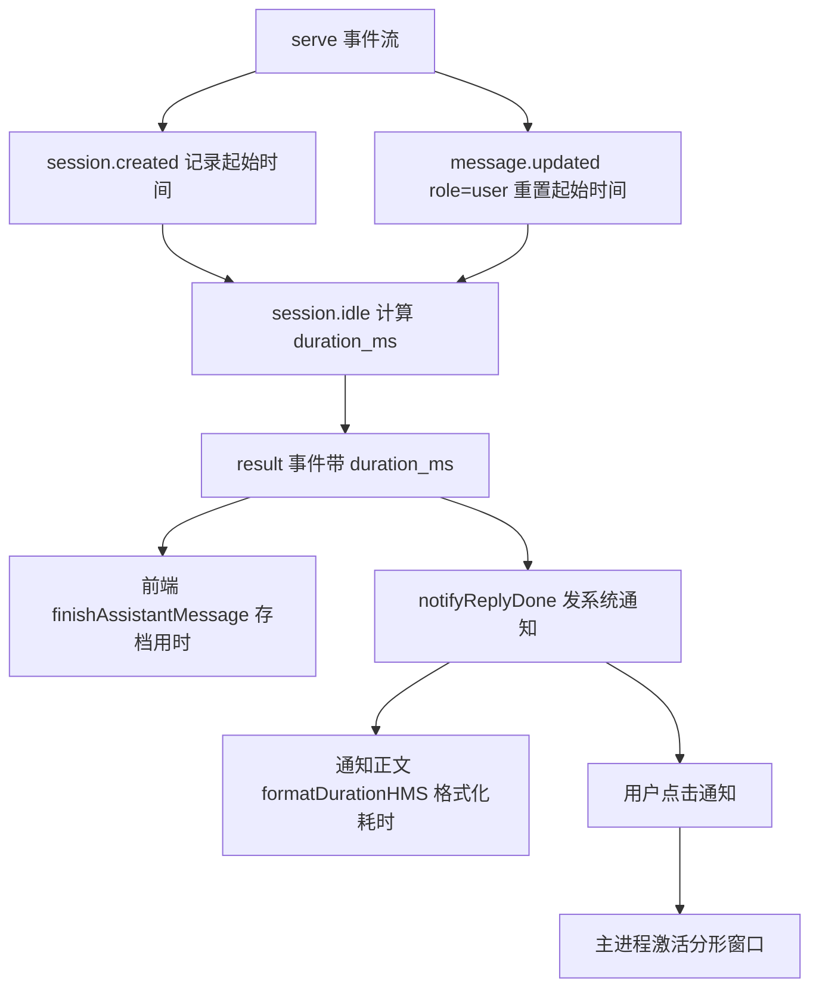
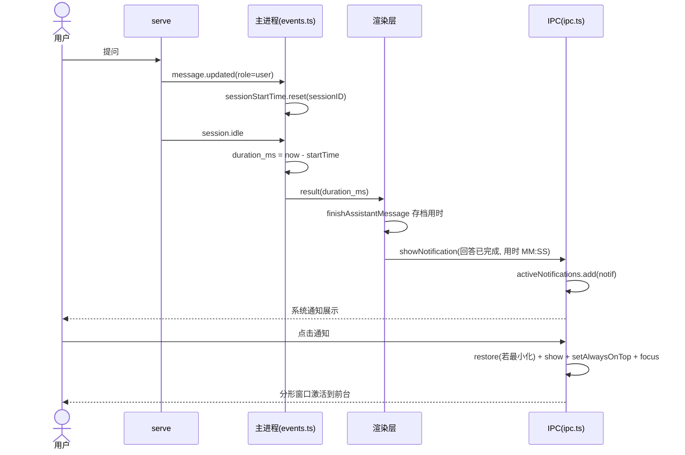

# 回合完成体验优化 — 功能设计方案

> 版本：v1.0
> 日期：2026-08-16
> 作者：技术研发
> 状态：已实施（逆向补文档，代码已完成）

---

## 一、需求背景

### 1.1 现状与问题

分形每个回合（一次用户提问 → AI 完成回复）结束时，需要在三个环节给出「回合完成」的反馈：回合消息的**用时标记**、**系统通知**（回答完成时提醒用户）、通知内容里带上**本次耗时**。1.1.2 之前的实现存在三个问题：

1. **回合用时可能缺失或跨回合累计**：回合起始时间只在 `session.created` 记录一次。当 serve 重启后继续旧会话（无 `session.created` 重放）时，起始时间永远缺失 → `result.duration_ms` 为 `undefined` → 回合完成标记用时显示 `--`（2026-08-15 用户反馈）；且同一会话多回合共享同一个起始时间 → 后一回合的用时把前一回合的时间也算进去（跨回合累计）。
2. **点击系统通知无动作**：Windows 通知默认点击无行为，用户点通知后无法回到分形窗口（2026-08-15 反馈）。且主进程局部变量的 `Notification` 实例会被 V8 GC 回收，导致 click 监听静默丢失。
3. **通知耗时不可读**：回答完成通知正文只显示「AI 已生成回答」，不带耗时；子任务耗时展示用的是秒数原始值，长耗时（超过 1 分钟）难以快速阅读。

### 1.2 用户故事

| 场景 | 用户角色 | 需求描述 |
|------|----------|----------|
| 查看回合约耗时 | 普通用户 | 每个回合完成后，消息上显示本回合从提问到完成的实际耗时，且每回合独立计时 |
| 点击通知回应用 | 普通用户 | 点击系统通知后，分形窗口被激活并置顶到前台，回到当前会话 |
| 通知可见耗时 | 普通用户 | 回答完成通知正文显示本回合耗时，且格式对人类友好（≥1 小时显示 HH:MM:SS） |

### 1.3 范围

| 角色 | 可操作范围 | 本次是否覆盖 |
|------|-----------|-------------|
| 普通用户 | 回合消息用时标记（每回合独立、服务重启后续会话仍准确） | ✅ |
| 普通用户 | 点击系统通知激活分形主窗口 | ✅ |
| 普通用户 | 回答完成通知正文带耗时（时分秒格式化） | ✅ |
| 普通用户 | 子任务完成耗时同样使用时分秒格式化 | ✅（复用同一格式化函数） |
| 任意角色 | 通知自定义点击跳转指定会话 | ❌（只做激活窗口，不做深度链接） |

---

## 二、架构设计

### 2.1 整体数据流



### 2.2 关键设计决策

| 决策点 | 选择 | 理由 |
|--------|------|------|
| 回合起始时间重置时机 | `message.updated`（role=user）时无条件重置 | 用户消息 = 回合开始，天然是计时基准；无条件重置保证多回合会话每回合独立计时，且 serve 重启后继续旧会话也能补上基准（无 created 重放） |
| 通知点击激活窗口方式 | 找到主窗口 → 最小化先 restore → show → `setAlwaysOnTop(true)` + focus → 200ms 后取消置顶 | Windows 限制前台进程 focus 被拒（MSDN SetForegroundWindow），社区 workaround（electron issue #2867 / bpasero）为强制置顶后 focus 才能生效；延时取消置顶恢复普通层级 |
| Notification 实例生命周期 | 模块级 `Set<Notification>` 注册表持有引用，close 时释放 | 局部变量会被 V8 GC 回收导致 click 监听丢失；close 释放防注册表无限增长 |
| 耗时格式化规则 | `formatDurationHMS`：<1h 显示 MM:SS，≥1h 显示 HH:MM:SS | 秒级耗时用「分:秒」，长耗时加「时:分:秒」，符合日常阅读习惯；通用工具函数供通知与子任务共用 |
| 通知耗时缺省处理 | `duration_ms` 为 undefined 时正文回退为「AI 已生成回答」 | 历史会话/无计时基准时不得因缺耗时而报错，通知降级为纯文案 |

---

## 三、详细设计

### 3.1 回合起始时间维护（`electron/main/events.ts`）

**改动点：** `MapContext` 新增 `sessionStartTime: Map<string, number>`（回合起始时间，`session.created` 记录），两个写入时机：

1. **`session.created`**：仅当 `!ctx.sessionStartTime.has(sessionID)` 时记录（首次创建）。
2. **`message.updated`（info.role === 'user'）**：无条件重置为当前时间——用户消息 = 回合开始（修复点核心，2026-08-15 用户反馈「用时显示 --」的根因）。

**消费点：** `session.idle` 分支计算 `result.duration_ms`：

```ts
const startTime = sessionID ? ctx.sessionStartTime.get(sessionID) : undefined
duration_ms: startTime !== undefined ? ctx.now() - startTime : undefined,
```

**要点：** `message.updated` 重置是无条件执行（不判断 has），因此：
- serve 重启后继续旧会话（无 `session.created` 重放）时，首条 user 消息到达即建立基准；
- 同一会话多回合各自重置，不再跨回合累计。

### 3.2 通知点击激活窗口（`electron/main/ipc.ts`）

**改动点：** `notification:show` IPC handler 内：

```ts
// 活跃系统通知注册表：局部变量 Notification 会被 V8 GC 回收 → click 监听丢失
const activeNotifications = new Set<Notification>()

ipcMain.handle('notification:show', (_e, args: { title: string; body: string }) => {
  try {
    const notif = new Notification({ title: args.title, body: args.body })
    notif.on('click', () => {
      const win = BrowserWindow.getFocusedWindow() ?? BrowserWindow.getAllWindows()[0]
      if (!win) return
      if (win.isMinimized?.()) win.restore?.()   // 最小化时先 restore，否则 show/focus 不生效
      win.show()
      win.setAlwaysOnTop(true)                   // Windows 通知激活限制 workaround
      win.focus()
      setTimeout(() => { if (!win.isDestroyed()) win.setAlwaysOnTop(false) }, 200)
    })
    notif.on('close', () => activeNotifications.delete(notif))
    activeNotifications.add(notif)
    notif.show()
  } catch { /* 通知失败静默（不阻断调用方） */ }
})
```

### 3.3 耗时格式化工具（`src/renderer/src/lib/utils.ts`）

**改动点：** 新增通用函数：

```ts
/** 毫秒 → 时分秒格式化：<1h 显示 MM:SS，≥1h 显示 HH:MM:SS（负值/0 兜底为 00:00） */
export function formatDurationHMS(ms: number): string {
  const totalSec = Math.floor(Math.max(0, ms) / 1000);
  const h = Math.floor(totalSec / 3600);
  const m = Math.floor((totalSec % 3600) / 60);
  const s = totalSec % 60;
  const pad = (n: number) => String(n).padStart(2, "0");
  return h > 0 ? `${h}:${pad(m)}:${pad(s)}` : `${pad(m)}:${pad(s)}`;
}
```

### 3.4 回答完成通知接入耗时（`src/renderer/src/composables/useStreamProcessor.ts`）

**改动点：** `notifyReplyDone(durationMs?)` 支持耗时参数：

```ts
async function notifyReplyDone(durationMs?: number) {
  if (!shouldNotify("replyDone")) return;
  try {
    await showNotification(
      t("settings.notificationReplyDoneTitle"),
      durationMs != null
        ? t("settings.notificationReplyDoneBodyDuration", { duration: formatDurationHMS(durationMs) })
        : t("settings.notificationReplyDoneBody"),
    );
  } catch { /* 通知失败静默 */ }
}
```

**调用点：** `result` 事件处理中 `void notifyReplyDone(data.duration_ms)`（`useStreamProcessor.ts:469`）——`result` 事件来自 `session.idle`，`data.duration_ms` 即本回合耗时（3.1 计算值）。

**i18n 文案**（`src/renderer/src/locales/zh.json` / `en.json`）：

| key | zh | en |
|-----|----|----|
| `notificationReplyDoneTitle` | 回答已完成 | Reply complete |
| `notificationReplyDoneBody` | AI 已生成回答 | The AI has finished replying |
| `notificationReplyDoneBodyDuration` | 用时 {duration} | Took {duration} |

### 3.5 子任务完成通知复用（`useStreamProcessor.ts`）

`notifySubtaskDone` 复用 `formatDurationHMS` 的格式化规则（子任务耗时展示统一为 MM:SS / HH:MM:SS，不再显示秒原始值）。

---

## 四、错误处理与边界

| 场景 | 处理方式 |
|------|----------|
| `duration_ms` 为 undefined（无计时基准） | 通知正文回退为 `notificationReplyDoneBody`（纯文案）；回合消息用时标记显示 `--` |
| serve 重启后继续旧会话 | `message.updated`（user）无条件重置起始时间 → 首条 user 消息即建立基准，不再缺失 |
| 主窗口被最小化 | 点击通知先 `win.restore()` 再 `show()`/`focus()`（Electron 最小化窗口 show 不会还原） |
| 无任何 BrowserWindow | click 回调 `if (!win) return` 静默退出 |
| Windows 前台激活被拒 | `setAlwaysOnTop(true)` + focus + 200ms 后取消置顶（不永久置顶，避免遮挡其他应用） |
| 窗口在取消置顶前被销毁 | `if (!win.isDestroyed())` 守卫，防操作已销毁窗口报错 |
| 通知被系统禁用/受限 | `try/catch` 吞掉，不阻断主流程 |

---

## 五、测试计划

| 测试文件 | 用例 |
|----------|------|
| `events.test.ts` | session.created 记录起始时间；message.updated(role=user) 无条件重置；session.idle 计算 duration_ms；无起始时间时 duration_ms 为 undefined |
| `utils.test.ts` | formatDurationHMS：<1 分钟、1-59 分钟、≥1 小时、0/负值边界 |
| `useStreamProcessor.test.ts` | notifyReplyDone 有耗时/无耗时两种正文；shouldNotify 门控 |

---

## 六、文件变更清单

### 主进程

| 操作 | 文件 | 说明 |
|------|------|------|
| 修改 | `electron/main/events.ts` | sessionStartTime 记录/重置 + session.idle 计算 duration_ms |
| 修改 | `electron/main/ipc.ts` | notification:show 点击激活窗口 + activeNotifications 注册表防 GC |

### 前端

| 操作 | 文件 | 说明 |
|------|------|------|
| 修改 | `src/renderer/src/lib/utils.ts` | 新增 formatDurationHMS |
| 修改 | `src/renderer/src/composables/useStreamProcessor.ts` | notifyReplyDone 接入耗时参数 |
| 修改 | `src/renderer/src/locales/zh.json` / `en.json` | 新增 notificationReplyDoneBodyDuration 文案 |

---

## 七、关键流程

### 7.1 时序图



### 7.2 异常流程

| 异常场景 | 前端处理 | 主进程处理 |
|----------|----------|----------|
| duration_ms 缺失 | 通知正文回退纯文案；用时标记显示 -- | 不阻断 result 事件 |
| 通知点击时无窗口 | — | click 回调静默退出 |
| 通知点击时窗口已销毁 | — | isDestroyed 守卫 |
| 系统禁用通知 | 通知函数 try/catch 吞错 | show 抛错被吞 |

---

## 八、测试要点

| 测试场景 | 前置条件 | 操作 | 预期结果 |
|----------|----------|------|----------|
| 单回合计时 | 新会话发一条消息 | 等待回合完成 | 消息用时 = 提问到完成的实际时长 |
| 多回合独立计时 | 会话内连续发两条消息 | 等待两个回合完成 | 第二回合用时不含第一回合时间 |
| 重启后续会话 | serve 重启，继续旧会话提问 | 等待回合完成 | 用时正常显示（不显示 --） |
| 通知点击激活 | 通知已展示，窗口最小化 | 点击通知 | 窗口还原并置顶到前台 |
| 通知耗时格式 | 回合完成，耗时 90 秒 | 观察通知正文 | 显示「用时 01:30」 |
| 通知耗时格式（长耗时） | 回合完成，耗时 1 小时 5 分 | 观察通知正文 | 显示「用时 1:05:00」 |

---

## 九、风险与边界

| 风险 | 等级 | 缓解 |
|------|------|------|
| Windows 前台激活策略因系统版本差异 | 低 | 采用社区验证的 setAlwaysOnTop workaround；激活失败仅任务栏闪烁，不影响功能 |
| setAlwaysOnTop 短暂置顶可能遮挡 | 低 | 200ms 后自动取消，肉眼几乎不可感知 |
| 计时基准依赖事件时序 | 低 | message.updated(role=user) 为回合起始的稳定信号；缺失时降级为 -- 显示 |

---

## 十、实施计划

> 本方案为逆向补文档（代码已完成），实施记录：

| 阶段 | 任务 | 状态 |
|------|------|------|
| 主进程 | events.ts 回合起始时间重置 + ipc.ts 通知点击激活 | ✅ 已实施（e74cbef） |
| 前端 | utils.ts formatDurationHMS + notifyReplyDone 接入 + i18n | ✅ 已实施（5e678fd / e74cbef） |
| 测试 | 补充 events/utils/useStreamProcessor 用例 | ✅ 已实施 |

---

## 十一、变更记录

| 版本 | 日期 | 变更内容 | 作者 |
|------|------|----------|------|
| v1.0 | 2026-08-16 | 初始版本（逆向补文档：覆盖 e74cbef 计时修复+通知激活、5e678fd 耗时格式化） | 技术研发 |
