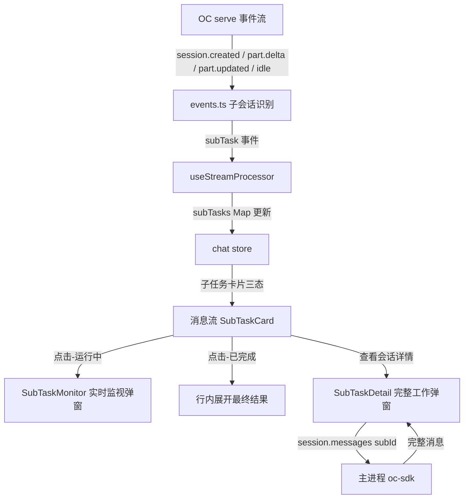
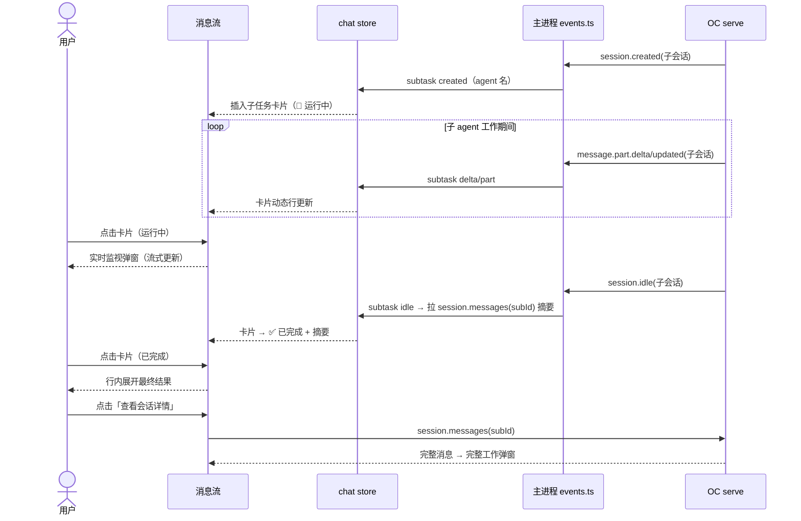

# 子智能体可视化 — 功能设计方案

> 版本：v1.1
> 日期：2026-08-09
> 作者：技术研发
> 状态：待评审

---

## 一、需求背景

### 1.1 现状

OC（OpenCode）当前**仅实验功能支持后台调用子智能体**（task 工具），且是**阻塞式**——主智能体派生子智能体后，主会话消息流完全静止。实测（2026-08-09 探针 stage0/probe-subagent.mjs，serve 1.18.15）确认：

- task 工具**没有** tool part 状态流转（子 agent 调用不走工具卡片机制）——前端没有任何「子 agent 在工作」的指示
- **主会话 SSE 原生广播子会话全部活动**：`session.created`（子会话创建）、`message.part.delta`（子 agent 流式输出，实测 4361 条）、`message.part.updated`、`session.status`、`session.idle`（子会话完成）
- 子会话最终反馈可达：`GET /session/{subId}/message` 拉取完整消息

**核心痛点**：子 agent 被调用时用户看不到任何动态——**必然认为主 agent 卡住了**；侦查兵这类调查型 agent 的最终反馈内容用户也无处查看。

### 1.2 用户故事

| 场景 | 用户角色 | 需求描述 |
|------|----------|----------|
| 阻塞可视化 | 分形用户 | 主 agent 派生子 agent 时，能实时看到子 agent 在干什么（不至于误判卡住） |
| 反馈查看 | 分形用户 | 侦查兵等调查型子 agent 完成后，能查看其最终反馈内容 |
| 完整审计 | 分形用户 | 想回看子 agent 的完整工作（思考/工具/文本） |

### 1.3 范围

| 能力 | 本次是否覆盖 |
|------|-------------|
| 子任务实时卡片（消息流内） | ✅ |
| 运行中实时监视弹窗 | ✅ |
| 完成后行内展开最终结果 | ✅ |
| 「查看会话详情」完整工作弹窗 | ✅ |
| 侧栏子会话树形分组 | ❌（二期，方案已定） |
| 子会话批量清理 | ❌（未排期） |

---

## 二、架构设计

### 2.1 整体数据流



### 2.2 关键设计决策

| 决策点 | 选择 | 理由 |
|--------|------|------|
| D1 子任务识别 | 事件流 `sessionID ≠ 活跃会话` 的事件（session.created 触发建卡） | 实测 serve 原生广播子会话活动，零额外请求 |
| D2 实时动态数据源 | 已广播的事件流（delta/updated 累积） | 无需轮询；监视弹窗与卡片共享同一份累积文本 |
| D3 最终反馈摘要 | idle 后拉一次 `session.messages(subId)` 取最后 assistant 文本 | delta 是流式碎片，拉取一次保证摘要完整可靠 |
| D4 三态交互 | 运行中=实时弹窗 / 完成后=行内摘要 / 详情=按钮进完整弹窗 | 用户拍板：轻量查看不打断，完整审计按需进入 |
| D5 卡片插入位置 | 消息流内 ToolCard 风格（紧随触发时刻的流式消息后） | 与现有工具卡片视觉语言一致，时间线语义清晰 |
| D6 子任务状态存储 | chat store `subTasks: Map<subId, SubTask>` + 随 sessionCache 持久 | 切会话不丢状态；重启后从 serve 消息重建（二期） |
| D7 多子 agent | 按 subID 独立卡片 | OC 当前阻塞式串行，但事件流天然支持多会话，实现零额外成本 |
| D8 弹窗组件 | 复用 ModalShell（现有） | 统一弹窗交互/动画/关闭行为 |

---

## 三、协议与数据（serve 事件流实测）

### 3.1 实测结论（serve 1.18.15，2026-08-09）

| 事件 | 子会话可见性 | 用途 |
|------|-------------|------|
| `session.created` | ✅ 主会话 SSE 收到 | 触发建卡（子会话 id = 事件 sessionID） |
| `message.part.delta` | ✅ 子 agent 流式输出 | 卡片动态行 + 监视弹窗流式渲染 |
| `message.part.updated` | ✅ text/thinking/tool 分派 | 累积完整活动（思考/工具/文本） |
| `session.status` | ✅ 子会话状态变化 | 卡片状态辅助 |
| `session.idle` | ✅ 子会话完成 | 状态收尾 + 触发摘要拉取 |
| task 工具 tool part | ❌ 不存在 | 不能用工具卡片机制，必须事件流识别 |

### 3.2 事件映射（events.ts 扩展）

```typescript
// StreamFrontendEvent 新增：
type SubTaskEvent = {
  type: "subtask";
  subId: string;          // 子会话 id
  parentId: string;       // 主会话 id（= 当前活跃会话）
  agent?: string;         // 子 agent 名（工匠/军师/参谋/侦查兵/制图师）
  kind: "created" | "delta" | "part" | "idle";
  text?: string;          // delta 文本 / part 摘要
  part?: { type: string; tool?: string; state?: string };
  startedAt?: number;
  endedAt?: number;
};
```

识别逻辑：`props.sessionID` 存在且 ≠ 当前活跃会话 → 子任务事件；`session.created` 时取 `info.agent`（agent 名徽标）；`message.part.updated` 的 tool part 累积工具记录。

---

## 四、前端设计

### 4.1 chat store（`src/renderer/src/stores/chat.ts`）

```typescript
// 子任务状态（随 sessionCache 持久）
interface SubTask {
  id: string;
  agent: string;          // 徽标映射：工匠👷 军师🧭 参谋🧭 侦查兵🕵️ 制图师🎨 其他🤖
  status: "running" | "done";
  deltaText: string;      // 流式累积（卡片动态行 + 监视弹窗共用）
  parts: Array<{ type: string; tool?: string; state?: string; text?: string }>;  // 完整活动（上限 200 条）
  startedAt: number;
  endedAt?: number;
  summary?: string;       // idle 后拉取的最终反馈摘要
}
const subTasks = ref<Record<string, SubTask>>({});
// action：subtaskCreated / subtaskDelta / subtaskPart / subtaskIdle（拉摘要回调）
```

### 4.2 子任务卡片（`src/renderer/src/components/chat/SubTaskCard.vue`）

**运行中态**：agent 徽标 + 名称 + `🔄 运行中 · {耗时}s` + 动态行（deltaText 最后一段，单行省略）

**已完成态**：徽标 + 名称 + `✅ 已完成 · {耗时}s` + 摘要（summary 前 3 行）

**交互**（按状态分流，用户拍板）：
- 运行中：点击 → `SubTaskMonitor` 实时监视弹窗
- 已完成：点击 → 行内展开 summary 全文；附「查看会话详情」按钮 → `SubTaskDetail` 完整工作弹窗

### 4.3 实时监视弹窗（`src/renderer/src/components/chat/SubTaskMonitor.vue`）

- ModalShell 复用（宽 640px）
- 内容：agent 徽标 + 状态条 + **实时工作流**（subTask.parts 渲染：thinking 折叠区 / tool 卡片 / text 段落——与 MessageBubble 同渲染函数复用）
- 数据源：事件流实时累积（`subTasks[subId].parts` 响应式，零轮询）
- 运行中可关闭，关闭后事件流仍累积（不丢数据）；再次点击重新打开即见最新

### 4.4 完整工作弹窗（`src/renderer/src/components/chat/SubTaskDetail.vue`）

- 点击「查看会话详情」时**一次性拉取** `session.messages(subId)` 全量
- 渲染：复用 MessageBubble 列表（思考折叠/工具卡片/文本完整呈现）
- 顶部：返回主会话链接（子会话的 parentID → 主会话定位）

### 4.5 useStreamProcessor 扩展

```typescript
case "subtask":
  chat.handleSubTaskEvent(data);   // created/delta/part/idle 分派
  break;
```

### 4.6 会话切换与缓存

- subTasks 随 `sessionCache` 保存/恢复（切换会话不丢）
- 切走再切回：卡片保持完成态 + 摘要（已累积）；未完成的子任务在 serve 侧可能已结束——切回时子任务存在但无 idle 事件 → 显示「状态未知」降级态（点击查看详情拉最新）

---

## 五、文件变更清单

### 协议层

| 操作 | 文件 | 说明 |
|------|------|------|
| 修改 | `electron/main/events.ts` | 子会话事件识别 + subtask 事件映射（sessionID ≠ active） |
| 修改 | `src/renderer/src/lib/electron-bridge.ts` | StreamEvent 加 subtask 类型 + SubTask 数据结构 |

### 状态层

| 操作 | 文件 | 说明 |
|------|------|------|
| 修改 | `src/renderer/src/stores/chat.ts` | subTasks Map + 4 个 action + sessionCache 持久化 |
| 修改 | `src/renderer/src/composables/useStreamProcessor.ts` | subtask case 分派 |

### 渲染层（新增 3 组件）

| 操作 | 文件 | 说明 |
|------|------|------|
| 新增 | `src/renderer/src/components/chat/SubTaskCard.vue` | 消息流内三态卡片 |
| 新增 | `src/renderer/src/components/chat/SubTaskMonitor.vue` | 实时监视弹窗 |
| 新增 | `src/renderer/src/components/chat/SubTaskDetail.vue` | 完整工作弹窗 |
| 修改 | `src/renderer/src/components/chat/ChatPanel.vue` | 卡片插入消息流 + 弹窗挂载 |

### 测试

| 操作 | 文件 | 说明 |
|------|------|------|
| 新增 | `events.test.ts` 子会话用例 | session.created/delta/idle 映射 |
| 新增 | `chat.test.ts` subTasks 用例 | 累积/摘要/缓存 |
| 新增 | `SubTaskCard.test.ts` | 三态渲染 + 点击分流 |
| 新增 | `useStreamProcessor.test.ts` subtask case | 分派断言 |

---

## 六、关键流程

### 6.1 时序图（完整生命周期）



### 6.2 异常流程

| 异常场景 | 前端处理 |
|----------|----------|
| 子会话事件到达但 agent 字段缺失 | 徽标显示 🤖 + 「子智能体」 |
| 监视弹窗打开时事件大量涌入（性能） | parts 上限 200 条（超出滚动丢弃最旧）；deltaText 只保留最后 500 字符 |
| idle 后摘要拉取失败（serve 重启窗口） | 卡片显示「已完成」+ 摘要占位「（摘要获取失败）」，点击详情重试 |
| 切回会话时子任务无 idle（serve 侧已结束） | 状态未知降级态：点击详情拉最新 |
| 主会话被删除 | subTasks 随会话缓存一起清理 |

---

## 七、测试要点

| 测试场景 | 前置条件 | 操作 | 预期结果 |
|----------|----------|------|----------|
| 建卡 | 事件流注入 session.created(子) | 处理事件 | 卡片出现（🔄 运行中 + agent 徽标） |
| 动态行 | 卡片运行中 | 注入 delta | 动态行实时更新 |
| 完成 | 注入 idle | 处理 | 卡片 ✅ + 摘要（mock 拉取） |
| 三态点击 | 运行中卡片 | 点击 | 实时监视弹窗打开 |
| 三态点击 | 已完成卡片 | 点击 | 行内展开摘要 |
| 详情按钮 | 已完成卡片 | 点「查看会话详情」 | 完整弹窗 + messages 拉取断言 |
| 缓存 | 会话有子任务 | 切走切回 | 卡片状态保留（完成态 + 摘要） |
| 识别 | 主会话事件 | 处理 | 不产生子任务（sessionID = active 跳过） |
| 真实链路 | 引擎 + 真实模型 | 触发 task 调用 | 卡片出现 + 动态 + 完成 + 详情（e2e 冒烟） |

---

## 八、风险与边界

| 风险 | 等级 | 应对措施 |
|------|------|----------|
| serve 事件结构升级变化（sessionID 字段位置） | 中 | events.ts 单点适配（L167 已有兜底逻辑 props.sessionID ?? info.id）；版本矩阵记录 |
| 子 agent 长时间运行（delta 海量） | 低 | parts 上限 + deltaText 截断 |
| 并行子 agent（未来 OC 支持） | 低 | 按 subID 独立卡片天然支持 |
| 事件流重复/乱序 | 低 | 按 messageID 去重（复用现有 seenToolCallIDs 思路） |

---

## 九、实施计划

| 阶段 | 任务 | 预估工时 |
|------|------|----------|
| 协议层 | events.ts 子会话识别 + 事件映射 + 测试 | 1h |
| 状态层 | chat store subTasks + useStreamProcessor 分派 + 测试 | 1h |
| 渲染层 | SubTaskCard/Monitor/Detail 三组件 + ChatPanel 集成 | 2.5h |
| 联调 | 真实引擎冒烟（probe-subagent 触发 + e2e 断言） | 1h |
| 测试 | 用例补全 + 全量回归（630+） | 0.5h |
| **合计** | | **6h** |

---

## 十、变更记录

| 版本 | 日期 | 变更内容 | 作者 |
|------|------|----------|------|
| v1.0 | 2026-08-09 | 初始版本（实测证据：serve 事件流子会话广播 + 三态交互用户拍板） | 技术研发 |
| v1.1 | 2026-08-09 | 交互演进（用户多轮反馈）：历史子任务从折叠条改平铺 SubTaskCard 复用；摘要懒加载→并行预拉（收起态直接显示梗概）；SubTaskDetail 历史场景状态修复（✅ 已完成·历史记录）+ agent prop（标题用真实名字）；角色标签删除；弹窗 min(60vw,960px)（ModalShell width prop）；窗口最小尺寸 960×640 | 技术研发 |
