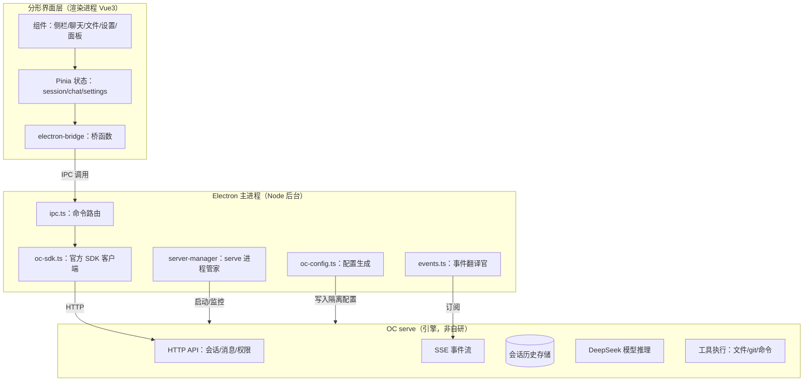
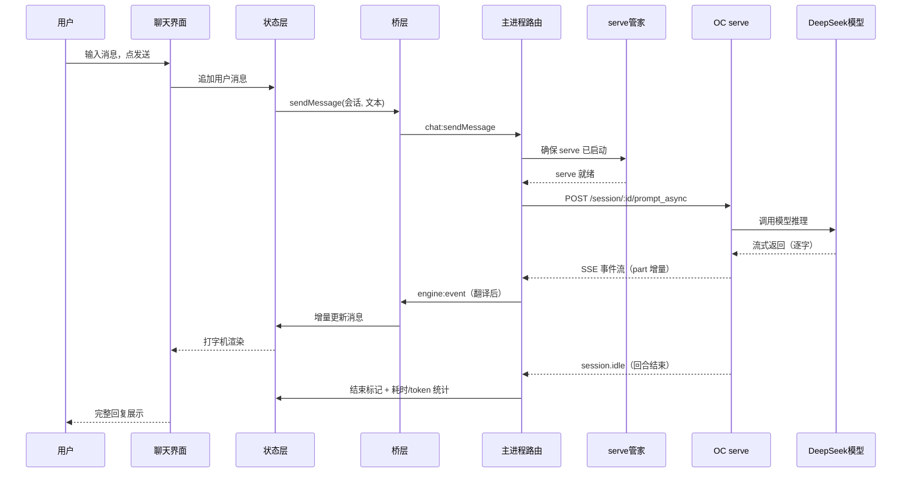
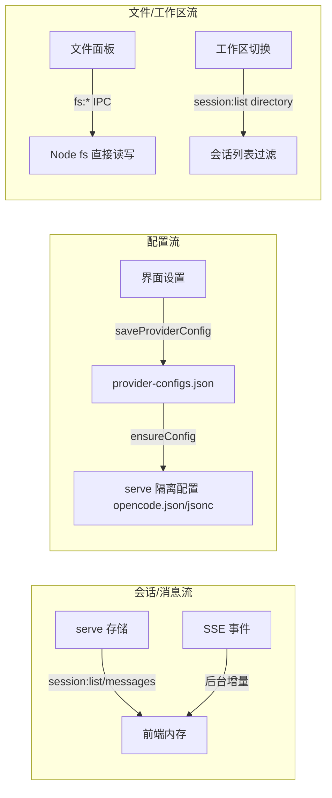
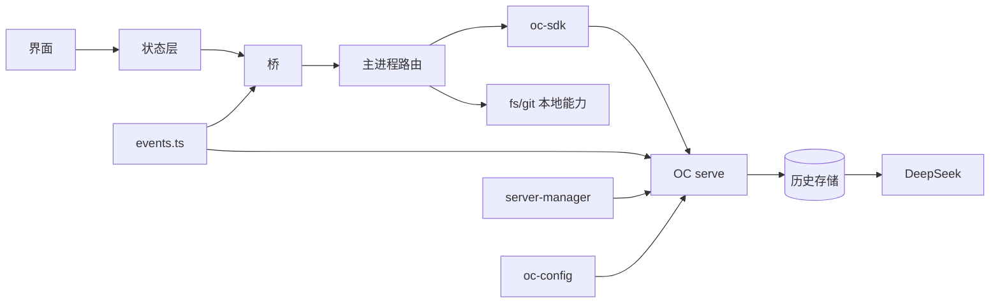

# 实现设计 00：总览——分形到底是什么

> 版本：2026-08-07 ｜ 阅读顺序：先读本文，再看 01 及后续模块文档
> 目标读者：非编程背景的产品负责人（用户本人）

## 一、一句话架构

**分形 = 车壳（Electron GUI）+ 发动机（OC serve）**——分形不自己做 AI 推理，它是 OpenCode 引擎的「驾驶舱」。

## 二、核心概念：OC serve 是什么

- **OC（OpenCode）** = 开源 AI 编程助手（命令行工具，类似 Claude Code）
- **serve 模式** = OC 的一种运行方式：不开界面、只开放 HTTP 接口（API），供其他程序调用
- **分形与 serve 的关系**：
  - 分形把内嵌的 OC 二进制以 serve 模式启动（`opencode serve`，带认证、独立配置目录）
  - 分形通过官方 SDK 调它的 API（建会话、发消息、查历史）
  - 分形订阅它的 SSE 事件流（AI 回复逐字到达 → 界面打字机效果）
- **我们没写的**：模型推理、工具执行、会话存储——全部由 OC 引擎完成
- **我们写的**：启动管理、API 封装、事件翻译、界面、配置管理

## 三、架构图（三层）

## 四、模块职责清单（谁干什么）

| 文件 | 角色 | 干什么 |
|------|------|--------|
| `electron/main/index.ts` | 入口 | 创建窗口、启动链路、单实例锁 |
| `electron/main/server-manager.ts` | serve 管家 | 启动/健康检查/崩溃重启 serve 进程 |
| `electron/main/oc-sdk.ts` | 翻译 | 官方 SDK 封装（会话/消息/权限/文件/配置 API） |
| `electron/main/ipc.ts` | 路由 | 接收界面指令 → 调 SDK 或本地能力（fs/git） |
| `electron/main/events.ts` | 翻译官 | serve 事件 → 界面事件（text/thinking/tool 分派） |
| `electron/main/oc-config.ts` | 配置员 | 生成 serve 的独立配置文件（API Key/模型/agent） |
| `electron/main/provider.ts` | 模型表 | DeepSeek 模型 ID 映射 |
| `src/renderer/src/stores/*` | 状态层 | 会话列表/消息/设置的内存状态 |
| `src/renderer/src/lib/electron-bridge.ts` | 桥 | 界面 ↔ 主进程的唯一通道（58 个函数） |
| `src/renderer/src/components/*` | 界面 | 侧栏/聊天/文件/设置/面板组件 |

## 五、一次对话的完整流程（业务时序）

## 六、三条数据流总图

## 七、依赖关系图（谁依赖谁）

## 八、模块文档索引

| 文档 | 内容 | 状态 |
|------|------|------|
| 01 会话历史管理 | 历史存哪、怎么加载、缓存机制 | ✅ 已定稿（G1-G5 已拍板） |
| 02 OC 消息处理与事件流 | events.ts 翻译规则 + 消息增量构建 | ⏳ 待写 |
| 03 数据库与持久化 | 无本地库决策 + 设置存储现状 | ⏳ 待写 |
| 04 缓存设计 | 内存缓存 + 配置双写 + 事件重连 | ⏳ 待写 |
| 05 前端功能规格 | 各组件职责 + 状态流转 | ⏳ 待写 |
| 06 配置体系 | oc-config 双写 + XDG 隔离 + 预置包 | ⏳ 待写 |
| 07 引擎进程管理 | server-manager 生命周期 + 认证 | ⏳ 待写 |
