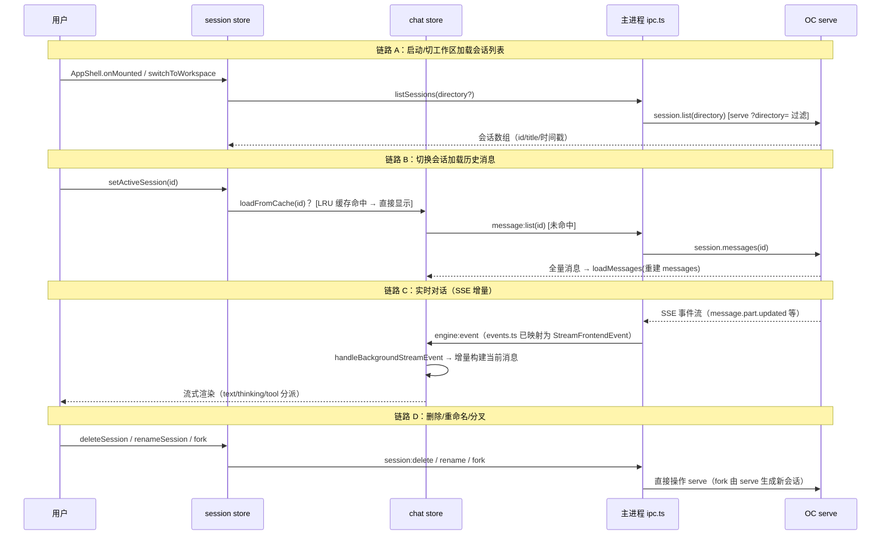

# 实现设计 01：会话历史管理

> 版本：2026-08-07 ｜ 状态：✅ 现状盘点完成，待用户审查
> 对应方案：3.1 会话 API / 4.1 会话管理 / 阶段 4-5
> 本文档记录**当前代码事实**（实现现状）+ 设计意图 + 缺口待决——不是目标设计，是「现在长什么样、为什么、哪里不对」

## 一、核心事实：本地没有数据库，历史全部存在 OC serve

**`electron/main/db.ts` 是桩**（`initDatabase` 抛「未实现」）——方案原规划的阶段 4 SQLite 从未实现，实现时改为「serve 为唯一数据源」，此决策变更**没有文档化**（这是你失控感的直接来源之一，先承认）。

当前存储拓扑：

```
┌─ 分形 GUI（无本地持久化）──────────────────────┐
│  session store（内存：会话列表）                │
│  chat store（内存：当前会话消息 + 20 条 LRU 缓存）│
└──────────────┬───────────────────────────────┘
               │ IPC（session:*/message:*）
┌──────────────▼───────────────────────────────┐
│  OC serve（唯一数据源）                        │
│  · 会话/消息/分叉历史 → serve 自己的数据存储     │
│  · 数据目录 = XDG_CONFIG_HOME 隔离的分形目录     │
│  · 即使 GUI 关闭，历史仍在 serve 侧            │
└──────────────────────────────────────────────┘
```

## 二、数据流（四条链路）



## 三、关键实现细节（代码事实）

### 1. 会话列表（`src/renderer/src/stores/session.ts`）
- `loadSessions(directory?)`：启动时（AppShell onMounted）与切换工作区时调用；directory 透传 serve 过滤（OC 会话绑定 projectID/directory）
- `createSession`：serve 创建失败时 **fallback 本地 ID**（`Date.now().toString(36)`）——serve 未启动也能「创建」会话（纯本地内存，消息发不出去）——**这是容错设计，但可能造成「假会话」困惑**
- `sessionActivity`：processing/unread/blocked 三态圆点（事件驱动）

### 2. 消息缓存（`src/renderer/src/stores/chat.ts`）
- `sessionCache: Map<sessionId, {messages, todos}>` + `MAX_CACHE_SIZE=20` LRU
- 切走时 `saveSessionCache`（防流式中的会话被覆盖丢失），切回 `loadFromCache` 优先
- **缓存是内存态：app 重启即失**，重启后一切从 serve 拉取

### 3. 历史消息还原（`electron/main/ipc.ts` → `toMessageData`）
- **只拼接 text parts**（`parts.filter(p => p.type === 'text').join('\n')`）
- **tool/thinking parts 被丢弃**——历史加载时看不到工具调用卡片和思考过程，只有实时流式时可见
- tokens 序列化为 JSON 字符串塞 `token_usage` 字段（兼容旧契约）

### 4. 无清理策略
- serve 数据无限增长（每次对话/每个分叉都持久化）——没有归档/清理/导出机制

## 四、设计意图（为什么这样）

1. **serve 唯一数据源**：避免 CC GUI 的经典痛点——本地 SQLite 与引擎存储不同步（双写一致性灾难）。GUI 当「无状态壳」，重启后 serve 侧历史天然完整
2. **会话跟随工作区**：利用 serve 原生 `?directory=` 过滤，零本地索引成本
3. **内存 LRU 缓存**：只解决「切换会话不丢流式状态」的瞬时问题，不做持久化

## 五、缺口与决策（2026-08-07 用户拍板）

| # | 缺口 | 决策 | 实施要点 |
|---|------|------|---------|
| G1 | 无本地缓存层 | **A. 保持 serve 唯一源**（不做 SQLite 镜像） | 排序 = 前端职责（serve 无 sort 参数，仅过滤；前端按 updated_at 倒序）；重命名 ✅ serve PATCH 实测通过；归档 = experimental API 雏形，不可依赖 |
| G2 | 历史还原丢 tool/thinking | **C. 完整还原** | `toMessageData` 补 parts 还原：text + tool（工具卡片静态渲染）+ thinking（折叠区）；加载历史与实时流式呈现一致 |
| G3 | 假会话 | **B+C 组合**：serve 未就绪禁止新建（按钮置灰 + 提示引擎未启动）；存量本地 fallback 会话灰显「离线」标记 | 新建入口检查 `serving` 状态；fallback 路径移除或标记 |
| G4 | 无清理策略 | **降级**：用户判定多虑（实测 oc-gui 目录 102MB 中会话数据仅几 MB 级，TOP5 为依赖/缓存） | 设置页「手动清理」可选做（低优先级，不做自动策略） |
| G5 | 20 条 LRU 缓存 | **保留现状 + 澄清语义**：后台会话持续接收（事件流全局广播 → handleBackgroundStreamEvent 增量写缓存）；切回优先缓存（含流式中间态）；serve 拉取兜底（首次/重启） | 若用户后续偏好「切回一律拉 serve」再改（牺牲中间态即时性） |

## 六、结论

设计基线 = **serve 唯一真相源 + 前端内存缓存（后台增量持续接收）**：
- 会话/消息持久化全部在 serve（隔离目录），GUI 无本地库（db.ts 桩保留为设置存储扩展点）
- 排序/展示层逻辑归前端
- 待实现：G2 完整还原、G3 新建拦截+离线标记、G1 前端排序
