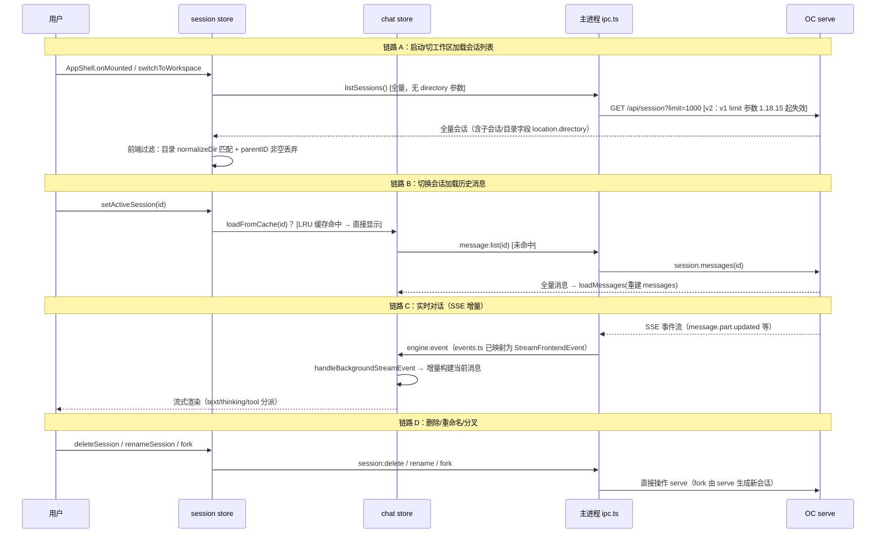

# 实现设计 01：会话历史管理

> 版本：2026-08-09（v1.1）｜ 状态：✅ 现状盘点 + 2026-08-08/09 实测修订
> 对应方案：3.1 会话 API / 4.1 会话管理 / 阶段 4-5
> 本文档记录**当前代码事实**（实现现状）+ 设计意图 + 缺口待决——不是目标设计，是「现在长什么样、为什么、哪里不对」

## 〇、v1.1 变更记录（2026-08-09）

| 变更 | 原因 |
|------|------|
| 链路 A 改为**全量拉取 + 前端过滤**（不再传 `?directory=`） | serve 1.18.15 实测：带 directory 实例化 doc-edit 会崩溃（exit 1 无 stderr）；且 v1 `/session` 的 limit/start 参数失效（恒返回 50 条）——全量改走 **v2 `/api/session?limit=1000`**（`{data, cursor}` 分页），前端 `normalizeDir` 过滤 |
| 会话列表**过滤子会话**（`parentID` 非空丢弃） | task 派生子会话（agent=工匠/军师/参谋…）混入列表（实测 62% 是子会话）——列表只显示主会话，数据保留可随时打开 |
| G1 排序**实测定稿** | 2026-08-08 探针：serve `/session` 按 `time.created` **倒序**返回（updated_at 字段存在但非排序键）——前端依赖 serve 顺序成立，无需自排 |
| G2/G3 **已实现**（提交 0e19aa8） | 消息完整还原（text+tool+thinking）+ 新建会话离线拦截（serve 未就绪置灰） |
| 历史消息**分页**（提交 6d0e874/869382d） | 首屏 limit=50（`FULL_HISTORY_LIMIT=500` 内存全量 + DOM 分页渲染）；滚动到顶内存切片续载（`before` 游标备用）——长会话切换不再卡数秒 |

## 一、核心事实：本地没有数据库，历史全部存在 OC serve

**`electron/main/db.ts` 是桩**（`initDatabase` 抛「未实现」）——方案原规划的阶段 4 SQLite 从未实现，实现时改为「serve 为唯一数据源」，此决策变更**没有文档化**（这是你失控感的直接来源之一，先承认）。

当前存储拓扑：

```
┌─ 分形 GUI（无本地持久化）──────────────────────┐
│  session store（内存：会话列表）                │
│  chat store（内存：当前会话消息 + 20 条 LRU 缓存）│
└──────────────┬───────────────────────────────┘
               │ IPC（session:*/message:*）
┌──────────────▼───────────────────────────────┐
│  OC serve（唯一数据源）                        │
│  · 会话/消息/分叉历史 → serve 自己的数据存储     │
│  · 数据目录 = XDG_CONFIG_HOME 隔离的分形目录     │
│  · 即使 GUI 关闭，历史仍在 serve 侧            │
└──────────────────────────────────────────────┘
```

## 二、数据流（四条链路）



## 三、关键实现细节（代码事实）

### 1. 会话列表（`src/renderer/src/stores/session.ts`）
- `loadSessions(directory?)`：启动时（AppShell onMounted）与切换工作区时调用；**全量拉取 + 前端过滤**——`normalizeDir`（去尾斜杠 + `\`→`/` + 小写）匹配目录，`parentID` 非空丢弃（子会话不显示）
- **底层列表接口**：oc-sdk `session.list` 走 **v2 裸 fetch** `GET /api/session?limit=1000`（Basic 认证 + `location.directory → directory` 字段映射）；`SESSION_LIST_LIMIT=1000` 常量（cursor 翻页留待）
- `createSession`：serve 创建失败时 **fallback 本地 ID**（`Date.now().toString(36)`）——serve 未启动也能「创建」会话（纯本地内存，消息发不出去）——G3 已实现新建拦截（serve 未就绪置灰），fallback 仅作极端兜底
- `sessionActivity`：processing/unread/blocked 三态圆点（事件驱动）
- 历史消息分页：`fullHistory`（≤500 内存全量）+ `loadedFromFull`（已渲染数）+ `timelineIndex`（全量锚点）；首屏尾部 50 条渲染，滚动到顶内存切片续载（`scrollToTimelineIndex` 上限 10 次循环）

### 2. 消息缓存（`src/renderer/src/stores/chat.ts`）
- `sessionCache: Map<sessionId, {messages, todos}>` + `MAX_CACHE_SIZE=20` LRU
- 切走时 `saveSessionCache`（防流式中的会话被覆盖丢失），切回 `loadFromCache` 优先
- **缓存是内存态：app 重启即失**，重启后一切从 serve 拉取

### 3. 历史消息还原（`electron/main/ipc.ts` → `toMessageData`）
- **G2 已实现**：text + tool（工具卡片静态渲染）+ thinking（折叠区）完整还原——历史加载与实时流式呈现一致（提交 0e19aa8）
- tokens 序列化为 JSON 字符串塞 `token_usage` 字段（兼容旧契约）

### 4. 无清理策略
- serve 数据无限增长（每次对话/每个分叉都持久化）——没有归档/清理/导出机制

## 四、设计意图（为什么这样）

1. **serve 唯一数据源**：避免 CC GUI 的经典痛点——本地 SQLite 与引擎存储不同步（双写一致性灾难）。GUI 当「无状态壳」，重启后 serve 侧历史天然完整
2. **会话跟随工作区**：serve 原生 `?directory=` 过滤曾在 1.18.15 触发实例化崩溃（doc-edit 项目配置）——改为**全量拉取 + 前端 normalizeDir 过滤**，零实例化风险；列表接口走 v2（v1 limit 失效）
3. **内存 LRU 缓存**：只解决「切换会话不丢流式状态」的瞬时问题，不做持久化

## 五、缺口与决策（2026-08-07 用户拍板）

| # | 缺口 | 决策 | 实施要点 |
|---|------|------|---------|
| G1 | 无本地缓存层 | **A. 保持 serve 唯一源**（不做 SQLite 镜像） | ✅ 已定稿：排序 = serve `time.created` 倒序（2026-08-08 探针实测，前端依赖 serve 顺序）；重命名 ✅ serve PATCH 实测通过；归档 = experimental API 雏形，不可依赖 |
| G2 | 历史还原丢 tool/thinking | **C. 完整还原** | ✅ 已实现（0e19aa8）：text + tool + thinking 完整还原 |
| G3 | 假会话 | **B+C 组合**：serve 未就绪禁止新建（按钮置灰 + 提示引擎未启动） | ✅ 已实现：新建入口检查 serving 状态 |
| G4 | 无清理策略 | **降级**：用户判定多虑（实测 oc-gui 目录 102MB 中会话数据仅几 MB 级，TOP5 为依赖/缓存） | 设置页「手动清理」可选做（低优先级，不做自动策略） |
| G5 | 20 条 LRU 缓存 | **保留现状 + 澄清语义**：后台会话持续接收（事件流全局广播 → handleBackgroundStreamEvent 增量写缓存）；切回优先缓存（含流式中间态）；serve 拉取兜底（首次/重启） | ✅ 补充：长会话分页（FULL_HISTORY_LIMIT=500 内存全量 + 首屏 50 条 DOM 渲染 + 滚动到顶内存续载）——切换不再全量渲染卡顿 |

## 六、结论

设计基线 = **serve 唯一真相源 + 前端内存缓存（后台增量持续接收）**：
- 会话/消息持久化全部在 serve（隔离目录），GUI 无本地库（db.ts 桩保留为设置存储扩展点）
- 列表 = v2 全量拉取 + 前端过滤（目录/子会话）；排序依赖 serve time.created 倒序
- 历史消息 = 内存全量（≤500）+ DOM 分页渲染 + 滚动续载
- ✅ 已闭环：G1 排序定稿 / G2 完整还原 / G3 新建拦截 / G5 分页；G4 低优先级
