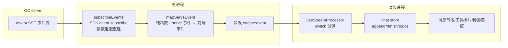
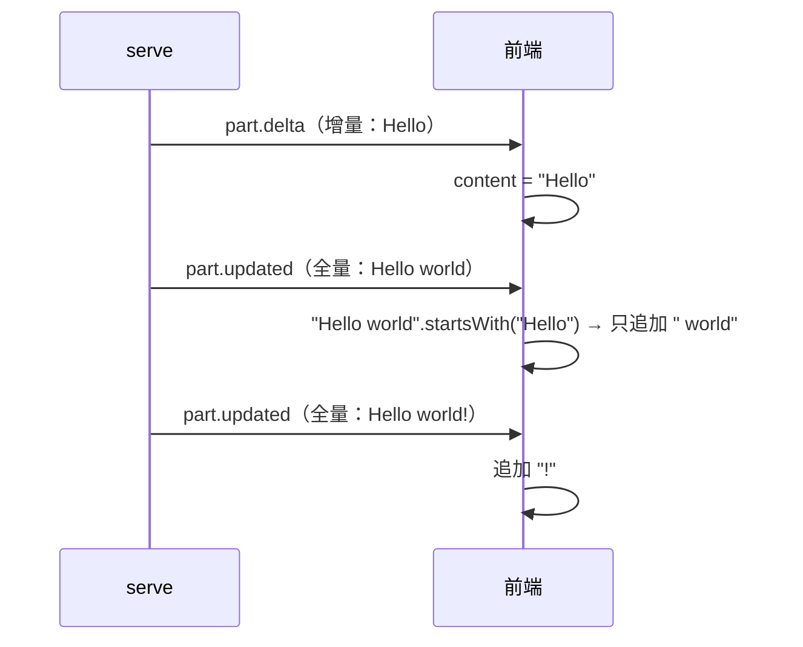
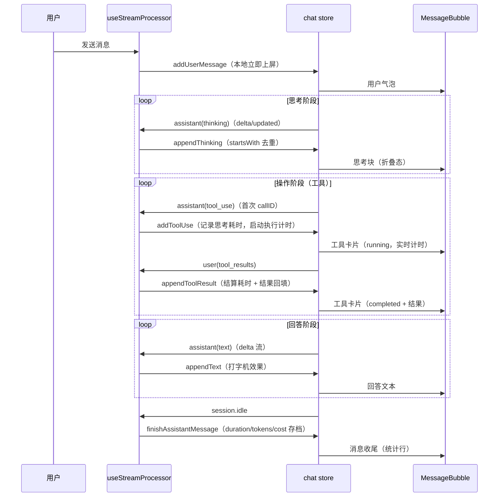

# 实现设计 02：OC 消息处理与事件流

> 版本：2026-08-07 ｜ 代码依据：`electron/main/events.ts`（433 行）+ `src/renderer/src/composables/useStreamProcessor.ts`（404 行）+ `src/renderer/src/stores/chat.ts`
> 前置阅读：00 总览（架构三层）、01 会话历史管理（缓存/加载策略）

## 一、事件流全景

**核心原则**：事件映射是**纯函数**（同输入同输出，可单测）；前端拿到的是翻译后的事件（`StreamFrontendEvent`），对 serve 原始结构零感知——serve 升级换事件名时只改 events.ts 一处。

## 二、事件映射表（serve 实测事件名 → 前端事件）

| serve 事件 | 前端事件 | 说明 |
|-----------|---------|------|
| `server.connected` | （无，onConnected 回调） | serve 就绪信号 |
| `session.created` | （内部） | 记录回合起始时间 + 初始 tokens |
| `session.updated` | （内部） | 记录最新 tokens（idle 时附到 result） |
| `session.status` | （无） | busy/idle 轮询，前端以 session.idle 为准 |
| `message.updated` | （内部） | 记录 messageID→role（part 分派依赖） |
| `message.part.updated`（text, assistant） | `assistant(text)` | delta 优先，无则全量 part.text |
| `message.part.updated`（text, user） | （无） | 用户回显，前端已本地 addUserMessage |
| `message.part.updated`（reasoning） | `assistant(thinking)` | 思考阶段（方案 4.6） |
| `message.part.updated`（tool） | `assistant(tool_use)` + `user(tool_results)` | 首次 callID 建卡片；completed/error 回填结果 |
| `message.part.delta` | `assistant(text/thinking)` | 打字机增量（事件无 type 字段，靠 partID 反查 partTypes） |
| `session.idle` | `result(is_final)` | 回合结束 + duration_ms + tokens |
| `session.error` | `error` | 模型不存在/认证失败等（提取 data.message） |
| `permission.asked` / `permission.updated` | `control_request(approval)` | 权限审批（实测事件名是 asked！） |
| `question.asked` | `control_request(question)` | 提问弹窗（复用审批队列） |
| `todo.updated` | `todo(todos[])` | 待办面板整体覆盖 |
| 其余（file/step/snapshot/patch/plugin 等） | （无） | 阶段 0 未实测前端消费 [待实测] |

## 三、消息构建机制（去重三原则）

serve 推送的事件**不是**整洁的「一条回复 = 一条事件」——同一段文本会以多种形态到达，去重是消息构建的核心：

### 1. 文本去重（startsWith 前缀匹配）

- delta（增量）优先消费；后续全量 updated 用 `startsWith(已有内容)` 判断是否重复，只追加新后缀
- 兼容三种 serve 行为：纯增量 / 累积更新 / 全量覆盖

### 2. 工具卡片去重（seenToolCallIDs）
serve 对工具状态流转发多条 `part.updated`（pending → running → completed），前端只在**首次见 callID** 时创建工具卡片；completed/error 时回填结果（不新建卡片）。

### 3. delta 流向判定（partTypes 反查）
`message.part.delta` 事件**没有 part 类型字段**（SDK 1.18.13 类型未生成）——靠先行的 `message.part.updated` 记录 partID→type，delta 到达时反查。先行的 updated 未到时 delta 直接跳过（等全量兜底）。

## 四、一次 AI 回复的消息构建时序（含工具调用）

**阶段识别**（方案 4.6 回答时间线，P7 依据）：thinking part = 思考阶段 → tool part = 操作阶段 → text part（delta 流）= 回答阶段；「回应 vs 答案」由事件序列天然区分（thinking 先、text 后）。

## 五、后台会话处理（切回不丢流）

事件属于**非活跃会话**时走 `handleBackgroundStreamEvent`：
- 写入 `sessionCache`（LRU 20 条）——与活跃会话相同的增量逻辑
- 更新侧栏 activity 指示器：control_request → `blocked`（橙点）／ result → `unread`／ assistant → `processing`
- 切回会话时 `loadFromCache` 恢复完整状态（含流式中间态）；serve 拉取仅作首次/重启兜底（G5 拍板：优先缓存）

## 六、重连与补偿

- SDK `event.subscribe` 内置**指数退避重连**（3s 起步 ×2 递增 30s 封顶），连接中断自动恢复
- 断线期间丢失的事件：切换会话/重启时 `session.messages` 全量拉取兜底（01 文档 G3）
- `session.error`（模型不存在等）→ 前端 error 通道 → 翻译为可读提示 + 消息收尾（不崩溃）

## 七、边界与已知缺口

| # | 缺口 | 影响 | 状态 |
|---|------|------|------|
| 1 | 非 text/reasoning/tool 的 part（file/step/snapshot/patch/agent/retry/compaction/subtask）不产出 | 这些 part 的信息不进 UI | 阶段 0 未实测 [待实测] |
| 2 | `message.part.delta` 的 field='input'（工具输入增量）不产出 | 工具卡片输入不流式 | 前端无消费点 |
| 3 | G2：历史消息加载只还原 text（tool/thinking 丢） | 切会话后工具卡片/思考块消失 | ✅ 已拍板待实现 |
| 4 | G3：serve 未就绪时历史消息无离线展示 | 离线灰显 | ✅ 已拍板待实现 |
| 5 | 权限弹窗的 `always` 免审批**持久化**未接 | 「总是允许」只在当前会话生效 | serve 的 always 是请求级建议，跨会话持久化 = 写配置 permission 规则（阶段 6） |

## 八、测试策略

- `mapServeEvent` 纯函数单测：合成事件（events.test.ts 28 用例）——结构变更立刻暴露
- fixture 回归：`electron/tests/fixtures/events-round3-success.json`（真实成功回合）+ `extras-events.json`（question/permission/todo 实测报文）——serve 升级时跑回归
- 前端：useStreamProcessor.test（去重/分派/后台缓存）+ chat.test（append 系列）
- 真实链路：probe-question.mjs（question 闭环）+ e2e engine-chat（完整对话）

## 九、serve 升级检查清单

1. `opencode serve` 版本变化 → 跑 fixture 回归（事件结构漂移立刻暴露）
2. 新事件类型 → 先查 `docs/知识/oc-engine/v1.18.x-serve-API能力清单.md` 确认结构再接入
3. SDK 升级 → 确认 `event.subscribe` / `types.gen.d.ts` 的事件联合类型变化（1.18.13 无 part.delta 类型，靠字符串 switch 兼容）
