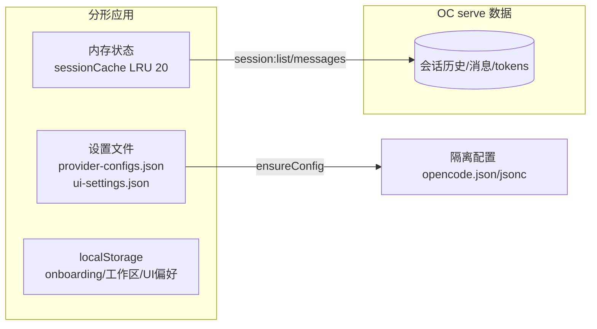
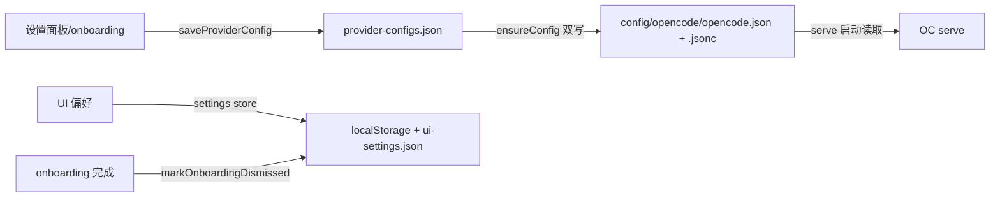

# 实现设计 03：数据库与持久化

> 版本：2026-08-07 ｜ 代码依据：`electron/main/db.ts`（桩）+ `src/renderer/src/stores/settings.ts` + 实测数据布局
> 前置阅读：00 总览、01 会话历史管理（serve 唯一数据源决策）

## 一、核心决策：没有本地数据库

**serve 是唯一数据源，分形无 SQLite**（方案原规划的 `db.ts` 是桩——`initDatabase` 抛「未实现」；决策变更已文档化，GUI 零本地持久化）。

**为什么可以不用本地库**：会话/消息/tokens 全在 serve 自己的存储里（API 原生读取）；GUI 只是「视图」——切换工作区 = 换 directory 过滤，换引擎版本 = 数据跟随。分形不复制引擎数据（避免双源不一致——01 文档 G1 拍板）。

## 二、数据文件布局（实测）

| 位置 | 内容 | 说明 |
|------|------|------|
| `%APPDATA%\oc-gui\provider-configs.json` | API Key / baseURL / 模型（DeepSeek 专属） | 设置面板写入；**无 BOM**（BOM 会导致 JSON.parse 失败） |
| `%APPDATA%\oc-gui\ui-settings.json` | UI 偏好（主题等） | settings store 读写 |
| `%APPDATA%\oc-gui\Local Storage\` | onboardingDismissed / recentWorkspaces / currentAgent | Electron 渲染 localStorage（leveldb） |
| `%APPDATA%\oc-gui\session-logs\` | 会话调试日志（saveSessionDebugLog） | 调试面板 |
| `%APPDATA%\oc-gui\config\opencode\` | **serve 隔离配置目录**（D17 XDG_CONFIG_HOME） | opencode.json + opencode.jsonc（双写）+ node_modules（插件预置区） |
| serve 数据目录（XDG_DATA_HOME 未显式注入） | 会话历史存储 | ⚠️ 未隔离——与系统 OC 共享数据目录，待阶段 8 评估注入 |

## 三、设置持久化链路（现状）

- **API Key 生效链路**：设置保存 → provider-configs.json → ensureConfig 写 serve 隔离配置 → **重启 serve 生效**（saveProviderConfig 联动 stopServer+ready；右上角刷新按钮也可手动重启）
- **双写原因**：serve 候选配置加载 `opencode.jsonc` 优先于 `opencode.json`（实测），只写一个会被 serve 忽略——必须两处同内容
- **「测试连接」**：engine:testConnection = 写配置 + 验证 serve 可达（key 有效性由下次请求隐式验证）

## 四、一致性保证

| 场景 | 机制 |
|------|------|
| 配置写入原子性 | JSON.stringify 一次写盘（无中间态）；BOM 剥离 |
| serve 配置漂移 | ensureConfig 幂等合并（只覆盖受管字段：provider.deepseek/model/agent，不碰用户手写字段） |
| 设置与 serve 不同步 | 保存即重启 serve（saveProviderConfig 联动） |
| 双实例并发 | 单实例锁拦截（index.ts requestSingleInstanceLock） |

## 五、已知缺口

| # | 缺口 | 影响 | 状态 |
|---|------|------|------|
| 1 | serve 数据目录（XDG_DATA_HOME）未隔离 | 会话历史与系统 OC 混存 | 待阶段 8 评估注入 |
| 2 | session-logs 无清理机制 | 调试日志累积 | 低优先级（G4 拍板：设置页手动清理） |
| 3 | 设置项写 localStorage 与 ui-settings.json 双通道 | 部分字段双写（currentAgent） | 现状可接受，阶段 6 统一 |

---

