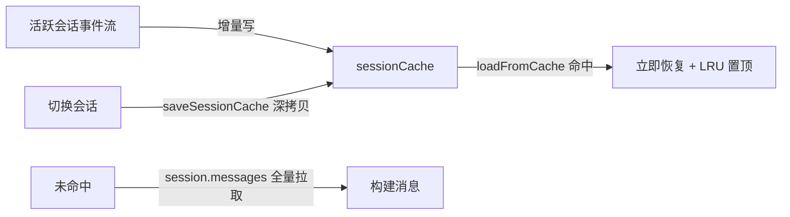

# 实现设计 04：缓存设计

> 版本：2026-08-07 ｜ 前置阅读：02 事件流（重连/补偿）、03 持久化

## 一、缓存总览

分形无磁盘缓存——「缓存」= **内存层**，目的是会话切换零延迟 + 流式中断不丢。

| 缓存 | 位置 | 容量 | 用途 |
|------|------|------|------|
| sessionCache | chat store（Map） | LRU 20 会话 | 切回会话立即恢复（含流式中间态） |
| 配置双写文件 | 磁盘（json+jsonc） | - | serve 配置一致性（见 03） |
| SSE 断线补偿 | serve 侧 session.messages | - | 断线后全量拉取兜底 |

## 二、sessionCache 机制

- **写**：切换会话前 `saveSessionCache`（深拷贝 messages + todos）；后台会话事件直接增量写缓存（handleBackgroundStreamEvent）
- **读**：`loadFromCache` 命中即恢复（含 isStreaming 中间态——流式消息切走再切回不丢）；未命中走 serve 拉取（G5 拍板：缓存优先，serve 兜底）
- **淘汰**：LRU——超 20 条删最旧（Map 插入序）
- **失效**：应用重启全失（内存层）；serve 侧数据为真源，重拉兜底

## 三、事件重连补偿

- SDK `event.subscribe` 指数退避（3s ×2 递增，30s 封顶）
- 断线期间丢失的事件 → 切换/重启时 session.messages 全量拉取（G3）
- `server.connected` 重连成功信号 → 前端刷新状态（serve 运行状态指示）

## 四、缓存与真实性的边界

| 场景 | 行为 |
|------|------|
| 后台会话完成（session.idle） | 缓存标记完成 + 侧栏 unread 角标；serve 已存档 |
| 切换回完成会话 | 缓存直接展示（与 serve 一致，无漂移——idle 已定格） |
| 删除/重命名/分叉 | 直接走 serve API（改真源），缓存同步失效重拉 |
| 应用重启 | 缓存清空，全量从 serve 拉取 |
