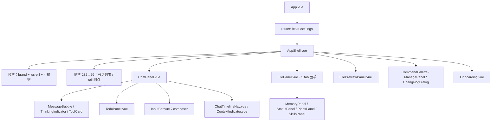

# 实现设计 05：前端功能规格

> 版本：2026-08-07 ｜ 代码依据：`src/renderer/src/`（components 40+ / stores 3 / composables 12 / lib 3 / locales 2）
> 前置阅读：00 总览、02 事件流（消息构建）、01 会话历史（缓存/加载）

## 一、组件树与职责

| 组件 | 职责 | 关键状态 |
|------|------|---------|
| AppShell | 布局骨架 + 工作区切换 + 引擎状态 | settings.cwd / drawerOpen / showManagePanel |
| SessionSidebar | 会话列表（搜索/切换/删除/重命名） | session.sessions / activeSessionId |
| ChatPanel | 消息渲染 + 审批/提问弹窗 + 发送 | chat.messages / pendingControlRequest |
| MessageBubble | 消息气泡（左右分行 + 统计行） | 单消息对象 |
| InputBar（composer） | 输入（agent/模型/权限/推理选择 + 附件 chips + 发送） | settings.currentAgent/model/permissionMode/effort |
| TodoPanel | 待办列表（serve 原生 todo 数据） | chat.todos |
| FilePanel | 文件树 + 5 tab（文件/记忆/状态/计划/技能） | 本地 fs IPC |
| Onboarding | 首次引导（API Key → 测试连接 → 完成） | settings.apiKey / onboardingDismissed |
| SettingsPanel | 设置（API Key/模型/权限 + 高级配置 JSONC 编辑器） | settings.* |

## 二、状态层（Pinia 三件套）

| store | 核心状态 | 数据源 |
|-------|---------|--------|
| session | sessions[] / activeSessionId / sessionActivity | serve（session:list ?directory=） |
| chat | messages[] / todos[] / sessionCache（LRU 20）/ pendingControlRequest | serve（message:list + SSE 增量） |
| settings | apiKey / model / permissionMode / theme / currentAgent / recentWorkspaces / uiSettings | SQLite（settings 表）+ localStorage 镜像 + provider-configs.json（key） |

**会话切换流程**：saveSessionCache（深拷贝当前消息+todos 入 LRU）→ 切 activeId → loadFromCache 恢复（含流式中间态）→ 缓存缺失时 serve 拉取（G5 拍板）

## 三、桥层（electron-bridge：58 函数）

| 分类 | 数量 | 说明 |
|------|------|------|
| A 本地能力（fs/git/settings/logs/dialog） | 27 | IPC 主进程 Node 实现 |
| B 引擎通道（会话/消息/权限/提问/配置） | 22 | serve API（阶段 4-5 真实接入） |
| C CC 专属桩（已废弃，保留签名） | 9 | 分形全新 OC 项目不再使用 |

**调用链**：组件 → bridge 函数 → preload（白名单校验 30 通道）→ ipcMain.handle → oc-sdk / fs / git

## 四、页面路由与引导

- `/chat`：主界面（侧栏 + 聊天 + 面板）
- `/settings`：设置页
- **Onboarding 触发条件**：`!initializing && !apiKey && !onboardingDismissed`——无 key 首屏引导（2 步：输入 → 测试连接 → 完成/跳过）；设置页可重新触发
- 主题：dark（#0e1116 系）/ light（#f7f8fa 系）——CSS 变量驱动（main.css），顶栏按钮切换

## 五、关键交互规格

| 交互 | 行为 |
|------|------|
| 发送消息 | composer 发送 → sendMessage(agent=双星/选中) → 本地 addUserMessage 立即上屏 → SSE 流式 |
| 停止生成 | 发送按钮变红色方块 → chat:stopSession（abort 500 容错：事件流 session.idle 兜底） |
| 权限审批（approval） | 弹窗三选：允许一次（once）/ 总是允许（always，有建议时）/ 拒绝 |
| 提问（question） | 弹窗：单选/多选/自由输入 → answers 数组提交 / 跳过 |
| 分叉会话 | 会话菜单「分叉」→ session:fork → 新会话标题自动「 (fork #1)」 |
| 切换工作区 | ws-pill 下拉（最近列表 + 打开文件夹）→ cwd 更新 + 会话列表按目录过滤 |
| 刷新引擎 | 顶栏刷新按钮 → engine:refresh（重启 serve）+ 重载会话列表 |
| 附件 | composer 📎 → openDialog 文件 → chips → sendMessage parts（阶段 0 P6 待补测 FilePart） |

## 六、样式体系（原型 v0.23 对齐）

- 设计令牌：`--bg`/`--bg-soft`/`--bg-card`/`--bg-elevated`/`--bg-hover`/`--bg-active`/`--border-*`/`--text-*`/`--accent`（暗 #34d399 / 亮 #0ea5e9）/`--accent-soft`/`--accent-line`/`--accent-glow`/`--radius-*`/`--shadow-*`
- 布局常量：顶栏 52px / 侧栏 232↔56 / 聊天 760px / 面板 320px（可拖拽）
- 组件样式：composer 卡片（focus-within 光环）、消息左右分行（row-reverse）、rail 圆点（34px tip）、panel-tabs（accent 下划线）、onboarding 卡片

## 七、测试覆盖（447 passed / 1 skip）

| 层 | 文件 | 用例数 |
|----|------|--------|
| 主进程协议 | events/oc-sdk/oc-config/preset/server-manager/ipc | ~90 |
| 渲染 store | chat/session/settings | ~50 |
| 组件 | MessageBubble/InputBar/ChatPanel/TodoPanel/Onboarding/FilePanel/面板 等 | ~100 |
| e2e | smoke/onboarding/engine-chat | 3（真实引擎） |

## 八、已知缺口（标注后续）

- G2：历史消息完整还原（tool/thinking part）——待实现
- G3：serve 未就绪离线灰显——待实现
- P6：附件 FilePart 真实链路——待补测
- 增强面板（记忆/状态/计划/技能）数据源——阶段 6 已接配置，其余 P1-P3 实时监听待接
- CC 专属组件（C 类桩 + 未挂载页面）——保留未删（用户指示）
