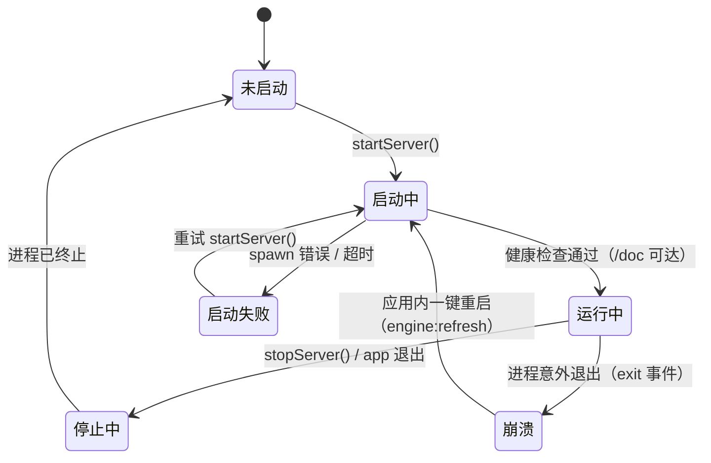

# 实现设计 07：引擎进程管理（server-manager）

> 版本：2026-08-07 ｜ 代码依据：`electron/main/server-manager.ts`（341 行）+ `electron/main/index.ts` + 阶段 0 实测
> 前置阅读：00 总览、02 事件流

## 一、职责一句话

**serve 进程的管家**：启动（含 sidecar 三态路径）、健康检查、崩溃重启、停止；向 IPC 层提供「就绪客户端」（`ready()` 缓存单例）。

## 二、进程生命周期



**关键机制**：
- `ready()`：返回「已就绪的 serve 客户端」Promise——首次调用触发启动，后续并发调用共享同一 `startPromise`（防并发启动）；stopServer 后缓存置空（防拿到死进程）
- `startServer()`：幂等（运行中直接返回）；spawn 前注入环境（XDG 隔离 + 认证）
- 健康检查：轮询 `GET /doc`（带 Basic 认证），约 2.7s 就绪（阶段 0 实测）
- 状态广播：`onStatusChange(running)` → `engine:status` → 前端（侧栏角标/设置页状态）

## 三、启动参数与环境注入

| 项 | 值 | 依据 |
|----|-----|------|
| 命令 | `opencode serve --port <随机> --hostname 127.0.0.1` | 随机端口防冲突 |
| `XDG_CONFIG_HOME` | `<userData>/config` | **D17 配置隔离**（阶段 0 实测定案）——serve 全局配置/插件/技能/agent 全在分形自己的目录，零污染系统 OC |
| `OPENCODE_SERVER_USERNAME/PASSWORD` | 随机生成 | serve v1.15+ 默认 Basic 认证（C-10 实测） |
| `--auto` 等权限模式参数 | 未注入（权限翻译走配置 permission 规则，P4 已拍板） | — |

## 四、二进制解析（sidecar 三态路径）

```mermaid
graph TD
  A[resolveOpencodeBin] --> B{打包环境?}
  B -->|是| C[process.resourcesPath/bin/opencode.exe<br/>extraResources 内置]
  B -->|否| D{开发/测试}
  D -->|是| E[项目根 resources/bin/opencode.exe<br/>download-opencode.js 下载]
  D -->|否（单测）| F[process.cwd() 兜底]
  C --> G{spawn 失败?}
  E --> G
  F --> G
  G -->|是| H[sidecarBroken=true<br/>系统 PATH opencode 兜底]
  G -->|否| I[使用内置]
```

- 下载脚本 `scripts/download-opencode.js`：GitHub Releases（v1.18.14 锁定）+ 镜像 fallback（gh-proxy/ghfast）+ SHA256 校验 + `serve --help` 验证
- `sidecarBroken` 标记：内置 spawn 失败后本会话不再尝试内置（防重复失败拖慢启动）

## 五、认证与客户端

- 认证凭据：env 注入 serve + SDK 客户端 `headers: { Authorization: Basic btoa(user:pass) }`（**C-11 实测：@hey-api 配置键是 `headers` 不是 `defaultHeaders`**）
- SDK 客户端单例：`getClient()` 返回 `createOpencodeClient`（baseURL 指向 serve 端口）；**ESM-only 包**——electron-vite `externalizeDepsPlugin({ exclude: ['@opencode-ai/sdk'] })` bundle 进主进程（CJS require 失败的坑）

## 六、异常与恢复

| 场景 | 行为 |
|------|------|
| 进程意外退出 | `exit` 监听 → 前端 `engine:status(running=false)` → 状态角标变化；不自动重启（防崩溃循环），用户点刷新按钮（engine:refresh）或重启 app |
| 启动超时 | 健康检查超时 → 启动失败 → 下次调用重试 |
| 端口占用 | 随机端口（几乎不可能）；若冲突 spawn 失败 → sidecarBroken/错误提示 |
| 配置变更（API Key） | saveProviderConfig 联动：仅 `running` 时 stopServer+startServer（首次启动不打断——修复了「前端自动保存设置杀掉健康检查中的 serve」竞态） |
| 双实例 | **单实例锁**（requestSingleInstanceLock）：第二个实例退出并聚焦已有窗口（SQLite 并发锁根治） |
| e2e 场景 | `OC_GUI_E2E=1` 豁免锁 + 独立 userData（临时目录 + 继承正式 API Key 配置） |

## 七、测试策略

- server-manager.test.ts：startServer→running / ready 单例复用 / stopServer 幂等 / 状态回调
- ipc.test.ts：引擎通道缺 manager 时抛「引擎未初始化」
- engine.integration.test.ts（skip 标记）：真实 serve 集成场景（手动/CI 启用）
- e2e engine-chat.spec.ts：真实引擎对话（35s 级，全链路含预置 agent）
- 升级检查：serve 版本变化 → 跑 e2e + 检查 `/doc` spec 变更（能力清单对照）

## 八、边界

- **serve 不是我们维护的**：崩溃/行为异常以「重启 + 上报」为主，不深挖引擎内部（除非升级验证）
- 日志：serve stdout/stderr 不落盘（GUI 场景），排查用 `OC_GUI_DEBUG_LOG` 文件日志（调试期机制，已移除）
