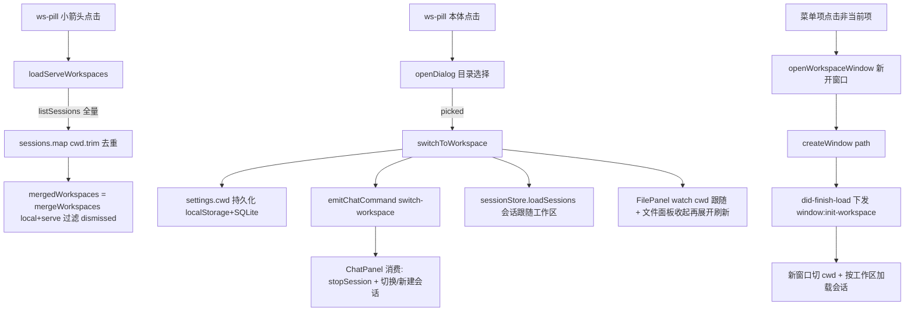

# 工作区管理 — 功能设计方案

> 版本：v1.0
> 日期：2026-08-08
> 作者：技术研发
> 状态：待评审

---

## 一、需求背景

### 1.1 现状与问题

分形（oc-gui）从 cc-gui 迁移 UI 设计资产，但**引擎从 CC 换成了 OC（OpenCode serve）**，工作区语义随之变化：

1. **CC 时代无工作区概念**：cc-gui 的头部工作区胶囊（ws-pill）仅展示当前 cwd 并支持目录选择，没有「最近工作区列表」「工作区管理」能力。
2. **OC 会话绑定 directory**：OC 的 Session 数据结构带 `directory` 字段（`toSessionData` 映射为前端 `cwd`），serve 原生支持 `POST /session`（query.directory 绑定工作区）与 `GET /session?directory=`（按工作区过滤）。**会话天然跟随工作区**——这要求 GUI 侧有「工作区」概念：切换工作区 = 切换会话集合 + 切换文件面板根目录 + 后续新会话绑定该目录。
3. **OC 无工作区列表 API**：serve 没有「列出所有工作区」的端点，最近工作区只能由 GUI 自己维护（本地 recentWorkspaces）+ 从会话目录反推（serveDirs 聚合）。
4. **多窗口诉求**：用户希望同时打开多个项目——「点最近工作区的非当前项 = 新开窗口」，这要求主进程支持多窗口 + 新窗口工作区下发链路。

### 1.2 用户故事

| 场景 | 用户角色 | 需求描述 |
|------|----------|----------|
| 切换项目 | 普通用户 | 想换一个项目干活时，能在头部工作区胶囊快速选目录，文件面板与会话列表自动跟随 |
| 回到最近项目 | 普通用户 | 之前用过的工作区能记住（最多 10 个），一键回到上次的目录 |
| 多项目并行 | 普通用户/开发者 | 点最近工作区里的非当前项目时，新开一个窗口干活，两个项目互不干扰 |
| 清理工作区列表 | 普通用户 | 不想要某个工作区出现在列表里，能手动移除且「移除即消失」；误删后重新使用会自动恢复 |
| 找回丢失的列表 | 开发者 | userData 迁移/清缓存后本地 recent 丢失，仍能从 serve 会话目录恢复工作区列表 |

### 1.3 范围

| 角色 | 可操作范围 | 本次是否覆盖 |
|------|-----------|-------------|
| 普通用户 | ws-pill 本体点击选目录；小箭头打开最近工作区菜单；菜单项新开窗口/打开位置/移除 | ✅ |
| 普通用户 | 移除工作区 = 排除集合（非物理删除），重新使用自动恢复 | ✅ |
| 开发者 | 本地 recent 与 serve 会话目录聚合去重；dismissed 排除集合过滤 | ✅ |
| 任意角色 | 工作区的物理增删（新建/删除磁盘目录） | ❌（仅目录选择，不做目录管理） |
| 任意角色 | 同一窗口内直接切换工作区（非当前项点击） | ❌（交互模式已改为新开窗口） |

---

## 二、架构设计

### 2.1 整体数据流



### 2.2 关键设计决策

| 决策点 | 选择 | 理由 |
|--------|------|------|
| D1 工作区列表来源 | **本地 recentWorkspaces 优先 + serve 会话目录补充去重**（`mergeWorkspaces(local, serve)`：local 原序 → serve 补缺） | OC 无「列出工作区」API；serve 会话带 directory（前端契约字段 cwd），userData 迁移/清缓存后本地历史丢失仍可从引擎恢复列表 |
| D2 会话跟随工作区 | `session.create` 的 cwd **透传 serve `query.directory`**（目录在 query 不在 body——SDK 实测结构）+ `session:list` 传 directory 走 serve 原生 `?directory=` 过滤 | OC Session 绑定 project/directory；切换工作区后会话列表只显示该工作区的会话，UI 语义与引擎一致 |
| D3 移除工作区语义 | **dismissedWorkspaces 排除集合**（localStorage `sb-dismissed-workspaces` 持久化），非物理删除 | serve 里有会话的工作区删除本地 recent 后仍会被聚合显示——用户期望「移除即消失」，用排除集合过滤；重新打开/使用该目录时 `unDismissWorkspace` 清除标记恢复显示，天然满足「可恢复」 |
| D4 切换动作链路 | `settings.cwd = path`（localStorage `sb-current-workspace` + SQLite `ui-settings.json` 双写）→ `emitChatCommand('switch-workspace:'+path)` → `filePanelForceClose++` 收起文件面板 → `sessionStore.loadSessions(path)` | cwd 是全局唯一事实源；ChatPanel 收命令后停旧会话进程、复用空会话/新建绑定新 cwd 的会话；文件面板收起再展开（collapsed watch）触发目录刷新 |
| D5 当前工作区点击反馈 | `path === cwd` 时提示「已在该工作区」，不触发任何切换 | 防「点了没反应」——菜单里当前项高亮 + 提示条可见反馈（`alertText` 3s 自动消失） |
| D6 对话框默认路径 | `openDialog({ directory: true, defaultPath: cwd.value || undefined })` | Windows 默认弹「下载」目录不符合直觉；跟随当前工作区让用户少跳转 |
| D7 单实例锁 | `app.requestSingleInstanceLock()`，未获锁直接 quit；`second-instance` 聚焦已有窗口（恢复/聚焦）；e2e 用 `OC_GUI_E2E=1` 豁免 | SQLite 用户数据（settings/session 缓存）不支持双实例并发写；e2e 测试需独立进程 |
| D8 非当前项交互模式 | 点最近工作区非当前项 = **新开窗口并切到目标工作区**（`window:openWorkspace` → `createWindow(path)` → `did-finish-load` 后下发 `window:init-workspace`），不在当前窗口内切换 | 用户需求变更：多项目并行互不干扰；新窗口标题「分形 — 目录名」便于识别 |
| D9 新窗口下发机制 | 主进程 `webContents.send('window:init-workspace', path)`（比 URL query 可靠，无编码问题）+ 渲染层 `onInitWorkspace` 注册 | did-finish-load 可能早于 AppShell onMounted 的监听注册——主进程 300ms 延时下发兜底；`settings.windowInitCwd` 竞态标记防止 SQLite 异步恢复覆盖下发值 |
| D10 serve 未就绪降级 | `loadServeWorkspaces` catch 静默，菜单降级为纯本地 recent，不崩溃 | serve 未启动时打开菜单不应阻塞 UI |
| D11 会话加载竞态 | `sessionStore.loadSessions` 内部 `loadSeq` 递增，只有最后一次调用的结果能写入 | 新窗口 onMounted 与 onInitWorkspace 并发各发一次 loadSessions，先发后返回会覆盖新工作区列表 |
| D12 最近工作区上限 | `MAX_RECENT_WORKSPACES = 10`，头插去重，超限 pop | 菜单不至于无限长；保持近期优先 |

---

## 三、后端设计

> 说明：`mergeWorkspaces` 实际位于渲染进程 `src/renderer/src/lib/workspace-merge.ts`（纯函数，无主进程依赖）；「后端」侧改动为主进程 ipc/sdk/窗口管理。

### 3.1 工作区合并纯函数

**文件：** `src/renderer/src/lib/workspace-merge.ts`

```typescript
/**
 * 合并本地 recent 与 serve 会话目录，返回去重保序的工作区列表。
 * 顺序：local 原序 → serve 中不在 local 的按出现序（local 优先，serve 补充）。
 * 空串防御性过滤：local 侧来自 localStorage 可能脏，serve 侧提取时也可能混入空值。
 */
export function mergeWorkspaces(local: string[], serve: string[]): string[] {
  const seen = new Set<string>();
  const result: string[] = [];
  for (const p of local) {
    if (p && !seen.has(p)) { seen.add(p); result.push(p); }
  }
  for (const p of serve) {
    if (p && !seen.has(p)) { seen.add(p); result.push(p); }
  }
  return result;
}
```

- 纯函数、无副作用：local 原序优先（最近使用顺序），serve 仅补缺
- 空串过滤：local 脏数据（localStorage 手工改）/serve 未绑定工作区（`cwd: ''`）

### 3.2 ipc cwd 链路（会话跟随工作区）

**文件：** `electron/main/ipc.ts`

```typescript
// L726：session:create 接收 cwd → 透传 serve query.directory（新会话绑定当前工作区）
ipcMain.handle('session:create', async (_e, args: { title?: string; cwd?: string }) => {
  const s = await (await requireClient()).session.create({
    title: typeof args?.title === 'string' ? args.title : undefined,
    cwd: typeof args?.cwd === 'string' && args.cwd ? args.cwd : undefined,
  })
  return toSessionData(s)
})

// L735：session:list 接收 directory → 透传 serve 过滤（仅该工作区的会话）
ipcMain.handle('session:list', async (_e, args: { directory?: string } = {}) => {
  const list = await (await requireClient()).session.list(args.directory)
  return list.map(toSessionData)
})
```

**文件：** `electron/main/oc-sdk.ts`（createOcClient 内 session 适配）

```typescript
// L235：目录走 query.directory（SDK 实测结构：body 只有 parentID/title）——绑定工作区后会话在 ?directory= 过滤下可见
create: async (opts) => normalizeError<Session>(
  await client.session.create({ query: opts?.cwd ? { directory: opts.cwd } : undefined, body: { title: opts?.title, parentID: opts?.parentID } }),
),
// L239：serve 原生支持 GET /session?directory= 按工作区过滤（spec 实测）；未传目录返回全部
list: async (directory?: string) =>
  normalizeError<Session[]>(await client.session.list({ query: directory ? { directory } : undefined })),
```

**文件：** `electron/main/ipc.ts` L909 `toSessionData`

```typescript
// OC Session.directory → 前端 SessionData.cwd（serveDirs 聚合的数据来源）
cwd: s.directory,
```

> 注意：`requireClient` 先 `await serverManager.ready()`——前端请求早于 serve 健康检查完成会 ECONNREFUSED，统一共享 ready 启动 promise。

### 3.3 单实例锁与多窗口下发

**文件：** `electron/main/index.ts`

```typescript
// L17：单实例锁——SQLite 用户数据不支持双实例并发，第二个实例直接退出
const gotSingleInstanceLock = isE2E || app.requestSingleInstanceLock()
// L48：second-instance 聚焦已有窗口（恢复最小化 + focus）
app.on('second-instance', () => {
  const win = BrowserWindow.getAllWindows()[0]
  if (win) { if (win.isMinimized()) win.restore(); win.focus() }
})
```

**文件：** `electron/main/index.ts` L62 `createWindow(workspace?)` + L146 `window:openWorkspace`

```typescript
// 新窗口指定工作区：窗口标题「分形 — 目录名」；did-finish-load 后延时下发 init-workspace
const windowTitle = workspace ? `分形 — ${basename(workspace)}` : '分形'
if (workspace) {
  mainWindow.on('page-title-updated', (e) => e.preventDefault()) // 阻止页面 <title> 覆盖自定义标题
  mainWindow.webContents.once('did-finish-load', () => {
    mainWindow.setTitle(windowTitle)
    setTimeout(() => {
      mainWindow.webContents.send('window:init-workspace', workspace) // 300ms 冗余确保新窗口必收到
    }, 300)
  })
}

// L146：渲染层点最近工作区非当前项 → 新开窗口
ipcMain.handle('window:openWorkspace', (_e, args: { path?: unknown }) => {
  if (typeof args?.path !== 'string' || args.path.length === 0) return // 脏参数忽略
  createWindow(args.path)
})
```

### 3.4 文件对话框（目录选择）

**文件：** `electron/main/ipc.ts` L499 `dialog:openDialog`

- `directory: true` → properties 加 `openDirectory`（与 openFile 互斥，directory 优先）
- `defaultPath` 透传（当前 cwd，决策 D6）
- 父窗口前置保障：`getFocusedWindow() ?? getAllWindows()[0]`，最小化则 restore + show + focus（防对话框弹到不可见位置）；无聚焦窗口走无父窗口重载避免 `win!` 崩溃
- 取消/未选返回 `null`；多选模式返回数组，单选返回字符串

### 3.5 数据库变更

**无表结构变更**。仅 `ui-settings.json`（SQLite 存储）扩展两个字段：

| 字段 | 说明 | 写入时机 |
|------|------|----------|
| `cwd` | 当前工作区 | 切换工作区后 500ms 防抖写 |
| `recentWorkspaces` | 最近工作区列表（JSON 数组） | 增删后 500ms 防抖写 |

（`sb-dismissed-workspaces` 仅 localStorage，不入 SQLite——排除集合是渲染层 UI 状态。）

---

## 四、前端设计

### 4.1 ws-pill 交互结构

**文件：** `src/renderer/src/components/layout/AppShell.vue`（模板 L457-491 + 脚本 L160-274）

```
┌──────────────────────────────────────────────────────────────────┐
│ header-logo-group（brand + ws-wrap）                              │
│   brand: [logo] 分形                                              │
│   ws-wrap（position:relative）                                    │
│     ws-pill-wrap（胶囊组合，圆角底，一体外观）                      │
│       ws-pill（本体按钮）: [📁图标] C:\path\to\project │ ← 本体点击=选目录│
│       ws-pill-arrow（独立小箭头按钮）: ▾           │ ← 点击=菜单│
│     ws-menu（下拉，v-if=showWsMenu）                               │
│       ws-menu-head: 最近工作区                                    │
│       [ws-menu-item] H:\local\proj-a     [📂] [×]   ← 当前项高亮 │
│       [ws-menu-item] H:\serve\proj-b     [📂] [×]                │
│       （无列表时）ws-menu-empty: 暂无最近工作区                     │
└──────────────────────────────────────────────────────────────────┘
```

| 元素 | 点击行为 | 备注 |
|------|----------|------|
| ws-pill 本体 | `onWsPickDirectory` → `openDialog({directory:true, defaultPath:cwd})` → picked 后 `switchToWorkspace(path)` | 直接弹目录选择器，不经过菜单 |
| ws-pill-arrow 小箭头 | `onWsPillClick` → toggle `showWsMenu`；打开时 `await loadServeWorkspaces()` | 菜单是主入口（最近工作区列表） |
| 菜单项路径 | `onWsPickRecent(p)`：p===cwd → 提示「已在该工作区」；否则 unDismiss + `openWorkspaceWindow(p)` | 非当前项 = 新开窗口（D8） |
| 菜单项 📂 | `onWsReveal(p)` → `revealInExplorer(p)` | `@click.stop` 防冒泡触发新开窗口 |
| 菜单项 × | `onWsRemoveRecent(p)` → `removeRecentWorkspace` + dismissed push + persist | `@click.stop` 防冒泡 |
| 菜单外点击 | `onBodyClickForWs`（document click 监听） | `closest('.ws-pill-wrap, .ws-menu')` 内不收起 |

**脚本要点：**

```typescript
// L163：核心切换动作（选目录路径）
function switchToWorkspace(path: string) {
  settings.cwd = path;
  settings.addRecentWorkspace(path);
  unDismissWorkspace(path); // 用户明确使用 → 恢复显示
  emitChatCommand(`switch-workspace:${path}`);
  filePanelForceClose.value++;  // 切工作区时收起文件面板
  panelFile.value = null;       // 关闭编辑器面板
  sessionStore.loadSessions(path); // 会话跟随工作区
}

// L199：serve 会话目录聚合（从全量会话提取 cwd，Set 去重、trim 过滤空）
async function loadServeWorkspaces() {
  try {
    const sessions = await listSessions();
    serveDirs.value = [...new Set(sessions.map((s) => s.cwd.trim()).filter(Boolean))];
  } catch { /* serve 未就绪 → 保持现有 serveDirs，菜单降级为纯本地 recent */ }
}

// L210：合并 + 排除集合过滤
const mergedWorkspaces = computed(() =>
  mergeWorkspaces(settings.recentWorkspaces, serveDirs.value)
    .filter((p) => !dismissedWorkspaces.value.includes(p))
);
```

**排除集合（dismissed）实现（L182-196）：**

```typescript
const dismissedWorkspaces = ref<string[]>([]);
// localStorage 初始化（sb-dismissed-workspaces，JSON 解析失败置空）
function persistDismissed() { localStorage.setItem("sb-dismissed-workspaces", JSON.stringify(dismissedWorkspaces.value)) }
function unDismissWorkspace(path: string) {
  const next = dismissedWorkspaces.value.filter((p) => p !== path);
  if (next.length !== dismissedWorkspaces.value.length) { dismissedWorkspaces.value = next; persistDismissed(); }
}
```

**新窗口初始化链路（L387-397，多窗口支持）：**

```typescript
stopInitWorkspace = onInitWorkspace((path) => {
  settings.windowInitCwd = path;   // 竞态标记：SQLite 异步 cwd 恢复以下发值为准
  settings.cwd = path;
  unDismissWorkspace(path);        // 新窗口明确切到该工作区 → 恢复显示
  sessionStore.loadSessions(path);
});
```

### 4.2 ChatPanel 消费 switch-workspace

**文件：** `src/renderer/src/components/chat/ChatPanel.vue`（L400-419）

```typescript
} else if (action.startsWith("switch-workspace:")) {
  const newPath = action.slice("switch-workspace:".length);
  // 先停止当前会话的引擎进程（避免旧 cwd 的进程继续 emit 事件到新会话）
  const sid = session.activeSessionId;
  if (sid) { try { await stopSession(sid); } catch { /* 无进程 */ } }
  chat.clearMessages();
  // 最新会话若是空会话则复用，避免堆积"新会话"
  const latestEmpty = ...;
  if (latestEmpty) { session.setActiveSession(latestEmpty.id); ... }
  else { await session.createSession(settings.model, newPath, undefined, settings.locale); ... }
}
```

### 4.3 FilePanel 跟随工作区

**文件：** `src/renderer/src/components/files/FilePanel.vue`（L108-128）

```typescript
// navPath 变更 → 同步文件面板（覆盖刷新后 settings 从 SQLite 恢复的场景）
watch(() => props.navPath, async (path) => {
  if (!path || path === rootPath.value) return;
  rootPath.value = path;
  clearPreview();
  try { files.value = await listDir(path); } catch {}
});
// forceClose 递增 → 面板收起（切工作区时）
watch(() => props.forceClose, () => { collapsed.value = true; });
// 工作区切换 → 文件面板目录跟随（rootPath 随 cwd 更新；面板收起时展开自动刷新——collapsed watch 兜底）
watch(() => settings.cwd, async (path) => {
  if (!path || path === rootPath.value) return;
  rootPath.value = path;
  clearPreview();
  if (!collapsed.value) {
    try { files.value = await listDir(path); } catch {}
    refreshKey.value++;
  }
});
// 打开面板时自动刷新目录（CC 可能已修改文件）
watch(collapsed, async (v) => { if (!v && rootPath.value) { try { files.value = await listDir(rootPath.value); } catch {} } });
```

- AppShell 传 `:navPath="cwd"` `:forceClose="filePanelForceClose"`（L686）
- 收起 → 展开时 collapsed watch 兜底刷新目录（目录被改场景）

### 4.4 settings store 工作区状态

**文件：** `src/renderer/src/stores/settings.ts`（L166-196、L199-246）

```typescript
const MAX_RECENT_WORKSPACES = 10;
const cwd = ref(localStorage.getItem("sb-current-workspace") || "");
const windowInitCwd = ref("");  // 新窗口下发竞态标记（多窗口支持）
const recentWorkspaces = ref<string[]>([]);  // localStorage sb-recent-workspaces 初始化

function addRecentWorkspace(path: string) {
  const next = recentWorkspaces.value.filter(p => p !== path);
  next.unshift(path);
  if (next.length > MAX_RECENT_WORKSPACES) next.pop();
  recentWorkspaces.value = next;
  localStorage.setItem("sb-recent-workspaces", JSON.stringify(recentWorkspaces.value));
}

function removeRecentWorkspace(path: string) {
  // 仅移除记录，不影响磁盘目录与 serve 会话（serve 里有会话的工作区仍会经 serveDirs 聚合出现）
  recentWorkspaces.value = recentWorkspaces.value.filter(p => p !== path);
  localStorage.setItem("sb-recent-workspaces", JSON.stringify(recentWorkspaces.value));
}
```

- `cwd` 变更 watch → localStorage `sb-current-workspace` 同步（L359）
- `[cwd, recentWorkspaces, ...]` watch → 500ms 防抖写 SQLite `ui-settings.json`（L334）
- `initFromDb`（L199）：从 SQLite 恢复 cwd 前 `listDir(db.cwd)` 校验路径存在（防 exe 换位置后加载无效工作区）；`windowInitCwd` 已置则以下发值为准（多窗口竞态防护）

---

## 五、文件变更清单

### 主进程

| 操作 | 文件 | 说明 |
|------|------|------|
| 修改 | `electron/main/ipc.ts` | session:create 接收 cwd 透传 query.directory；session:list 接收 directory 过滤；dialog:openDialog 支持 defaultPath/directory |
| 修改 | `electron/main/oc-sdk.ts` | session.create 目录走 query（body 只有 parentID/title）；session.list 支持 ?directory= |
| 修改 | `electron/main/index.ts` | 单实例锁 + second-instance 聚焦；createWindow(workspace) 标题/init-workspace 下发；window:openWorkspace handler |

### 渲染进程

| 操作 | 文件 | 说明 |
|------|------|------|
| 修改 | `src/renderer/src/components/layout/AppShell.vue` | ws-pill 双区交互；菜单；switchToWorkspace；dismissed 集合；serveDirs 聚合；onInitWorkspace 注册 |
| 新增 | `src/renderer/src/lib/workspace-merge.ts` | mergeWorkspaces 纯函数（local 优先 + serve 补充去重） |
| 修改 | `src/renderer/src/stores/settings.ts` | recentWorkspaces（localStorage + SQLite 双写）、removeRecentWorkspace、cwd 持久化、windowInitCwd 竞态标记 |
| 修改 | `src/renderer/src/components/files/FilePanel.vue` | watch settings.cwd / navPath / forceClose 跟随工作区 |
| 修改 | `src/renderer/src/components/chat/ChatPanel.vue` | 消费 switch-workspace 命令（停进程 + 切换/复用会话） |
| 修改 | `src/renderer/src/lib/electron-bridge.ts` | createSession/listSessions 透传 cwd/directory；openWorkspaceWindow；onInitWorkspace；openDialog options |
| 修改 | `electron/preload/index.ts` | 白名单加 dialog:openDialog / session:create / session:list / window:openWorkspace；window:init-workspace 事件桥 |

### 测试

| 操作 | 文件 | 说明 |
|------|------|------|
| 新增 | `src/renderer/src/components/layout/AppShell.test.ts` | 工作区菜单聚合 10 用例 |
| 新增 | `src/renderer/src/lib/workspace-merge.test.ts` | mergeWorkspaces 纯函数 7 用例 |
| 修改 | `src/renderer/src/stores/settings.test.ts` | 既有 UI 偏好/applySettingsJson 用例（是否新增 recentWorkspaces 专属用例待确认） |
| 修改 | `src/renderer/src/stores/session.test.ts` | loadSeq 竞态用例（会话跟随工作区） |
| 修改 | `electron/main/oc-sdk.test.ts` | session.create query.directory 透传用例 |

---

## 六、关键流程

### 6.1 时序图（切换工作区全链路）

```mermaid
sequenceDiagram
    actor 用户
    participant WS as ws-pill
    participant App as AppShell
    participant S as settings store
    participant B as electron-bridge
    participant IPC as 主进程 ipc
    participant OC as serve 引擎
    participant FP as FilePanel
    participant CP as ChatPanel

    Note over 用户,OC: 路径一：本体点击弹目录选择
    用户->>WS: 点击 ws-pill 本体
    WS->>App: onWsPickDirectory
    App->>B: openDialog(directory, defaultPath=cwd)
    B->>IPC: dialog:openDialog
    IPC-->>App: picked path（取消返回 null）
    App->>S: switchToWorkspace(path)
    S->>S: cwd=path（localStorage+SQLite 双写）
    S->>S: addRecentWorkspace(path)（去重头插，上限10）
    App->>CP: emitChatCommand switch-workspace:path
    CP->>OC: stopSession(旧会话)
    CP->>OC: createSession(cwd=path) / 复用空会话
    App->>FP: filePanelForceClose++（收起）
    FP->>S: watch cwd → rootPath=path + listDir
    App->>OC: sessionStore.loadSessions(path)
    OC-->>App: ?directory= 过滤后的会话列表

    Note over 用户,OC: 路径二：小箭头菜单 → 最近工作区项（新开窗口）
    用户->>WS: 点击小箭头
    WS->>App: onWsPillClick → loadServeWorkspaces
    App->>OC: listSessions() 全量
    OC-->>App: 会话 cwd 聚合 → serveDirs
    App->>App: mergedWorkspaces 合并 + dismissed 过滤
    用户->>App: 点击非当前项（或当前项 → 提示「已在该工作区」）
    App->>B: openWorkspaceWindow(path)
    B->>IPC: window:openWorkspace
    IPC->>IPC: createWindow(path)（新窗口）
    IPC-->>App: 新窗口 did-finish-load 后下发 window:init-workspace
    App->>S: windowInitCwd=path; cwd=path; unDismiss
    App->>OC: loadSessions(path)
```

### 6.2 异常流程

| 异常场景 | 前端处理 | 后端处理 |
|----------|----------|----------|
| 目录不存在（删除/移动后仍留在 recent） | 菜单照常显示；切换/打开时文件面板 listDir 失败静默；initFromDb 恢复 cwd 时 listDir 校验失败 → 保持空让 AppShell 用 getWorkspaceRoot | 无（目录选择器由 OS 校验） |
| 权限拒绝（无读权限目录） | FilePanel listDir catch 静默；ChatPanel 新建会话经 serve 报错（引擎错误事件展示） | serve 侧报错（会话创建失败） |
| 对话框取消 | `picked === null` → 直接 return，无切换、无提示 | 返回 null |
| openDialog reject | `alertText = "打开目录选择器失败，请重试"` | invoke reject 透传 |
| openWorkspaceWindow reject | `alertText = "打开新窗口失败，请重试"` | 主进程 createWindow 异常写入 dialog.log |
| 移除后菜单刷新 | dismissed push 后 computed 立即重算，菜单实时消失（含 serve 聚合项）；serve 重新打开该目录（新窗口 init-workspace）→ unDismiss 恢复 | 无 |
| serve 未就绪（打开菜单时） | loadServeWorkspaces catch 静默 → 菜单降级纯本地 recent | listSessions reject |
| 会话加载竞态（多窗口） | loadSessions loadSeq 丢弃过期结果 | 无 |
| 单实例双开 | 第二实例直接退出；已运行窗口 restore+focus | app.quit + second-instance |

---

## 七、测试要点

| 测试场景 | 前置条件 | 操作 | 预期结果 |
|----------|----------|------|----------|
| 菜单聚合 | 本地 recent 有 A，serve 会话有 A/B | 打开菜单 | [A, B]（local 优先，serve 补缺） |
| 合并去重 | serve 含 local 重复项 | 打开菜单 | 不重复显示，local 位置优先 |
| serve 未就绪降级 | listSessions reject | 打开菜单 | 只显示本地 recent，不崩溃 |
| 空 cwd 过滤 | serve 会话 cwd 为空/空白 | 打开菜单 | 空值不显示 |
| 点击非当前项 | 菜单含 serve 聚合项 | 点击该项 | openWorkspaceWindow 调用；当前窗口 cwd/recent 不变 |
| 点击当前项 | cwd = 菜单首项 | 点击 | 提示「已在该工作区」，不开新窗口 |
| init-workspace 下发 | onInitWorkspace 回调触发 | 手动触发回调 | cwd 切换 + loadSessions 按新工作区过滤 |
| 移除工作区 | 本地/聚合项均在菜单 | 点 × | recent 移除 + dismissed 持久化 + 菜单立即消失（serve 聚合项仍显示） |
| 移除后恢复 | 已 dismissed 的目录 | 新窗口打开该目录 | unDismiss 清除标记，菜单恢复显示 |
| 打开位置 | 菜单有项 | 点 📂 | revealInExplorer 调用，不触发新开窗口（click.stop） |
| 对话框取消 | openDialog 返回 null | 取消选择 | 无切换动作 |
| 切工作区全链路 | 有旧会话 | switchToWorkspace | 旧进程停止、文件面板收起、会话列表刷新、新会话绑定新 cwd |
| mergeWorkspaces 纯函数 | — | 单测 | 空 local/serve、重复、空串过滤 7 用例 |
| 会话加载竞态 | 并发 loadSessions | 两窗口切换 | 只有最后一次结果生效 |

---

## 八、风险与边界

| 风险 | 等级 | 应对措施 |
|------|------|----------|
| 路径大小写/斜杠不一致导致重复项 | 低 | mergeWorkspaces 按字符串精确去重（Windows 大小写不敏感场景容忍重复显示，不做规范化——避免误合并语义不同路径） |
| SQLite 单实例并发 | 已消除 | 单实例锁拦截双开 |
| init-workspace 下发丢失（新窗口 cwd 停留旧工作区） | 低 | 主进程 300ms 延时下发 + windowInitCwd 竞态标记双保险 |
| userData 清缓存后本地 recent 丢失 | 低 | serveDirs 从会话目录聚合兜底恢复 |
| dismissed 列表无限增长 | 低 | localStorage 小 JSON，无清理策略（可接受；重新使用自动清除单条） |
| 移除≠删除的认知落差 | 中 | 移除仅影响列表显示，磁盘目录与会话不受影响；重新使用自动恢复（D3 设计内） |
| 多窗口每窗口独立 cwd | 低 | 各窗口 settings store 独立实例；windowInitCwd 保证新窗口以下发值为准，不互相覆盖 |
| 非当前项新开窗口的会话空转 | 低 | 新窗口 loadSessions(path) 过滤会话；空工作区显示空态 |

---

## 九、变更记录

| 版本 | 日期 | 变更内容 | 作者 |
|------|------|----------|------|
| v1.0 | 2026-08-08 | 初始版本（逆向：代码已实现，补文档） | 技术研发 |
