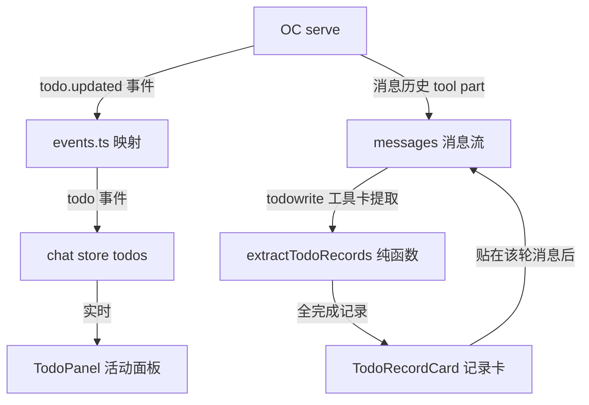
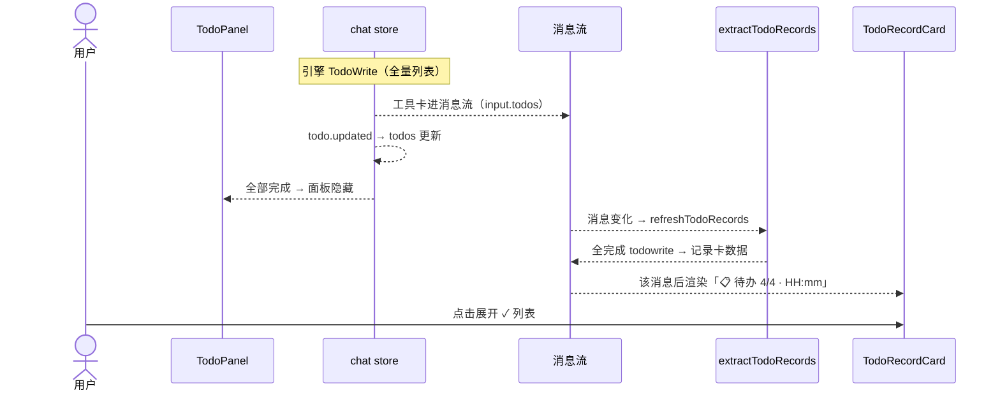

# 待办列表（TodoPanel 重构 + 回合记录）— 功能设计方案

> 版本：v2.0
> 日期：2026-08-09
> 作者：技术研发
> 状态：待评审

---

## 一、需求背景

### 1.1 现状

- 分形 TodoPanel 是「活动面板」：实时显示当前会话 todo 列表，数据来自 serve 的 `todo.updated` 事件流
- **三个体验问题**：
  1. 折叠态只显示计数，看不到**当前正在做什么**
  2. 展开/收起必须鼠标点击
  3. 回合结束后 todo 面板直接消失，**完成的待办没有留下记录**
- **v1 已实现**：折叠态/hover/自动展开/状态样式 + 本地快照记录卡
- **v2 关键认知（2026-08-09 实测发现）**：**serve 消息历史里就有完整的 todo 信息**——todowrite 工具调用（tool part）的 input 就是当时的完整 todo 列表（全量覆盖语义），input/output 完整回显。**OC 本来就提供历史 todo 数据** → 记录卡直接**从 serve 消息提取**，本地快照多余（移除）

### 1.2 用户故事

| 场景 | 用户角色 | 需求描述 |
|------|----------|----------|
| 折叠态洞察 | 用户 | 面板折叠时能看到「当前正在进行的任务」及序号 |
| 变化感知 | 用户 | 生成/更新待办时面板自动展开 15 秒后收起 |
| 悬停交互 | 用户 | 鼠标移入展开、移出收起 |
| 状态辨识 | 用户 | 完成项主题蓝（不划掉）、进行中主题蓝虚线框、未开始现状 |
| 回合记录 | 用户 | 待办全部完成后，该轮待办固化为记录卡**贴在那轮会话后**；历史会话同样可见（纯 serve 数据） |

### 1.3 范围

| 项 | 本次是否覆盖 |
|----|-------------|
| TodoPanel 折叠态/hover/自动展开/状态样式（v1 保留） | ✅ |
| 记录卡从 serve 工具卡提取（v2 升级） | ✅ |
| 本地快照链路移除（v2） | ✅ |
| 手动添加/编辑 todo | ❌ |

---

## 二、架构设计

### 2.1 整体数据流



**v2 核心**：记录卡数据源 = **serve 消息历史中的 todowrite 工具卡**（实时消息流与历史加载同一条路径，天然一致）；本地快照 IPC/存储全部移除。

### 2.2 关键设计决策

| 决策点 | 选择 | 理由 |
|--------|------|------|
| D1 折叠态内容 | 当前进行中项 + 序号（「②/ ④ 内容」），无进行中显示第一项 pending | 用户最关心「引擎正在做什么」（v1 保留） |
| D2 自动展开 | 生成/真实变化 → 展开 15s；内容级检测（JSON 对比）+ 不续期（展开期间变化不重置）；收起后真实变化重新展开 | 引擎每步全量 TodoWrite——内容没变的重复写入不触发；频繁变化不导致永不收起（v1 修复保留） |
| D3 展开态组合 | `expanded = autoExpanded \|\| hoverExpanded` | 自动展开与悬停互不打架（v1 保留） |
| D4 hover 交互 | mouseenter 展开 / mouseleave 收起；无点击 | 用户明确要求（v1 保留） |
| D5 状态样式 | completed 主题蓝不划掉；in_progress 主题蓝虚线框；pending 现状 | 用户明确要求（v1 保留） |
| **D6 记录卡触发（v2 改）** | **消息流中「全完成的 todowrite 工具卡」→ 该消息后渲染记录卡**（不再依赖 idle 事件 + 本地快照） | 工具卡 input = 当时完整 todo 列表；全完成（completed/cancelled）即该轮完成——消息位置即记录卡位置（精确） |
| **D7 数据源（v2 改）** | **serve 消息历史（tool part）**——移除本地快照 IPC/存储/设置项 | OC 本来就提供历史 todo（2026-08-09 实测：todowrite input/output 完整回显）；回到「serve 唯一源」基线，无辅助存储 |
| D8 记录卡展示 | 默认折叠「📋 待办 4/4 · HH:mm」，点击展开 ✓ 列表 | 多轮记录不刷屏（v1 保留组件） |
| D9 记录卡位置（v2 改） | **贴在该轮（消息）后**——消息流 v-for 中每条消息后按提取结果渲染 | 位置精确（v1 是时间序尾部，不精确） |
| D10 与活动面板互斥 | 全部完成 → 面板隐藏（记录卡替代）；新回合 TodoWrite → 面板重新出现 | 活动面板只显示未完成任务 |

---

## 三、主进程设计

**无改动**（v2 移除 v1 的 todos:saveSnapshot/listSnapshots IPC + preload + bridge 快照函数）。

---

## 四、前端设计

### 4.1 提取纯函数（chat store 或 lib）

**文件：** `src/renderer/src/stores/chat.ts`（或独立 lib）

```typescript
// 从消息流提取「全完成 todowrite」记录卡数据
// 遍历消息的 toolUses + contentBlocks，找 tool 名（小写化）=== 'todowrite' 的 part
// input 可能是 JSON 字符串或对象 → 解析容错（parse 失败跳过）
// 条件：todos 长度 > 0 && every(status === 'completed' || status === 'cancelled')
// 返回：Array<{ messageId: string; endedAt: number; todos: TodoItem[] }>（消息时间序）
export function extractTodoRecords(messages: Message[]): TodoRecord[]
```

**边界**：
- 工具名兼容：`todowrite` / `TodoWrite`（小写化比较）
- input 结构：`{ todos: [...] }`（对象）或 JSON 字符串（parse 容错）
- 同轮重复全完成 TodoWrite（引擎重复写）→ 每条都产记录卡（v2 简化，不做轮级去重——真实场景引擎收尾写一次）
- 消息时间：使用消息 timestamp 作为 endedAt（无则 0——渲染时只显示 HH:mm，0 显示「--:--」）

### 4.2 chat store 变更

```
移除（v1 快照链路全部）：
- todoSnapshots ref / loadTodoSnapshots / pushTodoSnapshot / maybeSnapshotTodos
- clearMessages 里对 todoSnapshots 的重置
保留：
- todos / setTodos（事件流面板数据）
新增：
- todoRecords: ref<TodoRecord[]>([])（提取结果缓存，供 ChatPanel 渲染）
- refreshTodoRecords(messages)：调 extractTodoRecords 更新 todoRecords
  —— 调用时机：loadMessages 后 + 消息流 watch（增量重建——v2 简化：直接全量重提取，消息量 ≤500 性能可接受）
```

### 4.3 TodoPanel.vue

- v1 的折叠态/hover/自动展开/状态样式**全部保留**
- hidePanel 条件（v2 改）：`全部 completed/cancelled`（不再依赖快照计数）——面板隐藏由记录卡替代；新回合 TodoWrite（出现 pending/in_progress）→ 面板重新显示（todos 变化天然驱动）

### 4.4 记录卡渲染（ChatPanel.vue，v2 改）

- **消息流内**：v-for 消息块中，`v-if="todoRecordsByMsg[msg.id]"` → 渲染 TodoRecordCard（该消息后）
- **实时**：消息流 watch → refreshTodoRecords —— 引擎全完成 TodoWrite 工具卡进消息流 → 记录卡自动出现在该消息后
- **历史**：loadMessages 后 refreshTodoRecords —— 同一路径，天然恢复
- TodoRecordCard.vue：v1 组件保留，props 从 snapshot 改为 `{ endedAt, todos }`（不再有 round/completedAll 概念）

### 4.5 历史恢复

- **无 IPC**（v2 移除）——历史 todo 记录 = 消息流提取（serve 数据）
- serve 当前 todo 状态：历史会话无事件流 → 面板不显示（现状）；**记录卡从工具卡恢复**（全完成轮次可见）

---

## 五、文件变更清单

| 操作 | 文件 | 说明 |
|------|------|------|
| 修改 | `src/renderer/src/stores/chat.ts` | +extractTodoRecords/todoRecords/refreshTodoRecords；-快照链路全部 |
| 修改 | `src/renderer/src/components/chat/ChatPanel.vue` | 记录卡消息内渲染 + 消息 watch 刷新 |
| 修改 | `src/renderer/src/components/chat/TodoRecordCard.vue` | props 改 {endedAt, todos} |
| 修改 | `src/renderer/src/components/chat/TodoPanel.vue` | hidePanel 条件改（去快照依赖） |
| 删除 | `electron/main/ipc.ts` todos:saveSnapshot/listSnapshots | 快照 IPC |
| 删除 | `electron/preload/index.ts` + bridge 快照函数 | 快照通道 |
| 删除 | settings `todos.maxSnapshotsPerSession`（DEFAULT_SETTINGS/schema/SettingsPanel/i18n） | 快照设置项 |
| 删除 | 快照测试（ipc/chat/settings/useStreamProcessor 相关） | 快照链路 |
| 修改 | 测试：chat（extractTodoRecords 新用例）、ChatPanel（消息内渲染）、TodoRecordCard、TodoPanel | 适配 v2 |
| 修改 | locales：记录卡文案（移除 maxSnapshots 相关） | 适配 v2 |

---

## 六、关键流程

### 6.1 时序图（v2：回合完成 → 记录卡）



### 6.2 异常流程

| 异常场景 | 前端处理 |
|----------|----------|
| todowrite input 解析失败（JSON 字符串损坏） | 跳过该条（不产记录卡） |
| 引擎重复写全完成 TodoWrite | 每条都产记录卡（v2 简化，真实场景罕见） |
| 消息时间缺失 | endedAt=0，渲染「--:--」 |
| 实时消息流提取性能 | 消息量 ≤500，全量重提取可接受（无优化必要） |

---

## 七、测试要点

| 测试场景 | 预期结果 |
|----------|----------|
| extractTodoRecords：全完成 todowrite → 产出记录卡 | 返回 {messageId, todos} |
| extractTodoRecords：部分完成（含 pending/in_progress）→ 不产出 | 空 |
| extractTodoRecords：无 todowrite 消息 | 空 |
| extractTodoRecords：input 为 JSON 字符串 / 对象 / 损坏 | 解析成功 / 跳过 |
| extractTodoRecords：工具名 todowrite/TodoWrite 大小写 | 均匹配 |
| 记录卡渲染位置：消息后（v-for 内） | 该消息下方出现记录卡 |
| 实时：引擎全完成 TodoWrite → 记录卡自动出现 | 消息流 watch 触发 |
| 历史：loadMessages 后记录卡恢复 | refreshTodoRecords 路径 |
| hidePanel：全部完成 → 面板隐藏 | 记录卡替代 |
| v1 回归：折叠态/hover/自动展开/状态样式 | 全保留 |

---

## 八、风险与边界

| 风险 | 等级 | 应对措施 |
|------|------|----------|
| 引擎不写 TodoWrite（全程无工具卡）→ 无记录卡 | 低 | serve todo 表当前状态兜底（后续可加 GET /session/{id}/todo 全完成渲染） |
| 同轮重复全完成 → 多条记录卡 | 低 | v2 接受；如用户反馈再加轮级去重 |
| 移除快照后旧数据（v1 已存的文件） | 低 | 残留 JSON 文件无害（不再读取），可手动清理 |

---

## 九、实施计划

| 阶段 | 任务 | 预估工时 |
|------|------|----------|
| 提取 | extractTodoRecords 纯函数 + 测试 | 1h |
| store | todoRecords/refresh + 移除快照链路 | 1h |
| 渲染 | ChatPanel 消息内记录卡 + TodoRecordCard props 改造 | 1h |
| 清理 | IPC/preload/bridge/settings 快照删除 + 测试适配 | 1.5h |
| 测试 | 全量回归 + 新增用例 | 1.5h |
| **合计** | | **6h** |

---

## 十、变更记录

| 版本 | 日期 | 变更内容 | 作者 |
|------|------|----------|------|
| v1.0 | 2026-08-09 | 初始版本（需求 1-5 + 本地快照） | 技术研发 |
| v1.1 | 2026-08-09 | 快照保留轮数改设置项（默认 20） | 技术研发 |
| **v2.0** | 2026-08-09 | **记录卡改从 serve 工具卡提取（todowrite input 全量列表，2026-08-09 实测）；移除本地快照 IPC/存储/设置项——回到纯 serve 数据源；记录卡位置从时间序尾部改为消息级精确** | 技术研发 |
