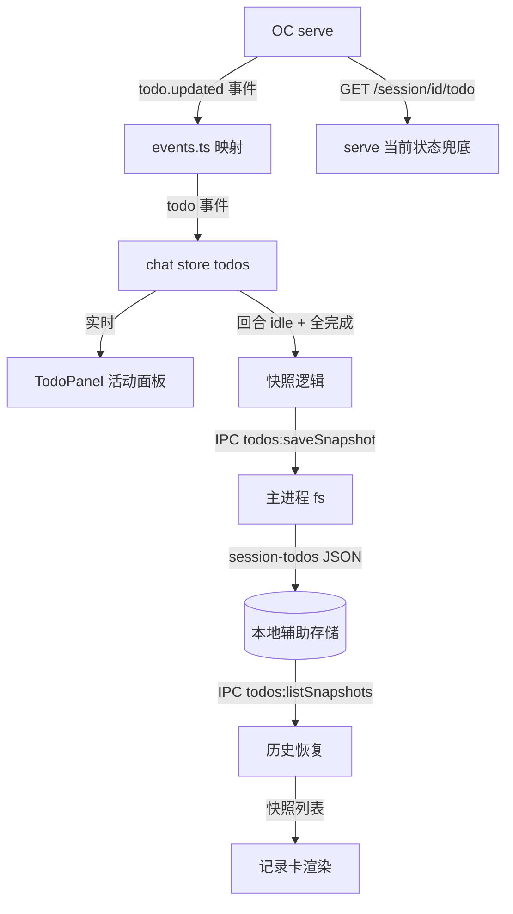
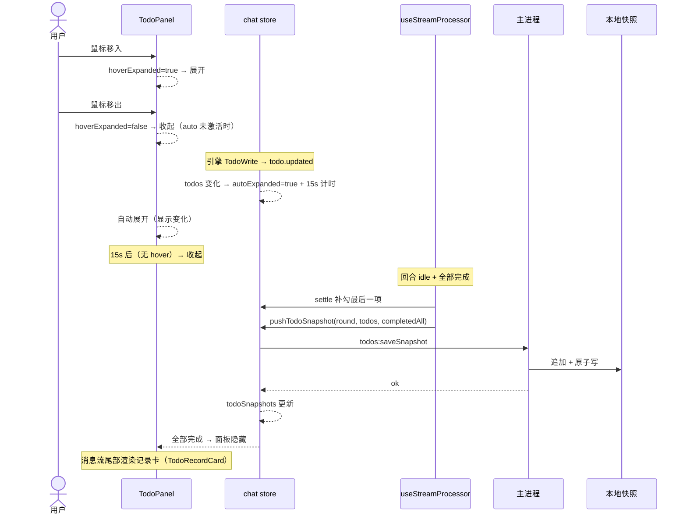

# 待办列表（TodoPanel 重构 + 回合记录）— 功能设计方案

> 版本：v1.0
> 日期：2026-08-09
> 作者：技术研发
> 状态：待评审

---

## 一、需求背景

### 1.1 现状

- 分形 TodoPanel 是「活动面板」：实时显示当前会话 todo 列表（折叠/展开 + 点击切换），数据来自 serve 的 `todo.updated` 事件流
- **三个体验问题**：
  1. 折叠态只显示「✅ 1/4」计数，看不到**当前正在做什么**（用户最关心的信息反而隐藏）
  2. 展开/收起必须鼠标点击，悬停查看不自然
  3. 回合结束后 todo 面板直接消失，**完成的待办没有留下记录**——多轮会话/重启后无从回溯
- **能力缺口（基线实证）**：serve 只有会话级「当前 todo 状态」（`GET /session/{id}/todo`），**无每轮历史快照**；todo 不进消息历史

### 1.2 用户故事

| 场景 | 用户角色 | 需求描述 |
|------|----------|----------|
| 折叠态洞察 | 用户 | 面板折叠时能看到「当前正在进行的任务」及序号（如「②/ ④ 列出 docs 目录结构」），不用展开就知道引擎在干什么 |
| 变化感知 | 用户 | 生成/更新待办列表时面板自动展开 15 秒，任务变化（增减/勾选）不被错过 |
| 悬停交互 | 用户 | 鼠标移入展开、移出收起，无需点击 |
| 状态辨识 | 用户 | 完成项用主题蓝标记（不划掉）、进行中主题蓝 + 虚线边框、未开始保持现状 |
| 回合记录 | 用户 | 待办全部完成后面板收起，完成的那一轮待办固化在消息流尾部作为记录；历史会话也能看到 |

### 1.3 范围

| 项 | 本次是否覆盖 |
|----|-------------|
| TodoPanel 折叠态显示当前项 + 序号 | ✅ |
| 生成/变化自动展开 15s 收起 | ✅ |
| hover 展开/收起（去点击） | ✅ |
| 状态样式（completed/in_progress/pending） | ✅ |
| 回合完成记录卡（消息流尾部固化） | ✅ |
| 每轮快照本地存储（辅助处理层） | ✅ |
| 历史会话记录卡恢复 | ✅ |
| 手动添加/编辑 todo | ❌（引擎驱动，现状保持） |

---

## 二、架构设计

### 2.1 整体数据流



### 2.2 关键设计决策

| 决策点 | 选择 | 理由 |
|--------|------|------|
| D1 折叠态内容 | 当前进行中项 + 序号（「②/ ④ 内容」），无进行中则显示第一项 pending | 用户最关心「引擎正在做什么」，计数无信息量 |
| D2 自动展开 | todo 生成/变化 → autoExpanded=true + 15s 计时器收起；频繁变化重置计时 | 变化被看见（任务增减/勾选），同时不长期占用 |
| D3 展开态组合 | `expanded = autoExpanded \|\| hoverExpanded`；15s 到点但鼠标在面板内 → 保持 | 自动展开与悬停互不打架 |
| D4 hover 交互 | mouseenter 展开 / mouseleave 收起；删除点击 toggle | 用户明确要求（「也不用鼠标点击展开收起」） |
| D5 状态样式 | completed → 主题蓝 var(--accent) 不划掉；in_progress → 主题蓝 + 虚线边框；pending 现状 | 用户明确要求；主题色跟随亮/暗主题 |
| D6 记录卡触发 | 回合 idle 且 todo **全部完成**（或全 cancelled）→ 快照 + 记录卡；部分完成 → 面板保持折叠态 | 「待办完成后附在那轮会话后」；未完成的中断会话由 serve 状态兜底 |
| D7 快照存储 | `%APPDATA%\fractal\data\session-todos\{sessionId}.json`（辅助处理层） | serve 无每轮历史 → 基线「OC 无法提供的分形辅助存储」（记忆机制同款） |
| D8 快照内容 | `{ snapshots: [{ round, endedAt, todos[], completedAll }] }`；**保留轮数 = 设置项 `todos.maxSnapshotsPerSession`（默认 20，设置页高级区可调 1-100）**，单快照 todo ≤ 50 项截断 | 小 JSON 按会话一文件；轮数可配置（用户拍板 2026-08-09）；50 项防单轮膨胀 |
| D9 记录卡展示 | 默认折叠摘要「📋 待办 4/4 · 时间」，点击展开列表；按 endedAt 时间序排消息流尾部 | 多轮快照不刷屏 |
| D10 与活动面板互斥 | 全完成 → 面板隐藏（记录卡替代）；新回合 TodoWrite → 面板重新出现 | 活动面板只显示未完成任务 |

> 基线说明：本功能的本地快照属于「OC 无法提供的数据 → 分形辅助处理」（2026-08-09 基线精确化，01/03 文档已同步）。

---

## 三、主进程设计（辅助存储层）

### 3.1 新增 IPC：todos:saveSnapshot

**文件：** `electron/main/ipc.ts`

```
入参 { sessionId: string; maxSnapshots: number; snapshot: { round: number; endedAt: number; todos: Array<{content, status, priority}>; completedAll: boolean } }
行为：
1. 路径 = join(appDataDir, 'data', 'session-todos', `${sessionId}.json`)
2. 读现有快照（JSON.parse，损坏忽略）
3. 追加新快照 → 超 maxSnapshots 条删最旧（maxSnapshots 前端设置传入，校验 1-100 默认 20）
4. 原子写（tmp + rename）
5. 返回 { ok: true }；写失败返回 { ok: false, error }
校验：sessionId 匹配 /^ses_/；todos 数组长度 ≤ 50；endedAt 为有限数
```

### 3.2 新增 IPC：todos:listSnapshots

```
入参 { sessionId: string }
行为：读快照文件 → 返回 { snapshots: [...] }；文件不存在/损坏 → { snapshots: [] }
```

### 3.3 文件结构

```
%APPDATA%\fractal\data\session-todos\{sessionId}.json
{
  "sessionId": "ses_xxx",
  "snapshots": [
    { "round": 1, "endedAt": 1723200000000, "completedAll": true,
      "todos": [{ "content": "列出 docs 目录结构", "status": "completed", "priority": "high" }] }
  ]
}
```

### 3.4 数据库变更

**无**——辅助 JSON 文件（非 SQLite）。现有 `settings` 表不受影响。

---

## 四、前端设计

### 4.1 新增 IPC 封装（electron-bridge.ts）

```typescript
// 保存回合快照（全完成时）
saveTodoSnapshot(sessionId: string, snapshot: TodoSnapshot): Promise<{ok: boolean}> → invoke('todos:saveSnapshot', ...)
// 读取会话快照（历史恢复）
listTodoSnapshots(sessionId: string): Promise<{snapshots: TodoSnapshot[]}> → invoke('todos:listSnapshots', ...)
```

### 4.2 chat store 扩展

**文件：** `src/renderer/src/stores/chat.ts`

```
新增状态：
- todoSnapshots: ref<TodoSnapshot[]>([])          // 当前会话快照（历史恢复/实时追加）
- todoAutoExpanded: ref(false) + todoAutoTimer    // 自动展开 15s
- todoHoverExpanded: ref(false)                   // hover 展开（TodoPanel 局部状态或 store——建议局部）
新增动作：
- pushTodoSnapshot(snapshot)                       // 追加 + 写主进程（IPC）+ 截断 20
- loadTodoSnapshots(sessionId)                     // 会话加载时读快照（失败静默）
- clearMessages() 联动重置 todoSnapshots
回合收尾（useStreamProcessor result 分支，settle 之后）：
- 有 todo && 全部 completed/cancelled → pushTodoSnapshot({round: todoRound+1, endedAt: now, todos: 全量, completedAll: true})
- 否则 → 不处理（面板保持折叠态）
（自动展开 15s 的 watch 放 TodoPanel 组件内——4.3，组件卸载时清理计时器）
```

### 4.3 TodoPanel.vue 重构

**改造点：**

**折叠态（收起时）**——只显示一行：

```
[📋] ②/ ④ 列出 docs 目录结构
```

- 取第一个 in_progress（无则第一个 pending）；序号 = 该项在 visibleTodos 中的 index+1；内容 = activeForm || content
- 无可见 todo → 不渲染（现状保持）
- 点击标题行 toggle 逻辑**删除**（hover 接管）

**hover 交互：**

```
@mouseenter → todoHoverExpanded = true
@mouseleave → todoHoverExpanded = false
expanded = todoAutoExpanded || todoHoverExpanded
```

**状态样式（todo-chip）：**

| status | 样式 |
|--------|------|
| completed | 图标 ✓ + 文字 var(--accent) 主题蓝 + 底 12% 主题蓝（**无删除线**） |
| in_progress | 图标 ● + 文字主题蓝 + **虚线边框**（border: 1px dashed var(--accent)）+ 底 8% 主题蓝 |
| pending | 现状（灰底/默认边框） |
| cancelled | 现状（删除线 + 55% 透明） |

**自动展开计时：**

```
watch(todos, deep) → 内容变化 → autoExpanded=true + clearTimeout + setTimeout(15s → autoExpanded=false)
（watch 在 TodoPanel 内做——todos 来自 chat store；组件卸载时清理计时器）
```

### 4.4 记录卡渲染（ChatPanel.vue）

- 消息流尾部（最后一条消息后）渲染 `TodoRecordCard` 列表（todoSnapshots 按 endedAt 序）
- **TodoRecordCard.vue 新组件**：默认折叠摘要「📋 待办 4/4 · 14:30」（点击展开列表：✓ 内容×N + cancelled 灰）；样式复用 todo-chip 体系
- **面板隐藏条件**：visibleTodos 全部 completed/cancelled 且 todoSnapshots 有快照 → 活动面板隐藏（记录卡可见）；新回合 TodoWrite → 面板重新出现（store 判断：有未完成 todo 即显示）

### 4.5 历史恢复

- useSessionSwitch/loadMessages 分支：切会话时 `loadTodoSnapshots(sessionId)`（IPC，失败静默 []）→ 记录卡渲染
- **serve 当前状态兜底**：快照为空时拉 `GET /session/{id}/todo`（serve 当前状态）→ 全完成 → 渲染记录卡（serve 数据，不落快照——仅展示层）；有未完成 → 面板折叠态显示（与实时一致）

---

## 五、文件变更清单

| 操作 | 文件 | 说明 |
|------|------|------|
| 修改 | `electron/main/ipc.ts` | +todos:saveSnapshot / todos:listSnapshots（含校验） |
| 修改 | `electron/preload/index.ts` | 白名单 +2 通道 |
| 修改 | `src/renderer/src/lib/electron-bridge.ts` | +saveTodoSnapshot / listTodoSnapshots |
| 修改 | `src/renderer/src/stores/settings.ts` | +`todos.maxSnapshotsPerSession`（DEFAULT_SETTINGS 20 + settings.schema.json enum 1-100） |
| 修改 | `src/renderer/src/components/settings/SettingsPanel.vue` | 高级设置区「待办记录保留轮数」数字输入（1-100，默认 20） |
| 修改 | `src/renderer/src/stores/chat.ts` | +todoSnapshots/load/push（读 settings.maxSnapshotsPerSession 传 IPC）/回合收尾快照 |
| 修改 | `src/renderer/src/components/chat/TodoPanel.vue` | 折叠态/hover/自动展开/状态样式重构 |
| 新增 | `src/renderer/src/components/chat/TodoRecordCard.vue` | 记录卡组件 |
| 修改 | `src/renderer/src/components/chat/ChatPanel.vue` | 记录卡渲染 + 面板隐藏条件 |
| 修改 | `src/renderer/src/composables/useStreamProcessor.ts` | result 分支快照（settle 之后）+ 历史加载联动 |
| 修改 | `src/renderer/src/locales/zh.json` / `en.json` | 记录卡/折叠态/设置项文案 |
| 修改 | 测试：ipc.test / chat.test / TodoPanel.test / ChatPanel.test / useStreamProcessor.test / settings.test | 新增用例 |

---

## 六、关键流程

### 6.1 时序图（运行中 → 回合完成）



### 6.2 异常流程

| 异常场景 | 前端处理 | 主进程处理 |
|----------|----------|----------|
| 快照写失败（磁盘满/权限） | 静默（console.error），记录卡仅内存展示 | 返回 { ok:false, error }，不重试 |
| 快照文件损坏（JSON parse 失败） | 忽略（无记录卡） | 返回 { snapshots: [] } |
| 同一会话多窗口同时写快照 | 最后写赢（读-改-写非原子，v1 接受） | 原子写（tmp+rename）保证文件不半截 |
| 快照超 20 条 | 前端截断（push 后删最旧） | 主进程同样截断（双保险） |
| 15s 计时器组件卸载 | onUnmounted 清理 | — |

---

## 七、测试要点

| 测试场景 | 前置条件 | 操作 | 预期结果 |
|----------|----------|------|----------|
| 折叠态当前项 | 4 项 todo 第 2 项 in_progress | 面板收起 | 显示「②/ ④ 第2项内容」 |
| 无 in_progress 显示第一 pending | 全 pending | 收起 | 「①/ ④ 第1项内容」 |
| hover 展开/收起 | 收起态 | mouseenter → mouseleave | 展开 → 收起 |
| 自动展开 15s | todo 变化 | 等 16s | 展开后自动收起 |
| 自动展开 + hover 在场 | auto 计时结束 | 鼠标在面板内 | 保持展开 |
| 完成不划掉 | 1 项 completed | 渲染 | 主题蓝 + 无删除线 |
| in_progress 虚线边框 | 1 项 in_progress | 渲染 | 主题蓝虚线边框 |
| 全完成 → 记录卡 + 面板隐藏 | 4/4 completed | 回合 idle | 面板隐藏、尾部记录卡「4/4」 |
| 部分完成 → 面板折叠态 | 2/4 | 回合 idle | 无记录卡、面板折叠显示进行项 |
| 快照落盘 | 全完成回合 | 检查文件 | sessionId.json 含快照 |
| 历史恢复 | 切到有快照的会话 | 加载 | 记录卡按时间序渲染 |
| 快照 20 条截断 | 21 轮完成 | 第 21 次保存 | 文件 20 条 |
| 多轮记录卡 | 3 轮完成 | 渲染 | 3 条记录卡（时间序） |

---

## 八、风险与边界

| 风险 | 等级 | 应对措施 |
|------|------|----------|
| 快照与消息流位置不精确（记录卡在尾部而非对应消息后） | 低 | v1 时间序尾部展示可接受；后续加消息锚点（快照记录 messageID） |
| 多窗口并发写快照最后写赢 | 低 | 罕见场景；文件原子写保证不损坏 |
| settleIncompleteFinalTodo 与快照顺序 | 中 | result 分支固定顺序：settle → 快照（测试覆盖） |
| 自动展开频繁重置（每步勾选续期） | 低 | 符合预期（任务进行中一直可见）；收起条件 = 15s 无变化 |
| 快照隐私（todo 内容含路径） | 低 | 本地文件，与会话数据同目录；后续随「清除数据」功能一并删除 |

---

## 九、实施计划

| 阶段 | 任务 | 预估工时 |
|------|------|----------|
| 主进程 | IPC 两个通道 + 快照读写 + 校验 + 测试 | 1.5h |
| store | todoSnapshots/load/push + 回合收尾 + 自动展开联动 | 1.5h |
| 组件 | TodoPanel 重构（折叠态/hover/样式）+ TodoRecordCard 新建 | 2h |
| 集成 | ChatPanel 记录卡渲染 + 面板隐藏 + 历史恢复联动 | 1h |
| 测试 | 全量用例（12 场景）+ 回归 | 1.5h |
| **合计** | | **7.5h** |

---

## 十、变更记录

| 版本 | 日期 | 变更内容 | 作者 |
|------|------|----------|------|
| v1.0 | 2026-08-09 | 初始版本（需求 1-5 全量 + 本地快照辅助存储） | 技术研发 |
