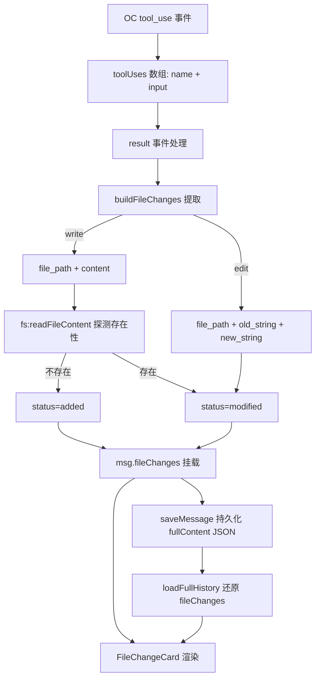

# 会话流文件修改卡片 — 功能设计方案

> 版本：v1.1
> 日期：2026-08-13（v1.1：2026-08-16）
> 作者：技术研发
> 状态：已实施

---

## 一、需求背景

### 1.1 现状与问题

分形用户在对话流中只能看到 AI 的文本回复与工具调用卡片，**无法直观感知本轮 AI 改了哪些文件**。当前 `result` 事件只做布尔判断——检测到本轮有 write/edit/bash 等工具时派发 `oc-file-changed` 事件刷新右侧文件面板（`useStreamProcessor.ts:426-428`），但**没有把「改了哪些文件、改了什么内容」记录并展示在会话流里**。

用户反馈：每轮会话结束后，希望在会话流末尾看到本轮的「文件修改变化」。

### 1.2 用户故事

| 场景 | 用户角色 | 需求描述 |
|------|----------|----------|
| 回顾本轮改动 | 普通用户 | 每轮 AI 回复结束后，在会话流末尾看到本轮改动了哪些文件 |
| 查看具体内容 | 普通用户 | 点击文件可展开查看改动内容（edit 的 old→new 对比 / write 的写入内容） |
| 多文件去重 | 普通用户 | 同一文件被多次修改时合并成一条，不重复显示 |
| 区分文件类型 | 普通用户 | 新增文件与修改文件用不同图标/标记区分 |
| 历史可回溯 | 普通用户 | 会话重新打开后，历史每轮的文件修改卡片仍然可见 |

### 1.3 范围

| 角色 | 可操作范围 | 本次是否覆盖 |
|------|-----------|-------------|
| 普通用户 | 会话流末尾自动插入文件修改卡片 | ✅ |
| 普通用户 | 卡片内文件清单 + 展开查看改动内容 | ✅ |
| 普通用户 | 按文件去重合并（多次修改同一文件） | ✅ |
| 普通用户 | 区分新增 / 修改（图标 + 标记） | ✅ |
| 普通用户 | 卡片持久化（会话重开仍可见） | ✅ |
| 任意角色 | 删除文件识别（bash rm 语义解析） | ❌（见 6.3 取舍） |
| 任意角色 | bash 修改文件精确列出 | ❌（见 6.3 取舍） |

---

## 二、架构设计

### 2.1 整体数据流



### 2.2 数据来源选型（方案对比）

| 方案 | 说明 | 优点 | 缺点 | 结论 |
|------|------|------|------|------|
| A：toolUses 提取 | 从本轮工具调用记录提取 file_path / old_string / new_string | 数据已在前端；精确对应「本轮」；无 git 依赖；edit 片段本身即精确 diff | bash 改的文件无法提取；write 全覆盖时不知旧内容 | ✅ 采用 |
| B：主进程轮次快照 | 每轮开始缓存文件内容快照，结束对比 | diff 最完整（含 bash） | 工程量大 2-3 倍；快照存储/清理复杂 | ❌ 不采用 |
| C：直接 git:diff | 展示工作区 vs HEAD | 实现最简单 | 语义是「自上次 commit 以来」非「本轮」；非 git 仓库不可用 | ❌ 不采用 |

**选型理由**：分形面向非编程人员，工作区不保证是 git 仓库（GitPanel 已有 `git.notRepo` 兜底），方案 C 直接排除；方案 B 复杂度不符合该功能性价比。方案 A 数据零成本、精确、无依赖。

---

## 三、详细设计

### 3.1 数据层（`src/renderer/src/stores/chat.ts`）

新增类型定义：

```ts
/** 会话流文件修改卡片条目（方案 A：从 toolUses 提取） */
export interface FileChangeItem {
  /** 工具 input 里的原始 file_path（展示时相对 cwd 化） */
  filePath: string;
  /** 新增（write 且文件不存在） / 修改（edit 或 write 覆盖已有文件） */
  status: "added" | "modified";
  /** 工具名：write / edit */
  toolName: string;
  /** edit 的 old_string（多片段时按顺序存储） */
  oldString?: string;
  /** edit 的 new_string / write 的 content */
  newString?: string;
}
```

`Message` 接口新增字段：

```ts
export interface Message {
  // ...现有字段
  /** 本轮文件修改卡片数据（方案 A 提取，随消息持久化） */
  fileChanges?: FileChangeItem[];
}
```

### 3.2 提取逻辑（`src/renderer/src/composables/useStreamProcessor.ts`）

新增纯函数 `buildFileChanges(toolUses: ToolUse[]): FileChangeItem[]`：

1. 遍历 `toolUses`，仅处理 `write` / `edit`（名称 toLowerCase 匹配，与现有 fileModifiers 判定一致）
2. **write**：取 `input.file_path` + `input.content` → 生成条目 `{ filePath, status: "modified", toolName: "write", newString: content }`（初始保守默认 modified，待存在性探测后若文件不存在升级为 added）
3. **edit**：取 `input.file_path` + `input.old_string` + `input.new_string` → 生成条目 `{ filePath, status: "modified", toolName: "edit", oldString, newString }`
4. **按 file_path 去重合并**：同一文件多次修改 → 合并为一条，oldString/newString 按序拼接
5. 返回条目数组

> **v1.1 增量 — key 多形态兼容**：OC 引擎 v1.18 实测 edit 工具 input 为 **camelCase**（`filePath`/`oldString`/`newString`，见 serve 数据库 part 表），旧版/CC 遗留为 **snake_case**（`file_path`/`old_string`/`new_string`）——2026-08-15 展开空白根因。取值做双 key 兜底（`old_string` → `oldString`，`new_string` → `newString`），并加 `typeof === 'string'` 守卫防对象/数字强转抛错阻断消息持久化。

`result` 事件处理中（现有 `oc-file-changed` 检测处）新增：

```ts
if (msg) {
  const fileModifiers = new Set(["write", "edit", "bash", "powershell", "skill", "workflow", "agent"]);
  const didModify = msg.toolUses.some(tu => fileModifiers.has((tu.name ?? "").toLowerCase()));
  if (didModify) window.dispatchEvent(new CustomEvent("oc-file-changed"));
  // 新增：提取文件修改卡片数据
  const changes = buildFileChanges(msg.toolUses);
  if (changes.length) {
    chat.setFileChanges(changes);          // 挂到 msg.fileChanges
    resolveAddedStatus(changes);           // 异步探测 write 文件存在性 → added/modified
  }
}
```

`resolveAddedStatus`：对 write 条目调 `fs:readFileContent(filePath)`——失败（文件不存在）→ 升级为 `added`；成功 → 保持 `modified`。结果通过 `chat.updateFileChangeStatus(filePath, status)` 回写，并触发一次重新持久化（仅当状态有变化）。

**存在性探测为尽力而为**：异步失败（网络/权限）时保持默认 modified，不影响卡片展示。

### 3.3 持久化链路

- `saveMessage`（`useStreamProcessor.ts` result 分支）：fullContent JSON 增加 `fileChanges: msg.fileChanges`
- 历史还原：`loadFullHistory` 解析 JSON 时还原 `fileChanges` 到 Message 对象（需在 `chat.ts` 的 loadFullHistory 中处理）

### 3.4 渲染层（新组件 `src/renderer/src/components/chat/FileChangeCard.vue`）

**位置**：最后一条 assistant 消息的 NodeTimeline 末尾（ChatPanel 回合容器内，`msg.fileChanges` 存在时渲染）

**结构**：

```
[折叠卡片] 📁 文件修改 (N)          ← 默认折叠
  [展开后]
  ┌─────────────────────────────────┐
  │ ＋ src/foo.ts        write      │  ← 点击行展开 diff
  │ ● src/bar.ts         edit       │
  └─────────────────────────────────┘
  [单文件展开区]
  edit:  old_string（红色删除线） → new_string（绿色新增）
  write: 写入的 content（代码块展示）
```

**设计要点**：
- 图标用 `lucide-vue-next`：`FilePlus2`（新增，绿）/ `FilePenLine`（修改，蓝）——遵守项目图标规范
- 文件路径相对 cwd 展示（`settings.cwd` 相对化，路径不在 cwd 下则原样显示）
- 展开的 diff 区：edit 条目用 old/new 字符串简单对比渲染（红色删除 + 绿色新增行）；write 条目直接代码块展示 content
- 无 fileChanges 或空数组时不渲染组件

> **v1.1 增量 — diff 行号**：展开区每个 diff 行带**行号列**（1 起始，固定宽右对齐，VSCode diff 风格）。`toLines(text)` 将文本拆行映射为 `{ n, text }`；空文本返回空数组（write 无 newString 时不渲染行号）。行容器 `display:flex`，行号列与文本列同底色（背景整块着色而非仅文本行）。

### 3.5 组件挂载（`ChatPanel.vue` / `NodeTimeline.vue`）

- NodeTimeline 末尾追加 FileChangeCard 渲染位（v-if="msg.fileChanges?.length"）
- 需确认 NodeTimeline 现有渲染结构后确定挂载点（见「七、实施计划」步骤 3）

---

## 四、错误处理与边界

| 场景 | 处理方式 |
|------|----------|
| tool_use 无 file_path | 跳过该条目（file_path 缺失无法定位文件） |
| tool input 为 camelCase（filePath/oldString/newString） | 双 key 兜底取值（v1.1：OC v1.18 edit 实测 camelCase） |
| write 存在性探测失败 | 保持默认 modified，不阻塞卡片渲染 |
| 同一文件 write + edit 混用 | 按 file_path 去重，合并展示（write 片段 + edit 片段） |
| 非 cwd 下的文件路径 | 相对化失败则原样显示绝对路径 |
| 旧会话无 fileChanges 字段 | undefined，卡片不渲染（兼容历史数据） |
| 超长 content / old_string | 展开区限制最大高度 + 滚动，防卡片无限膨胀 |
| 空 newString（write 无内容） | 不渲染行号（toLines 空文本返回空数组） |

---

## 五、测试计划

| 测试文件 | 用例 |
|----------|------|
| `useStreamProcessor.test.ts` | buildFileChanges 提取 write/edit；按文件去重合并；file_path 缺失跳过；write+edit 混用合并 |
| `useStreamProcessor.test.ts` | result 事件携带 fileChanges 持久化到 fullContent JSON |
| `file-changes.test.ts` | camelCase（filePath/oldString/newString）与 snake_case 双形态提取（v1.1） |
| `FileChangeCard.test.ts` | 卡片渲染/默认折叠；展开显示清单；点击单文件展开 diff 区；新增/修改图标区分；空数组不渲染；diff 行号显示（v1.1） |
| `chat.test.ts` | loadFullHistory 还原 fileChanges 字段 |

---

## 六、范围与取舍

### 6.1 明确不做

1. **删除文件识别**：AI 删文件走 bash `rm`，toolUses 无法可靠提取删除语义（write 空内容 ≠ 删除，避免误判）。删除场景由文件面板（`oc-file-changed` 刷新）兜底。
2. **bash 修改文件精确列出**：bash 命令语义复杂（sed/mv/cp 任意组合），不强行解析。bash 仍触发文件面板刷新，用户可去文件面板查看。
3. **完整文件级 diff（diff 上下文）**：卡片只展示 edit 的 old/new 片段与 write 的写入内容，不做完整文件对比（需要快照机制，见方案 B）。

### 6.2 与现有机制的关系

- 保留现有 `oc-file-changed` 布尔派发（文件面板刷新链路不动）
- 新增提取逻辑复用现有 fileModifiers 工具名判定，不重复定义

---

## 七、实施计划

| 步骤 | 内容 | 涉及文件 |
|------|------|----------|
| 1 | chat.ts 新增 FileChangeItem 类型 + Message.fileChanges 字段 | `src/renderer/src/stores/chat.ts` |
| 2 | useStreamProcessor 新增 buildFileChanges + resolveAddedStatus + 挂载/持久化 | `src/renderer/src/composables/useStreamProcessor.ts` |
| 3 | 确认 NodeTimeline/ChatPanel 渲染结构，确定挂载点 | `src/renderer/src/components/chat/NodeTimeline.vue`、`ChatPanel.vue` |
| 4 | 新建 FileChangeCard.vue 组件 | `src/renderer/src/components/chat/FileChangeCard.vue` |
| 5 | loadFullHistory 还原 fileChanges | `src/renderer/src/stores/chat.ts` |
| 6 | 补测试（提取/渲染/还原） | 见五、测试计划 |

---

## 八、风险与边界

| 风险 | 等级 | 缓解 |
|------|------|------|
| tool_use input 结构在不同 OC 版本有差异 | 中 | file_path 取值做多 key 兜底（file_path / filePath / path）；edit old/new 双 key 兜底（v1.1） |
| write 存在性探测在文件极多时性能 | 低 | 仅探测 write 条目（通常很少），一次 IPC/文件 |
| 卡片在超长消息流中的视觉噪音 | 低 | 默认折叠，展开才看到明细 |

---

## 九、变更记录

| 版本 | 日期 | 变更内容 | 作者 |
|------|------|----------|------|
| v1.1 | 2026-08-16 | 增量：diff 行号（toLines + 行号列）；edit input camelCase 兜底（OC v1.18 实测） | 技术研发 |
| v1.0 | 2026-08-13 | 初始版本 | 技术研发 |
