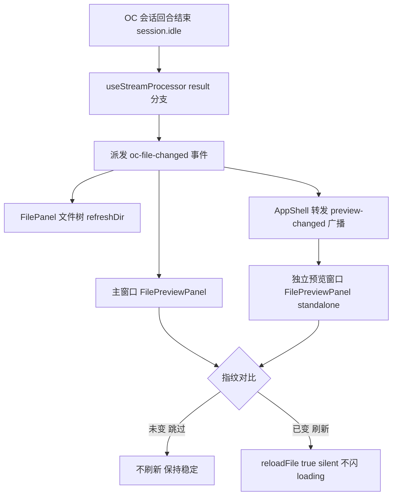
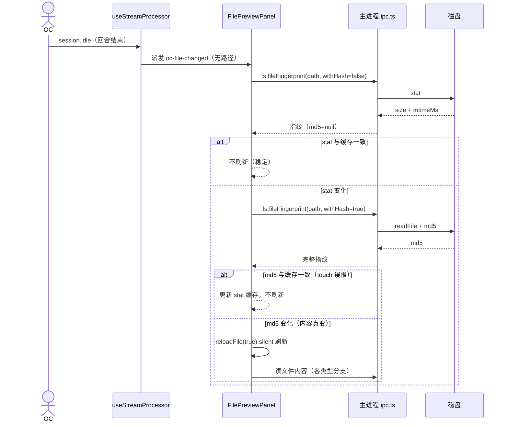

# 文件预览面板 — 功能设计方案

> 版本：v1.0
> 日期：2026-08-15
> 作者：技术研发
> 状态：待评审

---

## 一、需求背景

### 1.1 现状

分形（Electron + Vue3）的右侧文件预览面板 `FilePreviewPanel.vue` 已具备多格式预览能力：文本/代码（CodeMirror 编辑 + 预览 tab）、Markdown（渲染 + 大纲）、HTML（iframe blob + 检查模式 + 宽度预设）、docx（mammoth 转 HTML）、xlsx（表格 + 选区）、pptx（PptxPreview）、pdf（PdfPreview）、图片。相关能力散落在多份历史方案中（PDF 预览与 HTML 转 PDF、文件修改卡片），缺少一份面向面板整体的总设计。

**已知缺陷：会话编辑时预览一直闪。**

触发链路：OC 会话每轮结束（`session.idle` → `result` 事件）时，`useStreamProcessor.ts` 派发 `oc-file-changed` 事件（不携带被编辑文件路径）→ `FilePreviewPanel.vue` 监听后**无条件** `reloadFile(true)`。后果：agent 本轮改的是任意文件（哪怕不是当前预览的文件），预览面板都会重新读取并刷新当前文件——反复重读大文件/二进制时表现为"一直闪"。

### 1.2 用户故事

| 场景 | 用户角色 | 需求描述 |
|------|----------|----------|
| 预览不被无关编辑打扰 | 普通用户 | agent 修改了**其他**文件时，当前预览面板保持稳定，不闪不重载 |
| 预览跟随真实编辑 | 普通用户 | 当前预览的文件**确实被改**时，预览自动刷新展示最新内容 |
| 阅读位置保持 | 普通用户 | 自动刷新时不清空内容、不闪 loading、滚动位置不跳 |
| 多格式预览 | 普通用户 | 文本/MD/HTML/docx/xlsx/pptx/pdf/图片在面板内直接查看 |
| HTML 导出 PDF | 普通用户 | HTML 预览可将当前页面导出为 PDF 文件 |

### 1.3 范围

| 角色 | 可操作范围 | 本次是否覆盖 |
|------|-----------|-------------|
| 普通用户 | 面板内多格式预览（含 PDF） | ✅（既有能力，本文档固化） |
| 普通用户 | HTML 预览导出 PDF | ✅（既有能力，本文档固化） |
| 普通用户 | 会话编辑后**精确判断**当前预览文件是否被改，未改不刷新 | ✅（本次核心） |
| 普通用户 | 自动刷新保持滚动位置、不闪 loading | ✅（既有能力，配合本次优化） |
| 普通用户 | 会话流文件修改卡片展示 | ✅（关联方案：文件修改卡片，本文档不重复设计） |
| 任意角色 | 预览面板内直接编辑二进制（xlsx/pptx/pdf/docx） | ❌（只读渲染） |
| 任意角色 | 预览面板内多人实时协作 | ❌（YAGNI） |

---

## 二、架构设计

### 2.1 整体数据流（刷新链路）



### 2.2 关键设计决策

| 决策点 | 选择 | 理由 |
|--------|------|------|
| 刷新判断基准 | 磁盘指纹（stat + MD5）与缓存指纹对比 | 精确判断「当前预览文件是否被编辑」，事件本身不携带路径（既有契约不破坏） |
| 指纹算法 | stat（size + mtimeMs）预筛 + MD5 内容确认 | 业界最佳实践（make/rsync/IDE）：stat 快约 100 倍且不读盘，避免大文件每轮读全文件；MD5 消除 touch 等 stat 误报 |
| 指纹计算位置 | 主进程 `fs:fileFingerprint` IPC | Node 内置 `crypto.createHash('md5')` 零依赖；渲染进程无 fs 权限（沙箱） |
| 触发点 | 保留 result（回合结束） | 不新增事件类型、不改事件契约；链路零改动，只改消费端判断 |
| 自动刷新行为 | `reloadFile(true)` silent 模式 | 既有实现：不清空内容、不闪 loading、恢复滚动位置（2026-08-12 已实现） |
| 多格式能力 | 面板内既有实现 | PDF/HTML 转 PDF 已落地，本文档固化设计、不重写 |

### 2.3 能力矩阵

| 文件类型 | 预览方式 | 编辑 tab | 说明 |
|----------|----------|----------|------|
| text / code | CodeMirror 高亮 | ✅ | 预览 tab 用 MarkdownRenderer/纯文本 |
| markdown | MarkdownRenderer + 大纲 | ✅ | MD 选中可发送修改建议 |
| html | iframe blob + 检查模式 + 宽度预设 + 导出 PDF | ✅ | sandbox allow-scripts；链接点击分流 |
| docx / doc | mammoth → HTML | ❌ | 只读渲染；文本划选发送 |
| xlsx / xls / csv | 手动构建 HTML 表格（≤1000 行） | ❌ | Sheet tab + 拖拽选区发送 |
| pptx | PptxPreview 组件 | ❌ | 只读 |
| pdf | PdfPreview 组件（pdfjs-dist canvas） | ❌ | 翻页/缩放/适应宽度 |
| image | data URL `` | ❌ | 支持 data: 附件 |
| 其他二进制 | 不支持提示 | ❌ | binary 集合返回 unsupported |

---

## 三、详细设计

### 3.1 指纹 IPC（本次新增）

**三段式 IPC 通道（遵循项目既有模式）：**

**文件 1：** `electron/preload/index.ts`

ALLOWED_INVOKE 白名单追加 `'fs:fileFingerprint'`（channels.test.ts 静态扫描会校验主进程 handler 与白名单同步）。

**文件 2：** `electron/main/ipc.ts`

```ts
// 文件指纹：预览刷新判断用——stat 预筛（不读盘） + 可选 MD5 内容确认
ipcMain.handle("fs:fileFingerprint", async (_e, args: { path: string; withHash?: boolean }) => {
  assertValidFsPath(args.path);
  const st = await fsp.stat(args.path);
  let md5: string | null = null;
  if (args.withHash) {
    const buf = await fsp.readFile(args.path);
    md5 = createHash("md5").update(buf).digest("hex");
  }
  return { size: st.size, mtimeMs: st.mtimeMs, md5 };
});
```

- `withHash=false`（快路径）：仅 stat，不读文件内容，毫秒级——用于绝大多数「没变」场景
- `withHash=true`（确认路径）：stat 变化后读盘算 MD5，排除 touch 误报

**文件 3：** `src/renderer/src/lib/electron-bridge.ts`

```ts
// 获取文件指纹（stat + 可选 md5 内容哈希）：预览刷新判断，避免无条件重读文件
export function fileFingerprint(path: string, withHash = false) {
  return invoke<{ size: number; mtimeMs: number; md5: string | null }>("fs:fileFingerprint", { path, withHash });
}
```

### 3.2 预览面板刷新判断（FilePreviewPanel.vue）

**新增模块级指纹缓存：**

```ts
// 当前预览文件的磁盘指纹缓存（path + size + mtimeMs + md5）
// 刷新信号到来时与此对比，未变则跳过 reload——修复「会话中预览一直闪」
let previewFp: { path: string; size: number; mtimeMs: number; md5: string | null } | null = null;
```

**reloadFile 成功读盘后刷新指纹缓存**（各类型分支成功路径末尾调用，异步不阻塞渲染）：

```ts
async function refreshFingerprint(path: string) {
  try {
    previewFp = await fileFingerprint(path, true);
  } catch {
    previewFp = null; // 读盘失败（文件被删等）→ 清空缓存，下次信号保守刷新
  }
}
```

**刷新信号处理（替换原无条件 reloadFile(true)）：**

```ts
// OC 修改文件后自动重载：先比指纹，仅当前预览文件确实被编辑才刷新
async function onOcFileChanged() {
  const f = props.file;
  if (!f) return;
  try {
    const fp = await fileFingerprint(f.path, false);   // 快路径：仅 stat
    // stat 未变 → 不刷新（绝大多数情况，直接跳过，避免大文件读盘）
    if (previewFp && previewFp.path === f.path && fp.size === previewFp.size && fp.mtimeMs === previewFp.mtimeMs) {
      return;
    }
    // stat 变了 → MD5 确认内容是否真变（排除 touch 等 stat 误报）
    const full = await fileFingerprint(f.path, true);
    if (previewFp && previewFp.path === f.path && full.md5 === previewFp.md5) {
      previewFp = full;   // 仅 stat 变、内容未变：更新 stat 缓存，不刷新
      return;
    }
    // 内容真变：先更新缓存再静默刷新（reloadFile 内部读盘内容与缓存一致）
    previewFp = full;
    void reloadFile(true);
  } catch {
    // 指纹读取失败（文件被删/权限）：保守刷新，避免卡在旧内容
    void reloadFile(true);
  }
}
```

**独立预览窗口（standalone）同理**：`onPreviewChanged` 回调改为调用同一 `onOcFileChanged` 逻辑（独立窗口经主进程广播 `preview-changed` 收到刷新信号，跨 BrowserWindow 收不到 `oc-file-changed`）。

**文件切换重置**：`watch(() => props.file)` 时清空 `previewFp = null`（reloadFile 后 refreshFingerprint 重建基准）。首次加载后缓存即为最新基准，首轮信号 stat 相同直接跳过。

### 3.3 关联既有能力（固化设计，不重写）

**PDF 预览（已实现）**：`PdfPreview.vue` 照 PptxPreview 模式——`readFileBase64(path)` → `Uint8Array` → `pdfjsLib.getDocument({ data })` → canvas 按 `devicePixelRatio` 缩放；翻页/页码输入/缩放/适应宽度工具栏（lucide 图标 + 暗色）；worker 走 `pdfjs-dist/build/pdf.worker.min.mjs?url`。面板层 `pdf` 分支仅递增 `pdfRefreshKey` 强制重建（PdfPreview 只 watch path，同文件刷新引用不变不触发重载）。

**HTML 转 PDF（已实现）**：`pdf:htmlToPdf` IPC——`dialog.showSaveDialog`（取消静默返回 `{ ok: false }`）→ 隐藏窗口 `loadFile` → `printToPDF({ printBackground: true, pageSize: 'A4' })` → Buffer 写盘 → `{ ok: true, path }`；失败 `{ ok: false, error }`。前端 HTML 预览工具栏「导出 PDF」按钮（FileDown 图标 + loading 态 + 结果浮层提示）。

**自动刷新 silent 模式（已实现）**：`reloadFile(silent=true)` 不清空内容/不闪 loading，reload 前记录四类滚动位置（editor/iframe/md/docx）双拍恢复（nextTick + 120ms 兜底）。

---

## 四、错误处理与边界

| 场景 | 处理方式 |
|------|----------|
| 指纹读取失败（文件被删/权限） | 保守刷新 `reloadFile(true)`，避免卡在旧内容；`refreshFingerprint` 失败清空缓存 |
| stat 变但 MD5 未变（touch 等） | 更新 stat 缓存，不刷新 |
| 预览文件在刷新间隙再次变化 | 指纹对比基于各自时刻快照，最终以最新 reload 为准（可接受） |
| 超大文件 | stat 快路径每轮只 stat 不读盘；MD5 仅在 stat 变化后计算一次 |
| 非 cwd 下的文件 | 指纹按绝对路径对比，不涉及相对化 |
| 旧版本数据 | 指纹缓存为运行时内存态，无持久化兼容问题 |

---

## 五、测试计划

| 测试文件 | 用例 |
|----------|------|
| `electron/main/ipc.test.ts` | `fs:fileFingerprint` handler：正常返回 stat + md5；withHash=false 不读盘（md5=null）；非法路径 assertValidFsPath 拒绝；文件不存在抛错 |
| `src/renderer/src/lib/electron-bridge.test.ts` | `fileFingerprint(path)` 透传参数 + 返回类型 |
| `channels.test.ts` | 自动扫描：白名单含 `fs:fileFingerprint`（既有静态校验机制） |
| `FilePreviewPanel.test.ts`（新建） | 指纹对比逻辑：stat 相同不刷新；stat 变 + md5 同（touch）不刷新且更新缓存；stat 变 + md5 变 → reloadFile(true)；指纹读取失败保守刷新；文件切换重置缓存 |

---

## 六、文件变更清单

### 主进程（Electron）

| 操作 | 文件 | 说明 |
|------|------|------|
| 修改 | `electron/preload/index.ts` | ALLOWED_INVOKE 白名单 +`fs:fileFingerprint` |
| 修改 | `electron/main/ipc.ts` | 新增 `fs:fileFingerprint` handler（stat + 可选 md5） |
| 修改 | `electron/main/ipc.test.ts` | handler 单测（照既有 mock 模式） |

### 前端（Vue3）

| 操作 | 文件 | 说明 |
|------|------|------|
| 修改 | `src/renderer/src/lib/electron-bridge.ts` | 新增 `fileFingerprint()` 函数 |
| 修改 | `src/renderer/src/lib/electron-bridge.test.ts` | fileFingerprint 透传测试 |
| 修改 | `src/renderer/src/components/shared/FilePreviewPanel.vue` | 指纹缓存 + onOcFileChanged/onPreviewChanged 改为指纹对比后刷新 |
| 新增 | `src/renderer/src/components/shared/FilePreviewPanel.test.ts` | 指纹对比逻辑单测 |

### 其他

| 操作 | 文件 | 说明 |
|------|------|------|
| 无 | — | 无数据库变更、无依赖新增（crypto 为 Node 内置） |

---

## 七、关键流程

### 7.1 时序图（自动刷新判断）



### 7.2 异常流程

| 异常场景 | 前端处理 | 主进程处理 |
|----------|----------|----------|
| stat 抛错（文件被删） | 保守刷新 reloadFile(true) | handler 抛错透传 |
| 路径非法 | — | assertValidFsPath 拒绝 |
| 文件在两次指纹调用间变化 | 以最新 reload 为准 | 各自快照独立 |

---

## 八、风险与边界

| 风险 | 等级 | 缓解 |
|------|------|------|
| 指纹对比引入一次额外 IPC 往返 | 低 | 快路径仅 stat 毫秒级；省掉的是每次无条件读盘刷新 |
| 大文件 stat 快路径仍每轮调用 | 低 | stat 不读内容；MD5 仅在 stat 变化后计算一次 |
| 独立预览窗口与主窗口判断逻辑重复 | 低 | 复用同一 onOcFileChanged 处理函数 |
| PDF 刷新依赖 pdfRefreshKey 重建 | 低 | 指纹对比后刷新才递增 key，未变时 PdfPreview 不被重建 |

---

## 九、实施计划

| 阶段 | 任务 | 涉及文件 | 预估工时 |
|------|------|----------|----------|
| 1 | 主进程 fs:fileFingerprint handler + 白名单 | ipc.ts / preload index.ts | 1h |
| 2 | electron-bridge fileFingerprint + 透传测试 | electron-bridge.ts | 0.5h |
| 3 | FilePreviewPanel 指纹缓存 + 刷新判断改造 | FilePreviewPanel.vue | 1.5h |
| 4 | 单测（ipc / bridge / 面板指纹逻辑） | 测试文件 | 1.5h |
| 5 | 全量回归 + 手动验证 | — | 1h |
| **合计** | | | **5.5h** |

---

## 十、变更记录

| 版本 | 日期 | 变更内容 | 作者 |
|------|------|----------|------|
| v1.0 | 2026-08-15 | 初始版本：合并 PDF 预览 / HTML 转 PDF 既有能力，新增自动刷新指纹对比优化 | 技术研发 |
