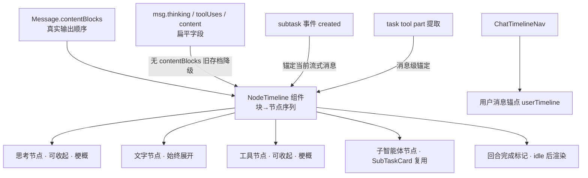
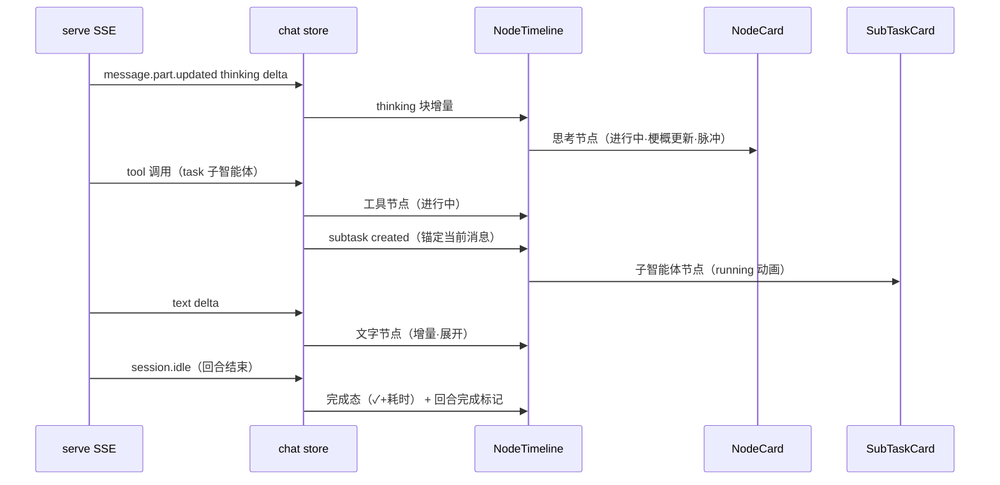

# 消息流时间线化-设计方案（会话面板改造 · 迭代 ③）

> 版本：v1.1 ｜ 状态：待复审 ｜ 读者：技术团队
> 关联：docs/原型/timeline-demo.html（视觉 demo v3，已确认方向）
> 镜像：docs/原型/消息流时间线化-原型文档.md

## 一、需求背景

### 1.1 现状

MessageBubble 已实现基础时间线渲染（竖线+圆点、thinking 折叠、tool 折叠、流式光标），但：
- 渲染逻辑全部内联在 MessageBubble 内部（非组件化）
- 子智能体卡片（SubTaskCard）是**会话级全局平铺**，不在时间线里
- 节点无「进行中/完成」两态动画；收起态无内容梗概
- 回合结束无完成标记（模型最后一个操作是 shell 静默结束时无任何显示）

### 1.2 用户故事

| 场景 | 用户角色 | 需求描述 |
|------|----------|----------|
| 回看助手工作过程 | 普通用户 | 一眼看到助手「做了什么」（思考→工具→子智能体→总结）的顺序 |
| 跳过思考细节 | 普通用户 | 思考默认收起，收起态能预览思考方向（梗概） |
| 查看工具细节 | 普通用户 | 工具一行标题（icon+梗概），点击展开 input/result |
| 感知进行中 | 普通用户 | 节点有「进行中（动画+内容更新）/完成（✓+耗时）」两态 |
| 回合边界清晰 | 普通用户 | 回合结束有完成标记（含耗时+系统时间），静默结束也有 |
| 回溯自己的消息 | 普通用户 | 时间线导航只锚用户消息 |
| 跟踪子智能体 | 普通用户 | 子智能体在时间线内（归属明确），功能与现状一致 |

### 1.3 范围

| 角色 | 可操作范围 | 本次是否覆盖 |
|------|-----------|-------------|
| 助手消息 | contentBlocks 重组为时间线节点序列 | ✅ |
| 子智能体 | 挂入时间线（归属规则）+ 样式适配 | ✅ |
| 用户消息 | 右侧独立气泡（不变）+ 指令徽标区分 | ✅（轻量） |
| 时间线导航 | 现有 ChatTimelineNav 只锚用户消息（验证+补测试） | ✅ |
| 指令模板库 / 会话详情 / 列表重设计 | 后续迭代 | ❌ |

## 二、架构设计

### 2.1 整体结构



### 2.2 关键设计决策

| 决策点 | 选择 | 理由 |
|--------|------|------|
| D1 时间线形态 | **回合级时间线**：一次回复（用户消息 → idle）= 一条时间线；多 step 产生的多条 assistant 消息**合并为一条线**（节点按全局顺序排，step 间不断裂）；用户气泡右侧独立 | 用户确认（回合级） |
| D2 节点类型 | 思考（收起+梗概）/ 文字（始终展开）/ 工具（收起+梗概）/ 子智能体（SubTaskCard 复用）/ 总结（最后 text 块 ✅ 标记） | 用户确认（demo v2） |
| D3 节点重组数据源 | **补丁方案（军师复审细化）**：**单写入点原则**——块边界判定（startsWith/隔断）从 buildContentBlocks 移植进 append 函数（appendText/appendThinking/addToolUse 按 SSE 事件序 push 块），setContentBlocks 降级为「contentBlocks 为空时初始化」（防全量覆盖冲掉 append 块；assistant 事件 content_blocks 恒完整假设已失效——实测增量模式只含 tool_result）；appendText 非流式调用点（ChatPanel 错误回显/useStreamProcessor L399）不产生新块；②历史 buildHistoryContentBlocks 改按 parts 原序（不聚合）③synthesizeBlocks 保留兜底；**存量聚合式 contentBlocks 无重建路径——声明为可接受降级，新存档下次加载生效** | 可行性实测 + 军师复审 |
| D4 相邻同类合并 | 连续同类块合并为单节点（thinking+thinking→单思考节点；text+text→单文字节点）；工具/子智能体打断后各自独立 | 用户确认（多思考交替场景） |
| D5 工具节点 | 统一节点：**收起态 = icon + 梗概**（按类型提取）+ 状态 + 耗时；点击展开 input/result（长结果截断） | 用户确认（压缩也标题行） |
| D6 思考节点 | 默认收起：**「💭 思考 + 梗概（前 60 字符动态）」+ 耗时**；展开全文 | 军师🟡4：保留现状 snippet 能力 |
| D7 文字节点 | 始终展开（正文直接显示）；最后 text 块标记为 ✅ 总结节点（绿底渐变） | 用户确认（demo ✅ 节点） |
| D8 节点两态 | **进行中**：琥珀脉冲动画（圆点呼吸+边框发光）+ 内容实时更新（三连点跳动）；**完成**：✓ + 耗时 | 用户确认（demo v3） |
| D9 回合完成标记 | idle 后时间线末尾渲染：`─── ✓ 回合完成 · 耗时 · HH:mm:ss ───`；**静默结束（最后节点是工具无文字）也有标记** | 用户确认（demo v3） |
| D10 收起态梗概 | 按节点类型提取：思考=内容前 60 字 / read=文件路径 / edit=文件路径 / bash=命令首行 / websearch=查询词 / task=子智能体任务 / compress=压缩摘要 / todowrite=当前进行中任务 / **grep=匹配模式（2026-08-10 补）** / glob/list/lsp/question（2026-08-09 反馈 #3 补） | 用户确认（demo v3） |
| D11 todo 节点 | todowrite = **单行**（`📋 更新待办 · 正在：<进行中任务>` + ✓）——**点击展开待办列表**；**复用 TodoRecordCard 折叠卡**（样式与回合结束记录节点统一，embedded 内嵌；busy 三连点 / ✓✗ 状态 / 工具耗时 透传） | 用户确认（demo v3）；**2026-08-10 拍板修订**：推翻「无展开交互」——默认一行展示进行中待办，点击展开 chips 列表 |
| D12 子智能体归属 | **task 工具节点由子智能体卡片代替（不重复展示——task 唯一作用是唤起子智能体，信息全含于卡片）**：tool=task 块/事件 → 子智能体节点；**锚定点 = task running 事件**（实测：pending 时 input 空 + 子会话未建——450ms 空窗；running 时 input 完整含 prompt + metadata.sessionId 可预关联子会话）；pending 期忽略（极简占位可选）；**块判定按小写 tool 名**（实测 part.tool 是小写 "task"，chat.ts:684 大写 "Task" 匹配不上——需规范化） | 用户确认（不重复展示）；实测时序修正 |
| D13 平铺收敛 | ChatPanel 全局平铺（实时）移除→进时间线；历史消息级平铺升级为时间线节点 | 军师🔴2 + 用户确认 |
| D14 子智能体复用 | SubTaskCard 功能全复用（三态/监视弹窗/详情弹窗/懒加载）；样式适配（竖线对齐/圆点/梗概/动画统一）；**task 工具不单独出节点**（D12） | 用户确认 |
| D15 指令徽标 | 用户消息检测 @agent（**中文词边界**：`@(双星|工匠|参谋|军师|侦查兵|制图师|导师|助理)(?=[\s,，。！？!?]|$)`——ASCII \b 对 CJK 无效）+ 斜杠命令（**复用 useSlashCommands 白名单**）→ 气泡徽标 + 边框色 | 军师🟡5 + 复审🟡5（词边界中文修正） |
| D16 导航 | 现有 ChatTimelineNav 只锚用户消息（userTimeline 已实现）——验证 + 补空态测试 | 军师🔴3：现状已实现 |
| D17 流式性能 | buildNodes = **computed 缓存**；节点 key 稳定（contentBlocks 索引/工具 id）；每秒 tick 不触发全量重建；相邻块合并可保折叠状态 | 军师🟡6 |
| D18 图标方案 | **Lucide 线性图标**（lucide-vue-next，用户确认；demo 对比 4 库后定稿）：节点图标映射 思考=brain / 工具兜底=wrench / websearch=globe / read=file-text / edit=pencil / bash=terminal / todo=square-check / 总结=flag / 发送=send（未知工具→wrench 兜底）；**子智能体=角色第一个字**（按角色分色：侦#7c3aed 紫 / 工#2563eb 蓝 / 谋#0d9488 青 / 军#9333ea 紫红 / 制#0891b2 青蓝 / 助#4f46e5 靛蓝），白色 700 字体 + 圆角方块底 | 用户确认（demo v4） |

## 三、技术方案

### 3.1 组件结构（新建/改造）

| 文件 | 操作 | 说明 |
|------|------|------|
| `NodeTimeline.vue` | 新建 | **回合级**时间线容器：竖线 + 节点序列 + 回合完成标记；接收 turn 结构（多条 assistant 消息聚合） |
| `NodeCard.vue` | 新建 | 通用节点卡片：标题行（icon+梗概+状态+耗时）+ 展开收起 + 进行中动画 |
| `MessageBubble.vue` | 改造 | 用户分支保留（指令徽标）；助手分支 → NodeTimeline（回合容器内） |
| `ChatPanel.vue` | 改造 | **回合分组容器**：role 序列 computed（用户消息 + 连续 assistant 消息归当前回合——流式新 step 插入自动吸收，idle 只驱动完成标记不参与分组）；移除全局平铺；平铺收敛 |
| `chat.ts` | 改造 | append 三函数签名 + 块边界判定移植（D3）；buildHistoryContentBlocks 原序化；存量降级声明 |
| `useStreamProcessor.ts` | 改造 | assistant 全量事件 setContentBlocks 降级（仅空初始化）；task 块判定小写规范化 |
| `ChatTimelineNav.vue` | 验证 | 只锚用户消息（已实现）——补测试 |

### 3.1a 实施拆分（军师复审：13.5h → 16-17h）

| 阶段 | 任务 | 预估 |
|------|------|------|
| 3a 数据层 | append 签名 + 块边界判定移植 + buildHistoryContentBlocks 原序 + 存量降级声明 + nodeSummary.ts/buildTurnNodes 纯函数及测试 | 2-3h |
| 3b 渲染层 | ChatPanel 回合分组容器 + MessageBubble 分支切换 + 平铺收敛 + 子智能体归属（running 锚定） | 2-3h |

### 3.2 节点重组规则（D3/D4，回合级）

```typescript
// 回合 = 一条用户消息 + 其后的全部 assistant 消息（step 分割不断线）
// contentBlocks 为顺序来源（D3 补丁：流式按事件序 push，历史按 parts 原序）；tool_result 块跳过
function buildTurnNodes(turn: { user: Message; assistants: Message[] }): TimelineNode[] {
  const nodes: TimelineNode[] = [];
  let lastKind: string | null = null;
  for (const msg of turn.assistants) {
    const blocks = msg.contentBlocks ?? synthesizeBlocks(msg); // 旧存档降级
    for (const b of blocks) {
      if (isToolResultBlock(b)) continue;
      if (isTaskToolBlock(b)) { nodes.push(createSubTaskNode(b)); lastKind = 'subtask'; continue; } // D12：task 由子智能体代替
      const kind = blockKind(b); // text | thinking | tool | file
      if (kind === lastKind && kind !== 'tool') {
        mergeIntoLastNode(nodes, b); // 相邻同类合并（D4，含跨消息连续）
      } else {
        nodes.push(createNode(kind, b));
        lastKind = kind;
      }
    }
  }
  const last = nodes[nodes.length - 1];
  if (last?.kind === 'text') last.isSummary = true; // 最后 text 块 → ✅ 总结（D7）
  return nodes;
}
```

### 3.3 节点卡片（NodeCard）变体与梗概（D10）

| 变体 | 收起态标题行 | 展开内容 | 默认 |
|------|--------------|----------|------|
| thinking | 💭 思考 + 前 60 字梗概 + 耗时 | 思考全文 | 收起 |
| text | （无标题行——直接正文） | — | 始终展开 |
| tool | icon + 工具名 + 梗概 + ✓/✗ + 耗时 | input + result | 收起 |
| todo | 📋 更新待办 · 正在：\<in_progress 任务\> + ✓ | 待办列表（TodoRecordCard chips，与回合记录节点统一） | 收起（点击展开，2026-08-10 修订） |
| subtask | 🕵️ agent 名 + 任务梗概 + ✓ + 耗时 | SubTaskCard 现有行为 | 收起 |
| summary | ✅ 总结（绿底渐变，始终展开） | — | 始终展开 |

**梗概提取函数**（每工具类型一个，放 `nodeSummary.ts` 纯函数模块，可测试）：

```typescript
export function toolSummary(tool: { name: string; input?: unknown; result?: unknown }): string {
  switch (tool.name) {
    case 'read': return String(tool.input ?? '').split('\n')[0].slice(0, 60); // 文件路径
    case 'edit': return String(tool.input ?? '').split('\n')[0].slice(0, 60); // 文件路径
    case 'bash': return firstLine(tool.input).slice(0, 60);                    // 命令首行
    case 'websearch': return firstLine(tool.input).slice(0, 60);              // 查询词
    case 'compress': return '已压缩历史消息（保留最近 N 轮）';                   // 固定文案
    case 'todowrite': return `正在：${currentTask(tool.input)}`;               // 进行中任务
    default: return '';                                                        // 无梗概
  }
}
```

### 3.4 两态与动画（D8）

| 状态 | 样式 | 内容 |
|------|------|------|
| 进行中 | 琥珀脉冲（圆点 box-shadow 呼吸 1.4s + 边框琥珀 0.5 透明度 + 头部浅琥珀底）+ 三连点跳动（`· · ·` 依次亮起上跳） | 流式增量实时更新（thinking/文字/tool result 流式） |
| 完成 | ✓ 绿 + 耗时 | 定格 |

### 3.5 回合完成标记（D9）

- 数据：消息 `isStreaming=false`（idle 达成）→ 渲染标记
- 内容：`─── ✓ 回合完成 · {durationMs} · {HH:mm:ss} ───`（系统时间 = 完成时刻 Date.now）
- **静默结束**（最后节点是工具无文字）同样渲染（防「无任何显示」）

### 3.6 子智能体归属（D12/D13/D14）

- **展示形态**：tool=task 的块/事件 → **直接生成子智能体节点**（SubTaskCard），不单独渲染 🔧 task 工具节点（task 唯一作用是唤起子智能体——信息全含于卡片）
- **实时**：**task running 事件**（实测：pending 时 input 空 + 子会话未建——450ms 空窗；running 时 input 完整含 prompt + metadata.sessionId 可预关联子会话）→ 子智能体节点（running，任务梗概取自 input.prompt/description）→ 子会话 created 补 agent 名 → idle 更新摘要
- **历史**：task tool part 提取（extractSubTaskIds 已有）→ 子智能体节点（已完成态）
- **平铺收敛**：ChatPanel 全局平铺 v-for 移除；历史消息级平铺移除（NodeTimeline 内渲染）
- **统一节点数据模型**：实时 subTasks 动态 vs 历史 done 态静态合并为同一节点模型（SubTaskCard 六项接线：subtask/expanded/summary-loader/@expand/@detail/@monitor 复用 + 样式适配）

### 3.7 用户消息指令徽标（D15）

- `@(双星|工匠|参谋|军师|侦查兵|制图师|导师|助理)\b` 词边界正则（避免 a@b.com 误判）
- 斜杠命令：useSlashCommands 白名单匹配（复用现有来源）
- 展示：气泡左上角徽标（@agent 紫 / 命令 蓝）+ 边框色微调

## 四、关键流程

### 4.1 时序图（流式回合）



### 4.2 异常流程

| 异常场景 | 处理 |
|----------|------|
| 流式期间 thinking 高频增量 | 思考节点收起态只渲染梗现行；computed 缓存节点序列（D17） |
| 工具 result 超长 | 现有截断机制（200 行/51200B），展开显示截断预览 |
| 无 contentBlocks 旧存档 | synthesizeBlocks 三段式降级（顺序退化可接受） |
| 子智能体 stale（切会话丢事件） | SubTaskCard 现有 stale 态 |
| 静默结束（最后操作工具无文字） | 回合完成标记兜底（D9） |
| 相邻块合并后用户展开 | 合并节点展开 = 各块内容连续显示（保序） |

## 五、测试要点

### 5.1 新组件用例

| 测试场景 | 预期 |
|----------|------|
| buildNodes 顺序（contentBlocks 交错） | 真实输出顺序还原 |
| 相邻同类合并 / 工具打断分离 | 合并规则正确 |
| 无 contentBlocks 降级 | 三段式兜底 |
| 工具梗概提取（8 类型） | 提取正确 |
| 思考节点收起（梗概）/展开全文 | 交互正确 |
| 文字节点不收起 / 最后 text → ✅ 总结 | 渲染正确 |
| todo 节点单行无展开 | 无展开交互 |
| 进行中动画类 / 完成态 | 状态切换 |
| 回合完成标记（耗时+系统时间） | 静默结束也渲染 |
| 子智能体归属（实时锚定/历史 part） | 挂载位置正确 |
| 指令徽标（@词边界/命令白名单） | 匹配正确 |

### 5.2 现有用例迁移（军师🟡7）

- MessageBubble.test.ts ~20 用例断言 contentBlocks 渲染结构（.tl-thinking/.tl-tool/.stream-cursor）→ 迁移到 NodeTimeline/NodeCard 测试（断言类名对应新组件）
- SubTaskCard.test 补时间线样式断言；ChatPanel.test stub 三组件更新
- 测试预算 3-4h

## 六、风险与边界

| 风险 | 等级 | 应对 |
|------|------|------|
| contentBlocks 结构差异（历史消息） | 中 | 降级路径 + 测试覆盖 |
| 流式性能（thinking 高频 + 每秒 tick） | 低 | computed 缓存 + 稳定 key + 收起态轻渲染（D17） |
| 子智能体双渲染 | 中 | 平铺收敛（D13）+ 归属规则（D12） |
| 现有测试破坏面 | 中 | 迁移计划（5.2）+ 预算 3-4h |

## 七、实施计划

| 阶段 | 任务 | 预估工时 |
|------|------|----------|
| 纯函数 | nodeSummary.ts（梗概提取）+ buildNodes 重组 + 测试 | 2h |
| 组件 | NodeCard.vue（6 变体 + 两态动画）+ NodeTimeline.vue（竖线/合并/回合标记） | 4h |
| 改造 | MessageBubble 助手分支 → NodeTimeline；用户徽标；ChatPanel 平铺收敛 + 子智能体归属 | 3h |
| 导航 | ChatTimelineNav 验证 + 空态测试 | 0.5h |
| 测试 | 现有用例迁移 + 新组件用例 + 回归 + 制图师视觉验收 | 4h |
| **合计** | | **13.5h** |

## 八、变更记录

| 版本 | 日期 | 变更内容 | 作者 |
|------|------|----------|------|
| v1.0 | 2026-08-09 | 初稿（demo v1 方向确认） | 双星 |
| v1.1 | 2026-08-09 | 军师审查 8 项全吸收（🔴contentBlocks 数据源/子智能体归属/现状描述；🟡snippet/徽标边界/computed 缓存/测试预算/总结变体）；用户四轮反馈（收起态梗概/todo 单行无展开/两态动画/回合完成标记+系统时间）；子智能体归属规则（实时锚定+历史 part）+ 平铺收敛 | 双星 |
| v1.2 | 2026-08-09 | **可行性实测定稿**：A 顺序补丁（流式事件序 push 块 + 历史 parts 原序构建 + 降级兜底）；B 子智能体锚定实测（task 工具 part 流转存在）→ **task 节点由子智能体卡片代替**（用户确认不重复展示）；回合级时间线（多 step 多条 assistant 消息合并一线，用户确认）；思考多段合并确认；新增「OC 支持性验证」结论（见二） | 双星 |
| v1.3 | 2026-08-09 | 军师复审细化：D3 单写入点原则（块边界判定移植 append、setContentBlocks 降级仅空初始化、存量聚合降级声明）；D12 锚定点改 task running（pending 空窗 450ms 实测）；task 块判定小写规范化（chat.ts:684 大写匹配不上）；渲染层回合分组容器（role 序列 computed）；实施拆分 3a/3b（13.5h→16-17h）；D15 中文词边界修正（ASCII \b 对 CJK 无效）；task 唯一作用=唤起子智能体（用户确认去重成立） | 双星 |
| v1.4 | 2026-08-09 | **图标方案定稿**（D18）：Lucide 线性图标（用户确认，4 库对比 demo）——节点图标映射 + 未知工具 wrench 兜底；子智能体文字图标（角色首字 + 6 色分色）；需要安装 lucide-vue-next | 双星 |
| v1.5 | 2026-08-10 | **D11 拍板修订**（用户验证反馈）：todo 更新节点推翻「无展开」——默认一行展示「正在：\<进行中任务\>」，点击展开整个待办列表；**复用 TodoRecordCard 折叠卡**（新增 title/summaryText/timeText/busy/status 变体 props），样式与回合结束记录节点统一 | 双星 |
| v1.6 | 2026-08-10 | **对话布局与节点细节 5 项修订**（用户验证反馈）：①**左右对话布局**——去掉「✦ 模型头像 + 模型名」时间线头部（推翻反馈 #1 方案），时间线直接开始节点序列，用户消息右侧气泡（分形左 / 用户在右）；②**text 节点不显示耗时**（推翻反馈 #5：demo 中耗时只在节点标题行）；③**除文本节点外统一卡片边框**——thinking/tool/todo 同款（border-dim + radius 6px + bg-root），text 无边框正文，subtask 由 SubTaskCard 自带；④**grep 补收起态梗概**（D10：匹配模式）；⑤text 节点 md 渲染确认（NodeCard text 变体已用 MarkdownRenderer，无需改动） | 双星 |
| v1.7 | 2026-08-10 | **服务端耗时透传 + 布局落地 + busy 语义修正**（制图师截图 3 问题）：①**节点耗时服务端透传**——serve ToolState.time / ReasoningPart.time 主链路透传（流式 events.ts：tool_use 带 startedAt、tool_results 带 executionDurationMs；历史 ipc.ts：thinking 块 durationMs + toolUse startedAt/executionDurationMs；前端服务端值优先、客户端计时兜底；后台会话同步透传；多工具交错按 tool_use_id 定位；负耗时钳 0）；②**左右对话布局落地**——NodeTimeline 外包 .assistant-col（头像「分」+ 限宽 76% 左对齐），与用户右侧气泡呼应；③**todo 进行中节点 busy 不显示 ✓/✗**（`status && !busy`） | 双星 |
