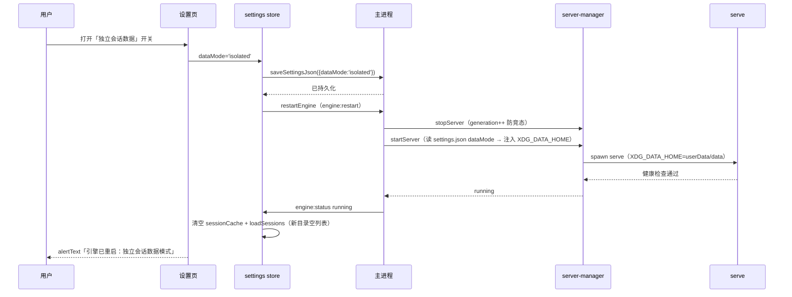

# 设置页设计方案

> 版本：v1.0 ｜ 状态：待确认 ｜ 读者：技术团队
> 镜像文档：docs/原型/设置页原型文档.md

## 一、背景与目标

设置页（SettingsPanel.vue，644 行）自迁移以来已迭代多轮（DeepSeek 专属重写、权限 6→4、关于区三行版本、重新显示引导页），但从未有设计文档。本次：
1. **逆向补全现状设计**（分区结构、交互模式、持久化链路）
2. **新增数据模式开关**（用户需求：会话数据共享/独立由用户决定）

## 二、现状盘点（逆向）

### 2.1 页面结构（6 区 + footer）

| 分区 | 内容 | 交互 |
|---|---|---|
| 头部 | 返回按钮 + 标题 | router.push('/chat') |
| LLM 设置 | API Key（password）+ baseUrl + 测试连接 + contextLimit（M/K/数字解析）+ 推理 URL（polish 用） | input + 按钮；isTesting 转圈 |
| 工作区设置 | cwd（readonly 显示）+ 浏览按钮 | openDialog({directory:true}) |
| 界面设置 | 语言/主题/字号 下拉 + 权限模式（4 项带 icon/cliKey/desc）+ 思考深度（有 variants 才显示）+ 重新显示引导页 | settings-dropdown 统一下拉模式 |
| 高级设置 | 折叠区：settings.json JSONC 编辑器 | showAdvanced 切换 + SettingsJsonEditor |
| Footer 关于 | 分形 v0.1.0 + OC 引擎 + 预置包 + 变更日志 | 固定底部 |

### 2.2 交互模式（已成型约定）

- **settings-dropdown 统一模式**：`openDropdown === 'lang'|'theme'|'font'|'perm'|'effort'` 单开（toggleDropdown/closeDropdowns），Transition drop-settings（120ms/100ms），选中高亮 accent-glow
- 持久化：settings store（Pinia）→ localStorage + SQLite；**主题/语言额外双写 settings.json**（applySettingsJson 仅文件真实存在时覆盖——主题持久化修复遗产）
- 版本显示：app:getInfo（分形版本 + engineVersion + presetVersion）

### 2.3 现有数据流

```
SettingsPanel ──v-model──▶ settings store（Pinia）
   │                          ├─ localStorage（UI 偏好）
   │                          └─ SQLite（settings 持久化）
   ├─ saveProviderConfig IPC ─▶ 主进程：写 oc-config（json+jsonc 双写）+ 重启 serve
   ├─ saveSettingsJson IPC ───▶ 主进程：写 settings.json（主题/语言）
   └─ 测试连接 IPC ───────────▶ 主进程：provider 校验
```

## 三、关键设计决策

| 编号 | 决策 | 理由 | 备注 |
|---|---|---|---|
| **D1 数据模式开关** | 新增「独立会话数据」开关（默认**开**=独立） | 用户需求：数据共享/独立由用户决定；默认独立是 2026-08-12 实测定案——shared 与其他 opencode 实例同库会被 SQLite 锁竞争静默杀掉（`settings.ts:186` 注释） | 核心新增，见四 |
| D2 开关归属 | 数据模式放**高级设置区**（JSONC 编辑器上方） | 引擎行为级设置，非 UI 偏好；避免 LLM 区混杂 | 含说明文案 |
| D3 数据模式持久化 | 存 **settings.json 的 `dataMode: 'shared'\|'isolated'`** 字段（主进程读写现成通道） | 主进程 startServer 需在渲染层就绪前知道该值；settings.json 是主进程侧持久化 | **P0（军师）**：`parseAndValidate`（settings.ts:107）只保留 DEFAULT_SETTINGS 已知 key，未知 key 静默丢弃——dataMode **必须加入 DEFAULT_SETTINGS + settings.schema.json**，否则主题 watch 重建对象写盘即抹掉；也**不进 UI 偏好 watch** |
| D4 生效方式 | 切换后**自动重启 serve**（进程级 env 必须重启） | XDG_DATA_HOME 注入是 spawn env；不重启不生效 | **复用现有 `engine:refresh` IPC（ipc.ts:713，stopServer+startServer）**，不新增通道，扩展返回值；settings.json 是 JSONC（可注释）不能直接 JSON.parse，读写必须走 settings 模块（无 loadSettingsJson 通道） |
| D5 数据目录 | 独立模式：`<userData>/data/opencode/`（XDG_DATA_HOME=userData/data） | storage/log/repos/snapshot/tool-output 全隔离 | 配置隔离（XDG_CONFIG_HOME）保持独立不动；**注**：共享模式 Windows 默认数据目录（未设 XDG_DATA_HOME 时）位置未实测（`~/.local/share` 为 Linux 路径），实施时实测记录 |
| D6 切换副作用 | 重启前 **chat:stopSession 收尾活跃流**（防 isStreaming 悬挂）；重启后清空会话缓存（**sessionCache 需新增 clear 方法**）+ 清 activeSessionId/messages + 重新 loadSessions | 防旧数据目录会话残留显示 + 防切换打断流式会话悬挂 | 会话列表自动跟随新数据目录 |
| D7 切换反馈 | 重启期间 alertText「正在重启引擎…」；完成后提示当前模式 | 用户感知切换生效；首次切独立时列表为空需说明 | 开关旁常驻说明文案「独立模式仅显示本应用创建的会话」 |
| D8 失败回滚 | 切换后 serve 启动失败 → **还原 settings.json 旧值 → 再调 startServer（读回滚后值）→ 二次失败才报错** | 防「开了独立模式但引擎起不来」的不可用态；startServer 失败语义是 throw（3 次重试后 serve 已停），仅还原开关值不重启=引擎停摆 | 前端 isRestarting 锁防连点；连续切换靠 server-manager startGeneration 兜底 |
| D9 切回共享 | 关开关 → serve 重启 → 共享数据目录会话恢复 | 数据零丢失（共享目录从未被删） | 无需迁移逻辑 |

## 四、数据模式开关设计（D1 展开）

### 4.1 开关语义

| 状态 | 注入 | 会话来源 | 适用 |
|---|---|---|---|
| 开（默认） | `XDG_DATA_HOME=<userData>/data` | `<userData>/data/opencode`（仅本应用） | 完全隔离：分形只见自己的会话（默认——shared 同库会被 SQLite 锁竞争静默杀掉，2026-08-12 实测定案） |
| 关 | 不注入 XDG_DATA_HOME | `~/.local/share/opencode`（全局共享） | 需要与其他工具共享会话时手动开启 |

### 4.2 时序（开启）



### 4.3 server-manager 注入实现

```ts
// startServer 读取（主进程，早于渲染层）
const cfg = readSettingsJson(userDataDir);          // 现有通道
const env = { ...process.env, OPENCODE_APPNAME: undefined };
if (cfg.dataMode === 'isolated') {
  env.XDG_DATA_HOME = path.join(userDataDir, 'data');
}
// spawn(bin, args, { env })
```

### 4.4 异常流程

| 场景 | 行为 |
|---|---|
| 切换后 serve 启动失败 | 回滚 dataMode 原值（settings.json + store）→ alertText 报错「引擎重启失败，已恢复原模式」 |
| 独立模式下会话列表为空 | 属正常（新数据目录）——开关旁说明文案兜底 |
| 切回共享后会话「消失」再出现 | 重启瞬间列表空 → 完成后 loadSessions 恢复共享会话（数据未动） |
| 卸载重装 | 共享/独立目录都保留（用户数据不自动删） |

## 五、前端设计

### 5.1 新增 UI（高级设置区）

```
┌─ 高级设置 ──────────────────────────┐
│ [折叠按钮 ▾ 高级设置]                │
│ ┌─────────────────────────────────┐ │
│ │ 独立会话数据  [开关]             │ │
│ │ （说明：开启后会话只保存在本应用 │ │
│ │   的数据目录，与其他工具隔离）   │ │
│ └─────────────────────────────────┘ │
│ JSONC 编辑器（现有）                 │
└─────────────────────────────────────┘
```

- 开关组件：沿用现有 toggle 样式（检查 AppShell/设置页是否已有 toggle——无则新增 switch 样式，accent 开启态）
- i18n：settings.dataModeLabel / dataModeDesc（zh/en）

### 5.2 settings store 变更

- **`dataMode: 'shared' | 'isolated'`（默认 'shared'）加入 `DEFAULT_SETTINGS` + `settings.schema.json`**（P0：parseAndValidate 只保留已知 key，不入默认即被丢弃）
- **不进 UI 偏好 watch 数组**（主题/语言 800ms 防抖重建对象写盘会抹掉 dataMode——P0）；切换时显式经 `settings:saveSettings` 写主进程
- 新增 `setDataMode(v)` + 切换副作用（stopSession → refreshEngine → 清缓存 → loadSessions）
- 新增 `isRestarting` ref（前端锁，防连点）

### 5.3 IPC 变更

- **复用现有 `engine:refresh`**（ipc.ts:713，stopServer + startServer）——扩展返回值 {ok, error?}；不新增 engine:restart
- **启动时序（P0）**：index.ts 的 watchSettings → loadSettings 是 void 不 await——startServer 前**必须 await 读 settings.json 的 dataMode**（或 await loadSettings），否则独立模式首次启动读到默认值失效
- preload ALLOWED_INVOKE 不变（engine:refresh 已存在）

## 六、测试要点

| 层 | 用例 |
|---|---|
| server-manager | spawn env 注入断言（dataMode=isolated → XDG_DATA_HOME 存在；shared → 无）；重启后新 env 生效 |
| ipc | engine:restart 调用链（mock stopServer/startServer）；settings.json dataMode 读写 |
| settings store | dataMode 默认值/切换/持久化（settings.json 通道 mock） |
| SettingsPanel | 开关渲染/切换调用 setDataMode/说明文案显示 |
| 回归 | 现有 601 用例不回归（主题/权限/版本区） |

## 七、风险与边界

- **数据目录误删风险**：独立模式下用户删除 userData 目录会丢独立会话（共享模式不受影响）——文档说明，不做回收站
- **双数据目录并存**：切来切去产生两套会话（共享一套 + 独立一套），互不可见——这是设计语义（开关决定看哪套），非缺陷
- **启动时序**：startServer 在主进程早期——dataMode 读取必须 await（见 5.3 P0）；settings.json 损坏（JSON.parse 失败）按 shared 兜底
- **切换竞态**：渲染层 isRestarting 锁 + server-manager startGeneration 双保险；回滚写盘触发 config-changed 广播（幂等无碍）
- **e2e**：跑 isolated 用例后必须还原（重置 settings.json / 删 data 目录），否则后续会话断言全挂

## 八、变更记录

| 版本 | 日期 | 内容 |
|---|---|---|
| v1.0 | 2026-08-08 | 初稿：现状逆向 + 数据模式开关（D1-D9） |
