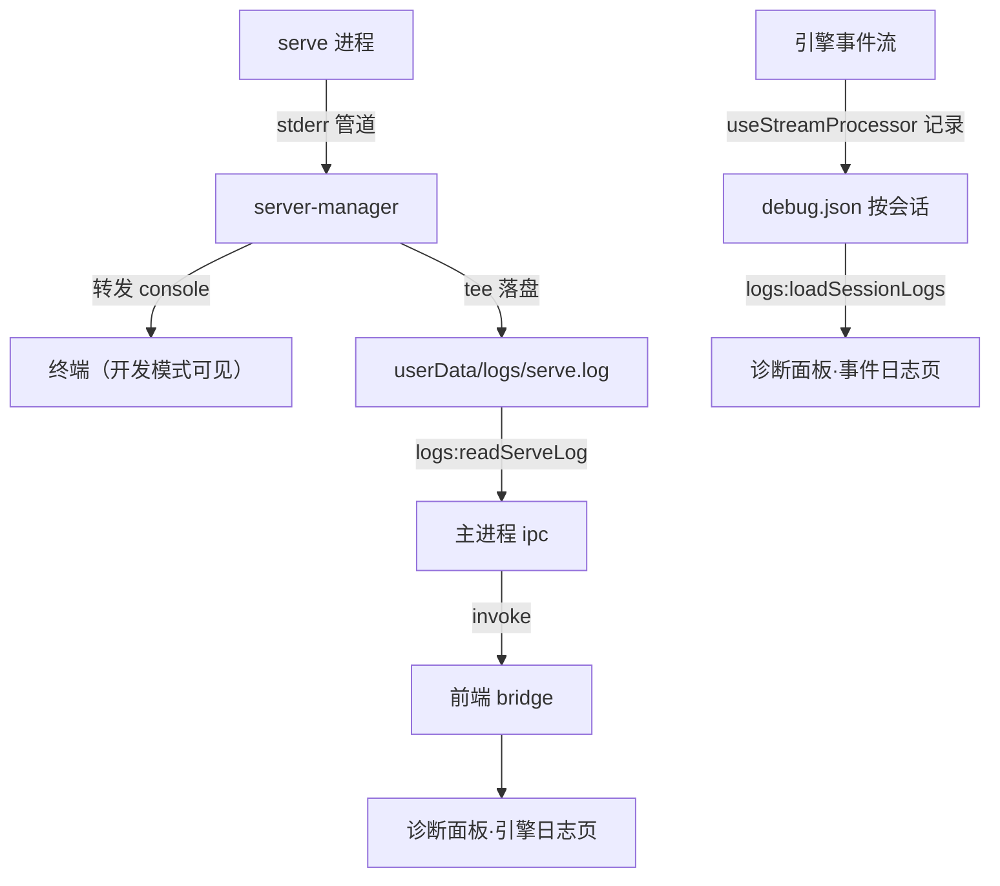
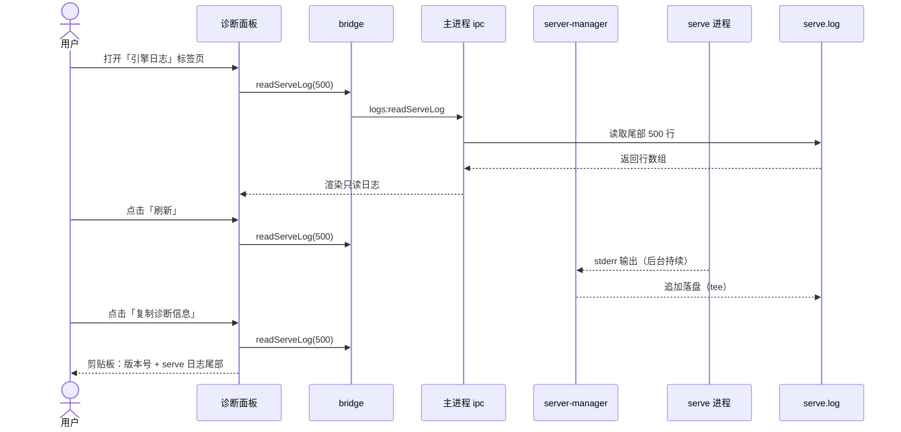

# 诊断面板改造 — 功能设计方案

> 版本：v1.1
> 日期：2026-08-08
> 作者：技术研发
> 状态：已评审（军师 🟡12 已吸收）

---

## 一、需求背景

### 1.1 现状

分形的「调试」面板是从 cc-gui（CC 时代）迁移的机制，存在两个缺陷：

1. **引擎报错不可见**：serve（OC 引擎）的 stderr 只转发到终端（server-manager.ts L274），从不落盘。打包版用户（无控制台）打开调试面板，看不到任何引擎报错（如插件加载失败、模型调用失败）。
2. **CC 遗留未适配**：`useStderrLog.ts` 注释明证是 CC 时代设计（「CC --verbose LLM 请求详情 stderr 日志」），CC 有 `--verbose` 参数输出 LLM 请求详情，OC 无对应输出——该日志源**从未有数据写入**，stderr.json 是死数据。

### 1.2 用户故事

| 场景 | 用户角色 | 需求描述 |
|------|----------|----------|
| 遇到报错求助 | 普通用户（打包版） | 遇到功能异常时，能在应用内看到引擎日志，一键复制给支持人员 |
| 排查问题 | 开发者 | 不用开终端也能看到 serve 引擎日志（插件报错/模型报错） |
| 会话操作追溯 | 开发者 | 查看某会话内发生了哪些引擎事件（权限响应/提问回复/错误） |

### 1.3 范围

| 角色 | 可操作范围 | 本次是否覆盖 |
|------|-----------|-------------|
| 普通用户 | 打开面板 → 查看日志 → 一键复制诊断信息 | ✅ |
| 开发者 | 查看 serve 引擎日志（全局）+ 会话事件日志 | ✅ |
| 开发者 | DevTools 控制台（Electron 调试工具） | ❌（独立能力，不归本面板） |
| 任意角色 | 按会话隔离的 LLM 请求详情（CC --verbose 语义） | ❌（OC 无此输出，机制废除） |

---

## 二、架构设计

### 2.1 整体数据流



### 2.2 关键设计决策

| 决策点 | 选择 | 理由 |
|--------|------|------|
| D1 引擎日志粒度 | **全局单文件** serve.log（非按会话） | serve 是全局进程，日志天然不属于某个会话；按会话归档需解析会话 ID，成本高收益低 |
| D2 落盘位置 | `userData/logs/serve.log`（%APPDATA%\oc-gui\logs\） | 与 session-logs 同根目录，符合既有目录约定；打包/开发路径一致 |
| D3 写入方式 | server-manager stderr 管道 **tee 双写**（console + 文件） | 现有 L274 已有管道转发，加一行落盘即可；console 转发保留（开发模式终端可见） |
| D4 CC 遗留处理 | **删除 useStderrLog 及其 stderr.json 写入**，stderr 标签页改读 serve.log | OC 无 --verbose 输出，按会话的 stderr 机制无数据源；serve.log 是唯一真实引擎日志 |
| D5 日志轮转 | serve.log 超 10MB → 改名 serve.1.log（覆盖旧档），保留 1 份 | 防止无限增长；插件日志量大（如向量模型日志）；开发可随时删文件 |
| D6 事件日志精简 | debug.json 保留关键事件（错误/权限/提问/引擎状态/历史重载），**去掉逐条事件流明细**（现 L182 每事件 50 字截断刷屏） | 验证发现：现 debug.json 里 `📨 event: error` 只记事件类型**不含错误内容**（实测 `text=` 为空）——精简时补一个错误事件记录点（case error → 记录 message），否则精简后错误信息反而丢失 |
| D7 面板文案 | 面向用户：标题「诊断信息」+ 复制按钮打包 serve.log 尾部 + 版本信息 | 面板定位从「开发者调试工具」转为「用户反馈通道」（此前已与用户对齐方向） |
| D8 日志读取 | 新增 IPC `logs:readServeLog`（读尾部 N 行，默认 500）+ 刷新按钮重读 | 文件可能很大，只读尾部；刷新让用户看到「刚才的操作产生了什么日志」 |

---

## 三、后端设计

### 3.1 server-manager.ts — serve stderr 落盘

**文件：** `electron/main/server-manager.ts`（L273 附近）

```typescript
// serve stderr 双写：console 转发（开发排查）+ 落盘（面板引擎日志）
// 注意：日志目录必须注入式（options.userDataDir）——测试环境传 tmpdir，不可用 app.getPath('userData')（会写真实用户数据）
const logDir = join(options.userDataDir, 'logs')
const logFile = join(logDir, 'serve.log')
child.stderr?.on('data', (d: Buffer) => {
  // 输出编码可能 UTF-16 或 UTF-8，双解码尝试（现状保留）
  const text = decode(d)
  console.error(`[serve] ${text}`)
  // 落盘：追加写（[HH:mm:ss] 时间戳前缀，跨重启可区分先后）；超过 10MB 轮转（serve.1.log 覆盖旧档）
  appendServeLog(logFile, text)
})
```

轮转逻辑 `appendServeLog`：
- 首次调用 `mkdir(logDir, { recursive: true })`（userData/logs 首启不存在，不建则 appendFile 静默失败吞日志）
- **写入用 `createWriteStream({ flags: 'a' })`**（高频 stderr 不能 appendFileSync 阻塞主进程；console 转发保留现有 slice(0,500) 截断，**落盘写完整文本**）
- 写前 stat 文件大小 > 10MB 时 rename 为 serve.1.log 再新建；**rename 失败（Windows 文件占用）降级：继续追加写当前文件 + console 警告一次**（日志不能影响主流程）
- 落盘行加 `[HH:mm:ss]` 前缀

### 3.2 ipc.ts — 新增日志读取通道

**文件：** `electron/main/ipc.ts`（logs 区，L392 附近追加）

```typescript
// 读取 serve 引擎日志尾部（诊断面板引擎日志页）
ipcMain.handle('logs:readServeLog', async (_e, args: { lines?: number }) => {
  // 参数：lines 正整数 1-5000，缺省 500
  // 读取 userData/logs/serve.log 最后 N 行（大文件从尾部读，避免全量加载）
  // 文件不存在 → 返回空数组
  return { lines: string[] }
})
```

实现要点：大文件尾部读取（fs.open + 从文件尾向前扫描换行符 N 个），避免 10MB 文件全量读入内存；**字节扫描 0x0A 后需 Buffer 定位到整行边界再 decode（防止切在多字节 UTF-8 字符中间出 �）**。

### 3.3 移除 CC 遗留（stderr.json 机制）

**文件：** `electron/main/ipc.ts`

- 删除 `logs:saveSessionStderrLog` handler（L399-402）
- `logs:loadSessionLogs` 返回结构改为 `[debugJson]`（去掉 stderr 槽位）

> 注意：删除前 grep 确认 `saveSessionStderrLog` 无其他调用方（bridge 里同步删）。

### 3.4 审计日志

不涉及敏感数据，无需审计。

---

## 四、前端设计

### 4.1 bridge 变更

**文件：** `src/renderer/src/lib/electron-bridge.ts`

```typescript
// 新增：读引擎日志尾部
export async function readServeLog(lines = 500): Promise<string[]>
// 删除：saveSessionStderrLog / loadSessionLogs 的 stderr 槽位
```

### 4.2 preload 白名单

**文件：** `electron/preload/index.ts`

- ALLOWED_INVOKE 加 `'logs:readServeLog'`
- ALLOWED_INVOKE 删 `'logs:saveSessionStderrLog'`

### 4.3 useStderrLog 移除

**文件：** `src/renderer/src/composables/useStderrLog.ts` — 删除

**文件：** `src/renderer/src/composables/useStreamProcessor.ts`

- L129 `const stderrLog = useStderrLog()` 删除
- L361 `saveSessionStderrLog(...)` 删除
- 依赖 useStderrLog 的测试同步清理

**文件：** `src/renderer/src/components/chat/ChatPanel.vue`（grep 确认 7 处引用，全部删除）

- L53 `useStderrLog()` 实例化
- L95 `copyStderrLog()`（复制 stderr 内容函数）
- L277 `setSession` 中 stderr 清空/重置
- L285 `importLines(stderrJson)`（loadSessionLogs 解构 `[debugJson, stderrJson]` → 改 `[debugJson]`，返回结构同步变单元素）
- L565 `clear()` 中 stderr 清理
- 模板 L997/999/1007/1013/1070/1081-1087（stderr 标签页/展示/按钮）

### 4.4 事件日志精简（debug.json）

**文件：** `src/renderer/src/composables/useStreamProcessor.ts`

- **删除** L182 逐条事件明细 `debugLog.add(\`📨 event: ...\`)`（最高频刷屏点）
- **新增** `case "error"` 记录点：`debugLog.add(\`❌ ${translateError(...) 后的内容}\`)`（现状 L377-382 无任何 debugLog 记录——不补则原型 F-06「错误含错误内容」不达标；错误事件是排查核心）
- **保留**：L280-282 权限事件、L385 unknown type、L410 引擎状态、L436-441 历史重载、ChatPanel 错误/权限响应/提问回复

### 4.5 ChatPanel 诊断面板改造

**文件：** `src/renderer/src/components/chat/ChatPanel.vue`（L997-1089 区域）

**改造点：**

1. 面板标题「调试」→「诊断信息」
2. 两个标签页：**事件日志**（debugLog，按会话）/ **引擎日志**（serve.log，全局）
3. 引擎日志页：进入时 readServeLog() 拉尾部 500 行 + 「刷新」按钮重读 + 只读 pre 展示
4. 复制按钮：当前标签页复制；新增「复制诊断信息」= serve.log 尾部 + 版本号 + 应用名打包——**版本号来源新增 IPC `app:getInfo`**（返回 { name, version }，用 app.getName()/app.getVersion()；全项目无现成通道，preload 白名单同步加）
5. 按钮显示条件**统一为「只看事件日志非空」**（删 stderrLog 后渲染层无从得知 serve.log 是否非空；引擎页空态由 readServeLog 空数组兜底「暂无引擎日志」）
6. 面板底部加提示文案：「日志用于排查问题，可复制后发给开发者」，复制诊断信息提示加「日志可能包含本地路径」警告

### 4.6 路由/权限配置

无需修改（面板是 ChatPanel 内部组件，无独立路由）。

---

## 五、数据库变更

**无需变更**（日志文件落盘，不涉及 SQLite）。

---

## 六、文件变更清单

### 主进程

| 操作 | 文件 | 说明 |
|------|------|------|
| 修改 | `electron/main/server-manager.ts` | serve stderr tee 落盘 + 10MB 轮转（userDataDir 注入式 + createWriteStream + 时间戳 + 轮转降级） |
| 修改 | `electron/main/ipc.ts` | 新增 logs:readServeLog + app:getInfo；删 logs:saveSessionStderrLog；loadSessionLogs 去 stderr 槽位 |
| 修改 | `electron/preload/index.ts` | 白名单加 logs:readServeLog + app:getInfo、删 logs:saveSessionStderrLog |

### 渲染进程

| 操作 | 文件 | 说明 |
|------|------|------|
| 修改 | `src/renderer/src/lib/electron-bridge.ts` | readServeLog + getAppInfo 新增；saveSessionStderrLog/loadSessionLogs stderr 删除 |
| 删除 | `src/renderer/src/composables/useStderrLog.ts` | CC 遗留组件 |
| 修改 | `src/renderer/src/composables/useStreamProcessor.ts` | 去 useStderrLog 引用；删逐条事件明细日志；case error 新增记录点 |
| 修改 | `src/renderer/src/components/chat/ChatPanel.vue` | 删 7 处 stderrLog 引用；面板改两标签页 + 复制诊断信息 |
| 修改 | `src/renderer/src/locales/zh.json` / `en.json` | 面板文案（诊断信息/引擎日志/刷新/复制诊断） |

### 测试

| 操作 | 文件 | 说明 |
|------|------|------|
| 修改 | `electron/main/ipc.test.ts` | readServeLog 尾部读取用例 + app:getInfo 用例（现有文件无 stderr/logs 用例，无清理动作） |
| 修改 | `src/renderer/src/composables/useStreamProcessor.test.ts` | 去 stderr 相关 mock；补 case error 记录断言 |
| 修改 | `src/renderer/src/components/chat/ChatPanel.test.ts` | 面板标签页切换 + 复制诊断用例；**L27 `mockResolvedValue([null, null])` 改 `[null]`** |
| 修改 | `electron/main/server-manager.test.ts` | 落盘/轮转用例（temp dir 注入；**文件已存在，是修改非新增**；检查现有用例是否断言 stderr 转发并同步） |

---

## 七、关键流程

### 7.1 时序图



### 7.2 异常流程

| 异常场景 | 前端处理 | 后端处理 |
|----------|----------|----------|
| serve.log 不存在（serve 未启动过） | 显示「暂无引擎日志」空态 | readServeLog 返回空数组 |
| 读取失败（文件被占用/权限） | 显示错误提示条 + 刷新按钮重试 | catch 返回空数组 + console.error |
| 日志超 10MB 轮转 | 无感知（读到的是新文件尾部） | rename + 新建文件 |
| 轮转 rename 失败（Windows 文件占用） | 无感知 | 继续追加写当前文件 + console 警告一次 |
| 落盘写失败（磁盘满） | 无感知（面板读旧内容） | 静默忽略（日志不能影响主流程） |

---

## 八、测试要点

| 测试场景 | 前置条件 | 操作 | 预期结果 |
|----------|----------|------|----------|
| serve 启动产生日志 | 冷启动 app | 等 serve ready → 打开引擎日志页 | 看到 serve 启动日志（loading path/listening） |
| 插件报错可见 | serve 运行中 | 触发插件报错 → 打开面板刷新 | 报错行出现在引擎日志页 |
| 尾部读取 | serve.log > 500 行 | 打开引擎日志页 | 只显示最后 500 行 |
| 轮转 | serve.log > 10MB | 继续写日志 | 旧文件改名 serve.1.log，新文件重建 |
| 复制诊断信息 | 有日志 | 点击复制 | 剪贴板含版本号 + 日志尾部 |
| 事件日志精简 | 有会话事件 | 打开事件日志页 | 无逐条事件流明细，有错误/权限事件 |
| 旧 stderr.json 残留 | 历史数据存在 | 打开面板 | 不再读取/展示（机制移除） |

---

## 九、风险与边界

| 风险 | 等级 | 应对措施 |
|------|------|----------|
| serve.log 无限增长 | 低 | 10MB 轮转 + 保留 1 份 |
| 日志泄露敏感信息（路径/key） | 中 | 面板是本地只读 + 用户主动复制；不主动上传；复制内容由用户控制 |
| 尾部读取性能 | 低 | 从文件尾向前扫描，不整读 |
| 删除 stderr 机制影响现有测试 | 低 | grep 全量引用后同步清理测试 mock |
| 引擎日志包含二进制/乱码 | 低 | 只读文本展示，非字符串字节跳过（现有解码逻辑复用） |

---

## 十、实施计划

| 阶段 | 任务 | 预估工时 |
|------|------|----------|
| 后端 | server-manager 落盘+轮转；ipc readServeLog；删 stderr handler | 1h |
| 前端 | bridge/preload；删 useStderrLog；事件日志精简；面板两标签页 | 1.5h |
| 联调 | 真机验证：serve 日志落盘 → 面板显示 → 复制 | 0.5h |
| 测试 | 单测补充 + 全量回归 | 0.5h |
| **合计** | | **3.5h** |

---

## 十一、变更记录

| 版本 | 日期 | 变更内容 | 作者 |
|------|------|----------|------|
| v1.1 | 2026-08-08 | 军师审查吸收：3.1 注入式 userDataDir/mkdir/createWriteStream/时间戳/轮转降级；3.2 UTF-8 整行边界；4.3 ChatPanel 7 处 stderrLog 引用补全；4.4 补 case error 记录点；4.5 版本号来源 app:getInfo + 按钮条件统一只看事件日志 + 隐私提示；测试表修正（server-manager.test 已存在改修改、ChatPanel.test [null,null]→[null]） | 技术研发 |
| v1.0 | 2026-08-08 | 初始版本 | 技术研发 |
