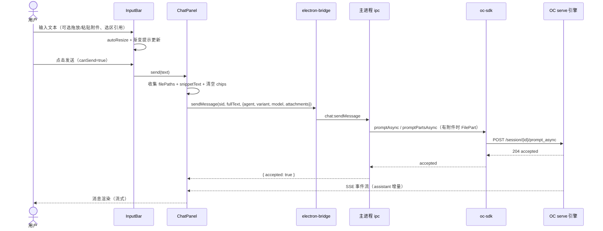
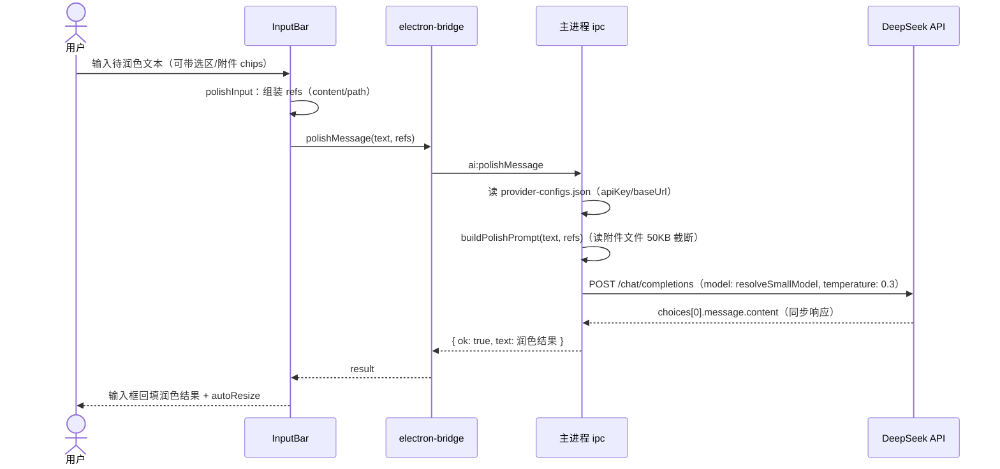

# 输入框优化 — 功能设计方案

> 版本：v1.2
> 日期：2026-08-15
> 作者：技术研发
> 状态：已实施（v1.2 增量修订——草稿跟随会话 + 会话卡片草稿标记；v1.1 增量修订——润色链路从 serve 临时会话改为直连 DeepSeek API）

---

## 一、需求背景

### 1.1 现状

分形（oc-gui）的聊天输入区是从 cc-gui（CC 时代）迁移的机制。CC 时代采用**独立工具栏（InputBarToolbar）+ 输入框分离**的两段式布局：模式/effort/命令逻辑分散在独立工具栏组件中，输入框与功能按钮不在一张卡片内。迁移到原型 v0.23 后，产品侧将输入区收敛为**单张 composer 卡片**，并把此前分散的功能（模式/effort/命令）并入卡片内部，原 `InputBarToolbar` 组件删除。

本次「输入框优化」是围绕 composer 单卡片的整体改造，包含三块内容：

1. **布局收敛**：chips 行 / textarea / 操作行 / 输入行 全部收敛为一张 composer 卡片（max-width 760 居中 + focus-within 光环），操作行独立一行显示在输入行上方。
2. **视觉与交互细节**：chips 空态零高度、附件按钮图标化、斜杠菜单定位修正、隐藏滚动条 + 双向渐变提示、发送/优化按钮规格统一（30×30 正方形）、禁用态保留主题蓝。
3. **新能力**：**AI 润色**（polish）——发送按钮左侧的「优化消息」按钮，调引擎临时会话润色输入框文本，结果回填输入框。

### 1.2 用户故事

| 场景 | 用户角色 | 需求描述 |
|------|----------|----------|
| 消息润色 | 普通用户 | 写好的消息不够通顺，点「✨」一键让 AI 优化，结果直接替换输入框内容 |
| 上下文引用 | 普通用户 | 选中的片段（选区卡片）或附带的文件能作为背景上下文参与润色，优化结果更贴原意 |
| 输入框多行 | 普通用户 | 长文本输入时看不到 Y 滚动条（视觉干净），上下还有内容时用渐变提示引导 |
| 会话参数选择 | 普通用户 | 不离开输入区即可切换主 agent / 模型 / 权限模式 / 推理强度 |
| 输入便捷性 | 普通用户 | 拖放 / 粘贴文件进输入区、`/` 斜杠快捷命令、输入框内 `/` 自动补全 |
| 草稿跟随会话（v1.2） | 普通用户 | 切走再切回会话，输入框里没发送的内容（文字/附件/选区）还在；切换会话互不串扰 |
| 草稿持久化（v1.2） | 普通用户 | 重启应用后草稿不丢（localStorage 落盘） |
| 草稿列表可见（v1.2） | 普通用户 | 会话卡片右侧显示「草稿」标记，一眼看出哪个会话有未发送内容；鼠标移入切回编辑/删除按钮 |

### 1.3 范围

| 角色 | 可操作范围 | 本次是否覆盖 |
|------|-----------|-------------|
| 普通用户 | composer 单卡片内全部交互（chips/输入/操作/发送/润色） | ✅ |
| 普通用户 | 发送消息时 agent/variant/model 透传引擎 | ✅ |
| 普通用户 | AI 润色走引擎临时会话（不污染当前会话历史） | ✅ |
| 普通用户 | 润色引用：选区片段 content + 附件 path（50KB 截断） | ✅ |
| 开发者 | InputBarToolbar 独立组件模式（CC 遗留） | ❌（组件已删除，逻辑并入 composer） |
| 任意角色 | 润色带对话历史上下文 | ❌（决策：不带历史，仅显式引用） |

---

## 二、架构设计

### 2.1 整体数据流

```mermaid
flowchart TD
    A[InputBar 输入框] -->|send / sendSlash| B[ChatPanel handleSend]
    B -->|chat:sendMessage<br>text + agent + model + variant + filePaths| C[主进程 ipc]
    C -->|promptAsync / promptPartsAsync| D[OC serve 引擎]
    D -->|SSE 事件流| E[前端会话渲染]
    A -->|polishInput| F[polishMessage text+refs]
    F -->|ai:polishMessage| G[主进程 ipc]
    G -->|buildPolishPrompt<br>text + 引用上下文| G
    G -->|fetch chat/completions| H[DeepSeek API 直连]
    H -->|choices[0].message.content| G
    G -->|回填 input| A
```

### 2.2 关键设计决策

| 决策点 | 选择 | 理由 |
|--------|------|------|
| D1 composer 单卡片三层 | chips 行 → 操作行 → 输入行（+foot 操作行内左右两组） | 对齐原型 v0.23：max-width 760 居中、focus-within 光环（accent-line 边框 + accent-glow 外发光）；CC 时代工具栏+输入框分离的布局废弃 |
| D2 操作行上移独立一行 | `.composer-foot` 用 flex `order: 2`、输入行 `order: 3`（chips 默认 order 0） | 用户反馈：cf-left 要放待办列表和输入框中间——功能类操作行在输入行上方，左右两端对齐 |
| D3 chips 空态零高度 | `v-if="props.chips.length > 0"` 整行不渲染 | 用户反馈：无附件/引用时 chips 行不占高度，不留空白区（`.composer-tools` 有 chips 才存在） |
| D4 附件按钮图标化 | `.composer-icon-btn` 26px 边框按钮 + 加号 SVG（12×12） | 对齐原型 icon-btn：与斜杠/命令按钮同风格；附件不再是一整条工具栏 |
| D5 斜杠菜单定位 | 按钮自身 `position: relative` 作下拉定位参照（`.composer-icon-btn`） | 用户反馈：去掉多余容器层后需要按钮自身 relative，下拉 `.slash-dropdown` 以按钮为锚 |
| D6 polish 走引擎 | 临时会话 → promptAsync → 轮询 messages → extractAssistantText → 删会话 | OC 唯一引擎架构铁律：不引入独立 LLM 直连通道；临时会话隔离，不污染当前会话历史（评论/追问历史不可预期、贵、慢）。**（v1.1 废弃——serve 并发缺陷导致会话进行时润色超时，见 v1.1 修订记录）** |
| D6' polish 直连（v1.1） | **主进程 fetch DeepSeek `chat/completions` 直连**：读 provider-configs.json 的 apiKey/baseUrl → `buildPolishPrompt` 组装 → POST → 取 `choices[0].message.content` → 60s 超时兜底 | **serve 已知并发缺陷**（#21524 promptAsync 204 但回合不启动、#32010 异步 prompt 被静默丢弃、#35472 stale busy，2026 年仍 open）：当前会话 busy 时润色临时会话被 accept 但不调度 → 分形轮询 60s 拿不到 assistant 文本 → 报「润色超时」。直连绕开 serve 会话调度，会话进行时也能润色；润色为纯文本任务（build agent 不执行工具），无 serve 工具执行/文件访问诉求，直连零能力损失；主进程已有 DeepSeek 直连成熟模式（`deepseek:getBalance`）；早期设置页设计本就有「推理 URL（polish 用）」字段 |
| D7 polish 参数固定 | agent: `build` + model: `deepseek-v4-flash` + variant: `low` | build agent 纯文本不执行工具（默认双星会读文件/多轮工具流——用户报错根因）；flash+low 推理快 2-3 倍，润色是短文本任务；60s 超时兜底长推理（20s 曾触发「润色超时」）。（v1.1 修订：**直连后无 agent/variant 概念**，model 取 `resolveSmallModel`（设置页「轻量模型」，默认 deepseek-v4-flash）+ `temperature: 0.3`，60s 超时兜底保留） |
| D8 polish 上下文策略 | **不带对话历史**，**带用户显式引用**（chips：选区片段 content / 附件 path） | 2026-08-08 用户确认方案：对话历史不可预期/贵/慢；显式引用是用户意图明确的选择，prompt 明确告知模型「仅作背景理解，不要引用到输出中」 |
| D9 引用文件截断 | 单文件 50KB 截断（`POLISH_REF_MAX_BYTES = 50000`） | 防超大文件打爆 prompt（50KB ≈ 1.5 万 token）；读失败（已删除/无权限）跳过该引用不阻断润色 |
| D10 发送/优化按钮规格 | 均 30×30 正方形；发送=Lucide 纸飞机 stroke 图标 + accent 实底；优化=Material auto_awesome fill 图标 + accent-glow 底 | 视觉统一；优化按钮 hover 变实心蓝（用户反馈：空心描边不明显 → 实心蓝） |
| D11 禁用态视觉 | disabled 时**保留主题蓝**（背景/边框/图标色不变），仅禁交互 | 用户反馈：空输入不该半透明——禁用不等于弱化，避免用户困惑「为什么按钮变灰」 |
| D12 滚动提示 | 隐藏 Y 滚动条（`scrollbar-width: none` + `::-webkit-scrollbar` 隐藏）+ 双向渐变（顶部+底部，0.5em accent-glow，4px 容差） | 与会话列表 rail 渐变一致（用户反馈）；隐藏滚动条保持输入框视觉干净，渐变提示上下还有内容 |
| D13 输入行对齐 | textarea `padding-bottom: 6px` 与 `.cf-right` `padding-bottom: 6px` 一致 | 用户反馈：底部距离不一致——按钮与输入文字底部对齐 |
| D14 agent 选择持久化 | `settings.currentAgent`（默认「双星」），localStorage + SQLite 双写 | 双星为分形预置 agent（四阶段编排）；plan 模式强制 plan agent（只读无写权限，方案 3.5）；模型选择（v4-flash/v4-pro）；权限 4 模式（askBefore/editAuto/bypass/plan，移除 CC 遗留 auto/dontAsk）；思考强度 variant（low/high/max 按模型 variants 动态过滤） |
| D15 润色错误可见 | `.polish-error` 绝对定位 composer 底部右上，3s 自动消失 | 此前 try/finally 无 catch → 错误变未捕获 rejection，用户看不到原因；catch 提取 invoke reject 的真实 message（如「润色超时」），去掉 `Error invoking remote method` 前缀 |
| D16 草稿跨组件共享（v1.2） | **模块级单例 Map**（`useSessionDrafts` composable：`draftsBySession: Map<sid, SessionDraft>`）+ `draftVersion` ref 自增作响应式时钟 | 草稿被三个组件读写（ChatPanel 切换编排、SessionSidebar 列表标记、InputBar 润色写回）——Map 非响应式，`draftVersion` 每次写操作自增，消费方 watch/依赖它触发刷新；单例（非工厂）保证跨组件共享同一份数据 |
| D17 草稿跟随会话时机（v1.2） | 切会话 `watch(activeSessionId)`：先 `captureDraft(oldId)`（读 InputBar 当前输入态）再 `restoreDraft(sid)`（写目标会话草稿） | watch 触发时 InputBar 仍是旧会话内容，captureDraft 读到的正是旧会话草稿；发送时**先 `setText("")` 清空再 captureDraft**（InputBar emit send 后才清 input，直接 capture 会把已发送文本存成草稿——军师 P1-1）；删除会话 `clearDraft` 清理防死条目（P2-1） |
| D18 无会话草稿槽（v1.2） | 首页（无 activeSessionId）草稿存 `DRAFT_KEY_NONE = "__draft_none__"` 槽；新建会话时 `migrateNoneDraft` 迁移 | 2026-08-15 用户确认：切历史会话再新建，首页输入应带到新会话；迁移后发 `draft-migrated` 事件让 ChatPanel 重新恢复输入态（迁移发生时 watch 已执行过、读到空） |
| D19 草稿持久化（v1.2） | `localStorage`（key `oc-gui.session-drafts.v1`）整 Map 序列化；写操作后 `persist()`；模块加载时 `loadFromStorage()` 恢复 + `isValidDraft` 结构校验 | 用户确认：草稿需重启不丢失；settings store 同模式（try/catch JSON.parse + 兜底）；损坏数据静默忽略，存储满等异常静默（草稿是临时输入态，丢失可接受） |
| D20 润色跨会话写回（v1.2） | 润色结果 `setPolishResult(sid)` 存 `pendingPolish` Map，由下一次 `captureDraft` 的 `saveDraft` **消费合并**（润色文本替换草稿 text） | 竞态：润色完成 saveDraft(A) 后切会话的 watch 可能随后 captureDraft(A) 读旧文本覆盖润色结果——pending 无论时序，草稿最终是润色文本；发起会话已删则跳过写回（P2-3）；pending 为瞬态不持久化 |
| D21 润色状态按会话隔离（v1.2） | `polishingBySession: Map<sid, boolean>` + computed 依赖 `draftVersion` 重算 | 用户反馈：A 润色中切到 B，B 按钮不应显示处理中；finally 按**发起会话**（polishSessionId）复位，不能复位当前会话状态 |
| D22 会话卡片草稿标记（v1.2） | SessionSidebar 右侧操作位**互斥切换**：未 hover 显示「草稿」标记（`group-hover:hidden`），hover 显示编辑/删除按钮（`absolute right-0` 不占位） | 用户微调（2026-08-15）：草稿标记放卡片右侧、与编辑/删除按钮同一位置；按钮 absolute 定位出现时行高不抖；草稿标记右对齐与按钮同锚点，切换零跳动；活跃会话（正在编辑）不标记 |

---

## 三、后端设计

### 3.1 ai:polishMessage IPC — 润色主链路

**文件：** `electron/main/ipc.ts`（L639-671，v1.1 重写为直连）

```typescript
// ✨ 输入消息优化：主进程直连 DeepSeek chat/completions → 提取回复。
// v1.1 改造（2026-08-15）：不再走 serve 临时会话——serve 并发缺陷（#21524/#32010/#35472）
// 导致会话进行时润色超时；润色是纯文本任务，直连零能力损失且与会话调度解耦。
ipcMain.handle('ai:polishMessage', async (_e, args: { text: string; refs?: Array<{ label?: string; content?: string; path?: string }> }) => {
  const text = typeof args?.text === 'string' ? args.text.trim() : ''
  if (!text) throw new Error('ai:polishMessage text 必须是非空字符串')
  // 读 provider-configs.json 的 deepseek 槽位（渲染进程不直接持有 key，主进程读取避免泄露）
  const cfg = (await readJsonFile(join(app.getPath('userData'), 'provider-configs.json'), {})) as Record<string, { apiKey?: string; baseUrl?: string }>
  const apiKey = cfg?.deepseek?.apiKey?.trim() ?? ''
  if (!apiKey) throw new Error('未配置 DeepSeek API Key（设置 → API Key）')
  const baseUrl = (cfg?.deepseek?.baseUrl?.trim() || 'https://api.deepseek.com').replace(/\/+$/, '')
  const prompt = await buildPolishPrompt(text, args?.refs)
  // 轻量任务模型（设置页「轻量模型」，默认 deepseek/deepseek-v4-flash；用户选 pro 则跟随）
  const smModel = (await resolveSmallModel(app.getPath('userData'))).split('/').pop() || 'deepseek-v4-flash'
  // 60s 超时兜底长推理（与旧轮询上限一致；AbortController 由 fetch 内部 signal 驱动）
  const controller = new AbortController()
  const timer = setTimeout(() => controller.abort(), 60_000)
  try {
    const res = await fetch(`${baseUrl}/chat/completions`, {
      method: 'POST',
      headers: { 'Content-Type': 'application/json', Authorization: `Bearer ${apiKey}` },
      body: JSON.stringify({
        model: smModel,
        messages: [
          { role: 'system', content: POLISH_PROMPT },
          { role: 'user', content: prompt },
        ],
        temperature: 0.3, // 润色低随机性，保持原意
      }),
      signal: controller.signal,
    })
    if (!res.ok) {
      throw new Error(
        res.status === 401 ? 'API Key 无效或已失效（HTTP 401）' : `润色失败（HTTP ${res.status}）`,
      )
    }
    const data = (await res.json()) as { choices?: Array<{ message?: { content?: string } }> }
    const polished = data?.choices?.[0]?.message?.content?.trim() ?? ''
    if (!polished) throw new Error('润色失败：模型未返回内容')
    return { ok: true, text: polished }
  } catch (err) {
    if (err instanceof Error && err.name === 'AbortError') {
      throw new Error('润色超时：模型未在 60 秒内回复')
    }
    throw err
  } finally {
    clearTimeout(timer)
  }
})
```

链路要点：

1. **参数校验**：`text` 必须是非空字符串（trim 后），否则 throw——前端 polishInput 已有空输入拦截，此为 IPC 层防御。
2. **API Key 读取**：从 `provider-configs.json` 的 deepseek 槽位读 key/baseUrl（同 `deepseek:getBalance` 模式）；未配置 → throw「未配置 DeepSeek API Key」。
3. **直连 DeepSeek**：POST `${baseUrl}/chat/completions`，`model` 取 `resolveSmallModel`（设置页「轻量模型」，默认 deepseek-v4-flash）+ `temperature: 0.3`（低随机性保原意），messages 为 system（POLISH_PROMPT）+ user（buildPolishPrompt 组装的引用+待润色文本）。
4. **响应提取**：直接取 `choices[0].message.content`，无需轮询（同步 HTTP 响应）。
5. **超时兜底**：AbortController 60s → throw「润色超时：模型未在 60 秒内回复」。
6. **无临时会话**：不创建/删除任何会话——不污染会话历史，也不残留「消息润色」会话。

### 3.2 buildPolishPrompt — 润色指令组装

**文件：** `electron/main/ipc.ts`（L992-1032）

```typescript
/** 润色指令前缀：中文写作助手，直接输出优化结果不解释（防污染输入框） */
export const POLISH_PROMPT =
  '你是专业的中文写作助手。请优化下面的用户消息，使其表达更清晰、准确、有条理，保持原意和语气，不改变用户意图。直接输出优化后的消息，不要任何解释、前缀或引号。\n\n消息：'

/** 引用文件内容截断上限（防超大文件打爆 prompt，50KB ≈ 1.5 万 token） */
const POLISH_REF_MAX_BYTES = 50_000

export async function buildPolishPrompt(
  text: string,
  refs?: Array<{ label?: string; content?: string; path?: string }>,
): Promise<string> {
  if (!refs || refs.length === 0) return POLISH_PROMPT + text
  const blocks: string[] = []
  for (const r of refs) {
    if (r.content) {
      blocks.push(`【${r.label || '引用片段'}】\n${r.content}`)
    } else if (r.path) {
      try {
        const content = await fsp.readFile(r.path, 'utf-8')
        blocks.push(`【${r.label || r.path}】\n${content.slice(0, POLISH_REF_MAX_BYTES)}`)
      } catch {
        // 文件读不到（已删除/无权限）——跳过该引用，不阻断润色
      }
    }
  }
  if (blocks.length === 0) return POLISH_PROMPT + text
  return (
    `你是专业的中文写作助手。请优化下面的用户消息，使其表达更清晰、准确、有条理，保持原意和语气，不改变用户意图。\n` +
    `以下是用户显式引用的参考内容（仅作背景理解，不要引用到输出中）：\n\n` +
    `${blocks.join('\n\n')}\n\n` +
    `要优化的消息：${text}\n\n` +
    `直接输出优化后的消息，不要任何解释、前缀或引号。`
  )
}
```

规则：

| 输入 | 输出 |
|------|------|
| 无 refs / refs 为空数组 | `POLISH_PROMPT + text`（基础指令，无引用段） |
| ref 有 `content`（选区片段） | `【label】\ncontent` 入块（label 缺省「引用片段」） |
| ref 有 `path` 无 content（附件） | 主进程 `fsp.readFile(path, 'utf-8')` 读文件 → `【label】\n内容前 50KB` 入块 |
| 文件读失败 | catch 跳过该引用，不阻断；若所有引用都失败 → 退化为基础指令 |
| 有引用块 | 引用段 + 「仅作背景理解，不要引用到输出中」声明 + 消息 + 输出约束 |

### 3.3 extractAssistantText — 已删除（v1.1 直连改造移除）

**文件：** `electron/main/ipc.ts`（原 L1035-1046，v1.1 已删除）

> v1.1 直连改造后不再使用：回复直接从 `choices[0].message.content` 提取（同步 HTTP 响应），无需从 serve 会话消息列表反向查找。历史实现如下：

```typescript
/** 提取最后一条 assistant 消息的全部 text part（润色回复；多 part 拼接；导出供测试） */
export function extractAssistantText(msgs: SessionMessage[]): string {
  for (let i = msgs.length - 1; i >= 0; i--) {
    const m = msgs[i]
    if (m.info.role !== 'assistant') continue
    const texts = m.parts
      .filter((p) => p.type === 'text')
      .map((p) => (p as { text?: string }).text || '')
    const joined = texts.join('')
    if (joined.trim()) return joined
  }
  return ''
}
```

规则：从最新消息向前找最后一条 `assistant`，取其全部 `text` part 拼接；若该条无文本（如只有 reasoning 思考），继续向前找更早的 assistant；空列表返回空串。

### 3.4 附件 parts 构建（发送链路复用）

**文件：** `electron/main/ipc.ts`（L74-99、L234-250）+ `electron/main/oc-sdk.ts`（L260-282）

- `mimeFromExt(name)`（L75-115）：文件名扩展名 → MIME 小表映射（md/json/txt/js/ts/tsx/vue/py/java/go/rs/c/h/cpp/hpp/html/css/scss/pdf/png/jpg/jpeg/gif/svg/webp/docx/xlsx/pptx/zip/yml/yaml/xml/sh/sql/toml/env 等），未知扩展回退 `application/octet-stream`。
- `buildSendParts(message, attachments)`：text part 在前 + file part（`mime: mimeFromExt(name)`、`url: pathToFileURL(path).href`（file:// URL——serve 约定）、`filename`）。
- `promptPartsAsync`（L272-282）：`Array<TextPartInput | FilePartInput>` 透传；`model` / `system` / `agent` / `variant` 均在 opts 中透传；`variant` 是 spec 实测顶层字段（SDK types.gen 未生成），用变量透传绕过类型检查；promptAsync 成功返回 204 void 无需 data 校验。

### 3.5 chat:sendMessage — agent/variant 透传

**文件：** `electron/main/ipc.ts`（L612-631）

```typescript
// promptAsync 立即返回（204），结果通过 SSE 事件流回前端；model 由前端传入（settings.model）；
// agent 由前端传入（settings.currentAgent：双星/build/plan，缺省走 serve 默认 Build）
const extra = {
  model: model ?? { providerID: 'ds', modelID: DEFAULT_MODEL.id },
  ...(typeof args?.agent === 'string' && args.agent ? { agent: args.agent } : {}),
  // variant 思考强度透传（spec 实测 prompt_async body 顶层字段；空串/缺省不传）
  ...(typeof args?.variant === 'string' && args.variant ? { variant: args.variant } : {}),
}
```

有附件时走 `promptPartsAsync`（text part + file part），无附件保持便捷 `promptAsync`（text 单 part）。

### 3.6 审计日志

不涉及敏感数据（润色文本与引用为本地用户数据，临时会话删除即清理），无需审计。

---

## 四、前端设计

### 4.1 composer 结构总览（InputBar.vue）

**文件：** `src/renderer/src/components/chat/InputBar.vue`

```
┌──────────────────────────────────────────────────────────────┐
│ .f-input-bar (max-width 760 居中, padding 14px 0 18px)        │
│ ┌──────────────────────────────────────────────────────────┐ │
│ │ .composer (flex column; focus-within 光环)                │ │
│ │  ① .composer-tools  chips 行（v-if chips>0，否则整行不渲染）│ │
│ │  ③ .composer-inputrow 输入行 (order 3)                     │ │
│ │     .composer-input-wrap → textarea + 顶部/底部渐变提示     │ │
│ │     .cf-right → [✨优化] [⏹停止/➤发送]                     │ │
│ │  ② .composer-foot 操作行 (order 2, border-bottom)          │ │
│ │     .cf-left → [📎附件][/斜杠][☰命令]                      │ │
│ │     .cf-right-pills → [✦agent][模型][🛡权限][⚡推理][ctx]   │ │
│ │                       [slot left（debug 按钮）]            │ │
│ └──────────────────────────────────────────────────────────┘ │
│ .slash-autocomplete 斜杠补全下拉（绝对定位 bottom:100%）      │
└──────────────────────────────────────────────────────────────┘
```

| 层 | class | 展示条件 | 说明 |
|----|-------|----------|------|
| chips 行 | `.composer-tools` | `chips.length > 0` | 附件/引用 chips，`flex-wrap`，min-height 28px |
| 输入行 | `.composer-inputrow` | 始终 | `flex`，`align-items: flex-end`，`order: 3` |
| textarea | `.composer-input` | 始终 | 14px/1.7，min-height 42 / max-height 160，隐藏 Y 滚动条，`padding: 8px 10px 6px` |
| 渐变提示 | `.input-scroll-hint` / `--top` | 可滚动且未到底 / 未到顶 | 0.5em accent-glow 渐变，绝对定位于 wrap |
| 操作行 | `.composer-foot` | 始终 | `order: 2`，左右两端对齐，底部 border 分隔 |
| 左组 | `.cf-left` | 始终 | 📎 / / ☰ 三个 26px 图标按钮 |
| 右组 | `.cf-right-pills` | 始终 | agent pill / model pill / 权限 select / 推理 select（v-if variants>0）/ ContextIndicator / left slot |
| 输入右侧 | `.cf-right` | 始终 | ✨优化 + ⏹/➤（30×30 正方形） |
| 错误条 | `.polish-error` | `polishError` 非空 | 绝对定位 `right:4px; bottom:30px`，3s 自动消失 |

### 4.2 操作行分组

| 组 | 元素 | 交互 | 数据源 |
|----|------|------|--------|
| cf-left 📎 | `composer-icon-btn` 26px + 加号 SVG | `emit('attach')` → ChatPanel 打开文件对话框 | — |
| cf-left / | `composer-icon-btn`（按钮自身 `position:relative` 锚定下拉） | `toggleMenu('slash')` → `.slash-dropdown`：最近使用前 5 + 收藏全部 + 「📋 浏览全部」 | `useSlashCommands`（recentCommands / favorites） |
| cf-left ☰ | `composer-icon-btn` | `emit('openCommandMenu')` → commandBus | — |
| right ✦agent | `.composer-pill` | 展开 `d-item` 列表（双星/build/plan 带描述）→ `settings.currentAgent = value` | `AGENT_OPTIONS`（值即引擎 promptAsync.agent 参数） |
| right 模型 | `.composer-pill` | 展开 2 项（v4-flash / v4-pro）→ `settings.model = value` | `MODEL_OPTIONS`（值即 settings.model 存储格式）；显示名去 `[1M]` 标注与 provider 前缀 |
| right 🛡权限 | `.composer-select` | 展开 4 项（询问/自动编辑/全自动/计划）→ `selectMode` | `modeOptions`；activeMode 计算：planMode 优先「计划」，dontAsk 旧值并入「全自动」显示 |
| right ⚡推理 | `.composer-select` | `effortOptions` 按 `settings.modelVariants` 动态过滤（顺序固定 low/high/max）→ `settings.effort` | `EFFORT_VARIANTS`（low 绿 / high 橙 / max 红）；模型无 variants 时选择器不渲染 |
| right ctx | `ContextIndicator` | `emit('showContext')` → 上下文用量弹窗 | 有消息时才显示（组件内部） |
| left slot | debug 按钮 | ChatPanel 注入「▸ 诊断信息 (N)」 | `debugLog.lines` 非空才显示 |

### 4.3 双向渐变提示

**触发逻辑**（`updateInputGradient`，textarea `@input` / `@scroll` 时调用）：

| 条件 | 顶部渐变 | 底部渐变 |
|------|----------|----------|
| `scrollHeight > clientHeight + 4`（可滚动）且 `scrollTop + clientHeight < scrollHeight - 4`（未到底） | — | ✅ `.input-scroll-hint` |
| 可滚动且 `scrollTop > 4`（未到顶） | ✅ `.input-scroll-hint--top` | — |

- 定位参照为 `.composer-input-wrap`（= textarea 宽度，不含右侧按钮），此前参照 inputrow 全宽会导致渐变延伸到发送按钮（用户反馈已修正）。
- 底部渐变 `bottom: 2px` 贴 textarea 可视底（此前 6px 悬空于 padding 区，滚动中间态文字从条下方露出）。
- 过渡动画 300ms（`grad` 底部 / `grad-top` 顶部，分别微上滑/下滑）。

### 4.4 按钮状态矩阵（输入行右侧）

| 按钮 | 状态 | 样式 | 交互 |
|------|------|------|------|
| ✨优化 `.polish-btn` | 默认 | 30×30，accent-glow 底 + accent 图标（Material auto_awesome fill） | 点击 `polishInput` |
| ✨优化 | hover | 实心蓝（accent 底 + 白图标） | — |
| ✨优化 | busy（polishing） | 边框 dashed + 图标呼吸动画（opacity 0.4→1 / scale 0.85→1，1.4s 无限） | 按钮禁用，防重复点击 |
| ✨优化 | disabled（输入空） | **视觉不变**（保留主题蓝），仅禁交互 | 不可点 |
| ➤发送 `.send` | 默认 | 30×30，accent 实底 + 纸飞机 stroke 图标（16×16） | 点击 `send`（trim 非空） |
| ➤发送 | disabled（输入空） | **视觉不变**（保留主题蓝），仅禁交互 | 不可点 |
| ⏹停止 `.send--stop` | 处理中（`disabled` prop = true） | 30×30，coral 红底 + 白色方块图标 | 点击 `emit('stop')` 替代发送 |

> `canSend = input.value.trim().length > 0`——chips 附件不计入发送启用条件（保持现有交互）。

### 4.5 润色前端流程（polishInput）

**文件：** `src/renderer/src/components/chat/InputBar.vue`（L343-377）

```typescript
async function polishInput() {
  const text = input.value.trim()
  if (!text || polishing.value) return
  polishing.value = true
  polishError.value = ""
  try {
    // 带上用户显式引用的上下文（chips：选区片段 content / 附件 path）
    const refs = props.chips
      .filter((c) => c.content || c.path)
      .map((c) => ({ label: c.label, content: c.content ?? "", path: c.path ?? "" }))
    const result = await polishMessage(text, refs)
    if (result?.ok && result.text) {
      input.value = result.text
      autoResize()
    } else {
      polishError.value = "优化失败：DeepSeek 未返回结果"
    }
  } catch (err) {
    // 主进程 handler throw → invoke reject——显示具体原因（如「润色超时：模型未在 60 秒内回复」）
    const msg = (err as Error)?.message?.replace(/^Error invoking remote method '[^']+':\s*/, "") || "优化失败，请稍后重试"
    polishError.value = msg
    console.error("[polish] 润色失败:", err)
  } finally {
    polishing.value = false
    if (polishErrorTimer) clearTimeout(polishErrorTimer)
    polishErrorTimer = setTimeout(() => { polishError.value = ""; }, 3000)
  }
}
```

- **refs 组装**：仅取 chips 中带 `content` 或 `path` 的（选区片段 / 附件），`content ?? ""` / `path ?? ""` 填充（bridge 测试断言此结构）。
- **成功**：`result.ok && result.text` → 回填输入框 + `autoResize`。
- **失败分支**：主进程返回 `ok: false`（理论不达，防御）→ 「优化失败：DeepSeek 未返回结果」；主进程 throw → invoke reject → 提取真实 message（去 `Error invoking remote method 'xxx':` 前缀）展示具体原因。
- **错误提示**：`.polish-error` 绝对定位 composer 底部右上，3s 自动消失（定时器每次重置）。

### 4.6 ChatPanel — chips 组装与发送透传

**文件：** `src/renderer/src/components/chat/ChatPanel.vue`

**composerChips 组装**（L175-194）：

| chip 来源 | id | tone | 附加字段 | 说明 |
|-----------|-----|------|----------|------|
| 选区片段 textSnippet | `"snippet"` | accent（accent-glow 底） | `content` | DOM / Excel / 文本划选 / MD 选区统一入口；content 供润色作背景上下文 |
| 附件 attachedFiles | `file:${path}` | elevated（bg-elevated 底） | `path` + `imageUrl`（图片缩略图） | 点击打开文件预览；path 供润色主进程读文件 |

- `handleRemoveChip`：`id === "snippet"` 移除选区；`file:` 前缀按 path 定位移除附件。
- `handleChipClick`：附件 chip → `openFileInPanel`（注入自父级）。
- `attachedFiles` watch：图片附件加入时预加载缩略图（`getThumbnail`）。

**handleSend**（L608-644）：

- 发送前收集 `filePaths`、`snippetText`（选区拼到消息文本前：`${content}\n\n`），随后清空 chips。
- `sendMessage(sid, fullText, {...})` opts：`planMode` / `autoMode` / `permissionMode` / `variant`（仅 `settings.modelVariants` 包含 `settings.effort` 时才传，防残留旧档/模型无 variants 时误传）/ `model`（settings.model）/ **`agent: settings.planMode ? "plan" : settings.currentAgent`**（权限选「计划」时强制 plan agent 无写权限）/ `filePaths` / `attachments`。

**InputBar 挂载**（L1117-1144）：`<InputBar ref="inputBar" :disabled="chat.isProcessing" :auto-mode :api-key :base-url :chips="composerChips" :chip-hint>` + 8 个事件（send/stop/files/attach/remove-chip/chip-click/open-command-menu/send-slash/show-context）；`#left` 插槽注入诊断按钮（仅 `debugLog.lines` 非空时显示）。

### 4.7 settings store — currentAgent 持久化

**文件：** `src/renderer/src/stores/settings.ts`

| 数据 | 存储 | 说明 |
|------|------|------|
| `currentAgent` | localStorage `sb-ui-settings` + SQLite providerConfigs（500ms 防抖） | 默认「双星」；UI 偏好双写，SQLite 不受 Tauri identifier 变更影响 |
| `planMode` | 同上 | 权限选「计划」时 true → 发送强制 plan agent |
| `effort`（variant 值） | 同上 | 旧 6 档（medium/xhigh/ultracode）读入归一为 variant；`modelVariants` 空 → 清空；不在列表 → 归一 high |
| `modelVariants` | 内存（主进程 `provider:modelVariants`） | `/provider` 响应 `all[].models[id].variants`（spec 实测字段） |

### 4.8 其他交互细节

| 交互 | 实现 | 说明 |
|------|------|------|
| 斜杠输入框补全 | `slashSuggestions`（输入以 `/` 开头且无空格时弹出）+ `applySlashSuggestion`（Enter 直接发送） | 最近使用在前、收藏在后、去重，slice(0,8)；键盘 ↑/↓/Enter/Escape |
| 拖放文件 | composer 容器 `@dragover/@dragleave/@drop` | dropEffect=copy；`files` 事件带 `{name, path}`（`f.path \|\| f.name`） |
| 粘贴文件 | textarea `@paste` | clipboardData items `kind === "file"` 提取；有文件时 preventDefault 防文本插入 |
| autoResize | `autoResize()` | `height: auto` → `min(scrollHeight, 160)px`，每次输入后调用 |
| 点击外部关闭 | document click 监听 | 目标不在 `.dropdown-menu` 内 → `closeMenus()` |
| 暴露 setText | `defineExpose` | FilePreview DOM 选择器等外部设置输入框文本 |

### 4.9 草稿跟随会话（v1.2）

**文件：** `src/renderer/src/composables/useSessionDrafts.ts`（新增）+ ChatPanel / SessionSidebar / InputBar / useNewSession

**数据模型：**

```typescript
interface SessionDraft {
  text: string;            // 输入框文本
  files: AttachedFile[];   // 附件 chips
  snippet: TextSnippetLike | null; // 选区片段
}
// 模块级单例（跨组件共享）+ 非响应式 Map + draftVersion ref 响应式时钟
const draftsBySession = new Map<string, SessionDraft>();
const pendingPolish = new Map<string, string>();   // 润色待合并（瞬态，不持久化）
const polishingBySession = new Map<string, boolean>(); // 润色进行中（瞬态）
const DRAFT_KEY_NONE = "__draft_none__";           // 无会话草稿槽
```

**Composable API：**

| 函数 | 职责 |
|------|------|
| `saveDraft(sid, draft)` | 写草稿；若该会话有 pendingPolish → 用润色文本替换 text 并消费；深拷贝后存 Map；`draftVersion++` + `persist()` |
| `getDraft(sid)` | 读草稿（深拷贝，读取不产生脏条目）；无草稿返回空草稿 |
| `hasDraft(sid)` | 是否有非空草稿（文字/附件/选区任一）——列表标记用 |
| `clearDraft(sid)` | 删草稿 + 丢弃 pendingPolish；会话删除时调用 |
| `setPolishResult(sid, text)` | 登记润色结果待合并（InputBar 跨会话写回） |
| `hasPendingPolish(sid)` | 该会话是否有待合并润色结果（restoreDraft 消费前判断，防制造空条目） |
| `migrateNoneDraft(sid)` | 首页草稿迁移到指定会话并清空 NONE 槽；目标已有草稿以目标为准 |
| `setPolishState / isPolishing` | 润色进行中状态按会话读写（按钮状态隔离） |
| `version() / versionRef()` | 版本号（写操作自增）；versionRef 返回 ref 供 computed 建立响应式依赖 |
| `_resetForTest / _reloadFromStorageForTest` | 测试辅助（清 Map + localStorage / 模拟重启恢复） |

**持久化（v1.2）：**

- `STORAGE_KEY = "oc-gui.session-drafts.v1"`：整 Map 序列化 JSON 存 localStorage。
- 写操作（saveDraft / clearDraft / migrateNoneDraft）后 `persist()`；模块加载时 `loadFromStorage()` 恢复。
- `isValidDraft` 校验反序列化结构（text string / files array / snippet null-or-object），损坏数据静默忽略。
- `pendingPolish` / `polishingBySession` 为瞬态协调状态，**不持久化**（应用重启后无意义）。

**ChatPanel 编排：**

```typescript
// 切会话：先保存旧会话草稿（watch 触发时 InputBar 仍是旧会话内容），再恢复新会话草稿
watch(() => session.activeSessionId, (sid, oldId) => {
  captureDraft(oldId);   // 守卫：会话已删跳过（防死条目复活）
  restoreDraft(sid);     // 消费 pendingPolish → 写 InputBar + 附件 + 选区
});

// 发送：先 setText("") 清空输入态，再 captureDraft 存「空草稿」覆盖旧值
async function doSend(...) {
  inputBar.value?.setText?.("");
  attachedFiles.value = [];
  textSnippet.value = null;
  captureDraft(session.activeSessionId);
  // ... 发送逻辑
}

// 首页草稿迁移完成后，chatCommand "draft-migrated" 事件 → 重新 restoreDraft
case "draft-migrated": { restoreDraft(session.activeSessionId); break; }

// 删除会话 → clearDraft(tgt.id)
```

**SessionSidebar 标记（D22）：**

- 右侧操作位互斥切换：未 hover 显示「草稿」标记（有草稿且非活跃会话），hover 显示编辑/删除按钮。
- `hasDraftFor(id)` 依赖 `draftTick`（watch draftVersion 自增的本地 ref）建立响应式——Map 非响应式，版本号变化时函数重算标记才刷新。

**InputBar 润色写回（D20）：**

- `polishInput` 入口记录 `polishSessionId`；润色完成若仍在发起会话 → 直接回填输入框；已切走 → `setPolishResult(polishSessionId, text)` 登记待合并（发起会话已删则跳过）。
- 润色按钮状态：`polishing = computed(() => { void draftVersion.value; return isPolishing(session.activeSessionId); })`——computed 依赖版本号才能在 setPolishState 后重算。

**useNewSession 迁移（D18）：**

- `handleNew` 创建/复用空会话后：`migrateNoneDraft(activeSessionId)` + 有迁移则 `emitChatCommand("draft-migrated")`。
- v1.2 增补：列表最近会话是空会话时点新建 → **跳转复用**（`find(s => s.messageCount === 0)`，依赖 sessions 按 updatedAt 倒序）不创建新会话，避免堆积空会话（用户反馈：重启后最近空会话仍可再建）。

### 4.9 路由/权限配置

无需修改（InputBar 是 ChatPanel 内部组件，无独立路由）。

---

## 五、数据库变更

**无新增表**。`currentAgent` / `planMode` / `effort` 等 UI 偏好持久化到已有 SQLite `providerConfigs`（500ms 防抖写）与 localStorage `sb-ui-settings` 双通道。润色临时会话不落库（引擎侧会话记录由 serve 管理，删除即清理）。

---

## 六、文件变更清单

### 主进程

| 操作 | 文件 | 说明 |
|------|------|------|
| 修改 | `electron/main/ipc.ts` | 新增 `ai:polishMessage` handler + `POLISH_PROMPT` / `POLISH_REF_MAX_BYTES` / `buildPolishPrompt` / `extractAssistantText`；`chat:sendMessage` 透传 agent/variant；`buildSendParts` / `mimeFromExt`（附件发送复用）。**v1.1：`ai:polishMessage` 重写为直连 DeepSeek（读 provider-configs.json → fetch chat/completions → 提取 choices[0].message.content），删除临时会话/轮询逻辑** |
| 修改 | `electron/main/oc-sdk.ts` | `promptPartsAsync`（FilePartInput 透传 + variant 变量透传）。（v1.1 润色不再用 oc-sdk，发送链路不变） |

### 渲染进程

| 操作 | 文件 | 说明 |
|------|------|------|
| 修改 | `src/renderer/src/components/chat/InputBar.vue` | composer 单卡片三层重构 + chips 行 + 操作行 + 输入行 + 渐变提示 + polish 按钮/错误条 + 斜杠菜单定位修正。**v1.2：getText expose（切会话保存草稿）+ polishSessionId 发起会话记录 + setPolishResult 跨会话写回 + 润色按钮状态按会话隔离** |
| 修改 | `src/renderer/src/components/chat/ChatPanel.vue` | `composerChips` 组装（textSnippet + attachedFiles）；`handleSend` agent/variant 透传；InputBar 挂载 + left slot debug 按钮。**v1.2：captureDraft/restoreDraft 切会话编排 + doSend 先清空再存 + 删除会话 clearDraft + draft-migrated 事件处理** |
| 修改 | `src/renderer/src/lib/electron-bridge.ts` | `polishMessage(text, refs?)` → `ai:polishMessage` |
| 修改 | `src/renderer/src/stores/settings.ts` | `currentAgent` 双写持久化；`modelVariants` / effort 归一逻辑 |
| 修改 | `src/renderer/src/locales/zh.json` / `en.json` | `composer.*` 命名空间（agent/model/perm/effort/polish 等文案）。**v1.2：`session.draftBadge`（草稿/Draft）** |
| **新增（v1.2）** | `src/renderer/src/composables/useSessionDrafts.ts` | 草稿跟随会话跨组件共享存储（Map + draftVersion 时钟 + NONE 槽 + pendingPolish 协调 + localStorage 持久化） |
| **修改（v1.2）** | `src/renderer/src/components/session/SessionSidebar.vue` | 草稿标记：右侧操作位未 hover 显示、hover 切换编辑/删除按钮（互斥 absolute 定位） |
| **修改（v1.2）** | `src/renderer/src/composables/useNewSession.ts` | 首页草稿迁移（migrateNoneDraft + draft-migrated 事件）；列表空会话跳转复用 |
| **修改（v1.2）** | `src/renderer/src/composables/useSessionSwitch.ts` | doSwitch 走完整加载路径（供空会话复用跳转） |

### 测试

| 操作 | 文件 | 说明 |
|------|------|------|
| 修改 | `src/renderer/src/components/chat/InputBar.test.ts` | 25 用例：发送/Enter/Stop/空输入/拖放/chips 空态/agent/model pill/polish ×3/attach/effort 选择器 ×4。（v1.2：+getText expose、润色按钮状态按会话隔离、跨会话写回） |
| 修改 | `electron/main/ipc.test.ts` | `extractAssistantText` 3 用例 + `buildPolishPrompt` 4 用例。（v1.1：`ai:polishMessage` 直连用例——未配 key / 空 text / 成功+请求细节 / 跟随主模型 pro / 401 / 500 / 空内容 / AbortError 超时 / 网络异常；extractAssistantText 用例随废弃删除） |
| 修改 | `src/renderer/src/components/chat/ChatPanel.test.ts` | P6 附件发送 → sendMessage attachments。（v1.2：草稿 describe——切走切回恢复/发送清空/删除清理/首页迁移，beforeEach `_resetForTest`，用例预置 session.sessions（captureDraft 守卫要求），chatCommand ts 显式递增（Date.now 同毫秒坑）） |
| 修改 | `src/renderer/src/lib/electron-bridge.test.ts` | `polishMessage` 2 用例（text 透传 / refs 透传） |
| **新增（v1.2）** | `src/renderer/src/composables/useSessionDrafts.test.ts` | 草稿存储/迁移/持久化/润色协调 19 用例（含 localStorage 模拟重启恢复、损坏数据防御） |
| **修改（v1.2）** | `src/renderer/src/components/session/SessionSidebar.test.ts` | 草稿标记用例：有草稿非活跃显示 Draft、活跃与无草稿不显示（卡片 text 定位） |
| **修改（v1.2）** | `src/renderer/src/composables/useNewSession.test.ts` | 首页草稿迁移 + draft-migrated 事件；空会话跳转复用（latestEmpty 分支）；chatCommand 模块级 ref 跨用例重置防污染 |

---

## 七、关键流程

### 7.1 时序图 — 发送消息



### 7.2 时序图 — 润色优化



### 7.3 异常流程

| 异常场景 | 前端处理 | 后端处理 |
|----------|----------|----------|
| 润色输入为空 | polishInput 直接 return（按钮 disabled 视觉不变） | —（前端拦截，IPC 层再防御 throw） |
| 润色 60s 无回复 | 错误条显示「润色超时：模型未在 60 秒内回复」，3s 消失 | AbortController 60s abort → throw |
| 引用文件读失败（已删除/无权限） | 无感知（润色照常） | `buildPolishPrompt` catch 跳过该引用，不阻断 |
| 未配置 API Key | 错误条显示「未配置 DeepSeek API Key（设置 → API Key）」 | 读 provider-configs.json 空 key → throw |
| API Key 失效（401） | 错误条显示「API Key 无效或已失效（HTTP 401）」 | `res.status === 401` → throw |
| 网络/服务错误 | 错误条显示「润色失败（HTTP xxx）」或网络原因 | fetch 非 2xx → throw；网络异常透传 message |
| 模型未返回内容 | 错误条「润色失败：模型未返回内容」 | `choices[0].message.content` 空 → throw |
| 润色进行中重复点击 | 按钮 busy 禁用 | —（`polishing` 标志防重入） |
| 引擎未初始化 | 不再依赖 serve（直连），无此分支 | — |
| 发送时空输入 | `send()` trim 后 return（按钮 disabled 视觉不变） | — |
| 拖放/粘贴非文件 | 忽略（files.length===0 或无可识别文件） | — |
| 切会话时会话已删（v1.2） | 无副作用 | `captureDraft` 守卫：sid 已不在 sessions → return，不写回复活死条目 |
| 润色完成时发起会话已删（v1.2） | 润色结果丢弃（不写回） | InputBar 写回前检查 `session.sessions.some(id === polishSessionId)` |
| 润色跨会话写回竞态（v1.2） | 无论时序草稿最终是润色文本 | pendingPolish 由 saveDraft 消费合并 |
| 首页无会话草稿目标已有草稿（v1.2） | 目标草稿保留，NONE 槽清空 | `migrateNoneDraft` 目标已有则跳过覆盖 |
| localStorage 损坏/不可用（v1.2） | 静默空草稿启动 | `isValidDraft` 校验 + try/catch JSON.parse + 存储满异常静默 |

---

## 八、测试要点

| 测试场景 | 前置条件 | 操作 | 预期结果 |
|----------|----------|------|----------|
| 发送（按钮/Enter） | 输入非空 | 点击发送 / Enter | emit send 带 trim 后文本；输入框清空 |
| Shift+Enter | 输入非空 | Shift+Enter | 不发送，允许换行 |
| 空输入禁用 | 输入为空/全空格 | 查看发送按钮 | disabled 存在且视觉不变（主题蓝） |
| 停止按钮 | 处理中（disabled=true） | 查看/点击 | 显示红色方块 Stop；emit stop |
| chips 空态 | 无附件/选区 | 查看 composer | `.composer-tools` 整行不渲染（零高度） |
| chips 渲染/移除 | 有 chips | 查看/点 × | 渲染 label；emit removeChip 带 id |
| agent pill | 默认 | 点击展开选 build | settings.currentAgent 同步 build；pill 文案更新 |
| model pill | 默认 pro | 展开选 v4-flash | settings.model 同步 deepseek-v4-flash |
| 权限 4 模式 | 默认 | 展开选择 | activeMode 计算正确（planMode 优先） |
| 推理强度动态过滤 | mock variants | flash(low/high/max) 3 档 / pro(high/max) 2 档 / 无 variants 隐藏 | 选项数正确、顺序 fixed、选择同步 settings.effort |
| polish 成功 | 输入非空 + mock ok | 点 ✨ | 输入框替换为润色结果 |
| polish 带 refs | 有选区/附件 chips | 点 ✨ | IPC 收到 `{text, refs:[{label, content, path}]}` |
| polish 失败 | mock reject | 点 ✨ | 错误条显示具体原因，3s 消失 |
| 润色超时 | 主进程 mock abort | 点 ✨ | 错误条「润色超时：模型未在 60 秒内回复」 |
| buildPolishPrompt 无引用 | — | 调用 | `POLISH_PROMPT + text` |
| buildPolishPrompt 选区片段 | — | 调用 | 引用段含【label】+ 内容 + 「仅作背景理解」声明 |
| buildPolishPrompt 附件 | 临时文件 | 调用 | 读文件内容入 prompt（50KB 截断） |
| buildPolishPrompt 文件失败 | 不存在的路径 | 调用 | 跳过该引用，退化为基础指令 |
| 直连未配 key | provider-configs.json 无 deepseek key | 调 ai:polishMessage | throw「未配置 DeepSeek API Key」 |
| 直连 401 | fetch mock 401 | 调 ai:polishMessage | throw「API Key 无效或已失效（HTTP 401）」 |
| 直连成功提取 | fetch mock choices 响应 | 调 ai:polishMessage | 返回 choices[0].message.content |
| 附件发送 | 挂载 + attach-files 事件 | send | sendMessage 收到 attachments（path/name 数组） |
| polishMessage bridge | — | 调用 | 走 ai:polishMessage 通道，refs 透传 |

---

## 九、风险与边界

| 风险 | 等级 | 应对措施 |
|------|------|----------|
| 润色引用文件超大打爆 prompt | 中 | 单文件 50KB 截断（≈1.5 万 token）；文件读取失败跳过不阻断 |
| ~~临时会话残留~~（v1.1 消除） | 已消除 | 直连后无临时会话，不残留 |
| 润色结果污染输入框（模型输出多余解释） | 中 | prompt 明确约束「直接输出优化后的消息，不要任何解释、前缀或引号」 |
| 润色超时 | 低 | AbortController 60s 上限 + 明确错误提示（直连同步响应，超时概率低于旧轮询） |
| API Key 失效/未配置 | 低 | 读 provider-configs.json 校验 + 401 明确提示「API Key 无效或已失效」 |
| 直连绕过 serve 会话隔离 | 低（设计内） | 润色是纯文本任务（build agent 不执行工具），无工具执行/文件访问诉求；直连不触碰用户会话历史 |
| 附件 MIME 推断错误 | 低 | `mimeFromExt` 小表 + 未知扩展回退 `application/octet-stream`（serve 侧宽容处理） |
| 斜杠菜单与输入框补全并存 | 低 | 两个入口职责分离：输入框内 `/` 补全（自动） vs foot `/` 按钮（最近/收藏/浏览全部） |
| 旧 effort 档位残留（medium/xhigh/ultracode） | 已消除 | settings store 读入归一为 variant；modelVariants 空 → effort 清空不传 variant |
| 润色与发送并发 | 低 | polishing 标志禁用按钮；处理中发送按钮仍可用（互不阻塞） |
| 润色不带对话历史导致语境丢失 | 已消除（产品决策） | 2026-08-08 用户确认：显式引用替代历史上下文，避免不可预期/贵/慢 |
| 草稿跨会话串扰（v1.2） | 已消除 | 草稿按会话 key 隔离（Map<sid, draft>）；活跃会话不标记 |
| 草稿丢失（v1.2） | 低 | localStorage 持久化（写操作后 persist）；损坏数据静默兜底 |
| 草稿与润色竞态覆盖（v1.2） | 已消除 | pendingPolish 消费合并机制（D20） |
| 会话卡片右侧操作位切换抖动（v1.2） | 低 | 草稿标记与编辑/删除按钮均 `absolute right-0` 同锚点，切换零跳动 |

---

## 十、实施计划

> 逆向文档：功能已实现完成，本表为回溯记录。

| 阶段 | 任务 | 预估工时 |
|------|------|----------|
| 后端 | ai:polishMessage + buildPolishPrompt + extractAssistantText + promptPartsAsync | 1.5h |
| 前端 | InputBar composer 三层重构 + chips + 渐变 + polish 按钮 + ChatPanel 组装 + settings | 2h |
| 联调 | 真机验证：润色走引擎 → 回填 → 临时会话清理 | 0.5h |
| 测试 | InputBar 25 用例 + ipc 7 用例 + ChatPanel/bridge 补充 | 1h |
| **合计** | | **5h** |

---

## 十一、变更记录

| 版本 | 日期 | 变更内容 | 作者 |
|------|------|----------|------|
| v1.2 | 2026-08-15 | 增量修订：**草稿跟随会话**（D16-D22）。新增 `useSessionDrafts` composable（Map + draftVersion 时钟 + NONE 槽 + pendingPolish 协调 + localStorage 持久化）；ChatPanel 切会话 captureDraft/restoreDraft 编排 + doSend 先清空再存 + 删除清理；SessionSidebar 会话卡片右侧草稿标记（与编辑/删除按钮互斥切换）；InputBar getText expose + 润色跨会话写回 + 润色按钮状态按会话隔离；useNewSession 首页草稿迁移 + 空会话跳转复用。4.9 新章节 + 决策表/文件清单/异常/测试/风险同步 | 技术研发 |
| v1.1 | 2026-08-15 | 增量修订：润色链路从 serve 临时会话改为**主进程直连 DeepSeek API**。背景：serve 已知并发缺陷（#21524 promptAsync 204 但回合不启动、#32010 异步 prompt 被静默丢弃、#35472 stale busy，2026 年仍 open）导致会话进行时润色超时。改动：D6 废弃改 D6'（直连）、D7 去掉 agent/variant、3.1 主链路重写（读 provider-configs.json → fetch chat/completions → choices 提取，AbortController 60s）、3.3 extractAssistantText 废弃、7.2 时序图/7.3 异常/八测试/九风险同步修订 | 技术研发 |
| v1.0 | 2026-08-08 | 初始版本（逆向文档：代码已实现，对齐 InputBar/ChatPanel/ipc/oc-sdk/settings/bridge/locales 现状） | 技术研发 |
